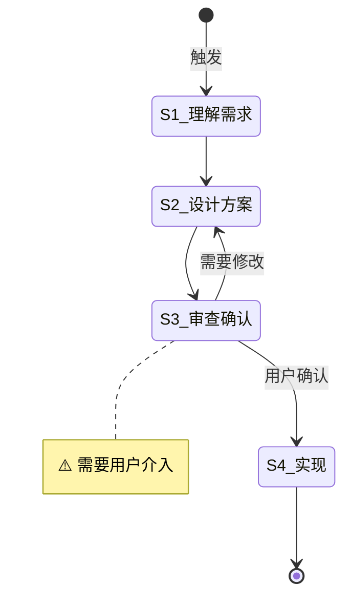

# Flow: test-flow

**Command**: `/pm-test`
**版本**: 1.0.0 | **创建日期**: 2026-06-12

---

## 适用场景

用于 Flow Engine 单元测试的示例流程。模拟典型的调研→设计→审查→实现工作流。

---

## 输入要求

| 输入项 | 必填 | 说明 |
|--------|------|------|
| 任务描述 | 是 | 要解决什么问题 |

---

## 默认交付清单

- 调研报告
- 代码实现

---

## 状态机

---

## 任务步骤

### S1: 理解需求

**目标**：准确理解任务意图，收集关键需求信息。
**执行 Agent**：Assistant
**引用 Regulation**：—

1. 阅读用户提出的需求描述
2. 提取核心意图和目标
3. 标记已覆盖、模糊、缺失的信息

**完成后**：自动进入 S2

---

### S2: 设计方案

**目标**：基于需求设计技术方案或实现计划。
**执行 Agent**：Assistant
**引用 Regulation**：coding_style.md

1. 分析需求和现有代码约束
2. 列出可行方案，评估优劣
3. 输出推荐方案

**完成后**：自动进入 S3

---

### S3: [Human-in-loop] 审查确认 ⚠️

> **⚠️ 本步骤需要用户介入。** 使用 `question` / `confirm` 阻塞式工具向用户提问。

**目标**：用户审查并确认设计方案。
**执行 Agent**：—
**引用 Regulation**：checklist.md

1. 展示方案
2. 使用 `confirm` 工具等待用户确认

**完成后**：
- 用户确认 → S4
- 需要修改 → 退回 S2

---

### S4: 实现

**目标**：按确认的方案编写代码。
**执行 Agent**：Assistant
**引用 Regulation**：coding_style.md、constitution.md

1. 按方案实现代码
2. 遵循最小变更原则
3. 完成编译检查和测试

**完成后**：任务结束
