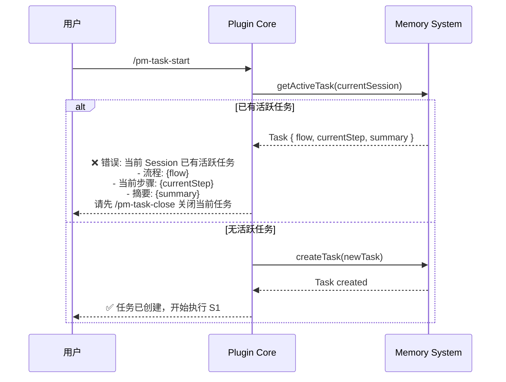
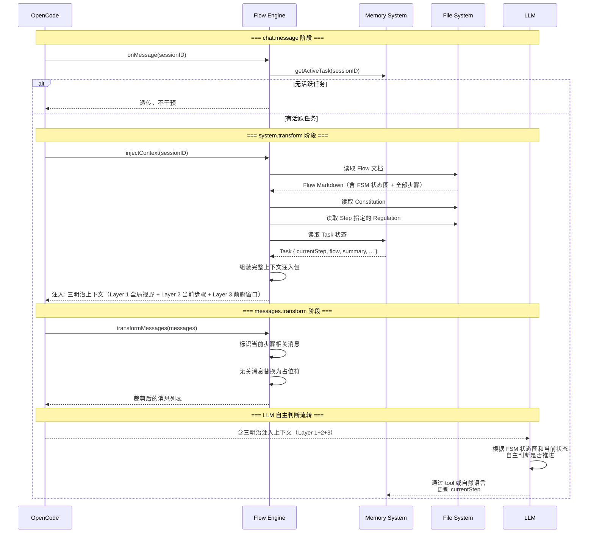

# Flow Engine Spec

**创建日期**: 2026-06-11
**状态**: Draft
**输入来源**: XMind 设计文档 + Plugin Core Spec + Memory System Spec + Spec 评估报告 + 消息裁剪算法调研

---

## 需求背景

Flow Engine 是 vibe-pm 的核心业务层。它负责：解析 Flow 文档 → 向 LLM 注入三明治上下文（全局视野 + 当前步骤详情 + 前瞻窗口）→ 裁剪无关消息 → 由 LLM 自主判断步骤流转。

**核心设计决策**：vibe-pm 不自行实现 FSM 引擎。流转判断完全交由 LLM——将 FSM 定义、任务状态、用户决策注入 system prompt，让 LLM 自主决定下一步。

---

## 设计要点

### 领域模型

| 实体 | 属性 | 关系 |
|------|------|------|
| FlowDefinition | `name`, `command`, `scenario`, `inputRequirements`, `deliverables`, `fsmDiagram`, `steps[]` | 解析自 `/docs/flow/[flow]_*.md` |
| StepDefinition | `id`, `name`, `goal`, `agent`, `regulations[]`, `instructions[]`, `humanInLoop`, `onComplete` | 属于一个 FlowDefinition |
| InjectedContext | `flowDoc`（全文）, `currentStep`, `taskState`, `constitution`, `regulations`, `specRef`, `planRef` | 注入到 system prompt 的完整上下文包 |

### 关键路径

#### `/pm-task-start` — 启动任务



#### 一次对话的完整处理



### 上下文注入（核心）

采用**三明治注入策略**：不注入完整 Flow 文档（避免浪费上下文），也不仅注入当前步骤（丧失跨步执行能力），而是三层结构解耦「全局视野」与「执行细节」。

#### 三层注入结构

```
┌──────────────────────────────────────────────────────────┐
│ Layer 1 — 全局视野（缓存稳定，始终注入）                     │
│                                                          │
│  - Constitution                               (~300T)    │
│  - FSM 状态图 (Mermaid)                       (~200T)    │
│  - 所有步骤的标题 + 目标摘要 + Human-in-loop 标记  (~400T)  │
│                                                          │
│  总计: ~900T，提供 LLM 全局规划视野                        │
│  缓存命中: ✅ 整个流程中不变（仅在切换流程/修改 Constitution  │
│             /OpenCode 版本升级时重建）                      │
└──────────────────────────────────────────────────────────┘

┌──────────────────────────────────────────────────────────┐
│ Layer 2 — 当前步骤详情（缓存波动，步骤推进时更新）            │
│                                                          │
│  - 当前步骤完整 instructions                   (~300T)    │
│  - 当前步骤引用的 Regulation                   (~500T)    │
│  - 当前 Task 状态                              (~100T)    │
│                                                          │
│  总计: ~900T，提供精准执行指令                            │
│  缓存命中: ❌ 步骤推进时失效，但变化范围控制在 Layer 2 内    │
└──────────────────────────────────────────────────────────┘

┌──────────────────────────────────────────────────────────┐
│ Layer 3 — 前瞻窗口（智能注入，连续步骤时展开）               │
│                                                          │
│  - 当前步骤的下 1-2 个连续步骤（非 HiL）的 instructions     │
│  - 仅在 currentStep 为非 HiL 且后续有连续步骤时注入         │
│  - 当前步骤为 HiL 时，不注入前瞻窗口（LLM 反正要等用户）     │
│                                                          │
│  总计: 0~600T（动态），支持跨步骤执行                      │
│  缓存命中: ❌ 但只在有连续执行需求时启用                    │
└──────────────────────────────────────────────────────────┘
```

#### system.transform 注入实现

```typescript
function buildInjectionLayers(
  flowDef: FlowDefinition,
  task: Task,
  constitution: string,
  regulations: string[],
): InjectionPlan {
  const currentIdx = flowDef.steps.findIndex(s => s.id === task.currentStep);
  const currentStep = flowDef.steps[currentIdx];

  // Layer 1: 全局视野（缓存稳定区）
  const layer1 = buildGlobalOverview(flowDef, constitution, task);

  // Layer 2: 当前步骤详情
  const layer2 = buildCurrentStepDetail(currentStep, task, regulations);

  // Layer 3: 前瞻窗口（条件注入）
  let layer3Steps: StepDefinition[] = [];
  if (!currentStep.humanInLoop) {
    let lookahead = currentIdx + 1;
    while (lookahead < flowDef.steps.length
           && !flowDef.steps[lookahead].humanInLoop
           && layer3Steps.length < 2) {  // 最多前瞻 2 步
      layer3Steps.push(flowDef.steps[lookahead]);
      lookahead++;
    }
  }
  const layer3 = layer3Steps.length > 0
    ? buildLookaheadWindow(layer3Steps) : null;

  return { layer1, layer2, layer3 };
}

function buildGlobalOverview(
  flowDef: FlowDefinition,
  constitution: string,
  task: Task,
): string {
  const parts: string[] = [];

  // Constitution
  parts.push(`<constitution>\n${constitution}\n</constitution>`);

  // FSM 状态图
  parts.push(`\n<fsm-diagram flow="${task.flow}">`);
  parts.push(`\n${flowDef.fsmDiagram}`);
  parts.push(`\n</fsm-diagram>`);

  // 步骤摘要（每步 ≤ 80T，标题 + 目标 + HiL 标记）
  parts.push(`\n<step-overview>`);
  parts.push(`\n**当前步骤: ${task.currentStep} - ${task.currentStepName}**`);
  for (const step of flowDef.steps) {
    const isHiL = step.humanInLoop ? ' ⚠️[需用户介入]' : '';
    parts.push(`\n- ${step.id}: ${step.name} — ${step.goal}${isHiL}`);
  }
  parts.push(`\n</step-overview>`);

  return parts.join('');
}

function buildCurrentStepDetail(
  step: StepDefinition,
  task: Task,
  regulations: string[],
): string {
  const parts: string[] = [];

  // 步骤目标与指令
  parts.push(`\n<current-step id="${step.id}" name="${step.name}">`);
  parts.push(`\n**目标**: ${step.goal}`);
  parts.push(`\n**推荐 Agent**: ${step.agent}`);
  parts.push(`\n---`);
  for (const [i, instr] of step.instructions.entries()) {
    parts.push(`\n${i + 1}. ${instr}`);
  }
  parts.push(`\n</current-step>`);

  // Task 状态
  parts.push(`\n<task-state>`);
  parts.push(`\n- Session ID: ${task.sessionId}`);
  parts.push(`\n- Flow: ${task.flow}`);
  parts.push(`\n- 任务摘要: ${task.summary}`);
  parts.push(`\n- 开始时间: ${task.startAt}`);
  if (task.specRef) parts.push(`\n- Spec 文档: ${task.specRef}`);
  if (task.planRef) parts.push(`\n- 计划文档: ${task.planRef}`);
  parts.push(`\n</task-state>`);

  // Step 指定的 Regulation
  for (const reg of regulations) {
    parts.push(`\n<regulation>\n${reg}\n</regulation>`);
  }

  // FSM 流转指令
  parts.push(`\n<fsm-instructions>`);
  parts.push(`\n你正在执行 Flow 文档中定义的流程。`);
  parts.push(`\n- 当前处于 **Step ${task.currentStep}: ${step.name}**`);
  if (step.humanInLoop) {
    parts.push(`\n- ⚠️⚠️⚠️ **本步骤需要用户介入！** 你必须使用 question / confirm 阻塞式工具向用户提问。每次只问 1 个问题，收到回复前不得继续。⚠️⚠️⚠️`);
    parts.push(`\n- ${step.onComplete}`);
  }
  parts.push(`\n- 请严格按照 Flow 文档中的「完成后」描述推进步骤`);
  parts.push(`\n- 非 Human-in-loop 步骤完成后自行判断并推进`);
  parts.push(`\n- 当你要推进步骤时，使用 pm_task_set_step 工具或明确告知`);
  parts.push(`\n</fsm-instructions>`);

  return parts.join('');
}

function buildLookaheadWindow(steps: StepDefinition[]): string {
  const parts: string[] = [];
  parts.push(`\n<lookahead-window>`);
  parts.push(`\n> 以下步骤可在本对话中连续执行（非 HiL）：`);
  for (const step of steps) {
    parts.push(`\n\n### Step ${step.id}: ${step.name}`);
    parts.push(`\n**目标**: ${step.goal}`);
    for (const [i, instr] of step.instructions.entries()) {
      parts.push(`\n${i + 1}. ${instr}`);
    }
    parts.push(`\n**完成后**: ${step.onComplete}`);
  }
  parts.push(`\n</lookahead-window>`);
  return parts.join('');
}
```

#### 注入内容优先级

| 优先级 | 层级 | 内容 | 缓存行为 |
|--------|:---:|------|---------|
| 1 | Layer 1 | Constitution | 始终注入，缓存稳定 |
| 2 | Layer 1 | FSM 状态图 + 步骤摘要 | 同一流程内缓存稳定 |
| 3 | Layer 2 | 当前步骤详情 + Task 状态 + Regulation | 步骤推进时更新 |
| 4 | Layer 2 | FSM 流转指令 | 步骤推进时更新 |
| 5 | Layer 3 | 前瞻窗口（1-2 个连续非 HiL 步骤） | 条件注入，HiL 步骤时省略 |

> **设计理由**：三明治注入在"精准注入"和"完整注入"之间取得平衡——Layer 1 提供全局视野支持规划（~900T，缓存稳定），Layer 2 提供精准执行指令（~900T），Layer 3 仅在连续执行场景下展开前瞻窗口（0~600T）。相较完整 Flow 注入（7 步 3500T），节省 40-50% 上下文；相较精准注入，保留了跨步骤执行能力。

### 缓存策略

vibe-pm 每次 `system.transform` 都会修改注入内容，可能导致 LLM prompt cache 失效。以下策略最小化缓存损失：

#### 策略 1：注入指纹去重

同一步骤内的多次对话不重复注入相同内容：

```typescript
const lastInjectedFingerprint: Map<string, string> = new Map();

function shouldInject(sessionId: string, task: Task, stepRegulations: string[]): boolean {
  const fingerprint = hash(`${task.flow}:${task.currentStep}:${stepRegulations.join(",")}`);
  const last = lastInjectedFingerprint.get(sessionId);

  if (fingerprint === last) {
    return false;  // 指纹未变 → 跳过注入 → 缓存命中
  }
  lastInjectedFingerprint.set(sessionId, fingerprint);
  return true;
}
```

**效果**：同一步骤内多次对话，零额外缓存损失。减少 30-40% 的不必要注入操作。

#### 策略 2：惰性裁剪

仅在上下文紧张时执行消息裁剪，否则保留完整消息→缓存稳定命中：

```typescript
if (estimatedTokens < config.contextInjection.maxStepTokens * 0.8) {
  return messages;  // 上下文未紧张 → 不裁剪 → 缓存完整命中
}
// 超过 80% 阈值 → 执行裁剪
pruneByDepthLevel(messages, currentStep, stepTransitionTimeline);
```

#### 策略 3：步骤边界感知

根据步骤类型采用差异化注入策略：

| 步骤类型 | 注入策略 | 缓存影响 |
|---------|---------|---------|
| **Human-in-loop 步骤** | 步骤开始时注入一次，用户回复期间跳过注入 | 交互过程中缓存完全命中 |
| **连续执行步骤**（如 S7→S8→S9） | Layer 2 更新 currentStep，Layer 3 展开新前瞻窗口 | 仅 Layer 2+3 变化 |
| **回退步骤**（LLM 判回 S[前]） | 恢复该步骤的历史注入指纹 | 可能缓存命中（指纹复用） |

#### 缓存价值估算

假设新功能开发流程（13 步骤），每步平均 3 轮对话：

| 场景 | 缓存命中率 | 每步 Token 消耗 | 13 步总消耗 |
|------|:---:|------|------|
| 无优化（每次重建全部注入） | ~50% | ~7,500/步 | ~97,500 |
| 分层注入 + 指纹去重 + 惰性裁剪 | ~80% | ~4,500/步 | ~58,500 |
| 全面优化（含步骤边界感知） | ~90% | ~3,000/步 | ~39,000 |

**节省**：约 **40-60% 的 Token 消耗**。

### Flow 文档解析

```typescript
interface FlowParser {
  /** 根据 flow 名称解析 */
  parse(flowName: string): Promise<FlowDefinition>;
  /** 从任意路径解析 */
  parseFromPath(filePath: string): Promise<FlowDefinition>;
  /** 扫描 /docs/flow/ 发现所有可用 Flow */
  listAvailableFlows(): Promise<string[]>;
  /** 读取 Flow 文档原始 Markdown 内容（用于注入） */
  readRawContent(flowName: string): Promise<string>;
}

interface FlowDefinition {
  name: string;
  command: string;
  scenario: string;           // 适用场景描述
  inputRequirements: InputRequirement[];
  defaultDeliverables: string[];
  fsmDiagram: string;         // Mermaid stateDiagram 原文
  steps: StepDefinition[];
}

interface StepDefinition {
  id: string;                 // "S1", "S2", ...
  name: string;               // "理解输入意图"
  goal: string;               // 步骤目标
  agent: string;              // 推荐 Agent 类型
  regulations: string[];      // 引用的 Regulation 文件名
  instructions: string[];     // 执行步骤（编号列表）
  humanInLoop: boolean;       // ⚠️ 是否需要用户介入
  onComplete: string;         // "完成后" 描述文本，如 "自动进入 S3"
}
```

> Flow 文档格式定义见 `docs/spec/flow-document-format.md`，模板见 `docs/template/flow-template.md`。步骤格式参照 `rules/[rules]research.md` 的简洁列表式——`**目标**`、`**执行 Agent**`、`**引用 Regulation**`、编号指令、`**完成后**`。

### 消息裁剪算法

裁剪采用**三步管道**：步骤归属分类 → 深度层级分配 → Token 约束执行。

#### Step 1：步骤归属分类

基于步骤转换时间线，为每条消息标记所属步骤：

```typescript
interface StepTaggedMessage {
  message: Message;
  stepId: string;              // 该消息所属的步骤
  stepDistance: number;        // 距当前步骤的距离（0=当前, 1=上一步, ...）
}

function tagMessagesByStep(
  messages: Message[],
  stepTransitionTimeline: StepTransition[],
  currentStepId: string,
): StepTaggedMessage[] {
  const currentIdx = stepTransitionTimeline.length - 1;

  return messages.map(msg => {
    // 根据时间戳找到消息所属的步骤
    const stepIdx = stepTransitionTimeline.findIndex(
      t => t.timestamp > msg.timestamp
    ) - 1;

    const actualIdx = stepIdx === -2 ? currentIdx : Math.max(0, stepIdx);
    return {
      message: msg,
      stepId: stepTransitionTimeline[actualIdx].stepId,
      stepDistance: currentIdx - actualIdx,
    };
  });
}
```

#### Step 2：深度层级分配

根据步骤距离分配深度级别（借鉴 MC 的深度层级压缩 + DCP 的保护机制）：

| 深度 | 距离条件 | 处理方式 | 说明 |
|:---:|---------|------|------|
| **0** | 当前步骤（distance ≤ 0） | 完整保留 | 当前步骤的所有消息不可裁剪 |
| **1** | 上一步（distance = 1） | 保留但可降权 | 压缩为摘要时保留关键结论和决策 |
| **2** | 前两步（distance = 2） | 仅保留关键决策 | 工具输出替换为占位符，仅保留用户决策内容 |
| **3** | 更早（distance > 2） | 占位符替换 | 整条消息替换为 `[前置步骤消息已裁剪]` |

**HiL 步骤的特殊处理**：当 currentStep 为 HiL 时，所有之前步骤的消息深度 +1（HiL 是天然断点，之前步骤可更激进裁剪）：

```typescript
function assignDepthLevel(
  tagged: StepTaggedMessage[],
  currentStep: StepDefinition,
): DepthAssignedMessage[] {
  return tagged.map(msg => {
    let depth: number;
    if (msg.stepDistance <= 0) depth = 0;
    else if (msg.stepDistance === 1) depth = 1;
    else if (msg.stepDistance === 2) depth = 2;
    else depth = 3;

    // HiL 步骤：所有之前步骤的深度 +1
    if (currentStep.humanInLoop && msg.stepDistance > 0) {
      depth = Math.min(depth + 1, 3);
    }

    return { ...msg, depth };
  });
}
```

#### Step 3：Token 约束执行

从高深度到低深度执行裁剪，直至满足 Token 预算：

```typescript
const PRUNE_PLACEHOLDER = "[前置步骤消息已裁剪]";

function pruneByDepth(
  messages: DepthAssignedMessage[],
  maxTokens: number,
): Message[] {
  let result = [...messages];
  let estimatedTokens = estimateTotalTokens(result);

  // 从高深度开始裁剪
  for (let depth = 3; depth >= 1; depth--) {
    if (estimatedTokens <= maxTokens) break;

    for (const msg of result) {
      if (msg.depth !== depth) continue;
      if (estimatedTokens <= maxTokens) break;

      if (depth === 3) {
        // 深度 3：整条替换为占位符
        msg.message = createPlaceholder(PRUNE_PLACEHOLDER);
      } else if (depth === 2) {
        // 深度 2：只保留用户消息内容，工具输出替换为占位符
        msg.message = keepUserContentOnly(msg.message);
      } else if (depth === 1) {
        // 深度 1：压缩为摘要（保留关键结论）
        msg.message = summarizeToKeyDecision(msg.message);
      }

      estimatedTokens = estimateTotalTokens(result);
    }
  }

  return result.map(m => m.message);
}
```

#### 保护机制

借鉴 DCP 的保护层级：

```typescript
const PROTECTED_PATTERNS = {
  // 用户消息永不达到深度 3（可降权但不可完全移除）
  userMessagesMaxDepth: 2,

  // 当前步骤产出的工具结果永不被裁剪
  currentStepToolResult: true,

  // Constitution 和 Regulation 注入内容永不裁剪
  injectedContext: true,

  // 最少保留最近 N 条消息
  minRecentMessages: 3,
};
```

#### 裁剪时机

- `messages.transform` 钩子触发时
- 仅当 `config.contextInjection.pruneIrrelevant === true`
- **惰性裁剪**：仅当 `estimatedTokens > maxStepTokens × 0.8` 时才执行裁剪
- 裁剪后不超过 `config.contextInjection.maxStepTokens`

---

## 接口设计

### Flow Engine 对外接口

```typescript
interface IFlowEngine {
  // --- 钩子回调 ---
  onMessage(input: unknown, output: unknown): Promise<void>;
  injectContext(input: unknown, output: SystemTransformOutput): Promise<void>;
  transformMessages(input: unknown, output: MessagesTransformOutput): Promise<void>;
  onSessionIdle(sessionId: string): Promise<void>;

  // --- Flow 管理 ---
  parseFlow(flowName: string): Promise<FlowDefinition>;
  readFlowContent(flowName: string): Promise<string>;  // 返回原始 MD
  listFlows(): Promise<string[]>;

  // --- 任务操作 ---
  startTask(params: {
    sessionId: string;
    flow: string;
    summary: string;
    specRef?: string;
    planRef?: string;
  }): Promise<Task>;
  setStep(sessionId: string, stepId: string): Promise<void>;
  getCurrentStep(sessionId: string): Promise<StepDefinition | null>;
}
```

### 任务启动检查

```typescript
async function startTask(params: StartTaskParams): Promise<Task> {
  // 检查当前 session 是否已有活跃任务
  const existing = await memory.getActiveTask(params.sessionId);
  if (existing) {
    throw new DuplicateActiveTaskError(
      `当前 Session 已有活跃任务:\n` +
      `- 流程: ${existing.flow}\n` +
      `- 当前步骤: ${existing.currentStep} - ${existing.currentStepName}\n` +
      `- 摘要: ${existing.summary}\n` +
      `- 开始时间: ${existing.startAt}\n\n` +
      `请先执行 /pm-task-close 关闭当前任务后再启动新任务。`
    );
  }

  // 解析 Flow 文档，获取第一个步骤
  const flowDef = await parseFlow(params.flow);
  const firstStep = flowDef.steps[0];

  // 创建 Task
  const task = await memory.createTask({
    sessionId: params.sessionId,
    flow: params.flow,
    currentStep: firstStep.id,
    currentStepName: firstStep.name,
    startAt: new Date().toISOString(),
    summary: params.summary,
    specRef: params.specRef,
    planRef: params.planRef,
  });

  return task;
}
```

### 依赖接口

```typescript
// 来自 Plugin Core
interface IPluginContext {
  readonly config: PluginConfig;
  readonly projectDir: string;
  readonly dataDir: string;
}

// 来自 Memory System
interface IMemorySystem {
  getActiveTask(sessionId: string): Promise<Task | null>;
  createTask(task: Omit<Task, "closed">): Promise<Task>;
  updateStep(sessionId: string, step: string): Promise<void>;
  recordStepEntry(sessionId: string, flow: string, step: string, tokens: number): Promise<void>;
  // ... 其他方法
}
```

---

## 测试用例

### task-start.test.ts

- **测试文件**: `src/engine/__tests__/task-start.test.ts`
- **关联设计文档**: `vibe-pm-flow-engine.md`
- **Setup/Teardown**: Mock Memory System，预置测试 Flow 文件

| 动作指令 | 测试方法 | Given | When | Then | Notes |
|----------|----------|-------|------|------|-------|
| 新增 | `start_task_creates_successfully` | 无活跃任务，存在测试 Flow | startTask() | 返回 Task，currentStep=S1，closed=false | 正常创建 |
| 新增 | `start_task_rejects_duplicate` | 已有活跃任务 | 再次 startTask() | 抛出 DuplicateActiveTaskError，消息含活跃任务信息 | 重复任务阻止 |
| 新增 | `start_task_rejects_missing_flow` | 无活跃任务，Flow 不存在 | startTask(flow="nonexistent") | 抛出 FlowNotFoundError | Flow 缺失 |

### context-injection.test.ts

- **测试文件**: `src/engine/__tests__/context-injection.test.ts`
- **关联设计文档**: `vibe-pm-flow-engine.md`
- **Setup/Teardown**: 创建临时项目目录含 Flow 文档和 Regulation，Mock Memory System

| 动作指令 | 测试方法 | Given | When | Then | Notes |
|----------|----------|-------|------|------|-------|
| 新增 | `inject_full_flow_doc` | 活跃 Task，Flow 有 7 个 Step | injectContext() | system prompt 包含 Layer 1 全局视野（FSM 状态图 + 全部步骤摘要）和 Layer 2 当前步骤详情 | 三明治注入 |
| 新增 | `inject_current_step_highlighted` | 活跃 Task 在 S3 | injectContext() | system prompt 中当前步骤被高亮标记 | 当前步骤标识 |
| 新增 | `inject_fsm_diagram` | Flow 文档含 Mermaid 状态图 | injectContext() | system prompt 包含 Mermaid stateDiagram | FSM 图注入 |
| 新增 | `inject_constitution_always` | 任意活跃 Task | injectContext() | system prompt 包含 Constitution | 宪法始终注入 |
| 新增 | `inject_fsm_instructions` | 任意活跃 Task | injectContext() | system prompt 包含 FSM 流转指令段落 | 告知 LLM 自行判断 |
| 新增 | `inject_human_in_loop_highlighted` | 活跃 Task 在 S4（humanInLoop=true） | injectContext() | system prompt 包含 ⚠️⚠️⚠️ 标记和"本步骤需要用户介入"警告 | LLM 不可遗漏 |
| 新增 | `no_inject_without_active_task` | 无活跃 Task | injectContext() | system prompt 不做修改 | 无任务不干预 |

### flow-parser.test.ts

- **测试文件**: `src/engine/__tests__/flow-parser.test.ts`
- **关联设计文档**: `vibe-pm-flow-engine.md`、`flow-document-format.md`
- **Setup/Teardown**: 创建临时 `/docs/flow/` 目录，放入符合 `flow-document-format.md` 规范的测试文件

| 动作指令 | 测试方法 | Given | When | Then | Notes |
|----------|----------|-------|------|------|-------|
| 新增 | `parse_complete_flow` | 符合 `flow-template.md` 格式的 Flow 文件 | parseFlow() | FlowDefinition.steps 长度正确，每个 Step 的 goal/agent/regulations/humanInLoop 已解析 | 标准解析 |
| 新增 | `parse_human_in_loop_step` | Step 标题含 ⚠️ 且有"需要用户介入"引用块 | parseFlow() | 该 Step 的 humanInLoop=true | ⚠️ 识别 |
| 新增 | `parse_extracts_fsm` | Flow 含 Mermaid stateDiagram 代码块 | parseFlow() | fsmDiagram 非空，保留原始 mermaid 文本 | FSM 图提取 |
| 新增 | `read_raw_content` | Flow 文件存在 | readFlowContent() | 返回原始 Markdown 全文（含 Mermaid + 全部步骤） | 全文注入用 |
| 新增 | `list_available_flows` | /docs/flow/ 下有 3 个 .md 文件 | listFlows() | 返回 3 个 Flow 名称 | 发现机制 |

### message-pruner.test.ts

- **测试文件**: `src/engine/__tests__/message-pruner.test.ts`
- **关联设计文档**: `vibe-pm-flow-engine.md`
- **Setup/Teardown**: 准备 20 条 mock 消息，标记当前 Step 为 S3

| 动作指令 | 测试方法 | Given | When | Then | Notes |
|----------|----------|-------|------|------|-------|
| 新增 | `keep_user_latest_input` | 最后一条为用户输入 | transformMessages() | 用户输入保留 | 不裁剪用户输入 |
| 新增 | `prune_irrelevant_messages` | 20 条消息，5 条与 S3 相关 | transformMessages() | 15 条替换为占位符 | 核心裁剪逻辑 |
| 新增 | `prune_respects_max_tokens` | 裁剪后仍超 maxStepTokens | transformMessages() | 进一步裁剪直到满足 | Token 限制 |
| 新增 | `no_prune_when_disabled` | config.pruneIrrelevant=false | transformMessages() | 全部消息原样保留 | 裁剪开关 |

---

## 边界与错误情况

| 场景 | 预期行为 |
|------|---------|
| `/pm-task-start` 时已有活跃任务 | 阻止创建，返回活跃任务详情（flow、currentStep、summary） |
| Flow 文档不存在 | parseFlow 抛出 `FlowNotFoundError` |
| Flow 文档格式错误 | parseFlow 抛出 `FlowParseError`，标注缺失内容 |
| 当前 Step 不存在于 Flow 中 | 重置为 S1，记录 error 日志 |
| injectContext 内容过大 | 按优先级截断：Constitution > FSM 图 > 步骤详情 > Regulation，最低优先级先截 |
| messages.transform 裁剪过度 | 至少保留最近 3 条消息（保护机制 `minRecentMessages`） |
| LLM 输出无法判定流转意图 | 不做状态变更，保持 currentStep |
| Layer 1（全局视野）超出预算 | 步骤摘要压缩为仅保留标题 + HiL 标记，移除目标描述 |
| 注入指纹哈希碰撞 | 指纹包含 flow + step + regulation 三要素，碰撞概率极低；若发生仅导致一次多余注入，不产生数据错误 |
| 同一步骤内多次对话 | 注入指纹去重 → 跳过注入 → 缓存命中 |

---

## 约束与限制

### 技术约束

- **不实现 FSM 引擎**：流转判断完全由 LLM 自主完成，插件只负责注入上下文和更新状态
- Flow 文档格式见 `docs/spec/flow-document-format.md`
- `experimental.chat.system.transform` 注入内容受 OpenCode 限制
- **缓存策略**：三明治注入的 Layer 1 设计为缓存稳定前缀（仅在切换流程/修改 Constitution/OpenCode 升级时重建），Layer 2+3 控制在最小变化范围
- **注入指纹**：通过 hash(flow + stepId + regulationRefs) 去重，避免同一步骤内重复注入

### 业务约束

- 不自动修改 Flow 文档
- 流转规则硬编码在 Flow 文档中，插件不做运行时裁决
- Human-in-loop 步骤由 LLM 使用 `question`/`confirm` 工具处理
- 消息裁剪默认启用惰性策略（> 80% 阈值才裁），用户可配置 `pruneIrrelevant` 关闭

### 已知风险

- LLM 可能误判步骤完成状态 → 缓解：Flow 文档中流转条件写清晰
- 不同 LLM 对 FSM 的理解能力不同 → 缓解：FSM 指令段落明确告知流转规则；Layer 3 前瞻窗口为不同 planner 能力的 LLM 提供差异化支持
- 三明治注入的 Layer 1 大小随流程复杂度线性增长 → 缓解：每步摘要控制在 ≤ 80 Token
- 注入指纹哈希碰撞 → 缓解：三要素（flow + step + regulation）碰撞概率极低；即使碰撞也仅导致一次多余注入，不影响功能
- Prompt cache 失效 → 缓解：分层注入 + 指纹去重 + 惰性裁剪三重策略，目标命中率 80%+

### 影响范围

- 依赖 Plugin Core 的 hook 接口
- 依赖 Memory System 的 Task CRUD
- 由 Metrics & Analysis 消费 FlowMetrics 数据
