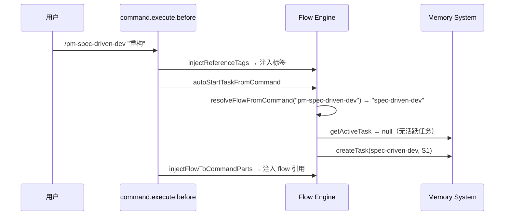

# Flow Engine Spec

**创建日期**: 2026-06-11
**状态**: Implemented
**最后更新**: 2026-06-16 — 重构：LLM 主导流程，文件引用替代内容注入

---

## 设计要点

Flow Engine 不再解析 Flow 步骤或管理 FSM 状态机。LLM 自行读取 flow 文件、理解步骤、管理流转。

### 核心职责

| 职责 | 说明 |
|------|------|
| 文件引用标签注入 | 向 system prompt 注入 `<pm-constitution>`、`<pm-flow-control>`、`<pm-dictionary>` 标签 |
| 任务生命周期 | `startTask()` / `closeTask()` |
| Command→Flow 映射 | 从 flow 文件解析 Command 字段，建立命令名到 flow 名称的映射 |
| 控制指令 | `buildControlPrompt()` 注入强力流程执行约束 |

### 注入标签格式

```xml
<pm-constitution src="docs/regulation/constitution.md">
  项目最高原则：类型安全至上、验证强制性、最小变更原则。
</pm-constitution>

<pm-flow-control src="docs/flow/[flow]spec-driven-dev.md">
  当前流程：spec-driven-dev。请自行阅读该文件，按步骤顺序执行。
  每进入新步骤时调用 pm_task_set_step 记录进度。
</pm-flow-control>

<pm-dictionary src="docs/regulation/dictionary.md">
  术语中英对照字典。
</pm-dictionary>

<pm-control-rules>
  ## 流程执行规则
  ...
</pm-control-rules>

<task-state>
  - 流程: spec-driven-dev
  - 当前步骤: S1
</task-state>
```

### 不再负责的功能

| 功能 | 原因 |
|------|------|
| Flow 步骤解析（parseFlow 等） | LLM 自行读取 flow 文件 |
| FSM 状态机管理 | LLM 自行理解状态图 |
| Regulation 内容读取 | LLM 自行读取文件 |
| 消息裁剪 | LLM 按需读取，无需裁剪 |

---

## 任务创建流程



## FSM 流转

无代码层面 FSM。步骤流转由 LLM 通过调用 `pm_task_set_step` 工具驱动。`setStep()` 更新 AxioDB 中的步骤信息并 best-effort 解析步骤名称。
