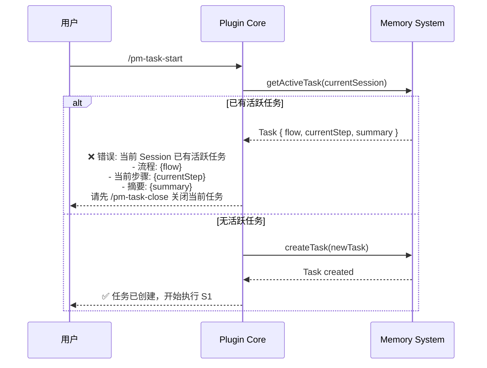
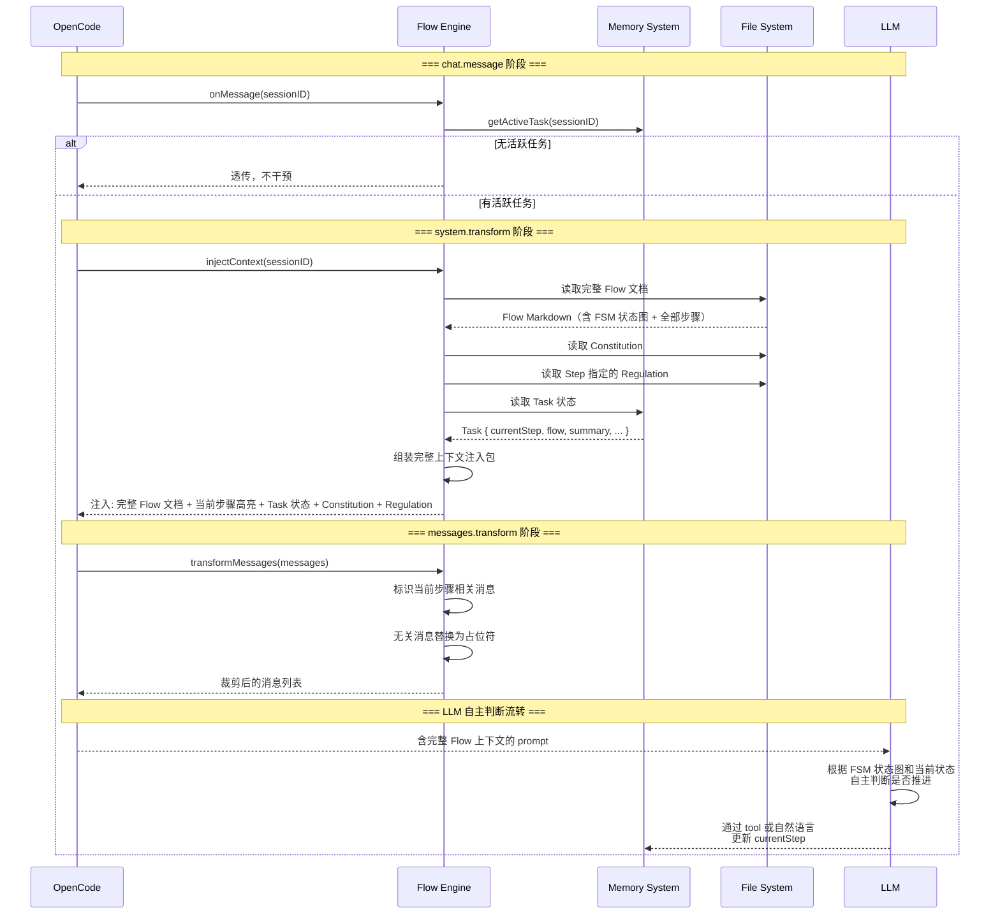

# Flow Engine Spec

**创建日期**: 2026-06-11
**状态**: Draft
**输入来源**: XMind 设计文档 + Plugin Core Spec + Memory System Spec

---

## 需求背景

Flow Engine 是 vibe-pm 的核心业务层。它负责：解析 Flow 文档 → 向 LLM 注入完整 Flow 上下文 + 当前步骤状态 → 裁剪无关消息 → 由 LLM 自主判断步骤流转。

**核心设计决策**：vibe-pm 不自行实现 FSM 引擎。流转判断完全交由 LLM——将 FSM 定义、任务状态、用户决策注入 system prompt，让 LLM 自主决定下一步。

---

## 设计要点

### 领域模型

| 实体 | 属性 | 关系 |
|------|------|------|
| FlowDefinition | `name`, `command`, `scenario`, `inputRequirements`, `deliverables`, `fsmDiagram`, `steps[]` | 解析自 `/docs/flow/[flow]_*.md` |
| StepDefinition | `id`, `name`, `goal`, `agent`, `regulations[]`, `instructions[]`, `humanInLoop`, `onComplete` | 属于一个 FlowDefinition |
| InjectedContext | `flowDoc`（全文）, `currentStep`, `taskState`, `constitution`, `regulations`, `specRef`, `planRef` | 注入到 system prompt 的完整上下文包 |

### 关键路径

#### `/pm-task-start` — 启动任务



#### 一次对话的完整处理



### 上下文注入（核心）

注入策略从"只注入当前 Step"改为**注入完整 Flow + 高亮当前步骤**，支持具规划能力的 LLM 在单次对话中跨步骤执行。

#### system.transform 注入内容结构

```typescript
function buildSystemInject(
  flowDoc: string,      // 完整 Flow 文档内容
  task: Task,           // 当前任务状态
  constitution: string, // 宪法内容
  regulations: string[], // Step 指定的 Regulation 内容
): string {
  const parts: string[] = [];

  // === 第 1 部分: 宪法（始终注入） ===
  parts.push(`<constitution>\n${constitution}\n</constitution>`);

  // === 第 2 部分: 完整 Flow 文档 ===
  // 包含 Mermaid 状态图 + 全部步骤 + 流转规则
  parts.push(`\n<flow-document name="${task.flow}">`);
  parts.push(`\n**当前步骤: ${task.currentStep} - ${task.currentStepName}**`);
  parts.push(`\n**任务摘要: ${task.summary}**`);
  parts.push(`\n---`);
  parts.push(`\n${flowDoc}`);
  parts.push(`\n</flow-document>`);

  // === 第 3 部分: 当前任务状态 ===
  parts.push(`\n<task-state>`);
  parts.push(`\n- Session ID: ${task.sessionId}`);
  parts.push(`\n- Flow: ${task.flow}`);
  parts.push(`\n- 当前步骤: ${task.currentStep} - ${task.currentStepName}`);
  parts.push(`\n- 开始时间: ${task.startAt}`);
  if (task.specRef) parts.push(`\n- Spec 文档: ${task.specRef}`);
  if (task.planRef) parts.push(`\n- 计划文档: ${task.planRef}`);
  parts.push(`\n</task-state>`);

  // === 第 4 部分: 步骤指定的 Regulation ===
  for (const reg of regulations) {
    parts.push(`\n<regulation>\n${reg}\n</regulation>`);
  }

  // === 第 4 部分: FSM 流转指令 ===
  const humanInLoopStep = currentStepDef.humanInLoop;
  parts.push(`\n<fsm-instructions>`);
  parts.push(`\n你正在执行上述 Flow 文档中定义的流程。`);
  parts.push(`\n- 当前处于 **Step ${task.currentStep}: ${task.currentStepName}**`);
  if (humanInLoopStep) {
    parts.push(`\n- ⚠️⚠️⚠️ **本步骤需要用户介入！** 你必须使用 question / confirm 阻塞式工具向用户提问，每次只问 1 个问题。在收到用户回复前不得继续。⚠️⚠️⚠️`);
    parts.push(`\n- ${currentStepDef.onComplete}`);
  }
  parts.push(`\n- 请严格按照 Flow 文档中的「完成后」描述推进步骤`);
  parts.push(`\n- 非 Human-in-loop 步骤完成后自行判断并推进`);
  parts.push(`\n- 当你要推进步骤时，使用 pm_task_set_step 工具或明确告知`);
  parts.push(`\n</fsm-instructions>`);

  return parts.join('\n');
}
```

#### 注入内容优先级

| 优先级 | 内容 | 说明 |
|--------|------|------|
| 1 | Constitution | 始终注入，不可裁剪 |
| 2 | 完整 Flow 文档 | 包含 Mermaid 状态图 + 全部步骤（当前步骤高亮标记） |
| 3 | 当前 Task 状态 | currentStep、summary、关联文档引用 |
| 4 | Step 指定 Regulation | 当前步骤引用的行为准则文件 |
| 5 | FSM 流转指令 | 告知 LLM 如何自主判断步骤流转 |

> **设计理由**：注入完整 Flow 文档而非截取单步骤，支持具备内置 planner 的 LLM（如 Claude Opus）在单次对话中预判并连续执行多个步骤，减少来回交互次数。

### Flow 文档解析

```typescript
interface FlowParser {
  /** 根据 flow 名称解析 */
  parse(flowName: string): Promise<FlowDefinition>;
  /** 从任意路径解析 */
  parseFromPath(filePath: string): Promise<FlowDefinition>;
  /** 扫描 /docs/flow/ 发现所有可用 Flow */
  listAvailableFlows(): Promise<string[]>;
  /** 读取 Flow 文档原始 Markdown 内容（用于注入） */
  readRawContent(flowName: string): Promise<string>;
}

interface FlowDefinition {
  name: string;
  command: string;
  scenario: string;           // 适用场景描述
  inputRequirements: InputRequirement[];
  defaultDeliverables: string[];
  fsmDiagram: string;         // Mermaid stateDiagram 原文
  steps: StepDefinition[];
}

interface StepDefinition {
  id: string;                 // "S1", "S2", ...
  name: string;               // "理解输入意图"
  goal: string;               // 步骤目标
  agent: string;              // 推荐 Agent 类型
  regulations: string[];      // 引用的 Regulation 文件名
  instructions: string[];     // 执行步骤（编号列表）
  humanInLoop: boolean;       // ⚠️ 是否需要用户介入
  onComplete: string;         // "完成后" 描述文本，如 "自动进入 S3"
}
```

> Flow 文档格式定义见 `docs/spec/flow-document-format.md`，模板见 `docs/template/flow-template.md`。步骤格式参照 `rules/[rules]research.md` 的简洁列表式——`**目标**`、`**执行 Agent**`、`**引用 Regulation**`、编号指令、`**完成后**`。

### 消息裁剪

```typescript
interface MessageFilter {
  filterRelevant(
    messages: Message[],
    currentStepId: string,
    flowDef: FlowDefinition
  ): { keep: Message[]; pruned: Message[] };
}
```

#### 裁剪规则

1. **永远保留**：用户的最新输入、当前步骤产出的工具结果
2. **保留但降权**：与当前步骤相关的历史消息（压缩为摘要）
3. **裁剪（占位符替换）**：已完成的旧步骤细节、无关工具调用

```typescript
const PRUNE_PLACEHOLDER = "[与当前步骤无关的消息已裁剪]";
```

#### 裁剪时机

- `messages.transform` 钩子触发时
- 仅当 `config.contextInjection.pruneIrrelevant === true`
- 裁剪后不超过 `config.contextInjection.maxStepTokens`

---

## 接口设计

### Flow Engine 对外接口

```typescript
interface IFlowEngine {
  // --- 钩子回调 ---
  onMessage(input: unknown, output: unknown): Promise<void>;
  injectContext(input: unknown, output: SystemTransformOutput): Promise<void>;
  transformMessages(input: unknown, output: MessagesTransformOutput): Promise<void>;
  onSessionIdle(sessionId: string): Promise<void>;

  // --- Flow 管理 ---
  parseFlow(flowName: string): Promise<FlowDefinition>;
  readFlowContent(flowName: string): Promise<string>;  // 返回原始 MD
  listFlows(): Promise<string[]>;

  // --- 任务操作 ---
  startTask(params: {
    sessionId: string;
    flow: string;
    summary: string;
    specRef?: string;
    planRef?: string;
  }): Promise<Task>;
  setStep(sessionId: string, stepId: string): Promise<void>;
  getCurrentStep(sessionId: string): Promise<StepDefinition | null>;
}
```

### 任务启动检查

```typescript
async function startTask(params: StartTaskParams): Promise<Task> {
  // 检查当前 session 是否已有活跃任务
  const existing = await memory.getActiveTask(params.sessionId);
  if (existing) {
    throw new DuplicateActiveTaskError(
      `当前 Session 已有活跃任务:\n` +
      `- 流程: ${existing.flow}\n` +
      `- 当前步骤: ${existing.currentStep} - ${existing.currentStepName}\n` +
      `- 摘要: ${existing.summary}\n` +
      `- 开始时间: ${existing.startAt}\n\n` +
      `请先执行 /pm-task-close 关闭当前任务后再启动新任务。`
    );
  }

  // 解析 Flow 文档，获取第一个步骤
  const flowDef = await parseFlow(params.flow);
  const firstStep = flowDef.steps[0];

  // 创建 Task
  const task = await memory.createTask({
    sessionId: params.sessionId,
    flow: params.flow,
    currentStep: firstStep.id,
    currentStepName: firstStep.name,
    startAt: new Date().toISOString(),
    summary: params.summary,
    specRef: params.specRef,
    planRef: params.planRef,
  });

  return task;
}
```

### 依赖接口

```typescript
// 来自 Plugin Core
interface IPluginContext {
  readonly config: PluginConfig;
  readonly projectDir: string;
  readonly dataDir: string;
}

// 来自 Memory System
interface IMemorySystem {
  getActiveTask(sessionId: string): Promise<Task | null>;
  createTask(task: Omit<Task, "closed">): Promise<Task>;
  updateStep(sessionId: string, step: string): Promise<void>;
  recordStepEntry(sessionId: string, flow: string, step: string, tokens: number): Promise<void>;
  // ... 其他方法
}
```

---

## 测试用例

### task-start.test.ts

- **测试文件**: `src/engine/__tests__/task-start.test.ts`
- **关联设计文档**: `vibe-pm-flow-engine.md`
- **Setup/Teardown**: Mock Memory System，预置测试 Flow 文件

| 动作指令 | 测试方法 | Given | When | Then | Notes |
|----------|----------|-------|------|------|-------|
| 新增 | `start_task_creates_successfully` | 无活跃任务，存在测试 Flow | startTask() | 返回 Task，currentStep=S1，closed=false | 正常创建 |
| 新增 | `start_task_rejects_duplicate` | 已有活跃任务 | 再次 startTask() | 抛出 DuplicateActiveTaskError，消息含活跃任务信息 | 重复任务阻止 |
| 新增 | `start_task_rejects_missing_flow` | 无活跃任务，Flow 不存在 | startTask(flow="nonexistent") | 抛出 FlowNotFoundError | Flow 缺失 |

### context-injection.test.ts

- **测试文件**: `src/engine/__tests__/context-injection.test.ts`
- **关联设计文档**: `vibe-pm-flow-engine.md`
- **Setup/Teardown**: 创建临时项目目录含完整 Flow 文档和 Regulation，Mock Memory System

| 动作指令 | 测试方法 | Given | When | Then | Notes |
|----------|----------|-------|------|------|-------|
| 新增 | `inject_full_flow_doc` | 活跃 Task，Flow 有 7 个 Step | injectContext() | system prompt 包含完整 Flow 文档（全部 7 个 Step） | 全文注入 |
| 新增 | `inject_current_step_highlighted` | 活跃 Task 在 S3 | injectContext() | system prompt 中当前步骤被高亮标记 | 当前步骤标识 |
| 新增 | `inject_fsm_diagram` | Flow 文档含 Mermaid 状态图 | injectContext() | system prompt 包含 Mermaid stateDiagram | FSM 图注入 |
| 新增 | `inject_constitution_always` | 任意活跃 Task | injectContext() | system prompt 包含 Constitution | 宪法始终注入 |
| 新增 | `inject_fsm_instructions` | 任意活跃 Task | injectContext() | system prompt 包含 FSM 流转指令段落 | 告知 LLM 自行判断 |
| 新增 | `inject_human_in_loop_highlighted` | 活跃 Task 在 S4（humanInLoop=true） | injectContext() | system prompt 包含 ⚠️⚠️⚠️ 标记和"本步骤需要用户介入"警告 | LLM 不可遗漏 |
| 新增 | `no_inject_without_active_task` | 无活跃 Task | injectContext() | system prompt 不做修改 | 无任务不干预 |

### flow-parser.test.ts

- **测试文件**: `src/engine/__tests__/flow-parser.test.ts`
- **关联设计文档**: `vibe-pm-flow-engine.md`、`flow-document-format.md`
- **Setup/Teardown**: 创建临时 `/docs/flow/` 目录，放入符合 `flow-document-format.md` 规范的测试文件

| 动作指令 | 测试方法 | Given | When | Then | Notes |
|----------|----------|-------|------|------|-------|
| 新增 | `parse_complete_flow` | 符合 `flow-template.md` 格式的 Flow 文件 | parseFlow() | FlowDefinition.steps 长度正确，每个 Step 的 goal/agent/regulations/humanInLoop 已解析 | 标准解析 |
| 新增 | `parse_human_in_loop_step` | Step 标题含 ⚠️ 且有"需要用户介入"引用块 | parseFlow() | 该 Step 的 humanInLoop=true | ⚠️ 识别 |
| 新增 | `parse_extracts_fsm` | Flow 含 Mermaid stateDiagram 代码块 | parseFlow() | fsmDiagram 非空，保留原始 mermaid 文本 | FSM 图提取 |
| 新增 | `read_raw_content` | Flow 文件存在 | readFlowContent() | 返回原始 Markdown 全文（含 Mermaid + 全部步骤） | 全文注入用 |
| 新增 | `list_available_flows` | /docs/flow/ 下有 3 个 .md 文件 | listFlows() | 返回 3 个 Flow 名称 | 发现机制 |

### message-pruner.test.ts

- **测试文件**: `src/engine/__tests__/message-pruner.test.ts`
- **关联设计文档**: `vibe-pm-flow-engine.md`
- **Setup/Teardown**: 准备 20 条 mock 消息，标记当前 Step 为 S3

| 动作指令 | 测试方法 | Given | When | Then | Notes |
|----------|----------|-------|------|------|-------|
| 新增 | `keep_user_latest_input` | 最后一条为用户输入 | transformMessages() | 用户输入保留 | 不裁剪用户输入 |
| 新增 | `prune_irrelevant_messages` | 20 条消息，5 条与 S3 相关 | transformMessages() | 15 条替换为占位符 | 核心裁剪逻辑 |
| 新增 | `prune_respects_max_tokens` | 裁剪后仍超 maxStepTokens | transformMessages() | 进一步裁剪直到满足 | Token 限制 |
| 新增 | `no_prune_when_disabled` | config.pruneIrrelevant=false | transformMessages() | 全部消息原样保留 | 裁剪开关 |

---

## 边界与错误情况

| 场景 | 预期行为 |
|------|---------|
| `/pm-task-start` 时已有活跃任务 | 阻止创建，返回活跃任务详情（flow、currentStep、summary） |
| Flow 文档不存在 | parseFlow 抛出 `FlowNotFoundError` |
| Flow 文档格式错误 | parseFlow 抛出 `FlowParseError`，标注缺失内容 |
| 当前 Step 不存在于 Flow 中 | 重置为 S1，记录 error 日志 |
| injectContext 内容过大 | 按优先级截断：Constitution > Flow Doc > Task State > Regulation，最低优先级先截 |
| messages.transform 裁剪过度 | 至少保留最近 3 条消息 |
| LLM 输出无法判定流转意图 | 不做状态变更，保持 currentStep |
| 注入的完整 Flow 文档超出上下文窗口 | 保留 FSM 图 + 当前步骤 + 相邻步骤，远端步骤压缩为 key-value 摘要 |

---

## 约束与限制

### 技术约束

- **不实现 FSM 引擎**：流转判断完全由 LLM 自主完成，插件只负责注入上下文和更新状态
- Flow 文档格式见 `docs/spec/flow-document-format.md`
- `experimental.chat.system.transform` 注入内容受 OpenCode 限制
- 注入完整 Flow 文档时可能出现上下文过长，需做智能截断

### 业务约束

- 不自动修改 Flow 文档
- 流转规则硬编码在 Flow 文档中，插件不做运行时裁决
- Human-in-loop 步骤由 LLM 使用 `question`/`confirm` 工具处理

### 已知风险

- LLM 可能误判步骤完成状态 → 缓解：Flow 文档中流转条件写清晰
- 注入完整 Flow 文档占用大量上下文 → 缓解：智能截断策略
- 不同 LLM 对 FSM 的理解能力不同 → 缓解：FSM 指令段落明确告知流转规则

### 影响范围

- 依赖 Plugin Core 的 hook 接口
- 依赖 Memory System 的 Task CRUD
- 由 Metrics & Analysis 消费 FlowMetrics 数据
