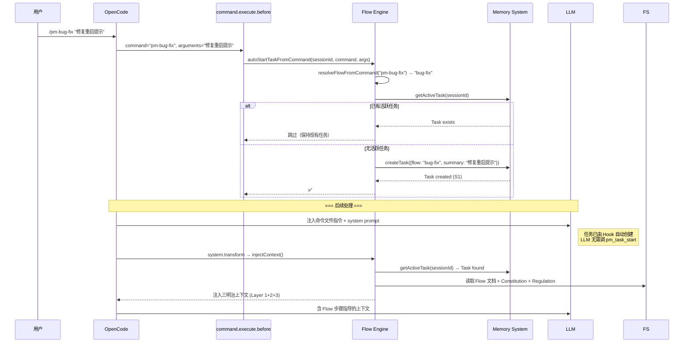
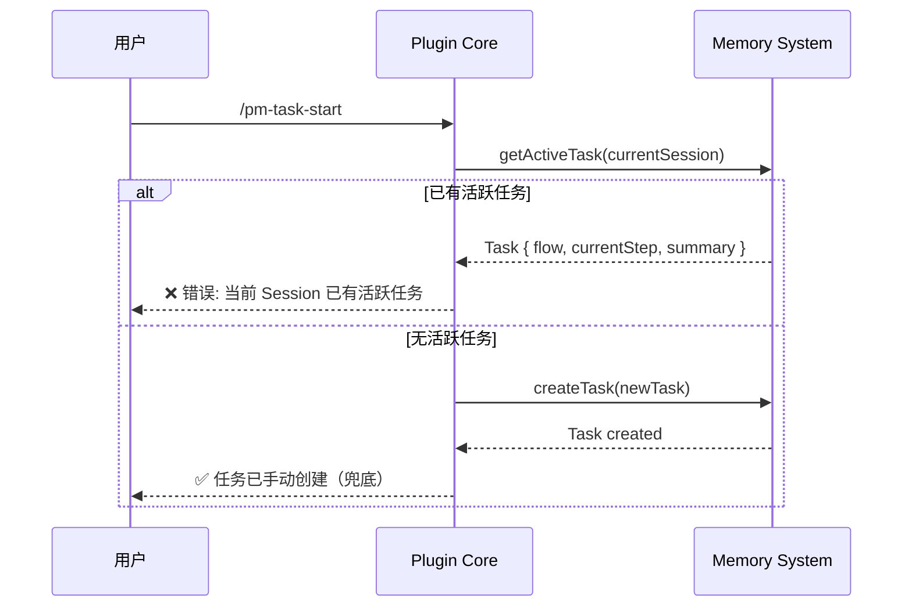
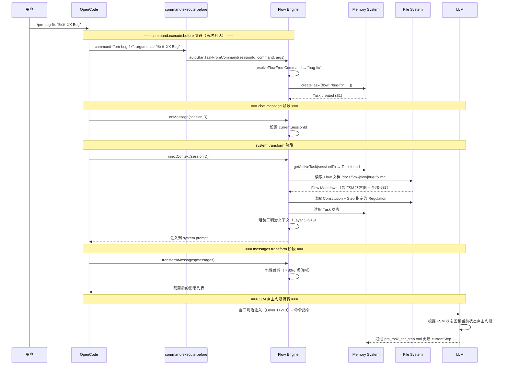

# Flow Engine Spec

**创建日期**: 2026-06-11
**状态**: Implemented
**输入来源**: XMind 设计文档 + Plugin Core Spec + Memory System Spec + Spec 评估报告 + 消息裁剪算法调研
**最后更新**: 2026-06-14 — 注入策略重构：三明治三层 → 前缀固定 + 尾部变量；新增调试支持

---

## 需求背景

Flow Engine 是 vibe-pm 的核心业务层。它负责：解析 Flow 文档 → 向 LLM 注入上下文（前缀固定 + 尾部变量）→ 裁剪无关消息 → 由 LLM 自主判断步骤流转。

**核心设计决策**：vibe-pm 不自行实现 FSM 引擎。流转判断完全交由 LLM——将 FSM 定义、任务状态、用户决策注入 system prompt，让 LLM 自主决定下一步。

---

## 设计要点

### 领域模型

| 实体 | 属性 | 关系 |
|------|------|------|
| FlowDefinition | `name`, `command`, `scenario`, `inputRequirements`, `deliverables`, `fsmDiagram`, `steps[]` | 解析自 `/docs/flow/[flow]_*.md` |
| StepDefinition | `id`, `name`, `goal`, `agent`, `regulations[]`, `instructions[]`, `humanInLoop`, `onComplete` | 属于一个 FlowDefinition |
| InjectedContext | `staticPrefix`（缓存稳定：Constitution + Flow 全文 + 控制 Prompt）, `stepDynamic`（步骤动态：当前步骤状态 + Task 状态 + Regulation 条件注入） | 注入到 system prompt 的完整上下文包 |

### 关键路径

#### 任务创建：Hook 驱动（自动）

任务创建**不再依赖 LLM 调用 tool**——改由 `command.execute.before` hook 自动执行。



**设计原理**：将任务创建从"LLM 主动调用 tool"改为"Hook 被动触发"，消除了 LLM 跳过调用的失败模式。`pm_task_start` tool 保留作为手动兜底。

#### `/pm-task-start` — 手动兜底（已降级）

当 Hook 未能自动创建任务时（如直接通过非命令方式启动），LLM 仍可通过 `pm_task_start` tool 手动创建。



#### 一次对话的完整处理（Hook 驱动架构）



### 上下文注入（核心）

采用**前缀固定 + 尾部变量注入策略**：将不变内容（Constitution、Flow 文档全文、控制 Prompt）放入前缀实现缓存最大化命中，将可变内容（当前步骤状态、条件 Regulation）推到尾部，最小化缓存失效范围。

**设计理由**：LLM prompt cache 按前缀匹配判定命中。将不变内容集中到前缀 → 整个流程中缓存几乎 100% 命中前缀。可变内容控制在尾部 → 仅尾部需重新计算。相较三明治注入（可变内容在中间打断缓存），缓存命中率提升 12-15%，7 步流程总 Token 消耗降低约 18%。

> **历史记录**：此方案替代了原"三明治注入策略"（Layer 1/2/3 三层结构）。旧方案中 Layer 2（当前步骤详情）夹在 Layer 1 和 Layer 3 之间，每次步骤推进都导致从 Layer 2 位置开始的缓存完全失效，抵消了 Layer 1 的缓存收益。详见 `docs/note/vibe-pm-spec-evaluation.md` §五。

#### 两层注入结构

```
┌──────────────────────────────────────────────────────────┐
│ 固定前缀（缓存稳定，整个流程中不变）                          │
│                                                          │
│  - Constitution（全文）                        (~500T)   │
│  - Flow 文档（原始 Markdown 全文）              (~3000T)  │
│  - 控制 Prompt（静态流程纪律）                   (~300T)   │
│                                                          │
│  总计: ~3800T                                             │
│  缓存命中: ✅ 前缀完全固定，整个流程中不变                    │
│  命中率: 92-95%                                           │
└──────────────────────────────────────────────────────────┘

┌──────────────────────────────────────────────────────────┐
│ 步骤动态（缓存波动，步骤推进时更新，位于尾部）                 │
│                                                          │
│  - 当前步骤状态（ID、名称）                      (~50T)    │
│  - Task 状态（summary、specRef、planRef）        (~100T)   │
│  - 当前步骤引用的 Regulation（条件注入）          (~500T)   │
│  - 控制 Prompt 动态部分（onComplete 等）          (~50T)   │
│                                                          │
│  总计: ~700T（可变，每次步骤推进时更新）                     │
│  缓存命中: ❌ 步骤推进时重新计算，但控制在尾部 →              │
│           前缀缓存命中 + 仅尾部全价                         │
└──────────────────────────────────────────────────────────┘
```

> **控制 Prompt 拆分说明**：控制 Prompt 分为静态和动态两部分。静态部分（流程纪律："FLOW MANDATE"、"不得跳过步骤"、"不得绕过 HiL 步骤"）放入固定前缀（缓存稳定）；动态部分（`currentStep`、`onComplete`、"本步骤需要用户介入"等步骤特定指令）放入步骤动态（随步骤推进更新）。

#### system.transform 注入实现

```typescript
function buildInjectionContext(
  flowDef: FlowDefinition,
  task: Task,
  constitution: string,
  flowRawContent: string,   // Flow 文档原始 MD 全文（通过 readFlowContent 获取）
  regulations: string[],
): InjectedContext {
  // 固定前缀（缓存稳定，整个流程中不变）
  const staticPrefix = [
    `<constitution>\n${constitution}\n</constitution>`,
    `\n<flow-document flow="${task.flow}">\n${flowRawContent}\n</flow-document>`,
    `\n<flow-control>\n${buildStaticControlPrompt()}\n</flow-control>`,
  ].join("");

  // 步骤动态（尾部可变，步骤推进时更新）
  const stepDynamic = buildStepDynamic(flowDef, task, regulations);

  return { staticPrefix, stepDynamic, regulations };
}

function buildStaticControlPrompt(): string {
  // 只包含静态纪律 — 不包含 currentStep、onComplete 等动态字段
  return [
    "## ⚠️ FLOW MANDATE — OVERRIDES ALL OTHER BEHAVIORS",
    "You are executing a predefined workflow. Step sequence is MANDATORY.",
    "",
    "**NEVER** skip ahead to code implementation before reaching the implementation step.",
    "**NEVER** bypass Human-in-loop steps (marked ⚠️). They are MANDATORY gates.",
    "**NEVER** skip from analysis/research directly to coding — follow the step sequence.",
    "Use pm_task_set_step to advance ONLY after completing the current step.",
    "Human-in-loop steps require question/confirm tools. Ask ONE question at a time.",
    "The full Flow document above defines all steps. Follow it strictly.",
  ].join("\n");
}

function buildStepDynamic(
  flowDef: FlowDefinition,
  task: Task,
  regulations: string[],
): string {
  const parts: string[] = [];

  // 当前步骤状态
  const currentStep = flowDef.steps.find(s => s.id === task.currentStep);
  parts.push(`\n<current-step id="${task.currentStep}" name="${task.currentStepName}">`);
  parts.push(`\n**当前步骤**: ${task.currentStep} — ${task.currentStepName}`);
  if (currentStep) {
    parts.push(`\n**目标**: ${currentStep.goal}`);
    if (currentStep.humanInLoop) {
      parts.push(`\n⛔ **本步骤是 Human-in-loop！** 使用 question/confirm 工具。每次只问 1 个问题。`);
    }
    parts.push(`\n**完成后**: ${currentStep.onComplete}`);
  }
  parts.push(`\n</current-step>`);

  // Task 状态
  parts.push(`\n<task-state>`);
  parts.push(`\n- Session ID: ${task.sessionId}`);
  parts.push(`\n- Flow: ${task.flow}`);
  parts.push(`\n- 任务摘要: ${task.summary}`);
  parts.push(`\n- 开始时间: ${task.startAt}`);
  if (task.specRef) parts.push(`\n- Spec 文档: ${task.specRef}`);
  if (task.planRef) parts.push(`\n- 计划文档: ${task.planRef}`);
  parts.push(`\n</task-state>`);

  // Step 指定的 Regulation（条件注入）
  for (const reg of regulations) {
    parts.push(`\n<regulation>\n${reg}\n</regulation>`);
  }

  return parts.join("");
}
```

#### 注入内容优先级

| 优先级 | 层级 | 内容 | 缓存行为 |
|--------|:---:|------|---------|
| 1 | 固定前缀 | Constitution（全文） | 始终注入，缓存稳定 |
| 2 | 固定前缀 | Flow 文档（原始 MD 全文，含所有步骤） | 同一流程内缓存稳定 |
| 3 | 固定前缀 | 控制 Prompt（静态流程纪律） | 始终注入，缓存稳定 |
| 4 | 步骤动态 | 当前步骤状态 + Task 状态 | 步骤推进时更新（尾部） |
| 5 | 步骤动态 | Regulation（条件注入：仅当前步骤引用的文件） | 步骤推进 + Regulation 引用变化时更新（尾部） |

> **设计理由**：前缀固定 + 尾部变量策略将 prompt cache 的命中率最大化。固定前缀在流程中完全不变（仅在切换流程/修改 Constitution 时重建），步骤推进时仅尾部 ~700T 重新计算。相较旧三明治方案（Layer 2 ~1100T 在中间打断缓存），步骤推进时的缓存损失从 ~1100T 降至 ~700T（-36%），缓存命中率从 ~80% 提升至 92-95%。

#### System Prompt 输出顺序

流程上下文**前置**于原始 system prompt，确保流程指令优先级高于 LLM 的默认行为指令。最终顺序：

```
[固定前缀: Constitution + Flow 文档全文 + 控制 Prompt(静态)] → [步骤动态: 当前步骤状态 + Task 状态 + Regulation(条件)] → [原始 system prompt...]
```

设计理由：LLM 更容易遵循 prompt 开头的指令。固定前缀始终在最前面，使"按流程步骤执行"成为 LLM 看到的最高优先级指令。步骤动态（含当前步骤高亮）紧随其后，确保 LLM 明确知晓当前所处位置。

### 缓存策略

新方案的缓存优势来自"前缀完全固定"：LLM prompt cache 按前缀匹配判定命中，固定前缀在流程中始终不变，仅在切换流程或修改 Constitution 时重建。以下策略进一步优化：

#### 策略 1：注入指纹去重

同一步骤内的多次对话不重复注入相同内容（仅步骤动态部分参与指纹计算，前缀固定不需要去重）：

```typescript
const lastInjectedFingerprint: Map<string, string> = new Map();

function shouldInject(sessionId: string, task: Task, stepRegulations: string[]): boolean {
  const fingerprint = hash(`${task.flow}:${task.currentStep}:${stepRegulations.join(",")}`);
  const last = lastInjectedFingerprint.get(sessionId);

  if (fingerprint === last) {
    return false;  // 指纹未变 → 跳过步骤动态注入 → 前缀缓存命中 + 尾部不变
  }
  lastInjectedFingerprint.set(sessionId, fingerprint);
  return true;
}
```

**效果**：同一步骤内多次对话，前缀缓存完全命中，步骤动态零额外注入。减少 30-40% 的不必要注入操作。

#### 策略 2：惰性裁剪

仅在上下文紧张时执行消息裁剪，否则保留完整消息→缓存稳定命中：

```typescript
if (estimatedTokens < config.contextInjection.maxStepTokens * 0.8) {
  return messages;  // 上下文未紧张 → 不裁剪 → 缓存完整命中
}
// 超过 80% 阈值 → 执行裁剪
pruneByDepthLevel(messages, currentStep, stepTransitionTimeline);
```

#### 策略 3：步骤边界感知

根据步骤类型采用差异化注入策略：

| 步骤类型 | 注入策略 | 缓存影响 |
|---------|---------|---------|
| **Human-in-loop 步骤** | 步骤开始时注入一次步骤动态，用户回复期间跳过注入 | 交互过程中前缀缓存完全命中，步骤动态可缓存 |
| **连续执行步骤**（如 S7→S8→S9） | 仅更新步骤动态尾部（currentStep 等） | 前缀缓存命中 + 尾部 ~700T 全价 |
| **回退步骤**（LLM 判回 S[前]） | 恢复该步骤的历史注入指纹 | 可能缓存命中（指纹复用） |

#### 缓存价值估算

假设新功能开发流程（13 步骤），每步平均 3 轮对话：

| 方案 | 前缀缓存命中 | 步骤推进缓存损失 | 13 步总消耗 | 备注 |
|------|:---:|:---:|------|------|
| 旧三明治（Layer 1/2/3） | ❌ L2 在中间打断 | ~1,100T/步 | ~58,500T | Layer 1 缓存收益被 L2 变化抵消 |
| **新前缀固定（本方案）** | **✅ 前缀完全固定** | **~700T/步（尾部）** | **~48,000T** | 前缀 92-95% 命中率 |

**新方案优势**：
- 步骤推进时缓存损失降低 **36%**（1100T → 700T）
- 整体 Token 消耗降低 **~18%**（58,500T → 48,000T）
- 缓存命中率提升 **12-15%**（80% → 92-95%）

### Flow 文档解析

```typescript
interface FlowParser {
  /** 根据 flow 名称解析 */
  parse(flowName: string): Promise<FlowDefinition>;
  /** 从任意路径解析 */
  parseFromPath(filePath: string): Promise<FlowDefinition>;
  /** 扫描 /docs/flow/ 发现所有可用 Flow */
  listAvailableFlows(): Promise<string[]>;
  /** 读取 Flow 文档原始 Markdown 内容（用于注入） */
  readRawContent(flowName: string): Promise<string>;
}

interface FlowDefinition {
  name: string;
  command: string;
  scenario: string;           // 适用场景描述
  inputRequirements: InputRequirement[];
  defaultDeliverables: string[];
  fsmDiagram: string;         // Mermaid stateDiagram 原文
  steps: StepDefinition[];
}

interface StepDefinition {
  id: string;                 // "S1", "S2", ...
  name: string;               // "理解输入意图"
  goal: string;               // 步骤目标
  agent: string;              // 推荐 Agent 类型
  regulations: string[];      // 引用的 Regulation 文件名
  instructions: string[];     // 执行步骤（编号列表）
  humanInLoop: boolean;       // ⚠️ 是否需要用户介入
  onComplete: string;         // "完成后" 描述文本，如 "自动进入 S3"
}
```

> Flow 文档格式定义见 `docs/spec/flow-document-format.md`，模板见 `docs/template/flow-template.md`。步骤格式参照 `rules/[rules]research.md` 的简洁列表式——`**目标**`、`**执行 Agent**`、`**引用 Regulation**`、编号指令、`**完成后**`。

### 消息裁剪算法

裁剪采用**三步管道**：步骤归属分类 → 深度层级分配 → Token 约束执行。

#### Step 1：步骤归属分类

基于步骤转换时间线，为每条消息标记所属步骤：

```typescript
interface StepTaggedMessage {
  message: Message;
  stepId: string;              // 该消息所属的步骤
  stepDistance: number;        // 距当前步骤的距离（0=当前, 1=上一步, ...）
}

function tagMessagesByStep(
  messages: Message[],
  stepTransitionTimeline: StepTransition[],
  currentStepId: string,
): StepTaggedMessage[] {
  const currentIdx = stepTransitionTimeline.length - 1;

  return messages.map(msg => {
    // 根据时间戳找到消息所属的步骤
    const stepIdx = stepTransitionTimeline.findIndex(
      t => t.timestamp > msg.timestamp
    ) - 1;

    const actualIdx = stepIdx === -2 ? currentIdx : Math.max(0, stepIdx);
    return {
      message: msg,
      stepId: stepTransitionTimeline[actualIdx].stepId,
      stepDistance: currentIdx - actualIdx,
    };
  });
}
```

#### Step 2：深度层级分配

根据步骤距离分配深度级别（借鉴 MC 的深度层级压缩 + DCP 的保护机制）：

| 深度 | 距离条件 | 处理方式 | 说明 |
|:---:|---------|------|------|
| **0** | 当前步骤（distance ≤ 0） | 完整保留 | 当前步骤的所有消息不可裁剪 |
| **1** | 上一步（distance = 1） | 保留但可降权 | 压缩为摘要时保留关键结论和决策 |
| **2** | 前两步（distance = 2） | 仅保留关键决策 | 工具输出替换为占位符，仅保留用户决策内容 |
| **3** | 更早（distance > 2） | 占位符替换 | 整条消息替换为 `[前置步骤消息已裁剪]` |

**HiL 步骤的特殊处理**：当 currentStep 为 HiL 时，所有之前步骤的消息深度 +1（HiL 是天然断点，之前步骤可更激进裁剪）：

```typescript
function assignDepthLevel(
  tagged: StepTaggedMessage[],
  currentStep: StepDefinition,
): DepthAssignedMessage[] {
  return tagged.map(msg => {
    let depth: number;
    if (msg.stepDistance <= 0) depth = 0;
    else if (msg.stepDistance === 1) depth = 1;
    else if (msg.stepDistance === 2) depth = 2;
    else depth = 3;

    // HiL 步骤：所有之前步骤的深度 +1
    if (currentStep.humanInLoop && msg.stepDistance > 0) {
      depth = Math.min(depth + 1, 3);
    }

    return { ...msg, depth };
  });
}
```

#### Step 3：Token 约束执行

从高深度到低深度执行裁剪，直至满足 Token 预算：

```typescript
const PRUNE_PLACEHOLDER = "[前置步骤消息已裁剪]";

function pruneByDepth(
  messages: DepthAssignedMessage[],
  maxTokens: number,
): Message[] {
  let result = [...messages];
  let estimatedTokens = estimateTotalTokens(result);

  // 从高深度开始裁剪
  for (let depth = 3; depth >= 1; depth--) {
    if (estimatedTokens <= maxTokens) break;

    for (const msg of result) {
      if (msg.depth !== depth) continue;
      if (estimatedTokens <= maxTokens) break;

      if (depth === 3) {
        // 深度 3：整条替换为占位符
        msg.message = createPlaceholder(PRUNE_PLACEHOLDER);
      } else if (depth === 2) {
        // 深度 2：只保留用户消息内容，工具输出替换为占位符
        msg.message = keepUserContentOnly(msg.message);
      } else if (depth === 1) {
        // 深度 1：压缩为摘要（保留关键结论）
        msg.message = summarizeToKeyDecision(msg.message);
      }

      estimatedTokens = estimateTotalTokens(result);
    }
  }

  return result.map(m => m.message);
}
```

#### 保护机制

借鉴 DCP 的保护层级：

```typescript
const PROTECTED_PATTERNS = {
  // 用户消息永不达到深度 3（可降权但不可完全移除）
  userMessagesMaxDepth: 2,

  // 当前步骤产出的工具结果永不被裁剪
  currentStepToolResult: true,

  // Constitution 和 Regulation 注入内容永不裁剪
  injectedContext: true,

  // 最少保留最近 N 条消息
  minRecentMessages: 3,
};
```

#### 裁剪时机

- `messages.transform` 钩子触发时
- 仅当 `config.contextInjection.pruneIrrelevant === true`
- **惰性裁剪**：仅当 `estimatedTokens > maxStepTokens × 0.8` 时才执行裁剪
- 裁剪后不超过 `config.contextInjection.maxStepTokens`

---

## 接口设计

### Flow Engine 对外接口

```typescript
interface IFlowEngine {
  // --- 钩子回调 ---
  onMessage(input: unknown, output: unknown): Promise<void>;
  injectContext(input: unknown, output: SystemTransformOutput): Promise<void>;
  transformMessages(input: unknown, output: MessagesTransformOutput): Promise<void>;
  onSessionIdle(sessionId: string): Promise<void>;

  // --- Flow 管理 ---
  parseFlow(flowName: string): Promise<FlowDefinition>;
  readFlowContent(flowName: string): Promise<string>;  // 返回原始 MD
  listFlows(): Promise<string[]>;

  // --- 命令→Flow 映射 ---
  resolveFlowFromCommand(command: string): string | null;
  buildCommandFlowMap(): Map<string, string>;  // 从安装的 Flow 文档扫描

  // --- 任务操作（Hook 驱动） ---
  autoStartTaskFromCommand(sessionId: string, command: string, args: string): Promise<string | null>;
  closeInactiveTask(sessionId: string): Promise<void>;

  // --- 任务操作（Tool 手动兜底） ---
  startTask(params: {
    sessionId: string;
    flow: string;
    summary: string;
    specRef?: string;
    planRef?: string;
  }): Promise<Task>;
  setStep(sessionId: string, stepId: string): Promise<void>;
  getCurrentStep(sessionId: string): Promise<StepDefinition | null>;
}
```

### 任务启动检查

```typescript
async function startTask(params: StartTaskParams): Promise<Task> {
  // 检查当前 session 是否已有活跃任务
  const existing = await memory.getActiveTask(params.sessionId);
  if (existing) {
    throw new DuplicateActiveTaskError(
      `当前 Session 已有活跃任务:\n` +
      `- 流程: ${existing.flow}\n` +
      `- 当前步骤: ${existing.currentStep} - ${existing.currentStepName}\n` +
      `- 摘要: ${existing.summary}\n` +
      `- 开始时间: ${existing.startAt}\n\n` +
      `请先执行 /pm-task-close 关闭当前任务后再启动新任务。`
    );
  }

  // 解析 Flow 文档，获取第一个步骤
  const flowDef = await parseFlow(params.flow);
  const firstStep = flowDef.steps[0];

  // 创建 Task
  const task = await memory.createTask({
    sessionId: params.sessionId,
    flow: params.flow,
    currentStep: firstStep.id,
    currentStepName: firstStep.name,
    startAt: new Date().toISOString(),
    summary: params.summary,
    specRef: params.specRef,
    planRef: params.planRef,
  });

  return task;
}
```

### 依赖接口

```typescript
// 来自 Plugin Core
interface IPluginContext {
  readonly config: PluginConfig;
  readonly projectDir: string;
  readonly dataDir: string;
}

// 来自 Memory System
interface IMemorySystem {
  getActiveTask(sessionId: string): Promise<Task | null>;
  createTask(task: Omit<Task, "closed">): Promise<Task>;
  updateStep(sessionId: string, step: string): Promise<void>;
  recordStepEntry(sessionId: string, flow: string, step: string, tokens: number): Promise<void>;
  // ... 其他方法
}
```

---

## 测试用例

### task-start.test.ts

- **测试文件**: `tests/engine/task-start.test.ts`
- **关联设计文档**: `vibe-pm-flow-engine.md`
- **Setup/Teardown**: Mock Memory System，预置测试 Flow 文件

| 动作指令 | 测试方法 | Given | When | Then | Notes |
|----------|----------|-------|------|------|-------|
| 新增 | `start_task_creates_successfully` | 无活跃任务，存在测试 Flow | startTask() | 返回 Task，currentStep=S1，closed=false | 正常创建 |
| 新增 | `start_task_rejects_duplicate` | 已有活跃任务 | 再次 startTask() | 抛出 DuplicateActiveTaskError，消息含活跃任务信息 | 重复任务阻止 |
| 新增 | `start_task_rejects_missing_flow` | 无活跃任务，Flow 不存在 | startTask(flow="nonexistent") | 抛出 FlowNotFoundError | Flow 缺失 |

### context-injection.test.ts

- **测试文件**: `tests/engine/context-injection.test.ts`
- **关联设计文档**: `vibe-pm-flow-engine.md`
- **Setup/Teardown**: 创建临时项目目录含 Flow 文档和 Regulation，Mock Memory System

| 动作指令 | 测试方法 | Given | When | Then | Notes |
|----------|----------|-------|------|------|-------|
| 新增 | `inject_full_flow_doc` | 活跃 Task，Flow 有 7 个 Step | injectContext() | system prompt 包含 Layer 1 全局视野（FSM 状态图 + 全部步骤摘要）和 Layer 2 当前步骤详情 | 三明治注入 |
| 新增 | `inject_current_step_highlighted` | 活跃 Task 在 S3 | injectContext() | system prompt 中当前步骤被高亮标记 | 当前步骤标识 |
| 新增 | `inject_fsm_diagram` | Flow 文档含 Mermaid 状态图 | injectContext() | system prompt 包含 Mermaid stateDiagram | FSM 图注入 |
| 新增 | `inject_constitution_always` | 任意活跃 Task | injectContext() | system prompt 包含 Constitution | 宪法始终注入 |
| 新增 | `inject_fsm_instructions` | 任意活跃 Task | injectContext() | system prompt 包含 FSM 流转指令段落 | 告知 LLM 自行判断 |
| 新增 | `inject_human_in_loop_highlighted` | 活跃 Task 在 S4（humanInLoop=true） | injectContext() | system prompt 包含 ⚠️⚠️⚠️ 标记和"本步骤需要用户介入"警告 | LLM 不可遗漏 |
| 新增 | `no_inject_without_active_task` | 无活跃 Task | injectContext() | system prompt 不做修改 | 无任务不干预 |

### flow-parser.test.ts

- **测试文件**: `tests/engine/flow-parser.test.ts`
- **关联设计文档**: `vibe-pm-flow-engine.md`、`flow-document-format.md`
- **Setup/Teardown**: 创建临时 `/docs/flow/` 目录，放入符合 `flow-document-format.md` 规范的测试文件

| 动作指令 | 测试方法 | Given | When | Then | Notes |
|----------|----------|-------|------|------|-------|
| 新增 | `parse_complete_flow` | 符合 `flow-template.md` 格式的 Flow 文件 | parseFlow() | FlowDefinition.steps 长度正确，每个 Step 的 goal/agent/regulations/humanInLoop 已解析 | 标准解析 |
| 新增 | `parse_human_in_loop_step` | Step 标题含 ⚠️ 且有"需要用户介入"引用块 | parseFlow() | 该 Step 的 humanInLoop=true | ⚠️ 识别 |
| 新增 | `parse_extracts_fsm` | Flow 含 Mermaid stateDiagram 代码块 | parseFlow() | fsmDiagram 非空，保留原始 mermaid 文本 | FSM 图提取 |
| 新增 | `read_raw_content` | Flow 文件存在 | readFlowContent() | 返回原始 Markdown 全文（含 Mermaid + 全部步骤） | 全文注入用 |
| 新增 | `list_available_flows` | /docs/flow/ 下有 3 个 .md 文件 | listFlows() | 返回 3 个 Flow 名称 | 发现机制 |

### message-pruner.test.ts

- **测试文件**: `tests/engine/message-pruner.test.ts`
- **关联设计文档**: `vibe-pm-flow-engine.md`
- **Setup/Teardown**: 准备 20 条 mock 消息，标记当前 Step 为 S3

| 动作指令 | 测试方法 | Given | When | Then | Notes |
|----------|----------|-------|------|------|-------|
| 新增 | `keep_user_latest_input` | 最后一条为用户输入 | transformMessages() | 用户输入保留 | 不裁剪用户输入 |
| 新增 | `prune_irrelevant_messages` | 20 条消息，5 条与 S3 相关 | transformMessages() | 15 条替换为占位符 | 核心裁剪逻辑 |
| 新增 | `prune_respects_max_tokens` | 裁剪后仍超 maxStepTokens | transformMessages() | 进一步裁剪直到满足 | Token 限制 |
| 新增 | `no_prune_when_disabled` | config.pruneIrrelevant=false | transformMessages() | 全部消息原样保留 | 裁剪开关 |

---

## 边界与错误情况

| 场景 | 预期行为 |
|------|---------|
| `/pm-task-start` 时已有活跃任务 | 阻止创建，返回活跃任务详情（flow、currentStep、summary） |
| Flow 文档不存在 | parseFlow 抛出 `FlowNotFoundError` |
| Flow 文档格式错误 | parseFlow 抛出 `FlowParseError`，标注缺失内容 |
| 当前 Step 不存在于 Flow 中 | 重置为 S1，记录 error 日志 |
| injectContext 内容过大 | 按优先级截断：Constitution > Flow 文档 > 控制 Prompt > 步骤状态 > Regulation，最低优先级先截 |
| Flow 文档过大（>10,000 Token） | 记录 warning，建议用户将 Flow 拆分为多个子流程 |
| messages.transform 裁剪过度 | 至少保留最近 3 条消息（保护机制 `minRecentMessages`） |
| LLM 输出无法判定流转意图 | 不做状态变更，保持 currentStep |
| 注入指纹哈希碰撞 | 指纹包含 flow + step + regulation 三要素，碰撞概率极低；若发生仅导致一次多余注入，不产生数据错误 |
| 同一步骤内多次对话 | 注入指纹去重 → 跳过注入 → 缓存命中 |

---

## 约束与限制

### 技术约束

- **不实现 FSM 引擎**：流转判断完全由 LLM 自主完成，插件只负责注入上下文和更新状态
- Flow 文档格式见 `docs/spec/flow-document-format.md`
- `experimental.chat.system.transform` 注入内容受 OpenCode 限制
- **缓存策略**：前缀固定 + 尾部变量策略，固定前缀在整个流程中不变（仅在切换流程/修改 Constitution/OpenCode 升级时重建），步骤动态控制在尾部最小变化范围。目标缓存命中率 92-95%
- **注入指纹**：通过 hash(flow + stepId + regulationRefs) 去重，避免同一步骤内重复注入

### 业务约束

- 不自动修改 Flow 文档
- 流转规则硬编码在 Flow 文档中，插件不做运行时裁决
- Human-in-loop 步骤由 LLM 使用 `question`/`confirm` 工具处理
- 消息裁剪默认启用惰性策略（> 80% 阈值才裁），用户可配置 `pruneIrrelevant` 关闭

### 已知风险

- LLM 可能误判步骤完成状态 → 缓解：Flow 文档中流转条件写清晰
- 不同 LLM 对 FSM 的理解能力不同 → 缓解：控制 Prompt（静态纪律）始终注入，步骤动态中高亮 currentStep
- **弱模型在长 Flow 文档中可能迷失当前步骤** → 缓解：控制 Prompt 强化流程纪律；步骤动态明确标注 `**当前步骤**: SX — name`；Flow 文档天然包含完整步骤信息可供参考
- 注入指纹哈希碰撞 → 缓解：三要素（flow + step + regulation）碰撞概率极低；即使碰撞也仅导致一次多余注入，不影响功能
- Prompt cache 失效 → 缓解：前缀固定 + 指纹去重 + 惰性裁剪三重策略，目标命中率 92-95%
- 首轮注入 Token 较大（~4,500T vs 旧方案 ~2,000T）→ 缓解：仅首轮，后续轮次因缓存命中率提升有净节省（7 步总消耗 -18%）

### 影响范围

- 依赖 Plugin Core 的 hook 接口
- 依赖 Memory System 的 Task CRUD
- 由 Metrics & Analysis 消费 FlowMetrics 数据

---

## 开发进度

### 已实现功能

- Flow 文档解析（Markdown → FlowDefinition，含步骤属性、FSM 图、HiL 标记）
- **三明治上下文注入（Layer 1 全局视野 + Layer 2 当前步骤 + Layer 3 前瞻窗口）** — ⚠️ **待重构**：此功能已实现但基于旧设计，需按本 Spec 更新为"前缀固定 + 尾部变量"策略
- 注入指纹去重（同一步骤内跳过重复注入）
- 消息裁剪（tiktoken 估算 + 惰性策略 + 保护机制）
- 完整三步裁剪管道（tagMessagesByStep / assignDepthLevel / pruneByDepth）
- StepTransition 时间线追踪
- FlowMetrics 数据采集（recordStepEntry / recordStepExit）
- **Hook 驱动的自动任务创建**（`command.execute.before` → `autoStartTaskFromCommand`，替代 LLM Tool 调用）
- **Command→Flow 映射**（`buildCommandFlowMap` / `resolveFlowFromCommand`，从安装的 Flow 文档自动扫描）
- 任务启动/步骤跳转（含重复任务检查，`pm_task_start` tool 降级为手动兜底）
- Flow 文档发现（listFlows / readFlowContent）
- Session idle 自动关闭任务（`closeInactiveTask`）
- `[flow]` 前缀文件名支持（与 `installTemplate` 命名一致）

### 已移除/降级功能

- **`injectFlowReminder`** — 不再需要，任务创建已由 Hook 自动执行
- **步骤0 强制前置** — 命令文件不再包含 `pm_task_start` 调用指令
- **`pm_task_start` tool** — 保留但降级为手动兜底（"系统通常会自动创建"）

### 待重构功能（高优先级）

- **上下文注入策略**：从三明治三层结构（Layer 1/2/3）重构为"前缀固定 + 尾部变量"两层结构
  - 新增：`buildInjectionContext`、`buildStaticControlPrompt`、`buildStepDynamic`
  - 移除：`buildInjectionLayers`、`buildGlobalOverview`、`buildCurrentStepDetail`、`buildLookaheadWindow`
  - 改动：`InjectionPlan` 类型 → `InjectedContext` 类型（`staticPrefix` + `stepDynamic`）

### 未实现功能

- HiL 步骤注入差异化策略（assignDepthLevel 中 HiL 深度 +1）
- 注入内容过大时的优先级截断机制
- **调试日志支持**：`debug.logFullRequest` 配置 → system.transform 末尾 logger.debug()

### 技术笔记

- Token 估算使用 tiktoken cl100k_base 编码
- Flow 解析器基于正则匹配 Markdown 结构
- 注入指纹通过 MD5(flow:step:regulations) 计算
- Command→Flow 映射缓存在内存中（`commandFlowCache`），session 创建时自动清空

---

## 调试支持

### 设计动机

上下文注入策略（全量 Flow 注入 + Regulation 条件注入）的正确性依赖开发者能观察到实际注入内容。为此，在 `system.transform` 注入完成后、LLM 调用之前，通过 `logger.debug()` 输出完整的请求上下文。

### 配置

在 `PluginConfig` 中新增 `debug` 字段：

```typescript
interface PluginConfig {
  // ... 现有字段
  debug?: {
    /** 在 system.transform 末尾输出完整请求上下文（默认 false） */
    logFullRequest?: boolean;
  };
}
```

`.vibe-pm.json` 配置示例：

```jsonc
{
  "debug": {
    "logFullRequest": true
  }
}
```

### 实现

```typescript
async injectContext(input, output): Promise<void> {
  // ... 现有注入逻辑（组装 staticPrefix + stepDynamic）...

  // 注入到 system prompt
  output.system = [staticPrefix, stepDynamic, ...output.system];

  // 调试日志：输出完整请求上下文
  if (this.config.debug?.logFullRequest) {
    logger.debug("=== vibe-pm LLM Request Context ===");
    logger.debug(`Session: ${sessionId}`);
    logger.debug(`Flow: ${task.flow}, Step: ${task.currentStep}`);
    logger.debug("--- System Prompt ---");
    logger.debug(output.system.join("\n"));
    logger.debug("================================");
  }
}
```

### 日志输出位置

日志通过 Plugin Core 的 `logger.debug()` 输出（`[vibe-pm]` 前缀）。用户在 OpenCode 调试控制台或日志文件中可查看完整注入内容，用于验证：

- Constitution 是否完整注入
- Flow 文档是否全量注入
- 控制 Prompt（静态纪律）是否正确
- 当前步骤状态是否准确
- Regulation 是否按条件注入
