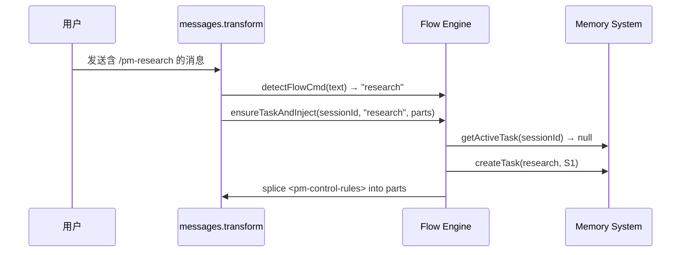

# Flow Engine Spec

**创建日期**: 2026-06-11
**状态**: Implemented
**最后更新**: 2026-06-17 — 重构：LLM 主导流程，文件引用替代内容注入，messages.transform 钩子驱动，fingerprint 去重

---

## 设计要点

Flow Engine 不再解析 Flow 步骤或管理 FSM 状态机。LLM 自行读取 flow 文件、理解步骤、管理流转。

### 核心职责

| 职责 | 说明 |
|------|------|
| 命令检测 | `detectFlowCmd()` — 从消息文本中匹配 `<auto-slash-command>` 模式，解析出 flow 名称 |
| 自动任务创建+注入 | `ensureTaskAndInject()` — 检测到 flow 命令后自动创建任务（如无活跃任务），注入 `<pm-control-rules>` 控制提示 |
| 控制提示清理 | `removeControlPrompt()` — 从消息 parts 中移除上轮注入的 `<pm-control-rules>`，防止重复 |
| Fingerprint 去重 | 基于 sessionId+flow 的 MD5 指纹，防止同一会话重复注入 |
| 任务生命周期 | `startTask()` / `closeTask()` |
| Command→Flow 映射 | 从 flow 文件解析 Command 字段，建立命令名到 flow 名称的映射 |
| 控制指令 | `buildControlPrompt()` 注入强力流程执行约束 |

### 公共 API

#### `detectFlowCmd(text: string): string | null`
从消息文本中检测 `/pm-*` 自动斜杠命令。匹配 `<auto-slash-command>` 块中的命令名，通过 `buildCommandFlowMap()` 解析为 flow 名称。

#### `ensureTaskAndInject(sessionId, flow, parts, msgId, msgSid): Promise<void>`
核心注入方法。流程：
1. 检查 session 是否有活跃任务 → 无则自动创建
2. MD5 指纹去重 → 同一 session+flow 只注入一次
3. 将 `<pm-control-rules>` 插入到消息 parts 中（splice 在 `<auto-slash-command>` 块之后）

#### `removeControlPrompt(parts): void`
反向清理：从消息 parts 中移除所有含 `<pm-control-rules>` 的项，防止控制提示累积。

#### `startTask(params): Promise<Task>`
创建新任务。校验 flow 存在性、检查 session 无重复任务，调用 `MemorySystem.createTask()`。

#### `setStep(sessionId, step): Promise<void>`
更新任务当前步骤。从内存缓存或 AxioDB 获取任务 docId，调用 `MemorySystem.updateStep()`。

#### `closeTask(sessionId): Promise<Task | null>`
关闭任务。调用 `MemorySystem.closeTask()`，清理内存缓存。

#### `getCurrentStep(sessionId: string): Promise<Task | null>`
查询当前活跃任务。委托 `MemorySystem.getActiveTask()`，返回完整 Task 对象或 null。

#### `resolveFlowFromCommand(command: string): string | null`
从命令名解析 flow 名称。依赖 `buildCommandFlowMap()`。

#### `clearCommandFlowCache(): void`
清除命令→流程映射缓存，在 `session.created` 事件时调用。

#### `buildControlPrompt(flowName?: string): string`
生成 `<pm-control-rules>` 控制提示文本。包含：
- 规则优先级（constitution > control rules > other）
- 启动流程（读 constitution → 读 flow FSM → 进入执行循环）
- 执行循环规则（逐步骤执行，禁止跳步）
- 步骤门禁表（S1 只读、⚠️ 需确认、编码按方案、合流验证）
- 红线表（8 条禁止行为）

### 注入标签格式

仅注入 `<pm-control-rules>` 单一标签。不再注入 `<pm-constitution>`、`<pm-flow-control>`、`<pm-dictionary>` 等独立标签。LLM 通过 `<pm-control-rules>` 中的文件引用自行读取。

```xml
<protect>
  ## 流程执行规则
  ...
  启动：
  1. 读取 docs/regulation/constitution.md
  2. 读取 docs/flow/flow-{name}.md 的 FSM 状态图
  3. 确认起点为 S1，进入执行循环
  
  执行循环（每个 S{n} 逐一执行）...
  
  ## 步骤门禁
  | S1（理解） | 阅读/探索 | 禁止编辑/创建文件 |
  ...
  
  ## 🔴 红线
  | # | 红线 | 违规示例 |
  ...
</protect>
```

### 不再负责的功能

| 功能 | 原因 |
|------|------|
| Flow 步骤解析（parseFlow 等） | LLM 自行读取 flow 文件 |
| FSM 状态机管理 | LLM 自行理解状态图 |
| Regulation 内容读取 | LLM 自行读取文件 |
| 消息裁剪 | LLM 按需读取，无需裁剪 |
| Prompt 去重 | `injectedFingerprints` Map 基于 sessionId+flow 的 MD5 去重 |

---

## 任务创建流程



## 内部状态

| 状态 | 类型 | 用途 |
|------|------|------|
| `sessionTasks` | `Map<string, string>` | sessionId → docId 内存缓存，避免重复查询 AxioDB |
| `injectedFingerprints` | `Map<string, string>` (static) | sessionId → MD5(sessionId:flow) 去重，防止重复注入 |
| `commandFlowCache` | `Map<string, string> \| null` | 命令名 → flow 名映射缓存，通过 `clearCommandFlowCache()` 过期 |

## FSM 流转

无代码层面 FSM。步骤流转由 LLM 通过调用 `pm_task_set_step` 工具驱动。`setStep()` 内部通过 `sessionTasks` 内存缓存获取 docId（未命中时回退到 AxioDB 查询），调用 `MemorySystem.updateStep()` 持久化。步骤名通过 `tryParseStepName()` 从 flow 文件中 best-effort 解析。

---

## 实施规划

> 本部分在开发过程中持续更新。以里程碑为粒度拆解，每个里程碑关联功能点和风险。

### [x] 里程碑 1 — Flow Engine MVP

- [x] `detectFlowCmd()` — 命令检测 + Command→Flow 映射（含缓存）
- [x] `ensureTaskAndInject()` — 自动任务创建 + `<pm-control-rules>` 注入
  - 已知问题/风险: `experimental.chat.messages.transform` API 可能在后续 OpenCode 版本变更
- [x] `removeControlPrompt()` — 控制提示清理，防止重复累积
- [x] `buildControlPrompt()` — 注入强力流程执行约束
  - 已知问题/风险: LLM 自主判断流转存在误判可能（Flow 文档 `完成后` 描述需保持清晰）
- [x] Fingerprint 去重（sessionId+flow 的 MD5）
- [x] 任务生命周期：`startTask()` / `closeTask()` / `setStep()` / `getCurrentStep()`
  - 已知问题/风险: 步骤名依赖 flow 文件解析（best-effort，flow 格式变更可能导致解析失败）
- [x] 精简注入为单一 `<pm-control-rules>` 标签
