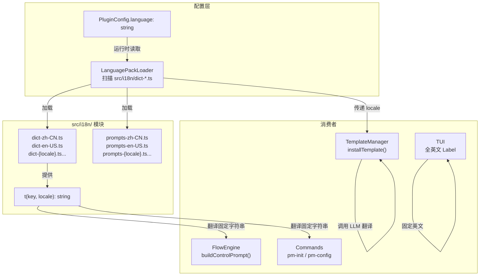
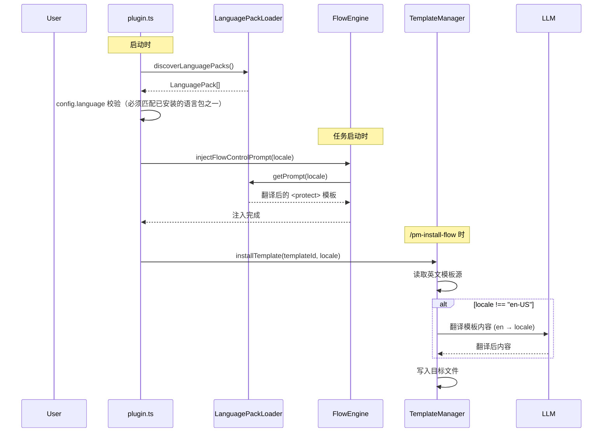
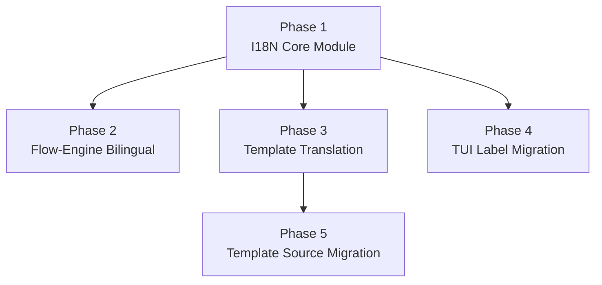

# I18N 国际化支持

**创建日期**: 2026-06-26
**状态**: Draft
**输入来源**: 用户需求 + `docs/note/vibe-pm-i18n.md` 调研报告 + S4 渐进式访谈

---

## 需求背景

vibe-pm 当前所有用户可见字符串均为硬编码中文——TUI 面板、Flow Engine 流程控制提示词、模板文档、命令交互消息。`PluginConfig.language` 字段虽已定义（`"zh-CN" | "en-US"`），但代码中零消费。调研笔记（`docs/note/vibe-pm-i18n.md`）标记了 5 个缺口、2 个模糊点、1 个矛盾项，并提出了 A/B/C 三种扩展方案。

**目标**：vibe-pm 以中文为开发过程中主要交互语言（展示以本地语言为主开发的能力），模板以英文为基础标准分发。建立可插拔语言包架构，实现运行时语言切换（TUI 除外，TUI 统一英文）。程序化字典覆盖固定 UI 字符串，LLM 翻译覆盖模板文档等长文本。

如果未实现，vibe-pm 将始终以中文交互，无法服务非中文用户，`PluginConfig.language` 持续为空壳字段。

---

## 用例场景与用户故事

### 用户故事 1 — 配置交互语言并生效（优先级：P1）

用户通过 `pm-config init` 选择交互语言后，后续所有 vibe-pm 的命令提示、流程控制注入、模板安装输出均以该语言呈现。

**优先原因**: 这是 I18N 的入口功能——无语言配置生效，其他功能无意义。

**独立验证**: 设置 `language: "en-US"` 后启动任一 vibe-pm 任务，验证 `<protect>` 注入提示词为英文。

**验收场景**:

1. **Given** 用户首次运行 `pm-config init`，**When** 选择语言"English"，**Then** `vibe-pm/config.json` 中 `language` 字段写为 `"en-US"`
2. **Given** `language: "en-US"`，**When** 启动 bug-fix 任务，**Then** 注入的 `<protect>` 块中「流程执行规则」「红线」「启动」等标题为英文
3. **Given** `language: "zh-CN"`（默认），**When** 启动任务，**Then** 注入提示词维持现有中文行为（向后兼容）

---

### 用户故事 2 — TUI 面板全英文展示（优先级：P1）

TUI 侧边栏的 Label（Flow、Step、Token Distribution 等）统一使用英文，不再显示中文。不实现 TUI 双语切换——仅英文。

**优先原因**: TUI 是用户直接可见的界面，英文 Label 提升国际化一致性。

**独立验证**: 打开任意 vibe-pm 项目，查看侧边栏——所有标题和标签为英文。

**验收场景**:

1. **Given** 存在活跃任务，**When** 打开 TUI 侧边栏，**Then** 显示 `Flow: spec-driven-dev`、`Step: S5 — Design`（非中文）
2. **Given** 无活跃任务，**When** 打开 TUI 侧边栏，**Then** 显示 `No active vibe-pm tasks`（非「暂无 vibe-pm 任务」）

---

### 用户故事 3 — 模板安装时翻译输出（优先级：P2）

`/pm-install-flow` 安装模板时，英文源模板自动翻译为 `config.language` 指定的交互语言，安装到用户项目。

**优先原因**: 保证用户项目中的流程文档、行为准则与其选择的交互语言一致。

**独立验证**: 设置 `language: "zh-CN"`，安装 `spec-driven-dev` 流程，检查 `docs/flow/flow-spec-driven-dev.md` 内容为中文。

**验收场景**:

1. **Given** `language: "zh-CN"` 且模板源为英文，**When** 执行 `/pm-install-flow spec-driven-dev`，**Then** 安装后的 `flow.md`、`constitution.md`、`dictionary.md` 为中文
2. **Given** `language: "en-US"` 且模板源为英文，**When** 安装流程，**Then** 直接复制英文源，不触发翻译（源=目标，跳过 LLM 调用）

---

### 用户故事 4 — 新增语言包可插拔（优先级：P2）

开发者添加新语言支持时，只需创建 `src/i18n/dict-{locale}.ts` 文件，系统自动发现并纳入可选语言列表。

**优先原因**: 降低新增语言的成本，避免硬编码语言列表。

**独立验证**: 新增 `src/i18n/dict-ja-JP.ts`，重启后 `pm-config init` 向导自动展示「日本語」选项。

**验收场景**:

1. **Given** `src/i18n/` 下存在 `dict-zh-CN.ts` 和 `dict-en-US.ts`，**When** 运行 `pm-config init` 语言选择步骤，**Then** 展示"中文"和"English"两个选项
2. **Given** 新创建 `src/i18n/dict-ja-JP.ts`（符合约定），**When** 重启插件，**Then** 语言选择步骤自动增加「日本語」选项

---

## 设计要点

### 领域模型

| 实体 | 属性 | 关系 |
|------|------|------|
| LanguagePack | `locale: string`，`label: string`，`dict: Record<DictKey, string>` | 1 个 LanguagePack 对应 1 种语言 |
| DictKey | `string`（如 `"flow"`、`"step"`、`"task"`） | LanguagePack.dict 的键——与 dictionary.md 术语对应 |
| ControlPrompt | `locale: string`，`template: string` | 每种语言一个 ControlPrompt 实例，包含 `<protect>` 块的完整翻译 |
| PluginConfig | `language: string`（放宽为 string 类型，运行时校验） | 指向当前激活的 LanguagePack |



### 关键路径



### 条件分支

| 条件 | 行为 |
|------|------|
| `config.language` 指向已安装的语言包 | 正常加载并使用 |
| `config.language` 指向未安装的语言包 | 回退到 `"en-US"`（基底语言），记录 warning 日志 |
| 模板安装时 `locale === "en-US"` | 跳过 LLM 翻译，直接复制源文件 |
| 模板安装时 LLM 翻译失败 | 回退输出英文源文件 + 日志告警（不阻塞安装） |
| 语言包文件缺失/格式错误 | 回退到 en-US 基底语言包，记录 error 日志 |

### 接口设计

#### `src/i18n/types.ts` — 核心类型

```typescript
/** 语言包标识 */
export type Locale = string;

/** 固定字符串字典键 */
export type DictKey = string;

/** 语言包定义 */
export interface LanguagePack {
  locale: Locale;
  label: string;            // 人类可读标签，如 "English" / "中文"
  dict: Record<DictKey, string>;
}

/** 流程控制提示词模板 */
export interface ControlPromptTemplate {
  locale: Locale;
  buildControlPrompt: (flowName?: string) => string;
  buildFlowWarningPrompt: () => string;
}
```

#### `src/i18n/loader.ts` — 语言包加载器

```typescript
/** 扫描 i18n 目录，返回所有可用语言包 */
export function discoverLanguagePacks(): LanguagePack[];

/** 按 locale 获取语言包，不存在则回退 en-US */
export function getLanguagePack(locale: Locale): LanguagePack;

/** 按 locale 获取提示词模板，不存在则回退 en-US */
export function getControlPromptTemplate(locale: Locale): ControlPromptTemplate;

/** 翻译函数：根据 key 和 locale 返回对应字符串 */
export function t(key: DictKey, locale: Locale): string;
```

#### 语言包文件约定

```
src/i18n/
├── types.ts              # 类型定义
├── loader.ts             # 加载器 + t() 函数
├── dict-en-US.ts          # 基底英文语言包（必须有）
├── dict-zh-CN.ts          # 中文语言包
├── prompts-en-US.ts       # 基底英文提示词模板（必须有）
└── prompts-zh-CN.ts       # 中文提示词模板
```

文件命名约定：`dict-{locale}.ts` 和 `prompts-{locale}.ts`。

### 可配置项

| 配置项 | 默认值 | 说明 |
|--------|--------|------|
| `PluginConfig.language` | `"en-US"` | 修改默认值为英文（基底语言），与「英文基底」策略一致 |

---

## 边界与错误情况

| 场景 | 预期行为 |
|------|---------|
| `config.language` 指向未安装的语言包 | 回退 `en-US`，输出 warning 日志 |
| 语言包 `.ts` 文件语法错误 | 加载时 `try/catch`，回退 `en-US`，输出 error 日志 |
| LLM 翻译模板时超时/失败 | 输出英文源文件，不阻塞安装，日志告警 |
| 模板内容过大（>4000 tokens） | 分块翻译，或跳过翻译直接输出英文 |
| `pm-config init` 时 `src/i18n/` 为空 | 不展示语言选择步骤（仅 en-US 可用） |
| 并发安装两个流程 + 翻译 | 各自独立 LLM 调用，不共享翻译缓存 |
| 用户手动修改已安装的翻译后文档 | 不覆盖（`installTemplate` 的 `overwrite` 参数为 false 时） |
| 旧版流程模板（中文源）与新 I18N 混用 | 模板源迁移阶段通过 `language` 检测兼容；迁移完成后全部英文源 |

---

## 测试用例

### I18N 核心模块测试

- **测试文件**: `tests/i18n/loader.test.ts`
- **关联设计文档**: `docs/spec/vibe-pm-i18n-support.md`

| 动作指令 | 测试方法 | Given | When | Then | Notes |
|----------|----------|-------|------|------|-------|
| 新增 | `discover_two_packs` | `src/i18n/` 下有 `dict-en-US.ts`, `dict-zh-CN.ts` | 调用 `discoverLanguagePacks()` | 返回 2 个 LanguagePack，locale 分别为 `en-US` 和 `zh-CN` | |
| 新增 | `fallback_to_en_us` | 仅 `dict-en-US.ts` 存在 | 调用 `getLanguagePack("ja-JP")` | 返回 `en-US` 语言包 | |
| 新增 | `t_translate_zh_cn` | 加载 `zh-CN` 字典（`flow: "流程"`） | `t("flow", "zh-CN")` | 返回 `"流程"` | |
| 新增 | `t_missing_key_fallback` | 加载 `zh-CN` 字典（无 `"unknown"` 键） | `t("unknown", "zh-CN")` | 返回 `"unknown"`（回退 key 本身） | |
| 新增 | `prompt_template_zh_cn` | 加载 `prompts-zh-CN.ts` | `buildControlPrompt("bug-fix")` | 返回包含中文「流程执行规则」的 `<protect>` 块 | |
| 新增 | `prompt_template_en_us` | 加载 `prompts-en-US.ts` | `buildControlPrompt("bug-fix")` | 返回包含英文 "Flow Execution Rules" 的 `<protect>` 块 | |

### TUI Label 测试

- **测试文件**: `tests/tui/sidebar-content.test.ts`（新增或扩展现有测试）

| 动作指令 | 测试方法 | Given | When | Then | Notes |
|----------|----------|-------|------|------|-------|
| 修改 | `active_task_labels_english` | 活跃任务存在 | 渲染 SidebarContent | 所有标签为英文（`Flow:`、`Step:`、`Started:`、`Elapsed:`） | |
| 修改 | `empty_state_english` | 无任务 | 渲染 EmptyState | 显示 `No active vibe-pm tasks` | |

---

## 约束与限制

### 技术约束

- **运行时环境**: Bun + TypeScript strict mode
- **依赖**: 不引入重型 I18N 框架（如 i18next）。固定字符串使用自定义 `t()` 函数。长文本翻译依赖 LLM（通过 SDK 已有的 LLM 交互能力）
- **LLM 翻译可用性**: 依赖 OpenCode SDK 的 `client` 接口调用 LLM。若 SDK 版本不支持长文本翻译 API，需降级为预翻译策略
- **`PluginConfig.language` 类型变更**: 从 `"zh-CN" \| "en-US"` 联合类型改为 `string`。需同步更新 Zod schema（如有）和 config 校验逻辑

### 业务约束

- **基底语言不可删除**: `en-US` 语言包为必需——作为回退基底，不可被移除
- **宪章 VIII**: 语言绑定由宪章自身更新（独立任务），本 Spec 不处理
- **向后兼容**: 不存在 `language` 字段的旧配置文件（升级前创建的），默认回退 `en-US`（因默认值修改）

### 已知风险

| 风险 | 影响 | 缓解措施 |
|------|------|---------|
| LLM 翻译质量不稳定 | 安装的文档可能包含翻译错误 | 翻译完成后增加简要质量检查日志，但不阻塞安装 |
| LLM 翻译增加安装延迟 | `/pm-install-flow` 耗时显著增加 | 优化：小文件翻译 + 并行 + 缓存已翻译内容 |
| 语言包 key 命名不一致 | 字典维护混乱 | 用 TypeScript 类型约束 + `dictionary.md` 作为 key 来源参考 |
| 模板源迁移不彻底 | 混合中英文源，安装行为不一致 | 分阶段迁移（见分步实施计划），每个 Phase 有明确完成标准 |

### 影响范围

| 模块 | 变更类型 | 说明 |
|------|---------|------|
| `src/i18n/` | **新增** | I18N 核心模块（types, loader, dicts, prompts） |
| `src/core/types.ts` | 修改 | `language: string`（原 `"zh-CN" \| "en-US"`） |
| `src/core/config.ts` | 修改 | `DEFAULT_CONFIG.language` 改为 `"en-US"` |
| `src/core/plugin.ts` | 修改 | 启动时调用 `discoverLanguagePacks()`，校验 `config.language`，传递 locale |
| `src/core/commands.ts` | 修改 | `pm-config init` 语言步骤动态展示；`pm-install-flow` 传递 locale |
| `src/engine/flow-engine.ts` | 修改 | `buildControlPrompt()` 和 `injectFlowWarningPrompt()` 改为从 PromptTemplate 获取 |
| `src/template/template-manager.ts` | 修改 | `installTemplate()` 增加 LLM 翻译管道 |
| `src/tui/slots/sidebar-content.tsx` | 修改 | 11 个硬编码中文字符串 → 英文 |
| `src/tui/components/empty-state.tsx` | 修改 | 1 个硬编码中文字符串 → 英文 |
| `docs/template/*/flow.md` | **翻译** | 现有中文模板源 → 英文 |
| `docs/template/constitution-template.md` | 修改 | 中文内容 → 英文 |
| `docs/template/dictionary-template.md` | 修改 | 中文说明 → 英文 |
| `docs/regulation/constitution.md` | 不修改 | 语言绑定由独立任务更新 |

---

## 分步实施计划

本需求涉及 5 个独立模块且有明确先后依赖，分解为 5 个 Phase。



### Phase 1: I18N Core Module

**职责边界**: 建立 `src/i18n/` 模块——类型定义、语言包加载器、`t()` 翻译函数、en-US 基底语言包。`PluginConfig.language` 类型变更为 `string`。

**交付物**:
- `src/i18n/types.ts` — `Locale`、`DictKey`、`LanguagePack`、`ControlPromptTemplate` 类型
- `src/i18n/loader.ts` — `discoverLanguagePacks()`、`getLanguagePack()`、`getControlPromptTemplate()`、`t()`
- `src/i18n/dict-en-US.ts` — 基底英文字典
- `src/i18n/prompts-en-US.ts` — 基底英文提示词模板（原 `buildControlPrompt` 翻译版）
- `src/i18n/dict-zh-CN.ts` — 中文字典（从 `dictionary.md` 迁移）
- `src/i18n/prompts-zh-CN.ts` — 中文提示词模板（原硬编码中文直接迁移）
- `tests/i18n/loader.test.ts` — 覆盖发现、回退、翻译、模板渲染

**MVP 验证**: `discoverLanguagePacks()` 返回正确语言包列表，`t("flow", "zh-CN")` 返回 `"流程"`。

### Phase 2: Flow-Engine Bilingual Prompt Injection

**职责边界**: `flow-engine.ts` 接入 I18N 模块，`buildControlPrompt()` 从 `getControlPromptTemplate(locale)` 获取翻译后的提示词。

**依赖**: Phase 1（I18N Core）

**交付物**:
- 修改 `src/engine/flow-engine.ts`：`FlowEngine` 构造函数接收 `locale` 参数
- 修改 `src/core/plugin.ts`：启动时传递 `config.language` 给 FlowEngine
- 修改 `src/core/config.ts`：`DEFAULT_CONFIG.language` 改为 `"en-US"`
- `pm-config init` 语言步骤改为动态语言包列表

**MVP 验证**: 设置 `language: "en-US"`，启动任务，验证注入提示词为英文。

### Phase 3: Template Translation Pipeline (LLM)

**职责边界**: `template-manager.ts` 在 `installTemplate()` / `installRegulationFromTemplate()` 中增加 LLM 翻译管道。`/pm-install-flow` 传递 locale。

**依赖**: Phase 1（I18N Core）

**交付物**:
- 修改 `src/template/template-manager.ts`：`installRegulationFromTemplate()` 增加 `translateContent()` 调用
- 修改 `src/core/commands.ts`：`createInstallFlowTool()` 传递 locale
- 新增 LLM 翻译调用逻辑（通过 SDK client）
- 错误处理：翻译失败回退英文源

**MVP 验证**: `language: "zh-CN"` 时安装流程，输出文档为中文。

### Phase 4: TUI Label Migration

**职责边界**: TUI 组件中 11 个硬编码中文字符串全部替换为英文。不实现 TUI 双语切换。

**依赖**: Phase 1（I18N Core，仅类型定义部分。可独立于 Phase 2/3 并行）

**交付物**:
- 修改 `src/tui/slots/sidebar-content.tsx`：10 个 Label → 英文
- 修改 `src/tui/components/empty-state.tsx`：1 个 Label → 英文

**MVP 验证**: TUI 侧边栏所有标签为英文。

### Phase 5: Template Source Migration

**职责边界**: 将 `docs/template/` 下所有现有模板文档从中文翻译为英文（基底语言）。确保 Phase 3 的 LLM 翻译管道能正确将英文源翻译为目标语言。

**依赖**: Phase 3（Template Translation Pipeline 完成后，有 LLM 翻译能力可辅助迁移）

**交付物**:
- `docs/template/*/flow.md`（全部 6 个流程模板）→ 英文
- `docs/template/constitution-template.md` → 英文
- `docs/template/dictionary-template.md` → 英文
- `docs/template/spec-template.md` → 英文
- `docs/template/agents-template.md` → 英文

**MVP 验证**: 所有模板源文件为英文，`/pm-install-flow` 能正确安装并翻译。

---

## 实施规划

> 本部分在开发过程中持续更新。以里程碑为粒度拆解，每个里程碑关联功能点和风险。

### [x] 里程碑 1 — Phase 1: I18N Core Module

- [x] `src/i18n/` 模块建立：types（Locale/LanguagePack/ControlPromptTemplate）、loader（discoverLanguagePacks/getControlPromptTemplate）
  - 已知问题/风险: 无 `t()` 翻译函数、无字典文件——TUI 全英文 + ControlPrompt 用模板覆盖所有文本需求
- [x] `PluginConfig.language` 类型变更为 `string`
- [x] en-US 基底提示词模板（`prompts-en-US.ts`） + zh-CN 模板（`prompts-zh-CN.ts`）
  - 已知问题/风险: 提示词文件为静态模块，新增语言需手动创建 prompts-{locale}.ts 文件

### [ ] 里程碑 2 — Phase 2: Flow-Engine Bilingual Prompt

- [ ] `flow-engine.ts` 接入 I18N，`buildControlPrompt()` 按 locale 获取翻译
- [ ] `DEFAULT_CONFIG.language` 改为 `"en-US"`
- [ ] `pm-config init` 语言步骤动态化
  - 已知问题/风险: 依赖 Phase 1 完成

### [ ] 里程碑 3 — Phase 3: Template Translation

- [ ] `template-manager.ts` 增加 LLM 翻译管道
- [ ] `installRegulationFromTemplate()` 调用 `translateContent()`
  - 已知问题/风险: LLM 翻译质量不稳定；翻译增加安装延迟
- [ ] 翻译失败回退英文源

### [ ] 里程碑 4 — Phase 4: TUI Label Migration

- [ ] `sidebar-content.tsx` 中 10 个中文字符串 → 英文
- [ ] `empty-state.tsx` 中 1 个中文字符串 → 英文
  - 已知问题/风险: 可独立于 Phase 2/3 并行实施

### [ ] 里程碑 5 — Phase 5: Template Source Migration

- [ ] 全部 6 个流程模板 → 英文源
- [ ] constitution-template、dictionary-template、spec-template、agents-template → 英文
  - 已知问题/风险: 依赖 Phase 3 完成后辅助翻译；混合中英文源风险
