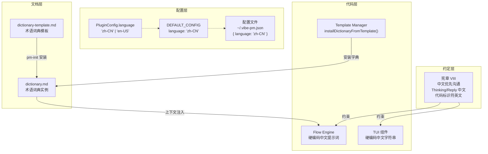
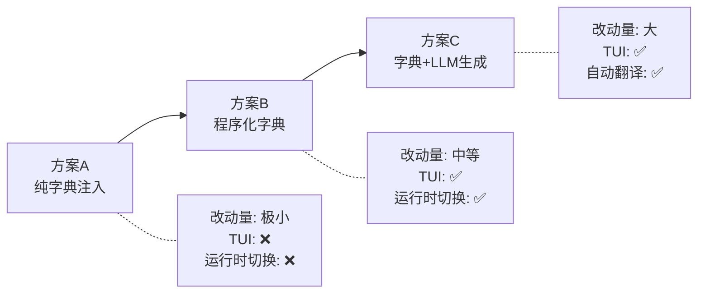

# vibe-pm I18N 调研报告

**创建日期**: 2026-06-22
**状态**: Draft
**调研类型**: 架构现状分析 + 扩展方案设计

---

## 调研范围

分析 vibe-pm 项目当前的国际化（I18N）架构，厘清现状、标记缺口、提出可扩展的语义化 I18N 方案。

---

## 当前 I18N 现状

### 组件地图



### 关键组件详解

#### 1. PluginConfig.language（配置层）

```typescript
// src/core/types.ts:27
export interface PluginConfig {
  language: "zh-CN" | "en-US";  // ✅ 类型安全，仅两个选项
  dataDir: string;
  autoAnalyze: boolean;
  contextInjection: { ... };
}
```

**状态**：已定义，默认值 `"zh-CN"`，但**代码中零消费**。无任何模块根据此字段做分支、选择模板、或切换输出语言。

#### 2. Dictionary.md（文档层）

`docs/regulation/dictionary.md` 是一个 Markdown 表格格式的中英术语对照表，覆盖 6 个分类约 50 个术语：

| 分类 | 示例条目 |
|------|---------|
| 核心概念 | 流程 ⇔ Flow, 步骤 ⇔ Step, 任务 ⇔ Task |
| 任务模型 | 规格说明 ⇔ Spec, 任务计划 ⇔ Plan |
| 记忆体系 | MD 文档记忆 ⇔ MD Document Memory, 结构化记忆 ⇔ Structured Memory |
| 流程相关 | 状态机 ⇔ FSM, 人机协作 ⇔ Human-in-loop |
| 技术栈 | 插件 ⇔ Plugin, 宿主 ⇔ Host, 会话 ⇔ Session |
| 命令对照 | `/pm-init` ⇔ pm-init, `/pm-task-close` ⇔ pm-task-close |

**消费路径**：通过 `flow-engine.ts` 的 `<pm-control-rules>` 注入 LLM 上下文，作为"合规参考"的一部分：
```
- `dictionary.md` → 本地语言 ↔ 英文术语转换
```

LLM 自行读取并使用该对照表进行术语一致性翻译。

#### 3. 代码硬编码（代码层）

| 位置 | 硬编码语言 | 示例 |
|------|-----------|------|
| `flow-engine.ts:64-150` | 中文 | 流程控制提示 `<protect>` 全部中文 |
| `tui/slots/sidebar-content.tsx` | 中文 | "流程:", "步骤:", "Token 分布", "暂无数据" |
| `tui/components/empty-state.tsx` | 中文 | "暂无 vibe-pm 任务" |

无一例外，所有面向用户的字符串均为硬编码中文。

#### 4. 宪章 VII（约定层）

```markdown
### VII. 中文优先沟通（Chinese-First Communication）
- Thinking 思考过程用中文表述
- Reply 回答用中文
- 代码注释和标识符使用英文
- 日志输出使用英文（便于工具处理）
```

这是**约定**而非**代码约束**。实际执行依赖 LLM 阅读理解并遵守。

### 与编程语言检测的区别

项目中存在名为 `LANGUAGE_DETECTORS` 和 `detectProjectLanguages()` 的机制，但它们检测的是**编程语言**（TypeScript/Python/Go/Rust...），用于自动生成 `coding_style.md`，**与人类语言 I18N 完全无关**。

---

## 缺口分析

### 缺失项

| # | 缺口 | 严重度 | 影响范围 |
|---|------|--------|---------|
| G-1 | `config.language` 未消费——无运行时语言切换 | 🔴 阻塞 | 全局 |
| G-2 | 无程序化翻译字典（JSON/TS 格式） | 🔴 阻塞 | TUI + 注入提示词 |
| G-3 | TUI UI 字符串硬编码，无翻译抽象 | 🟡 功能 | 终端面板 |
| G-4 | flow-engine 注入提示词硬编码 | 🟡 功能 | 流程控制 |
| G-5 | 日志输出未统一管理语言 | 🟢 体验 | 日志 |

### 模糊项

| # | 模糊点 | 待澄清 |
|---|--------|--------|
| F-1 | `config.language` 的设计定位是**预留待实现**还是**声明性文档**？ | 影响实现优先级 |
| F-2 | `dictionary.md` 注入 LLM 后对 AI 输出语言的实际约束效果如何？ | 影响是否需要运行时强制 |

### 矛盾项

| # | 矛盾 | 分析 |
|---|------|------|
| C-1 | 设计原则称"多语言支持：字典优先的本地化"，但实际只有 Markdown 术语表 + 硬编码中文 | 功能未完成——设计意图已表达，但实现停留在约定层。不是设计冲突，而是迭代阶段问题 |

---

## 扩展方案设计

基于项目现状（TypeScript 插件、CLI/TUI 环境、非 Web 框架），提出三种扩展路径：

### 方案 A：纯字典注入（最小改动）

**思路**：保持现有架构，仅增强 dictionary.md 注入策略。

```
当前：dictionary.md 仅作为"合规参考"链接 → LLM 可读可不读
方案A：将 dictionary.md 全文作为 <pm-control-rules> 的组成部分注入
```

**改动量**：~10 行代码（修改 flow-engine.ts 注入逻辑）
**收益**：术语翻译一致性提高
**局限**：
- 仅影响 LLM 理解，不影响 TUI 输出
- 无法做真正的双语 UI 切换
- `config.language` 依然不生效

### 方案 B：程序化字典 + 运行时切换（中等改动）

**思路**：将 `dictionary.md` 升级为 TypeScript 字典模块，支持运行时语言切换。

```typescript
// src/i18n/dictionary.ts
type Lang = "zh-CN" | "en-US";
type DictKey = "flow" | "step" | "task" | "constitution" | ...;

const dictionary: Record<Lang, Record<DictKey, string>> = {
  "zh-CN": { flow: "流程", step: "步骤", task: "任务", ... },
  "en-US": { flow: "Flow",  step: "Step",  task: "Task",  ... },
};

export function t(key: DictKey, lang: Lang): string {
  return dictionary[lang]?.[key] ?? dictionary["zh-CN"][key];
}
```

**改动量**：
- 新增 `src/i18n/` 模块（~100 行 TS）
- 修改 TUI 组件：替换硬编码字符串为 `t()` 调用
- 修改 `plugin.ts`：读取 `config.language` 并传递到 TUI
- 修改 `flow-engine.ts`：注入提示词支持双语模板

**收益**：
- `config.language` 终于生效
- TUI 界面支持中英切换
- 流程控制提示词支持中英切换
- 通过 dictionary.md 的对照关系生成 TypeScript 类型确保一致性

**局限**：
- 只支持 UI 字符串和少量提示词，不覆盖完整的自然语言生成
- 翻译覆盖度取决于手动维护的键值对数量

### 方案 C：字典 + LLM 翻译生成（最大改动）

**思路**：在方案 B 基础上，利用 LLM 自动生成翻译内容。

```
流程：
1. dictionary.md 作为翻译基础（术语层面）
2. 遇到没有翻译键的文本 → 调用 LLM 生成翻译 → 人工确认 → 加入字典
3. 字典自循环成长
```

**改动量**：方案 B + LLM 翻译管道（~300+ 行新增）
**收益**：翻译覆盖度随时间指数增长
**局限**：
- 引入 LLM 调用的延迟和成本
- 翻译质量需要人工复审机制
- 对当前阶段来说过度设计

### 方案对比



| 维度 | 方案 A | 方案 B | 方案 C |
|------|--------|--------|--------|
| 代码改动量 | ~10 行 | ~150 行 | ~400+ 行 |
| `config.language` 生效 | ❌ | ✅ | ✅ |
| TUI 双语支持 | ❌ | ✅ | ✅ |
| Flow 提示词双语 | ❌ | ✅ | ✅ |
| 术语一致性 | 提升 | 强制 | 强制 + 自动补充 |
| 翻译维护负担 | 无 | 手动 | 半自动 |
| 适合阶段 | 现状 | MVP 增强 | v2.0 |

---

## 外部参考：字典优先 I18N 最佳实践

> ⚠️ 外部参考（Librarian Agent）结果在此补充。当前基于已知业内实践。

在 CLI/插件类项目的 I18N 中，"字典优先"模式的典型特征：

1. **单一真相源（Single Source of Truth）**：所有翻译键统一维护在一个文件或目录中，而非散落各处
2. **类型安全键（Type-Safe Keys）**：通过 TypeScript 类型系统确保已翻译键一定存在对应翻译
3. **最小资源原则**：仅翻译面向用户的字符串，不含内部日志和调试信息
4. **渐进式覆盖**：从核心 UI 字符串开始，逐步扩展到提示词、错误信息、帮助文本
5. **避免重型框架**：CLI 环境下不需要 i18next 等级别的运行时（ICU 消息格式、复数规则等），简单的 key-value 映射 + 模板字符串足够

---

## 推荐路径

### 分阶段推进

| 阶段 | 内容 | 对应方案 |
|------|------|---------|
| **Now** | 增强 dictionary.md 注入为全文（方案 A） | 方案 A |
| **Phase 3/4** | 实现程序化字典 + 运行时切换（方案 B） | 方案 B |
| **Future** | 如需更广覆盖，评估方案 C | 方案 C |

### 待决策问题

1. **`config.language` 的定位**：确认为"即将实现"还是"远期规划"？
2. **I18N 的优先级**：在 roadmap 的哪个阶段加入？是否放在 Phase 3 增强阶段？
3. **方案 B 的接受度**：是否认可"程序化字典 + 运行时切换"作为中期方案？

---

## 附录：涉及文件清单

| 文件 | 角色 |
|------|------|
| `src/core/types.ts` | `PluginConfig.language` 类型定义 |
| `src/core/config.ts` | 默认语言配置、加载/合并逻辑 |
| `.vibe-pm.json` | 项目运行时语言配置 |
| `docs/regulation/dictionary.md` | 术语词典实例 |
| `docs/template/dictionary-template.md` | 术语词典模板 |
| `src/template/template-manager.ts` | 字典安装、编程语言检测 |
| `src/engine/flow-engine.ts` | 流程控制（硬编码中文）、字典引用 |
| `src/tui/slots/sidebar-content.tsx` | TUI 面板 UI 字符串（硬编码中文） |
| `src/tui/components/empty-state.tsx` | TUI 空状态文本（硬编码中文） |
| `docs/regulation/constitution.md` | 宪章 VIII: 中文优先沟通 |
| `docs/spec/vibe-pm-overall.md` | 总体架构（间接引用 dictionary.md） |
