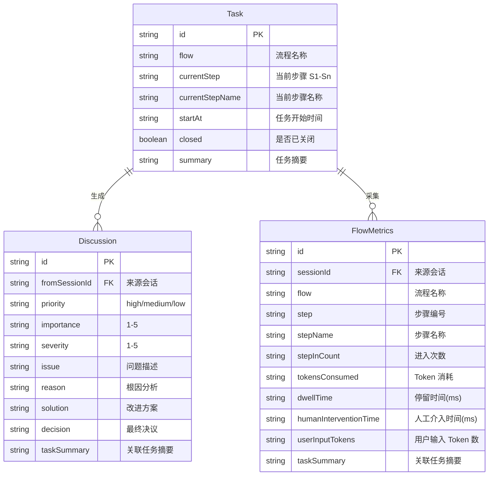
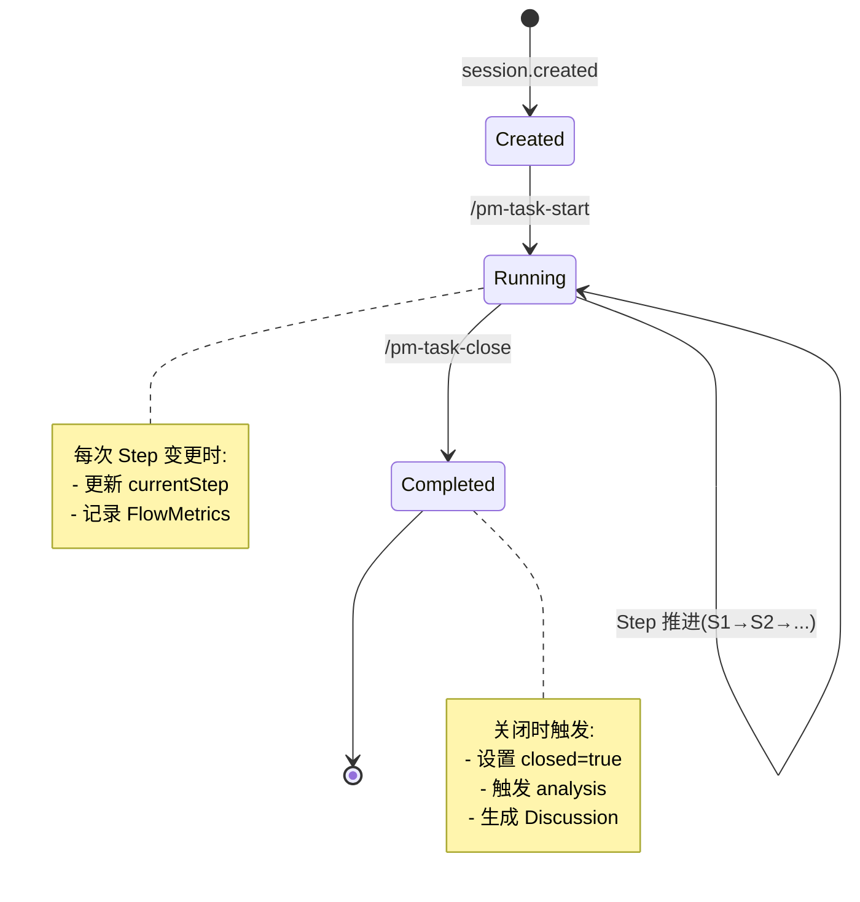

# Memory System Spec

**创建日期**: 2026-06-11
**状态**: Implemented
**输入来源**: XMind 设计文档 + S4 访谈（SQLite 嵌入式、单文件存储）
**最后更新**: 2026-06-20 — 切换至 bun:sqlite，移除 tui-bridge 桥接文件

---

## 需求背景

Memory System 是 vibe-pm 的数据层，负责结构化记忆的持久化存储。使用 SQLite (bun:sqlite) 作为嵌入式数据库，存储载体为单文件。管理三类核心数据：Task（任务状态）、Discussion（讨论项）、FlowMetrics（流程指标）。

---

## 设计要点

### 领域模型



### 数据模型详情

#### Task

```typescript
interface Task {
  id: string;                 // 自动生成 UUID
  flow: string;               // 流程名称，如 "project-build"
  currentStep: string;        // 当前步骤 ID，如 "S3"
  currentStepName: string;    // 当前步骤名称，如 "需求澄清访谈"
  startAt: string;            // ISO 8601 时间戳
  closed: boolean;            // 是否已关闭
  summary: string;            // 任务摘要（任务目标的一句话描述）
  // 扩展字段
  specRef?: string;           // 关联的 Spec 文档路径
  planRef?: string;           // 关联的 Plan 文档路径
}
```

#### Discussion

```typescript
interface Discussion {
  id: string;                 // 自动生成 UUID
  fromSessionId: string;      // 来源 session ID
  priority: "high" | "medium" | "low";
  importance: 1 | 2 | 3 | 4 | 5;
  severity: 1 | 2 | 3 | 4 | 5;
  issue: string;              // 问题描述
  reason: string;             // 根因分析
  solution: string;           // 改进方案
  decision?: string;          // 最终决议（用户审阅后填写）
  taskSummary: string;        // 关联任务的摘要（从 Task.summary 复制）
  createdAt: string;          // ISO 8601
  resolvedAt?: string;        // 决议时间
}
```

#### FlowMetrics

```typescript
interface FlowMetrics {
  id: string;                 // 自动生成 UUID
  sessionId: string;          // 来源 session ID
  flow: string;               // 流程名称
  step: string;               // 步骤编号，如 "S4"
  stepName: string;           // 步骤名称，如 "需求澄清访谈"
  stepInCount: number;        // 进入该步骤的次数
  tokensConsumed: number;     // 该步骤消耗的 Token 数
  dwellTime: number;          // 停留时间（毫秒）
  humanInterventionTime: number; // 人工介入时间（毫秒）
  userInputTokens: number;    // 用户输入 Token 数
  taskSummary: string;        // 关联任务的摘要（从 Task.summary 复制）
}
```

### 关键路径

#### 任务生命周期



#### 数据文件组织

```
.vibe-pm/
├── vibe-pm.db             # SQLite 数据库文件：包含三张表（tasks, discussions, flowMetrics）
└── data/                  # 【已废弃】旧 AxioDB 数据目录（可手动删除）
```

### 接口设计

```typescript
interface IMemorySystem {
  // --- Task CRUD ---
  createTask(task: Omit<Task, "closed">): Promise<Task>;
  getTask(sessionId: string): Promise<Task | null>;
  getActiveTask(sessionId: string): Promise<Task | null>;   // closed === false
  updateStep(sessionId: string, step: string, stepName: string): Promise<void>;
  closeTask(sessionId: string): Promise<void>;
  listActiveTasks(): Promise<Task[]>;                        // 所有未关闭的任务

  // --- Discussion CRUD ---
  createDiscussion(discussion: Omit<Discussion, "id" | "createdAt">): Promise<Discussion>;
  getDiscussions(sessionId: string): Promise<Discussion[]>;
  getUnresolvedDiscussions(): Promise<Discussion[]>;         // decision 为空的
  resolveDiscussion(id: string, decision: string): Promise<void>;
  listDiscussions(filter?: { priority?: string; unresolved?: boolean }): Promise<Discussion[]>;

  // --- FlowMetrics CRUD ---
  recordStepEntry(
    sessionId: string,
    flow: string,
    step: string,
    stepName: string,
    tokensConsumed: number,
    userInputTokens: number,
  ): Promise<void>;
  recordStepExit(
    sessionId: string,
    step: string,
    dwellTime: number,
    humanInterventionTime: number,
  ): Promise<void>;
  getFlowMetrics(sessionId: string): Promise<FlowMetrics[]>;
  getFlowMetricsByFlow(flow: string): Promise<FlowMetrics[]>; // 按流程聚合

  // --- 初始化 ---
  init(dataDir: string): Promise<void>;  // 确保数据文件和目录存在
}
```

### SQLite 集成

基于 bun:sqlite（Bun 内置模块），使用预编译语句和 WAL 模式：

```typescript
import { Database } from "bun:sqlite";

class MemorySystem implements IMemorySystem {
  private db: Database;

  async init(dataDir: string): Promise<void> {
    this.db = new Database(`${dataDir}/vibe-pm.db`, { create: true });
    this.db.run("PRAGMA journal_mode = WAL");

    this.db.exec(`
      CREATE TABLE IF NOT EXISTS tasks (
        id TEXT PRIMARY KEY,
        sessionId TEXT NOT NULL,
        flow TEXT NOT NULL,
        currentStep TEXT NOT NULL,
        currentStepName TEXT NOT NULL,
        startAt TEXT NOT NULL,
        endAt TEXT,
        closed INTEGER NOT NULL DEFAULT 0,
        summary TEXT NOT NULL,
        specRef TEXT,
        planRef TEXT,
        stepTransitions JSON
      );
      -- 其他两表类似
    `);

    // 预编译语句提升性能
    this.stmtInsertTask = this.db.prepare("INSERT INTO tasks (...) VALUES (...)");
    this.stmtGetActiveTask = this.db.prepare("SELECT * FROM tasks WHERE sessionId = ? AND closed = 0 LIMIT 1");
    // ...
  }
}
```

---

---

## 测试用例

### task-crud.test.ts

- **测试文件**: `tests/memory/task-crud.test.ts`
- **关联设计文档**: `vibe-pm-memory-system.md`
- **Setup/Teardown**: 创建临时 `.vibe-pm/` 目录，初始化 Memory System，测试后清理

| 动作指令 | 测试方法 | Given | When | Then | Notes |
|----------|----------|-------|------|------|-------|
| 新增 | `create_and_get_task` | 空数据库 | 创建 Task 后查询 | 返回的 Task 字段完整，closed=false，summary 和 currentStepName 有值 | 基本 CRUD 流程 |
| 新增 | `getActiveTask_filters_closed` | 数据库有 1 个 active + 1 个 closed Task | 查询 active task | 仅返回 closed=false 的那条 | closed 过滤 |
| 新增 | `updateStep_updates_both` | active Task 在 S3 | updateStep("S4", "设计方案") | currentStep="S4", currentStepName="设计方案" | 步骤名同步更新 |
| 新增 | `duplicate_task_rejected` | 已有 active Task for session X | 再次 createTask(session X) | 抛出 DuplicateTaskError | 唯一性约束 |

### discussion-crud.test.ts

- **测试文件**: `tests/memory/discussion-crud.test.ts`
- **关联设计文档**: `vibe-pm-memory-system.md`
- **Setup/Teardown**: 创建临时数据库，预置一个 closed Task，测试后清理

| 动作指令 | 测试方法 | Given | When | Then | Notes |
|----------|----------|-------|------|------|-------|
| 新增 | `create_discussion_with_task_summary` | closed Task | createDiscussion() | Discussion.taskSummary 等于 Task.summary | 关联确保 |
| 新增 | `get_unresolved_only` | 1 个 resolved + 2 个 unresolved | getUnresolvedDiscussions() | 返回 2 条，不包含 resolved | decision 为空即 unresolved |
| 新增 | `resolve_discussion` | 1 个 unresolved | resolveDiscussion(id, "采纳") | decision="采纳", resolvedAt 有时间戳 | 决议流程 |

### flowmetrics-crud.test.ts

- **测试文件**: `tests/memory/flowmetrics-crud.test.ts`
- **关联设计文档**: `vibe-pm-memory-system.md`
- **Setup/Teardown**: 创建临时数据库，预置 Task，测试后清理

| 动作指令 | 测试方法 | Given | When | Then | Notes |
|----------|----------|-------|------|------|-------|
| 新增 | `record_step_entry_and_exit` | active Task 在 S1 | recordStepEntry + recordStepExit | FlowMetrics 包含 stepName、taskSummary、stepInCount=1 | 完整指标记录 |
| 新增 | `step_in_count_increments` | S4 已有 1 次记录 | 再次 recordStepEntry("S4") | stepInCount 变为 2 | 重复进入计数 |
| 新增 | `get_metrics_by_flow_aggregates` | 2 个 session 的 FlowMetrics | getFlowMetricsByFlow("project-build") | 返回所有该 flow 的 Metrics | 按流程聚合 |

### data-file.test.ts

- **测试文件**: `tests/memory/data-file.test.ts`
- **关联设计文档**: `vibe-pm-memory-system.md`
- **Setup/Teardown**: 创建临时目录，测试后清理

| 动作指令 | 测试方法 | Given | When | Then | Notes |
|----------|----------|-------|------|------|-------|
| 新增 | `init_creates_json_on_first_run` | 空 `.vibe-pm/` | 调用 `init()` | `data.json` 文件被创建，内容为合法 JSON | 首次运行 |
| 新增 | `corrupted_json_backup_and_reset` | `data.json` 内容为非法 JSON | 调用 `init()` | 原文件备份为 `data.json.bak`，创建新的空 JSON | 容错恢复 |

---

## 边界与错误情况

| 场景 | 预期行为 |
|------|---------|
| `data.json` 文件不存在 | 首次 `init()` 时自动创建空的 JSON 结构 |
| JSON 文件损坏 | 备份损坏文件为 `data.json.bak`，创建新文件 |
| 同一 session 创建重复 Task | `createTask` 检查是否已存在 active task，存在时抛出 `DuplicateTaskError` |
| 并发写入（同一 session 多个 Step） | AxioDB 应提供原子写入（待确认）；若不支持，用内存锁串行化 |
| FlowMetrics 数据量过大 | 每个 session 结束后归档汇总数据到 FlowMetrics，删除原始步骤级数据（可配置） |
| 查询不存在的 Task | 返回 `null`，不抛异常 |

---

## 约束与限制

### 技术约束

- 依赖 bun:sqlite（Bun 内置模块，无需额外安装）
- WAL 模式支持并发读（单写），TUI 进程可同时打开同一数据库文件
- JSON 列使用 SQLite JSON 类型声明，配合 json_extract() / json_set() 进行查询和更新

### 业务约束

- 不存储用户对话内容（仅存储 Task 元数据和 Metrics）
- Discussion 的 `decision` 字段由用户审阅后手动填写，系统不自动决策

### 已知风险

- 旧 AxioDB 数据无法自动迁移（用户确认丢弃，不影响）
- JSON 文件随项目增长可能变大，需设计归档/清理策略
- 若未来需要多项目共享数据，JSON 文件方案不可行——但当前阶段仅单项目使用

### 影响范围

- 无现有代码影响（新模块）
- 被 Flow Engine、Metrics & Analysis、TUI Display 依赖

---

## 开发进度

### 已实现功能

- SQLite 嵌入式数据库集成 (bun:sqlite)
- Task CRUD（创建、查询、更新步骤、关闭、列表）
- Discussion CRUD（创建、决议、按条件过滤）
- FlowMetrics CRUD（步骤进入/退出指标记录、聚合查询）
- 容错处理（数据文件自动创建、重复任务检查）
- 4 个测试文件，14 个测试用例全部通过

### 未实现功能

- 大数据量归档/清理策略
- 数据迁移/Migration 机制
- AxioDBCloud 远程数据库支持

### 技术笔记

- bun:sqlite 使用预编译语句，性能优于动态 SQL
- WAL 模式支持并发读（单写），适合多 TUI 轮询场景
- tokensBySource 使用 JSON 列类型（SQLite 3.38+ 原生支持），配合 json_extract() / json_set() 操作
- 每进程可创建多个 Database 实例，测试和主进程无冲突
