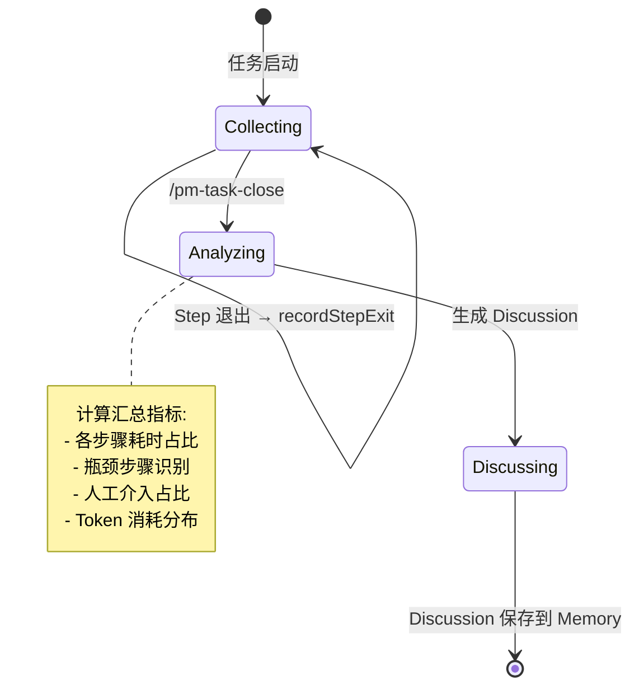
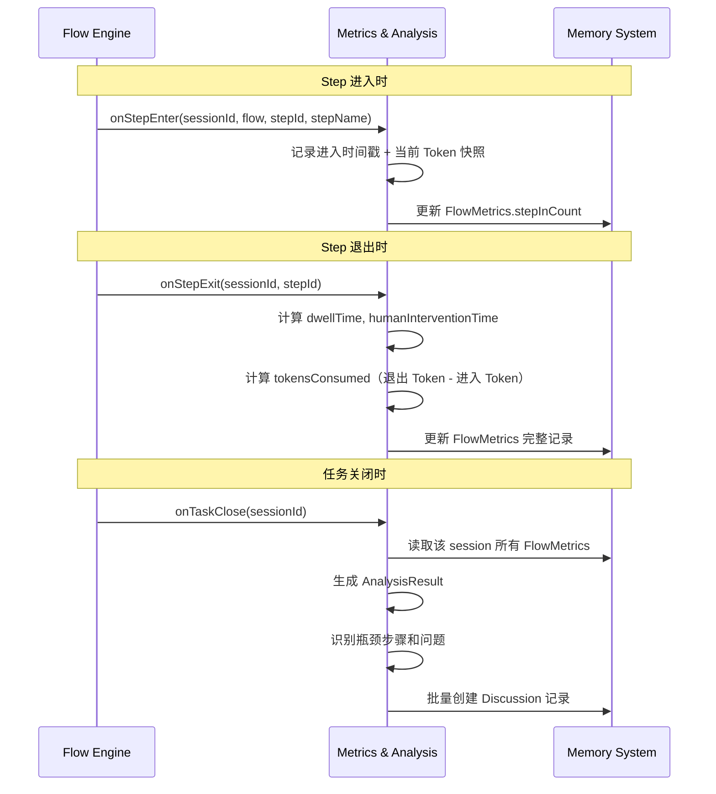

# Metrics & Analysis Spec

**创建日期**: 2026-06-11
**状态**: Draft
**输入来源**: XMind 设计文档 + Memory System Spec

---

## 需求背景

Metrics & Analysis 负责在任务执行过程中按步骤采集指标数据，并在任务结束后自动分析执行情况，生成结构化的 Discussion 改进建议。用户可在空闲时异步审阅并落地修改。

---

## 设计要点

### 领域模型

| 实体 | 属性 | 关系 |
|------|------|------|
| FlowMetrics | `id`, `sessionId`, `flow`, `step`, `stepName`, `stepInCount`, `tokensConsumed`, `dwellTime`, `humanInterventionTime`, `userInputTokens`, `taskSummary` | 与 Task 关联 |
| AnalysisResult | `sessionId`, `totalSteps`, `totalTokens`, `totalDwellTime`, `bottleneckStep`, `humanInterventionRatio`, `discussions[]` | 汇总一次任务的多条 FlowMetrics |

### 关键路径

#### 指标采集生命周期



#### 采集流程



### 接口设计

```typescript
interface IMetricsCollector {
  /** Step 进入时调用 */
  onStepEnter(params: {
    sessionId: string;
    flow: string;
    stepId: string;
    stepName: string;
    tokensSnapshot: number;
  }): Promise<void>;

  /** Step 退出时调用 */
  onStepExit(params: {
    sessionId: string;
    stepId: string;
    tokensSnapshot: number;
    dwellTime: number;
    humanInterventionTime: number;
    userInputTokens: number;
  }): Promise<void>;
}

interface IFlowAnalyzer {
  /** 任务关闭时调用，生成分析报告和 Discussion */
  analyze(sessionId: string): Promise<AnalysisResult>;

  /** 获取某流程的汇总指标 */
  getFlowSummary(flow: string): Promise<FlowSummary>;
}

interface AnalysisResult {
  sessionId: string;
  taskSummary: string;
  totalSteps: number;
  totalTokens: number;
  totalDwellTime: number;
  stepBreakdown: StepMetric[];
  bottleneckStep: string;
  bottleneckReason: string;
  humanInterventionRatio: number; // 人工介入时间/总时间
  discussions: DiscussionSeed[];
}

interface StepMetric {
  stepId: string;
  stepName: string;
  stepInCount: number;
  tokensConsumed: number;
  dwellTime: number;
  humanInterventionTime: number;
  userInputTokens: number;
  percentageOfTotal: number; // 耗时占比
}

interface DiscussionSeed {
  priority: "high" | "medium" | "low";
  importance: 1 | 2 | 3 | 4 | 5;
  severity: 1 | 2 | 3 | 4 | 5;
  issue: string;
  reason: string;
  solution: string;
}

interface FlowSummary {
  flow: string;
  totalSessions: number;
  avgTokens: number;
  avgDwellTime: number;
  avgHumanInterventionRatio: number;
  mostBottleneckedStep: string;
}
```

### 分析策略

#### 瓶颈识别

当某步骤满足以下条件之一时，标记为瓶颈：

| 条件 | 阈值 | 含义 |
|------|------|------|
| 耗时占比 > 30% | `dwellTime / totalDwellTime > 0.3` | 该步骤耗时过长 |
| StepIn > 3 次 | `stepInCount > 3` | 反复回退到该步骤 |
| 人工介入 > 50% | `humanInterventionTime / dwellTime > 0.5` | 该步骤太多人为决策 |

#### Discussion 生成规则

| 检测到的模式 | Discussion 建议 |
|-------------|----------------|
| 步骤耗时占比 > 30% | "步骤 {name} 耗时占 {pct}%，是否考虑拆分或简化该步骤？" |
| StepIn 次数 > 3 | "步骤 {name} 回退 {count} 次，流转规则是否需要调整？" |
| 人工介入占比 > 50% | "步骤 {name} 人工介入时间占 {pct}%，是否可通过预设选项减少提问？" |
| Token 消耗集中在某步骤 | "步骤 {name} 消耗 {pct}% Token，上下文注入是否过大？" |
| Human-in-loop 步骤跳过率低 | "人机协作步骤全部通过，流转顺畅"（正面反馈） |

---

## 测试用例

### metrics-collector.test.ts

- **测试文件**: `src/metrics/__tests__/metrics-collector.test.ts`
- **关联设计文档**: `vibe-pm-metrics-analysis.md`
- **Setup/Teardown**: Mock Memory System，预置 active Task

| 动作指令 | 测试方法 | Given | When | Then | Notes |
|----------|----------|-------|------|------|-------|
| 新增 | `collect_step_entry` | active Task | onStepEnter() | FlowMetrics 记录创建，stepInCount=1 | 进入采集 |
| 新增 | `collect_step_exit` | S3 已 onStepEnter | onStepExit() | FlowMetrics 更新：dwellTime/tokensConsumed 已计算 | 退出采集 |
| 新增 | `step_in_count_increments` | S4 已有 1 次记录 | 再次 onStepEnter("S4") | stepInCount=2 | 回退计数 |
| 新增 | `tokens_calculated_on_exit` | entry tokens=1000, exit tokens=2500 | onStepExit(tokensSnapshot=2500) | tokensConsumed=1500 | Token 计算 |

### flow-analyzer.test.ts

- **测试文件**: `src/metrics/__tests__/flow-analyzer.test.ts`
- **关联设计文档**: `vibe-pm-metrics-analysis.md`
- **Setup/Teardown**: 预置多条 FlowMetrics 记录（含模拟的瓶颈数据）

| 动作指令 | 测试方法 | Given | When | Then | Notes |
|----------|----------|-------|------|------|-------|
| 新增 | `identify_bottleneck_step` | S4 耗时占总 40%，stepInCount=4 | analyze() | bottleneckStep="S4", bottleneckReason 含"耗时"和"退回" | 瓶颈识别 |
| 新增 | `generate_discussion_for_bottleneck` | S4 耗时 > 30% | analyze() | discussions 包含 priority=high, issue 含步骤名 | 讨论生成 |
| 新增 | `calculate_human_intervention_ratio` | 人工介入 10min，总耗时 20min | analyze() | humanInterventionRatio=0.5 | 介入占比 |
| 新增 | `get_flow_summary_aggregates` | 同一 flow 有 3 次 session | getFlowSummary() | totalSessions=3, avgTokens 和 avgDwellTime 有值 | 流程汇总 |

---

## 边界与错误情况

| 场景 | 预期行为 |
|------|---------|
| onStepExit 未先调用 onStepEnter | 记录 warning，跳过该条采集 |
| analyze 时无 FlowMetrics | 返回空 AnalysisResult，不生成 Discussion |
| 指标数据量过大（长 session） | Metrics 按 step 聚合，不存储原始事件 |
| 同一 step 重复 onStepEnter | stepInCount 递增 |

---

## 约束与限制

### 技术约束

- 依赖 Memory System 的 FlowMetrics CRUD
- Token 快照依赖于 OpenCode 是否暴露 token 计数 API（待确认）
- 分析逻辑为确定性规则，不依赖 LLM

### 业务约束

- Discussion 的建议是参考性的，不自动修改 Flow 文档
- 用户审阅 Discussion 后才能落地修改

### 已知风险

- Token 计数不准确（若无 API 则用消息长度估算）
- 单 session 分析可能不足以发现模式——需积累多 session 数据后才有统计意义

### 影响范围

- 依赖 Memory System（FlowMetrics CRUD）
- 由 Flow Engine 调用 onStepEnter/onStepExit
- TUI Display 可消费 FlowSummary 展示汇总数据
