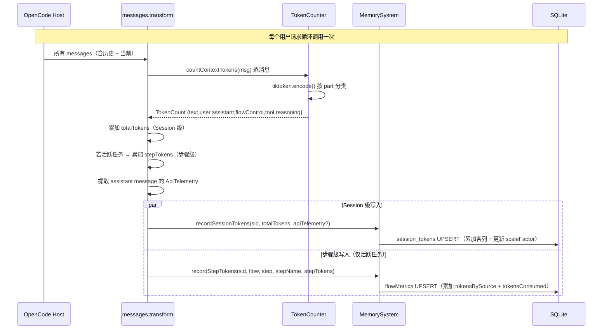

# Metrics 收集

**创建日期**: 2026-06-17
**状态**: 已实现
**输入来源**: 用户需求（TUI 扩展前置依赖）
**最后更新**: 2026-06-23 — 对齐实际代码实现：移除 `chat.message` hook 和 FlowControl 增量化拆分，补充 Session 级 Token 聚合（`session_tokens` 表）、`ApiTelemetry`、`scaleFactor` 等实际存在的功能

---

## 需求背景

vibe-pm 的 StepTokenMetrics 当前只存储步骤级汇总 Token（`tokensConsumed`），无法区分 Token 来源（System/FlowControl/User/Assistant/Tool/Reasoning）。同时 Task schema 缺少结束时间（`endAt`），无法计算任务总耗时。

本 Spec 定义 Metrics 收集层：
1. Token 计数实现（tiktoken 编码 + 来源分类）
2. Schema 扩展（Task.endAt、StepTokenMetrics.tokensBySource）
3. Session 级 Token 聚合（session_tokens + ApiTelemetry + scaleFactor）
4. IMemorySystem 新增查询接口

> **下游依赖**: 本 Spec 的输出（IMemorySystem 扩展接口）被 [vibe-pm-tui-extension.md](./vibe-pm-tui-extension.md) 消费。

---

## 设计要点

### 领域模型

| 实体 | 属性 | 关系 |
|------|------|------|
| **TokenCounter** | `encoder: tiktoken.Tiktoken` | 在 `messages.transform` hook 中调用 |
| **TokenCount** | 二维：role 维度（`user`, `assistant`）+ source 维度（`text`, `flowControl`, `tool`, `reasoning`）| `countContextTokens()` 的输出 | role 按 `message.info.role` 区分，source 按 `classifyPartType` 分类，二者正交 |
| **ApiTelemetry** | `input, output, reasoning, cache.read, cache.write` | LLM API 返回的遥测数据，来自 `@opencode-ai/sdk` 的 `AssistantMessage.tokens` |
| **StepTokenMetrics（扩展）** | `+ tokensBySource: Record<TokenSource, number>` | 每步骤按来源存储累计 Token，由 `recordStepTokens()` 维护 |
| **SessionTokenMetrics** | 15 列：6 基础 + 5 api + scaleFactor + 2 时间戳 | Session 级累计，每次 `messages.transform` 调用时累加 |

### TokenCount 二维字段说明

`TokenCount` 的 6 个字段分属两个正交维度：

| 维度 | 字段 | 含义 | 判断条件 |
|------|------|------|---------|
| **role** | `user` | user 角色消息的 totalTokens | `message.info.role === "user"` |
| **role** | `assistant` | assistant 角色消息的 totalTokens | `message.info.role === "assistant"` |
| **source** | `text` | text part（不含 `<protect>`）| `part.type === "text"` 且不含 `<protect>` |
| **source** | `flowControl` | `<protect>` 标记文本 + Read 读取 flow/regulation 文件 | `<protect>` 检测 或 `tool === "read"` + 路径匹配 |
| **source** | `tool` | 工具调用/返回的文本（Read 读取 flow/regulation 文件已分流至 flowControl） | `part.type === "tool"` |
| **source** | `reasoning` | 推理追踪文本 | `part.type === "reasoning"` |

> **正交性**：一条消息的 token 同时计入 role 字段（谁说的）和 source 字段（从哪来的），二者互不包含。
> 对单条 user 消息：`user = text + flowControl`（且 `assistant = tool = reasoning = 0`）。
> 对单条 assistant 消息：`assistant = text + tool + reasoning`（且 `user = 0`）。
> Session 多轮累加后，source 字段跨所有 role 累加，role 字段按消息 role 过滤累加。

> ⚠️ **TokenCount 与 ApiTelemetry 不可混合计算**：`TokenCount` 来自本地消息 tiktoken 计数，`ApiTelemetry` 来自 LLM API 返回的遥测数据。二者计量方式不同，不可直接相加或比较。**scaleFactor 是两套数据的唯一交集**：
> ```
> scaleFactor = (apiInput + apiCacheRead + apiCacheWrite) / (user + assistant)
> ```

### 数据流



### Schema 变更

#### Task 扩展

```typescript
export interface Task {
  id: string;
  sessionId: string;
  flow: string;
  currentStep: string;
  currentStepName: string;
  startAt: string;
  /** 任务结束时间（ISO 8601），由 closeTask 写入 */
  endAt?: string;
  closed: boolean;
  summary: string;
  userRequest?: string;
  /** 步骤转换历史，用于计算停留时间 */
  stepTransitions?: StepTransition[];
}
```

#### TokenCount（替换原 TokenCountResult）

```typescript
// src/token/types.ts
export interface TokenCount {
  text: number;        // text part token（不含 <protect>），与 role 无关
  user: number;        // 消息 role === "user" → totalTokens
  assistant: number;   // 消息 role === "assistant" → totalTokens
  flowControl: number; // <protect> 标记 + Read 读取 flow/regulation 文件
  tool: number;        // tool part token（Read 读取 flow/regulation 文件已分流至 flowControl）
  reasoning: number;   // reasoning part token，与 role 无关
}

export interface MessagePack {
  info: Message;       // @opencode-ai/sdk Message
  parts: Part[];       // @opencode-ai/sdk Part[]
}

export interface ApiTelemetry {
  input: number;
  output: number;
  reasoning: number;
  cache: { read: number; write: number };
}
```

#### StepTokenMetrics 扩展

```typescript
export type TokenSource =
  | "System"
  | "FlowControl"
  | "User"
  | "Assistant"
  | "Tool"
  | "Reasoning";

export interface StepTokenMetrics {
  id: string;
  sessionId: string;
  flow: string;
  step: string;
  stepName: string;
  stepInCount: number;
  tokensConsumed: number;
  /** 按来源分类的 Token 分布，各项独立累加 */
  tokensBySource: Record<TokenSource, number>;
  taskSummary: string;
}
```

> `recordStepTokens()` 内部将 `TokenCount` 字段映射为 `TokenSource` key 存储：
> - `TokenCount.text` → `tokensBySource["System"]`
> - `TokenCount.user` → `tokensBySource["User"]`
> - `TokenCount.assistant` → `tokensBySource["Assistant"]`
> - `TokenCount.flowControl` → `tokensBySource["FlowControl"]`
> - `TokenCount.tool` → `tokensBySource["Tool"]`
> - `TokenCount.reasoning` → `tokensBySource["Reasoning"]`
>
> `tokensConsumed = text + user + assistant`（不包括 tool/reasoning/flowControl）。

#### SessionTokenMetrics（新增）

```typescript
/** Session 级 Token 存储 — 层级式列设计 */
export interface SessionTokenMetrics {
  sessionId: string;
  /** 基础类型 */
  user: number;
  assistant: number;
  /** 按来源分（与 role 字段正交累加，互不包含） */
  flowControl: number;
  text: number;
  tool: number;
  reasoning: number;
  /** LLM API 遥测（仅当 LLM 返回时写入） */
  apiInput: number;
  apiOutput: number;
  apiReasoning: number;
  apiCacheRead: number;
  apiCacheWrite: number;
  /** 校准因子 = (apiInput + apiCacheRead + apiCacheWrite) / (user + assistant) */
  scaleFactor: number;
  /** 时间戳 */
  startedAt: string;
  updatedAt: string;
}
```

#### IMemorySystem 新增/变更接口

```typescript
export interface IMemorySystem {
  // ═══ 现有接口保持不变 ═══
  createTask(input: CreateTaskInput): Promise<Task>;
  getTask(sessionId: string): Promise<Task | null>;
  getActiveTask(sessionId: string): Promise<Task | null>;
  updateStep(id: string, step: string, stepName: string): Promise<void>;
  closeTask(id: string): Promise<void>;
  listActiveTasks(): Promise<Task[]>;

  // Discussion...
  // StepTokenMetrics — 变更
  recordStepTokens(
    sessionId: string, flow: string, step: string, stepName: string,
    tokenCount: TokenCount
  ): Promise<void>;
  incrementStepCount(
    sessionId: string, flow: string, step: string, stepName: string, taskSummary: string,
  ): Promise<void>;
  recordStepExit(
    sessionId: string, step: string,
  ): Promise<void>;
  getStepTokenMetrics(sessionId: string): Promise<StepTokenMetrics[]>;
  getStepTokenMetricsByFlow(flow: string): Promise<StepTokenMetrics[]>;

  // ═══ 新增查询 ═══
  /** 查询指定 Session 最近结束的任务（按 endAt 降序） */
  getLastClosedTask(sessionId: string): Promise<Task | null>;

  /** 查询指定 Session 的来源级 Token 分布汇总（跨步骤聚合） */
  getSourceTokenBreakdown(sessionId: string): Promise<SourceTokenBreakdown[]>;

  /** 查询指定 Session 的步骤级 Token 分布汇总 */
  getStepTokenBreakdown(sessionId: string): Promise<StepTokenBreakdown[]>;

  // ═══ 新增 Session Tokens ═══
  /** 初始化 Session 级 Token 计数器（idempotent） */
  initSessionTokens(sessionId: string): Promise<void>;

  /** 记录 Session 级 Token 计数 + API 遥测 */
  recordSessionTokens(
    sessionId: string, tokenCount: TokenCount, apiTelemetry?: ApiTelemetry
  ): Promise<void>;

  /** 获取 Session 级 Token 数据 */
  getSessionTokens(sessionId: string): Promise<SessionTokenMetrics | null>;

  // 初始化
  init(dataDir: string): Promise<void>;
}

export interface SourceTokenBreakdown {
  source: TokenSource;
  tokens: number;
}

export interface StepTokenBreakdown {
  step: string;
  stepName: string;
  stepInCount: number;
  tokensConsumed: number;
}
```

### TokenCounter 设计

```typescript
// src/token/token-counter.ts

export class TokenCounter {
  private encoder: tiktoken.Tiktoken;

  constructor(modelEncoding?: string);

  /**
   * 编码文本并返回 token 数。
   * 空字符串/仅空白字符串直接返回 0，跳过编码。
   */
  countTokens(text: string): number;

  /**
   * 计数消息中的 token 并按来源分类。
   *
   * user/assistant 按 message.info.role 区分。
   * flowControl/text/tool/reasoning 按 part.type 和内容区分。
   */
  countContextTokens(message: MessagePack): TokenCount;

  /** 释放 tiktoken encoder 资源 */
  dispose(): void;
}
```

**分类逻辑**（`classifyPartType` 私有方法）：

| part.type | 条件 | 分类 |
|-----------|------|------|
| `"text"` | text.includes("<protect>") | `flowControl` |
| `"text"` | 不含 `<protect>` | `text` |
| `"tool"` | — | `tool` |
| `"reasoning"` | — | `reasoning` |
| 其他 | — | null（跳过） |

**role 聚合**：消息的所有 part token 之和同时计入 role 字段（`user` 或 `assistant`）。
这意味着 `user` 字段包含 `text` + `flowControl`，`assistant` 字段包含 `text` + `tool` + `reasoning`。

### 集成点

#### messages.transform hook（现有）— 全部计数在此完成

在 `src/core/plugin.ts` 中，现有的 `experimental.chat.messages.transform` hook 中集成了全部 Token 计数逻辑：

```
1. 遍历所有 messages：
   a. 调用 tokenCounter.countContextTokens(msg) 逐消息计数
   b. 累加到 totalTokens（Session 级）
   c. 若存在活跃任务 → 同时累加到 stepTokens（步骤级）
   d. 遇 assistant role 消息 → 提取 ApiTelemetry（msg.info.tokens）
   e. 检测 outOfControl（有 todowrite 工具调用但无 stepTransitions）
2. recordSessionTokens(sid, totalTokens, apiTelemetry) — 持久化 Session 级
3. 若活跃任务 → recordStepTokens(sid, flow, step, stepName, stepTokens)
4. 注入 FlowControl + 可选 warning（原逻辑）
```

> **注意**：无 `chat.message` hook。所有计数都在 `messages.transform` 中完成。

#### session.created event（新增）

在 `event` hook 中初始化 `session_tokens`：

```
1. event.type === "session.created"
2. 获取 sessionId
3. 调用 memory.initSessionTokens(sessionId)（INSERT OR IGNORE，幂等）
```

### 模块结构

```
src/
├── memory/                         # 修改：新增接口方法 + Schema 扩展
│   ├── types.ts                    # + Task.endAt / StepTokenMetrics.tokensBySource / TokenSource
│   │                               #   SourceTokenBreakdown / StepTokenBreakdown
│   │                               #   SessionTokenMetrics / RecordSessionTokensInput
│   └── memory-system.ts            # + getLastClosedTask / getSourceTokenBreakdown
│                                   #   getStepTokenBreakdown / closeTask 写 endAt
│                                   #   initSessionTokens / recordSessionTokens / getSessionTokens
├── token/                          # 新建：Token 计数模块
│   ├── token-counter.ts            # TokenCounter 类（countTokens / countContextTokens / dispose）
│   ├── types.ts                    # TokenCount, MessagePack, ApiTelemetry
│   └── index.ts                    # export { TokenCounter, TokenCount, MessagePack, ApiTelemetry }
└── core/
    └── plugin.ts                   # 修改：messages.transform 集成全部计数逻辑
```

### SQLite session_tokens 表 DDL

```sql
CREATE TABLE IF NOT EXISTS session_tokens (
  sessionId       TEXT PRIMARY KEY,
  text            INTEGER NOT NULL DEFAULT 0,
  "user"          INTEGER NOT NULL DEFAULT 0,
  assistant       INTEGER NOT NULL DEFAULT 0,
  flowControl     INTEGER NOT NULL DEFAULT 0,
  tool            INTEGER NOT NULL DEFAULT 0,
  reasoning       INTEGER NOT NULL DEFAULT 0,
  apiInput        INTEGER NOT NULL DEFAULT 0,
  apiOutput       INTEGER NOT NULL DEFAULT 0,
  apiReasoning    INTEGER NOT NULL DEFAULT 0,
  apiCacheRead    INTEGER NOT NULL DEFAULT 0,
  apiCacheWrite   INTEGER NOT NULL DEFAULT 0,
  scaleFactor     REAL NOT NULL DEFAULT 1.0,
  startedAt       TEXT NOT NULL,
  updatedAt       TEXT NOT NULL
);
```

### MemorySystem 新增方法实现摘要

```typescript
// getLastClosedTask
async getLastClosedTask(sessionId: string): Promise<Task | null> {
  const rows = this.stmtGetClosedTasksBySession.all(sessionId) as Record<string, unknown>[];
  const tasks = rows.map((r) => this.rowToTask(r));
  tasks.sort((a, b) => (b.endAt ?? "").localeCompare(a.endAt ?? ""));
  return tasks[0] ?? null;
}

// closeTask — 扩展：写入 endAt
async closeTask(id: string): Promise<void> {
  const result = this.stmtCloseTask.run(new Date().toISOString(), id);
  if (result.changes === 0) return; // 任务不存在时静默
}

// recordStepTokens — 替代 recordStepEntry，接收 TokenCount
async recordStepTokens(
  sessionId: string, flow: string, step: string, stepName: string, tokenCount: TokenCount
): Promise<void> {
  // TokenCount → tokensBySource 映射（非零值）
  const rawBySource = {
    System: tokenCount.text,
    User: tokenCount.user,
    Assistant: tokenCount.assistant,
    FlowControl: tokenCount.flowControl,
    Tool: tokenCount.tool,
    Reasoning: tokenCount.reasoning,
  };
  const tokensBySource: Record<string, number> = {};
  for (const [src, tk] of Object.entries(rawBySource)) {
    if (tk > 0) tokensBySource[src] = tk;
  }

  const newTotal = tokenCount.text + tokenCount.user + tokenCount.assistant;
  const newUserTokens = tokenCount.user ?? 0;
  const existing = this.stmtGetMetricsBySessionStep.get(sessionId, step);

  if (existing) {
    const existingTokens = parseJSON<Record<string, number>>(existing["tokensBySource"], {});
    const merged = { ...existingTokens };
    for (const [source, tokens] of Object.entries(tokensBySource)) {
      merged[source] = (merged[source] ?? 0) + tokens;
    }
    this.stmtUpdateMetrics.run(
      (existing["tokensConsumed"] as number) + newTotal,
      JSON.stringify(merged),
      existing["stepInCount"],
      existing["id"],
    );
  } else {
    // 创建新记录
    this.stmtInsertMetrics.run(prefixKeys({...}));
  }
}

// recordSessionTokens — Session 级累加
async recordSessionTokens(
  sessionId: string, tokenCount: TokenCount, apiTelemetry?: ApiTelemetry
): Promise<void> {
  let existing = this.stmtGetSessionTokens.get(sessionId) as Record<string, unknown> | undefined;
  if (!existing) {
    await this.initSessionTokens(sessionId);
    existing = this.stmtGetSessionTokens.get(sessionId) as Record<string, unknown>;
  }

  let scaleFactor = 1.0;
  if (apiTelemetry) {
    const denominator = tokenCount.text + tokenCount.user + tokenCount.assistant;
    scaleFactor = denominator === 0
      ? 1.0
      : (apiTelemetry.input + (apiTelemetry.cache?.read ?? 0) + (apiTelemetry.cache?.write ?? 0)) / denominator;
  }

  this.stmtUpdateSessionTokens.run(prefixKeys({
    sessionId,
    text: (existing["text"] as number ?? 0) + tokenCount.text,
    user: (existing["user"] as number ?? 0) + tokenCount.user,
    assistant: (existing["assistant"] as number ?? 0) + tokenCount.assistant,
    flowControl: (existing["flowControl"] as number ?? 0) + tokenCount.flowControl,
    tool: (existing["tool"] as number ?? 0) + tokenCount.tool,
    reasoning: (existing["reasoning"] as number ?? 0) + tokenCount.reasoning,
    apiInput: (existing["apiInput"] as number ?? 0) + (apiTelemetry?.input ?? 0),
    apiOutput: (existing["apiOutput"] as number ?? 0) + (apiTelemetry?.output ?? 0),
    apiReasoning: (existing["apiReasoning"] as number ?? 0) + (apiTelemetry?.reasoning ?? 0),
    apiCacheRead: (existing["apiCacheRead"] as number ?? 0) + (apiTelemetry?.cache?.read ?? 0),
    apiCacheWrite: (existing["apiCacheWrite"] as number ?? 0) + (apiTelemetry?.cache?.write ?? 0),
    scaleFactor,
    updatedAt: new Date().toISOString(),
  }));
}

// getSourceTokenBreakdown — 跨步骤聚合来源 Token
async getSourceTokenBreakdown(sessionId: string): Promise<SourceTokenBreakdown[]> {
  const metrics = await this.getStepTokenMetrics(sessionId);
  const aggregated: Record<string, number> = {};
  for (const m of metrics) {
    if (m.tokensBySource) {
      for (const [source, tokens] of Object.entries(m.tokensBySource)) {
        aggregated[source] = (aggregated[source] ?? 0) + tokens;
      }
    }
  }
  return Object.entries(aggregated).map(([source, tokens]) => ({
    source: source as TokenSource,
    tokens,
  }));
}

// getStepTokenBreakdown — 按步骤返回 Token 汇总
async getStepTokenBreakdown(sessionId: string): Promise<StepTokenBreakdown[]> {
  const metrics = await this.getStepTokenMetrics(sessionId);
  return metrics.map((m) => ({
    step: m.step,
    stepName: m.stepName,
    stepInCount: m.stepInCount,
    tokensConsumed: m.tokensConsumed,
  }));
}
```

---

## 边界与错误情况

| 场景 | 预期行为 |
|------|---------|
| tiktoken 编码失败（part 格式异常） | 该 part 跳过（计入 0），不中断计数流程 |
| StepTokenMetrics 中 tokensBySource 为 null（旧数据兼容） | `getSourceTokenBreakdown` 中跳过该项，不影响其他步骤聚合 |
| messages.transform 中 messages 为空 | `totalTokens` 保持全 0，不写入步骤级计数 |
| 同一 Session 无活跃任务 | `stepTokens` 不写入（无 flow/step 关联），但 `recordSessionTokens` 正常执行 |
| recordStepTokens 中 tokensBySource 累加 | 同一 session+step 的各项与存量值相加，不覆盖 |
| endAt 写入异常 | closeTask 的 SQLite 失败时静默跳过 |
| TokenCounter encoder 初始化失败 | 插件初始化时捕获，设置 `tokenCounter = null`，跳过所有计数（logger.warn） |
| 空字符串/空白文本 | `countTokens("")` / `countTokens("  ")` 直接返回 0，不调用 tiktoken |
| 无 ApiTelemetry | `recordSessionTokens` 只更新基础 6 字段，api 字段和 scaleFactor 保持不变 |
| denominator 为 0 时 scaleFactor 计算 | 保持默认 1.0（不除零） |

---

## 测试用例

### token/token-counter.test.ts

- **测试文件**: `tests/token/token-counter.test.ts`
- **关联设计文档**: `docs/spec/vibe-pm-metrics-collection.md`
- **Setup/Teardown**: Mock tiktoken（编码器返回 `max(1, ceil(str.length/4))` token）

| 动作指令 | 测试方法 | Given | When | Then |
|----------|----------|-------|------|------|
| ✅ | `countTokens` 正常文本 | text="hello world" | countTokens | 返回 correct |
| ✅ | `countTokens` 空/空白 | text="" / text="   \n  " | countTokens | 返回 0 |
| ✅ | text part（无 `<protect>`） | type="text", 无 protect | countContextTokens | result.text = N, flowControl=0 |
| ✅ | FlowControl 检测 | type="text", 含 `<protect>` | countContextTokens | result.flowControl = N, text 不含 FC |
| ✅ | 混合 text + FlowControl | 2 text + 1 FC part | countContextTokens | text 和 flowControl 分别正确 |
| ✅ | Tool part | type="tool" | countContextTokens | result.tool = N |
| ✅ | Reasoning part | type="reasoning" | countContextTokens | result.reasoning = N |
| ✅ | User role 聚合 | role="user", 2 parts | countContextTokens | result.user = sum, assistant=0 |
| ✅ | Assistant role 聚合 | role="assistant", text+tool+reasoning | countContextTokens | result.assistant = sum, 分类字段正确 |
| ✅ | 空 parts 数组 | parts=[] | countContextTokens | 全 0 |
| ✅ | Tool state.output | tool.state 含 input+output | countContextTokens | result.tool = input + "\n" + output |
| ✅ | Tool state.error | tool.state 含 input+error | countContextTokens | result.tool = input + "\n" + error |
| ✅ | Tool args 回退 | tool.args 对象 | countContextTokens | result.tool = JSON.stringify(args) |
| ✅ | 未知 part 类型 | type="unknown-type" | countContextTokens | 跳过，不计 |
| ✅ | dispose | encoder 已创建 | dispose() | 不抛异常 |
| ✅ | dispose 二次调用 | 已释放 | 再次 dispose | 不抛异常 |

### memory/task-query.test.ts

- **测试文件**: `tests/memory/task-query.test.ts`
- **Setup/Teardown**: tmpDir + SQLite 临时实例

| 动作指令 | 测试方法 | Given | When | Then |
|----------|----------|-------|------|------|
| ✅ | `getLastClosedTask` 多任务 | 3 个已关闭，不同 endAt | getLastClosedTask(sid) | 返回 endAt 最新的 |
| ✅ | `getLastClosedTask` 无结果 | 无已关闭任务 | getLastClosedTask | 返回 null |
| ✅ | `getLastClosedTask` 只有活跃 | 仅活跃任务 | getLastClosedTask | 返回 null |
| ✅ | `closeTask` 写 endAt | 活跃任务 | closeTask | endAt 不为空，值≥关闭前 |
| ✅ | `recordStepTokens` 新建 | 无存量 | 传入 TokenCount | 创建记录，映射正确 |
| ✅ | `recordStepTokens` 累加 | 已有 {System:100,User:300} | 追加 {text:50,assistant:100} | 合并为 {System:150,User:300,Assistant:100} |
| ✅ | `getSourceTokenBreakdown` | 3 次 recordStepTokens | 调用 | 5 来源聚合正确 |
| ✅ | `getSourceTokenBreakdown` 空 | 无 metrics | 调用 | 返回 [] |
| ✅ | `getStepTokenBreakdown` | 3 次 recordStepTokens | 调用 | 2 步骤，tokensConsumed 正确 |

### memory/session-tokens.test.ts（新增）

- **测试文件**: `tests/memory/session-tokens.test.ts`
- **关联设计文档**: `docs/spec/vibe-pm-metrics-collection.md`

| 动作指令 | 测试方法 | Given | When | Then |
|----------|----------|-------|------|------|
| ✅ | `initSessionTokens` | 新 session | init | 全 0, scaleFactor=1.0 |
| ✅ | `initSessionTokens` 幂等 | 已初始化 | 再次 init | 不抛错 |
| ✅ | `recordSessionTokens` 累加 | init + 一次 record | get | 字段正确 |
| ✅ | `recordSessionTokens` auto-init | 无 init | 直接 record | 自动创建 |
| ✅ | `recordSessionTokens` 多次累加 | 2 次 record | get | 各字段累加 |
| ✅ | `recordSessionTokens` 更新 updatedAt | init 后 | 等时差后 record | updatedAt 变化 |
| ✅ | API telemetry | +ApiTelemetry | record | api 字段正确 |
| ✅ | scaleFactor 计算 | TokenCount + ApiTelemetry | record | scaleFactor = (input+cache)/denom |
| ✅ | scaleFactor 分母=0 | 全 0 TokenCount | record | scaleFactor = 1.0 |
| ✅ | `getSessionTokens` 不存在 | 未 init | get | 返回 null |
| ✅ | `getSessionTokens` 完整 | init + record + api | get | 15 列全部匹配 |

### 集成测试（messages.transform 模拟）

- **测试文件**: `tests/token/token-integration.test.ts`
- **Setup/Teardown**: Mock tiktoken、真实 MemorySystem + 真实 TokenCounter

| 动作指令 | 测试方法 | Given | When | Then |
|----------|----------|-------|------|------|
| ✅ | transform 集成 | 活跃任务 + user msg | countContextTokens + recordStepTokens | metrics 含 User+FlowControl |
| ✅ | FlowControl 隔离 | user msg + FC part | countContextTokens | flowControl > 0, user = total |
| ✅ | completion 集成 | 活跃任务 + assistant msg | countContextTokens + recordStepTokens | metrics 含 Assistant+Tool |
| ✅ | 无活跃任务跳过 | 无活跃任务 | getStepTokenMetrics | 无 metrics 记录 |

---

## 约束与限制

### 技术约束

| 约束 | 说明 |
|------|------|
| TypeScript strict mode | 所有新增代码必须通过 strict 类型检查 |
| tiktoken ^1.0.22 | 使用 `cl100k_base` 编码（GPT-4 兼容），后续可扩展为按 model 自适应 |
| SQLite (bun:sqlite) | 不修改版本，通过预编译语句 INSERT/SELECT/UPDATE 操作 |
| Node.js crypto | UUID 生成使用 `node:crypto`（Bun 内置），无额外依赖 |
| IMemorySystem 接口兼容 | 新增方法不改变现有方法签名，保证向后兼容 |

### 业务约束

| 约束 | 说明 |
|------|------|
| 不破坏现有流程 | Token 计数失败不应中断 Flow Engine 的正常流程注入（计数用 try/catch 包裹） |
| 数据一致性 | Token 计数和任务状态管理共享同一个 MemorySystem 实例 |
| 隐私保护 | Token 计数只计算长度，不存储消息原文。tokensBySource 只存数字不存内容 |
| 旧数据兼容 | StepTokenMetrics.tokensBySource 为 null/undefined 的旧记录不被破坏，新记录正常写入 |

### 已知风险

| 风险 | 影响 | 缓解措施 |
|------|------|---------|
| tiktoken 编码耗时 | 大型消息阻塞 messages.transform | 当前无超时保护；极端大消息需后续添加 |
| FlowControl 依赖 `<protect>` 标记 | 标记格式变化导致分类错误 | flow-engine 固定使用 `<protect>` |
| Reasoning 依赖 part.type | type 格式可能随 model/SDK 变化 | 第一版固定匹配，后续扩展 |
| closeTask endAt | 写入失败仅缺失结束时间 | 与 closed 同步写入 |

### 影响范围

| 模块 | 变更类型 | 说明 |
|------|---------|------|
| `src/memory/types.ts` | 修改 | Task.endAt、StepTokenMetrics.tokensBySource、TokenSource、Source/StepTokenBreakdown、SessionTokenMetrics |
| `src/memory/memory-system.ts` | 修改 | closeTask 写 endAt、recordStepTokens、getLastClosedTask/getSourceTokenBreakdown/getStepTokenBreakdown、SessionTokens CRUD |
| `src/token/` | 新建 | TokenCounter + TokenCount/MessagePack/ApiTelemetry |
| `src/core/plugin.ts` | 修改 | messages.transform 集成全部计数 + session.created 初始化 session_tokens |
| `tests/token/` | 新建 | token-counter.test.ts + token-integration.test.ts |
| `tests/memory/task-query.test.ts` | 新建 | 新增查询方法测试 |
| `tests/memory/session-tokens.test.ts` | 新建 | SessionTokens CRUD 测试 |

---

## 开发进度

> 本部分在开发过程中持续更新。

### 已实现功能

- [x] Task.endAt 扩展 + closeTask 写入 → `src/memory/types.ts`, `src/memory/memory-system.ts`
- [x] StepTokenMetrics.tokensBySource 扩展 + recordStepTokens → `src/memory/types.ts`, `src/memory/memory-system.ts`
- [x] TokenCounter 类：tiktoken 编码 + 来源分类 → `src/token/token-counter.ts`
- [x] countContextTokens 统一接口 → `src/token/token-counter.ts`
- [x] FlowControl 按 `<protect>` 标记分类 → `src/token/token-counter.ts`
- [x] getLastClosedTask / getSourceTokenBreakdown / getStepTokenBreakdown → `src/memory/memory-system.ts`
- [x] messages.transform 集成全部 Token 计数 → `src/core/plugin.ts`
- [x] Session 级 Token 聚合（session_tokens 表）→ `src/memory/memory-system.ts`
- [x] ApiTelemetry 采集 + scaleFactor 校准 → `src/memory/memory-system.ts`
- [x] initSessionTokens / recordSessionTokens / getSessionTokens → `src/memory/memory-system.ts`
- [x] session.created event → initSessionTokens 自动初始化 → `src/core/plugin.ts`

### 未实现功能

- （全部完成）

### 已知问题/风险

- `recordStepTokens` 合并路径对升级前旧数据后向不兼容（🟡 已记录）
- Reasoning 检测依赖 part.type，可能随 model/SDK 变更有误分类风险（🟢 已记录）
