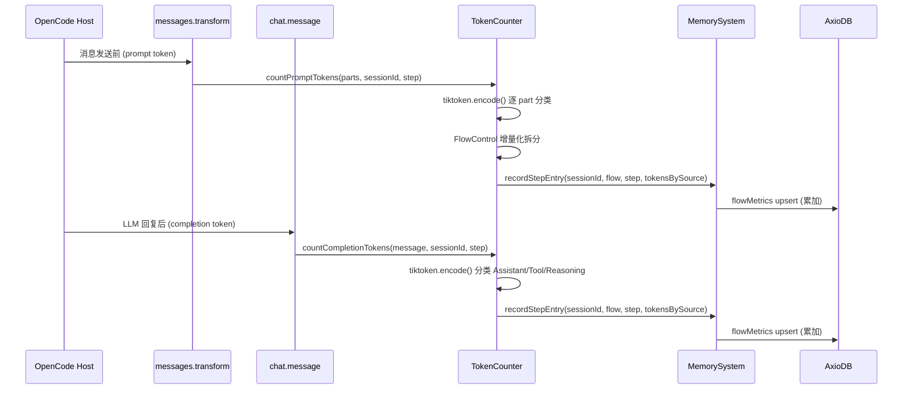
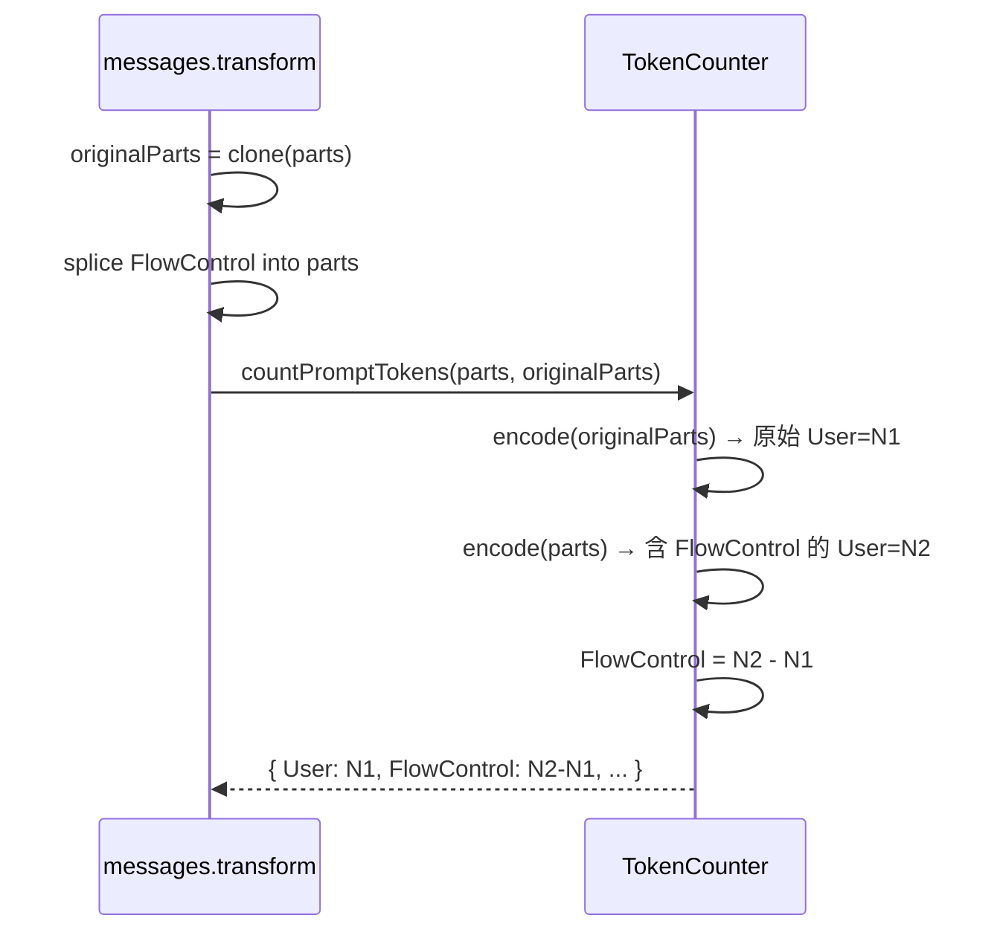

# Metrics 收集

**创建日期**: 2026-06-17
**状态**: Draft
**输入来源**: 用户需求（TUI 扩展前置依赖）
**最后更新**: 2026-06-17 — 从 TUI Spec 中拆分出独立的 Metrics 收集 Spec

---

## 需求背景

vibe-pm 的 FlowMetrics 当前只存储步骤级汇总 Token（`tokensConsumed`），无法区分 Token 来源（System/FlowControl/User/Assistant/Tool/Reasoning）。同时 Task schema 缺少结束时间（`endAt`），无法计算任务总耗时。

本 Spec 定义 Metrics 收集层：
1. Token 计数实现（tiktoken 编码 + 来源分类）
2. Schema 扩展（Task.endAt、FlowMetrics.tokensBySource）
3. IMemorySystem 新增查询接口

> **下游依赖**: 本 Spec 的输出（IMemorySystem 扩展接口）被 [vibe-pm-tui-extension.md](./vibe-pm-tui-extension.md) 消费。

---

## 设计要点

### 领域模型

| 实体 | 属性 | 关系 |
|------|------|------|
| **TokenCounter** | `encoder: tiktoken.Tiktoken` | 在 messages.transform / chat.message hook 中调用 |
| **TokenCountResult** | `bySource: Record<TokenSource, number>`, `total: number` | 一次计数的输出 |
| **TokenSource** | 枚举：System / FlowControl / User / Assistant / Tool / Reasoning | 6 个固定分类 |
| **FlowMetrics（扩展）** | `+ tokensBySource: Record<TokenSource, number>` | 每步骤按来源存储累计 Token |

### Token 来源分类规则

| 来源 | 判断条件 | 示例 |
|------|---------|------|
| **System** | part.role === "system" 且 content 不含 `<pm-control-rules>` | OpenCode 系统 prompt |
| **FlowControl** | part.type === "text" 且 content 含 `<pm-control-rules>` | vibe-pm 控制提示注入 |
| **User** | part.role === "user" 且 content 不含 `<pm-control-rules>` | 用户输入消息 |
| **Assistant** | part.role === "assistant" 且 part 不含 thinking/reasoning 标记 | LLM 文本回复 |
| **Tool** | part.type === "tool" 或 part.role === "tool" | 工具调用/返回 |
| **Reasoning** | assistant part 中的 thinking/reasoning 块 | LLM 内部推理 |

### 数据流



### Schema 变更

#### Task 扩展

```typescript
export interface Task {
  documentId: string;
  sessionId: string;
  flow: string;
  currentStep: string;
  currentStepName: string;
  startAt: string;
  endAt?: string;          // 新增：任务结束时间（ISO 8601）
  closed: boolean;
  summary: string;
  specRef?: string;
  planRef?: string;
}
```

#### FlowMetrics 扩展

```typescript
export interface FlowMetrics {
  id: string;
  sessionId: string;
  flow: string;
  step: string;
  stepName: string;
  stepInCount: number;
  tokensConsumed: number;
  // 新增：按来源分类的 Token 分布
  tokensBySource: Record<TokenSource, number>;
  dwellTime: number;
  humanInterventionTime: number;
  userInputTokens: number;   // 保留（通过 tokensBySource.User 可推导，保留以兼容旧数据）
  taskSummary: string;
}

export type TokenSource =
  | "System"
  | "FlowControl"
  | "User"
  | "Assistant"
  | "Tool"
  | "Reasoning";
```

#### IMemorySystem 新增接口

```typescript
export interface IMemorySystem {
  // ═══ 现有接口保持不变 ═══
  createTask(input: CreateTaskInput): Promise<Task>;
  getTask(sessionId: string): Promise<Task | null>;
  getActiveTask(sessionId: string): Promise<Task | null>;
  updateStep(documentId: string, step: string, stepName: string): Promise<void>;
  closeTask(documentId: string): Promise<void>;
  listActiveTasks(): Promise<Task[]>;
  // ...

  // ═══ 新增接口 ═══

  /** 查询指定 Session 最近结束的任务（按 endAt 降序） */
  getLastClosedTask(sessionId: string): Promise<Task | null>;

  /** 查询指定 Session 的来源级 Token 分布汇总（跨步骤聚合） */
  getSourceTokenBreakdown(sessionId: string): Promise<SourceTokenBreakdown[]>;

  /** 查询指定 Session 的步骤级 Token 分布汇总 */
  getStepTokenBreakdown(sessionId: string): Promise<StepTokenBreakdown[]>;
}

export interface SourceTokenBreakdown {
  source: TokenSource;
  tokens: number;
}

export interface StepTokenBreakdown {
  step: string;
  stepName: string;
  stepInCount: number;
  tokensConsumed: number;
}
```

### TokenCounter 设计

```typescript
// src/token/types.ts

export interface TokenCountResult {
  /** 按来源分类的 token 数 */
  bySource: Record<TokenSource, number>;
  /** 总 token 数 */
  total: number;
}

export interface PartInfo {
  type: string;
  text?: string;
  role?: string;
  /** 是否包含 vibe-pm 控制提示 */
  isControlPrompt?: boolean;
}

// src/token/token-counter.ts

export class TokenCounter {
  private encoder: tiktoken.Tiktoken;

  constructor(modelEncoding?: string) {
    this.encoder = tiktoken.get_encoding(modelEncoding ?? "cl100k_base");
  }

  /**
   * 计数 prompt side token（在 messages.transform 中调用）。
   *
   * @param parts 消息 parts 数组
   * @param originalParts 注入 FlowControl 之前的原始 parts（用于增量化拆分）
   */
  countPromptTokens(
    parts: PartInfo[],
    originalParts?: PartInfo[],
  ): TokenCountResult;

  /**
   * 计数 completion side token（在 chat.message 中调用）。
   */
  countCompletionTokens(
    message: { parts: PartInfo[] },
  ): TokenCountResult;

  /**
   * 分类单个 part：根据 type/role/content 判断来源。
   */
  classifyPart(part: PartInfo): TokenSource;

  /**
   * 编码文本并返回 token 数。
   */
  countTokens(text: string): number;

  /** 释放 encoder 资源 */
  dispose(): void;
}
```

### FlowControl 增量化拆分策略

由于 `<pm-control-rules>` 通过 `messages.transform` splice 到 User message 中，与用户输入混在同一消息。拆分方式：

1. `messages.transform` 触发时，**先保存** splice 前的 parts 快照（`originalParts`）
2. 执行 splice 注入 FlowControl
3. 对 splice 后的 parts 调用 `countPromptTokens(parts, originalParts)`
4. TokenCounter 内部：
   - 对 `originalParts` 逐 part 分类计数 → 得到不含 FlowControl 的各来源 token
   - 对 splice 后的 parts 逐 part 分类计数 → 得到含 FlowControl 的各来源 token
   - **差值** `(含 FlowControl 的 User token) - (原始 User token)` → FlowControl token



### 集成点

#### messages.transform hook（现有）— 扩展

在 `src/core/plugin.ts` 中，现有的 `experimental.chat.messages.transform` hook 中集成 TokenCounter：

```
1. 检测到 flow 命令 → 确保任务创建
2. 保存 originalParts 快照
3. splice FlowControl（现有逻辑）
4. 提取当前 step 信息
5. 调用 tokenCounter.countPromptTokens(parts, originalParts)
6. 调用 memory.recordStepEntry(sessionId, flow, step, result.bySource)
```

#### chat.message hook（新增）

在 `src/core/plugin.ts` 的 Hooks 中新增 `chat.message` hook：

```
1. 获取 message parts
2. 提取当前 step（从活跃任务）
3. 调用 tokenCounter.countCompletionTokens(message)
4. 调用 memory.recordStepEntry(sessionId, flow, step, result.bySource)
```

### 模块结构

```
src/
├── memory/                         # 修改：新增接口方法 + Schema 扩展
│   ├── types.ts                    # + Task.endAt / FlowMetrics.tokensBySource / TokenSource / SourceTokenBreakdown / StepTokenBreakdown
│   └── memory-system.ts            # + getLastClosedTask / getSourceTokenBreakdown / getStepTokenBreakdown / closeTask 写 endAt
├── token/                          # 新建：Token 计数模块
│   ├── token-counter.ts            # TokenCounter 类
│   ├── types.ts                    # TokenCountResult, PartInfo
│   └── index.ts                    # export { TokenCounter, TokenCountResult, PartInfo }
└── core/
    └── plugin.ts                   # 修改：集成 TokenCounter 到 messages.transform + chat.message
```

### MemorySystem 新增方法实现摘要

```typescript
// getLastClosedTask
async getLastClosedTask(sessionId: string): Promise<Task | null> {
  const result = await this.tasks
    .query({ sessionId, closed: true })
    .exec();
  const tasks = unwrapArray(result) as Task[];
  // 按 endAt 降序排序，取第一个
  tasks.sort((a, b) => (b.endAt ?? "").localeCompare(a.endAt ?? ""));
  return tasks[0] ?? null;
}

// closeTask — 扩展：写入 endAt
async closeTask(documentId: string): Promise<void> {
  await this.tasks
    .update({ documentId })
    .UpdateOne({
      closed: true,
      endAt: new Date().toISOString(),  // 新增
    });
}

// getSourceTokenBreakdown — 跨步骤聚合来源 Token
async getSourceTokenBreakdown(sessionId: string): Promise<SourceTokenBreakdown[]> {
  const metrics = await this.getFlowMetrics(sessionId);
  const aggregated: Record<string, number> = {};
  for (const m of metrics) {
    if (m.tokensBySource) {
      for (const [source, tokens] of Object.entries(m.tokensBySource)) {
        aggregated[source] = (aggregated[source] ?? 0) + tokens;
      }
    }
  }
  return Object.entries(aggregated).map(([source, tokens]) => ({
    source: source as TokenSource,
    tokens,
  }));
}

// getStepTokenBreakdown — 按步骤返回 Token 汇总
async getStepTokenBreakdown(sessionId: string): Promise<StepTokenBreakdown[]> {
  const metrics = await this.getFlowMetrics(sessionId);
  return metrics.map(m => ({
    step: m.step,
    stepName: m.stepName,
    stepInCount: m.stepInCount,
    tokensConsumed: m.tokensConsumed,
  }));
}
```

---

## 边界与错误情况

| 场景 | 预期行为 |
|------|---------|
| tiktoken 编码失败（message part 格式异常） | 该 part 计入 `Other` 分类（值为 TokenCountResult.bySource 中的额外 key），不中断计数流程 |
| FlowMetrics 中 tokensBySource 为 null（旧数据兼容） | `getSourceTokenBreakdown` 中跳过该项，不影响其他步骤聚合 |
| messages.transform 中 parts 为空数组 | TokenCountResult.total = 0，不写入 AxioDB |
| chat.message 在非 TUI 环境触发 | TokenCounter 正常执行，数据正常写入（TUI 可能不消费，但不影响数据完整性） |
| 同一 Session 无活跃任务时触发计数 | 跳过写入（无法确定 flow/step 关联），日志记录 debug |
| recordStepEntry 中 tokensBySource 累加 | 同一 session+step 的 tokensBySource 各项与存量值相加，不覆盖 |
| endAt 写入异常（数据库不可用） | closeTask 原有逻辑优先（closed=true 必须成功），endAt 写入失败时日志记录 warn，不阻塞关闭 |
| TokenCounter encoder 初始化失败（tiktoken 模型不支持） | 构造函数抛出明确错误，插件初始化时捕获并降级（TokenCounter = null，跳过所有计数） |

---

## 测试用例

### token/token-counter.test.ts

- **测试文件**: `tests/token/token-counter.test.ts`
- **关联设计文档**: `docs/spec/vibe-pm-metrics-collection.md`
- **Setup/Teardown**: Mock tiktoken（编码器返回固定 token 数），不依赖真实 tokenizer

| 动作指令 | 测试方法 | Given | When | Then | Notes |
|----------|----------|-------|------|------|-------|
| 新增 | `countPromptTokens` | User message 含 3 个 text parts | 传入 parts | bySource.User = N, total = N | N=固定 mock 值 |
| 新增 | `countPromptTokens` 含 FlowControl | originalParts=2 User parts, parts=3 parts（+FlowControl） | 传入 parts + originalParts | bySource.User = N1, bySource.FlowControl = N2-N1 | 增量化拆分 |
| 新增 | `countCompletionTokens` | assistant message 含 text + tool parts | 传入 message | bySource.Assistant > 0, bySource.Tool > 0 | |
| 新增 | `classifyPart` — System | part.type="text", part.role="system" | classifyPart | 返回 "System" | |
| 新增 | `classifyPart` — FlowControl | part.text 含 `<pm-control-rules>` | classifyPart | 返回 "FlowControl" | |
| 新增 | `classifyPart` — User | part.role="user", 不含 control prompt | classifyPart | 返回 "User" | |
| 新增 | `classifyPart` — Assistant | part.role="assistant", 不含 thinking | classifyPart | 返回 "Assistant" | |
| 新增 | `classifyPart` — Tool | part.type="tool" | classifyPart | 返回 "Tool" | |
| 新增 | `classifyPart` — Reasoning | part 含 thinking/reasoning 标记 | classifyPart | 返回 "Reasoning" | |
| 新增 | `countTokens` 空字符串 | text="" | countTokens("") | 返回 0 | 边界：空输入 |
| 新增 | `countTokens` 正常文本 | text="Hello world" | countTokens(text) | 返回 mock token 数 | |
| 新增 | `dispose` | encoder 已创建 | dispose() | encoder 被释放 | |

### memory/memory-system.test.ts（扩展）

- **测试文件**: `tests/memory/task-query.test.ts`（新建） + 扩展现有 `tests/memory/task-crud.test.ts`
- **关联设计文档**: `docs/spec/vibe-pm-metrics-collection.md`
- **Setup/Teardown**: tmpDir + AxioDB 临时实例

| 动作指令 | 测试方法 | Given | When | Then | Notes |
|----------|----------|-------|------|------|-------|
| 新增 | `getLastClosedTask` | 3 个已关闭任务，endAt 不同 | getLastClosedTask(sessionId) | 返回 endAt 最新的那个 | |
| 新增 | `getLastClosedTask` 无结果 | 无已关闭任务 | getLastClosedTask(sessionId) | 返回 null | |
| 修改 | `closeTask` | 活跃任务 | closeTask(docId) | Task.endAt 不为空，值≈当前时间 | |
| 修改 | `recordStepEntry` 含 tokensBySource | FlowMetrics 不存在 | 传入 tokensBySource | 创建记录，tokensBySource 正确存储 | |
| 修改 | `recordStepEntry` 累加 tokensBySource | FlowMetrics 已有 {System:100, User:200} | 传入 {System:50, Assistant:100} | tokensBySource = {System:150, User:200, Assistant:100} | |
| 新增 | `getSourceTokenBreakdown` | 3 个 FlowMetrics 各有不同来源 | 调用 getSourceTokenBreakdown | 所有步骤的来源聚合正确 | |
| 新增 | `getSourceTokenBreakdown` 旧数据兼容 | FlowMetrics.tokensBySource = null | 调用 getSourceTokenBreakdown | 跳过该项，返回其他步骤聚合结果 | |
| 新增 | `getStepTokenBreakdown` | 3 个 FlowMetrics | 调用 getStepTokenBreakdown | 返回 3 个 StepTokenBreakdown，数据对应 | |

### 集成测试（messages.transform + chat.message）

- **测试文件**: `tests/token/token-integration.test.ts`（新建）
- **关联设计文档**: `docs/spec/vibe-pm-metrics-collection.md`
- **Setup/Teardown**: Mock Hooks 上下文（messages.transform input/output、chat.message input/output）、真实 MemorySystem + 真实 TokenCounter

| 动作指令 | 测试方法 | Given | When | Then | Notes |
|----------|----------|-------|------|------|-------|
| 新增 | messages.transform 集成 | flow 命令 + user parts | transform hook 触发 | recordStepEntry 被调用，tokensBySource 正确 | |
| 新增 | chat.message 集成 | assistant message with tools | chat.message hook 触发 | recordStepEntry 被调用，Assistant/Tool token 正确 | |
| 新增 | 无活跃任务时跳过 | 无活跃任务 | hooks 触发 | recordStepEntry 不被调用 | 边界 |

---

## 约束与限制

### 技术约束

| 约束 | 说明 |
|------|------|
| TypeScript strict mode | 所有新增代码必须通过 strict 类型检查 |
| tiktoken ^1.0.22 | 使用 `cl100k_base` 编码（GPT-4 兼容），后续可扩展为按 model 自适应 |
| AxioDB | 不修改版本，通过现有 `insert`/`update`/`query` API 操作 |
| Node.js crypto | UUID 生成使用 `node:crypto`（Node 内置），无额外依赖 |
| IMemorySystem 接口兼容 | 新增方法不改变现有方法签名，保证向后兼容 |

### 业务约束

| 约束 | 说明 |
|------|------|
| 不破坏现有流程 | Token 计数失败不应中断 Flow Engine 的正常流程注入（计数用 try/catch 包裹） |
| 数据一致性 | Token 计数和任务状态管理共享同一个 MemorySystem 实例 |
| 异步安全 | Token 编码不应阻塞 OpenCode 消息管道（>50ms 超时降级为估算值） |
| 隐私保护 | Token 计数只计算长度，不存储消息原文。tokensBySource 只存数字不存内容 |
| 旧数据兼容 | FlowMetrics.tokensBySource 为 null/undefined 的旧记录不被破坏，新记录正常写入 |

### 已知风险

| 风险 | 影响 | 缓解措施 |
|------|------|---------|
| tiktoken 编码耗时过长 | 大型消息阻塞 messages.transform → 影响用户体验 | 超时保护：>50ms 降级为 `total = text.length / 4` 估算值 |
| FlowControl 增量化拆分误差 | 差值可能受 tiktoken tokenization 边界效应影响 | 误差在 ±2 token 内可接受；log debug 实际差值 |
| TokenSource 分类不准确 | Reasoning 块格式可能随 model 变化 | 第一版以固定标记匹配为主，后续按 model 扩展规则 |
| closeTask 中 endAt 写入失败 | 任务关闭成功但缺失结束时间 | log warn，TUI 端对空 endAt 显示 "—" |

### 影响范围

| 模块 | 变更类型 | 说明 |
|------|---------|------|
| `src/memory/types.ts` | 修改 | Task.endAt、FlowMetrics.tokensBySource、TokenSource、Source/StepTokenBreakdown |
| `src/memory/memory-system.ts` | 修改 | closeTask 写 endAt、新增 3 个查询方法 |
| `src/token/` | 新建 | TokenCounter 类 + 类型定义 |
| `src/core/plugin.ts` | 修改 | messages.transform 集成计数 + 新增 chat.message hook |
| `src/core/commands.ts` | 无变化 | 不涉及 |
| `package.json` | 无变化 | tiktoken 已安装 |

---

## 开发进度

> 本部分在开发过程中持续更新。

### 已实现功能

- （新建时为空）

### 未实现功能

- [ ] Task.endAt 扩展 + closeTask 写入
- [ ] FlowMetrics.tokensBySource 扩展 + recordStepEntry 支持
- [ ] TokenCounter 类：tiktoken 编码 + 来源分类
- [ ] FlowControl 增量化拆分逻辑
- [ ] getLastClosedTask 查询方法
- [ ] getSourceTokenBreakdown 聚合查询
- [ ] getStepTokenBreakdown 查询方法
- [ ] messages.transform 集成 TokenCounter
- [ ] chat.message hook 集成 TokenCounter

### 已知问题/风险

- 来自"约束与限制"章节
