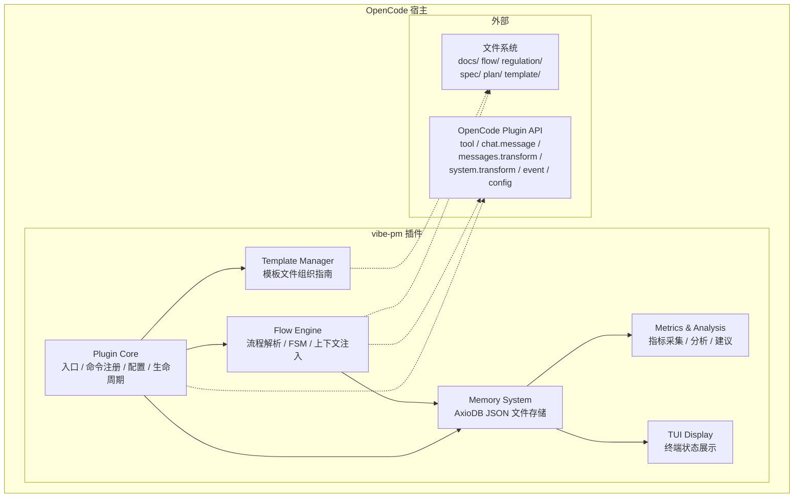
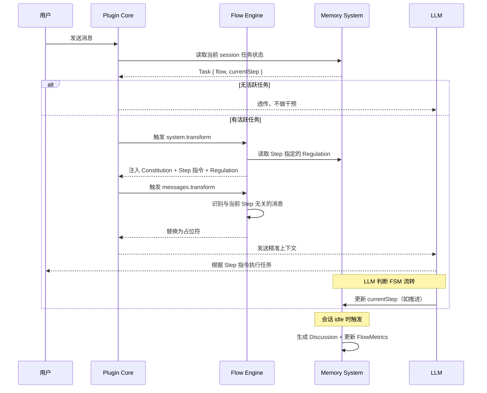
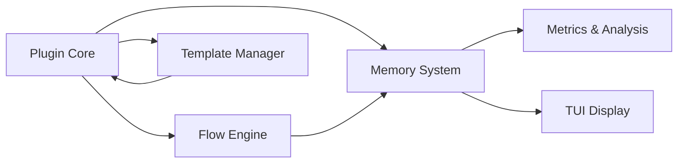
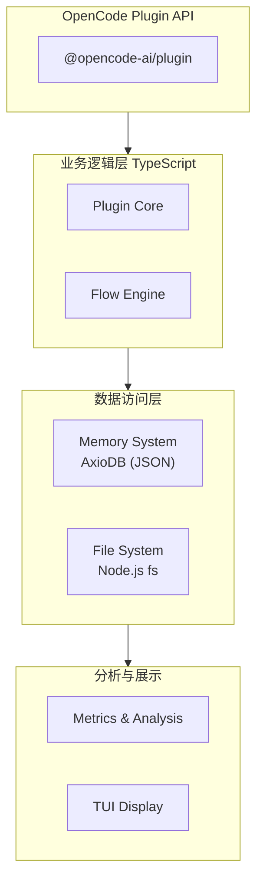

# vibe-pm 总体设计

**创建日期**: 2026-06-11
**状态**: Draft
**输入来源**: XMind 设计文档 + S4 访谈 + OpenCode 插件 API 调研

---

## 需求背景

vibe-pm 是一个 OpenCode 插件，解决当前 vibe-coding 中"全量加载 AGENTS.md 和 rules/*.md"导致的上下文浪费问题。通过根据任务状态（哪个流程、哪个步骤），向每次 OpenCode 对话精准注入最少但最相关的上下文，并移除无关消息，使 vibe-coding 过程稳定可控。

---

## 系统架构



### 分层说明

| 层 | 模块 | 职责 |
|----|------|------|
| **入口层** | Plugin Core | 插件生命周期、命令注册、配置加载、钩子编排 |
| **业务层** | Flow Engine | Flow 解析、FSM 状态机、上下文注入、步骤管理 |
| **数据层** | Memory System | AxioDB（JSON 文件）读写、数据模型、结构化记忆 CRUD |
| **分析层** | Metrics & Analysis | 流程指标采集、任务后分析、Discussion 改进建议生成 |
| **展示层** | TUI Display | 终端状态展示（任务进度、步骤、耗时） |
| **参考层** | Template Manager | 内置模板文件组织规范、模板选择指南 |

---

## 核心数据流

### 一次对话的完整流程



### 上下文注入内容

每次对话注入以下内容（按优先级排序）：

1. **Constitution** — 始终加载的最高原则
2. **当前 Step 执行指令** — 来自 Flow 文档
3. **Step 指定的 Regulation** — 如 CodingStyle、Checklist
4. **Spec 文档引用** — 与当前任务关联的功能规格说明
5. **任务计划引用** — 当前任务的执行计划

---

## 模块关系



**数据方向**：
- **写路径**: Flow Engine → Memory System（Task 状态、FlowMetrics）
- **写路径**: Metrics & Analysis → Memory System（Discussion）
- **读路径**: Plugin Core / TUI / Metrics ← Memory System
- **文件读**: Flow Engine 读取 `docs/flow/`、`docs/regulation/`、`docs/spec/`
- **文件读**: Template Manager 读取 `docs/template/`

---

## 技术栈分层



### 关键依赖

| 依赖 | 版本 | 用途 |
|------|------|------|
| `@opencode-ai/plugin` | latest | 插件入口、hooks、tool 注册 |
| `axiodb` | latest | 嵌入式结构化记忆数据库（JSON 文件存储） |
| TypeScript | 5.x | 类型安全 |

---

## 配置设计

### `.vibe-pm.json`

```jsonc
{
  "language": "zh-CN",       // 输出语言：zh-CN | en-US
  "dataDir": ".vibe-pm",     // AxioDB 数据文件目录（相对于项目根目录）
  "autoAnalyze": true,       // 任务结束后是否自动分析
  "contextInjection": {
    "maxStepTokens": 4000,   // 每个 Step 注入的上下文最大 Token 数
    "pruneIrrelevant": true  // 是否裁剪无关消息
  }
}
```

---

## 目录结构

```
项目根目录/
├── .vibe-pm/                    # 插件运行时数据
│   └── data.json                # AxioDB 数据库文件（JSON 格式）
├── .vibe-pm.json                # 插件配置
├── docs/
│   ├── flow/                    # 流程定义
│   │   └── [flow]_*.md
│   ├── regulation/              # 行为准则
│   │   ├── constitution.md
│   │   ├── coding_style.md
│   │   ├── checklist.md
│   │   └── dictionary.md
│   ├── spec/                    # 程序规格说明
│   ├── plan/                    # 任务计划
│   │   └── [plan]_*.md
│   └── template/                # 内置流程模板文件
├── rules/                       # OpenCode 会话规则（每次加载）
│   └── [rules]*.md
├── src/                         # 插件源代码
│   ├── index.ts                 # 插件入口
│   ├── core/                    # Plugin Core
│   ├── engine/                  # Flow Engine
│   ├── memory/                  # Memory System
│   ├── metrics/                 # Metrics & Analysis
│   ├── tui/                     # TUI Display
│   └── template/                # Template Manager
├── package.json
└── tsconfig.json
```

---

## 安全与权限

| 操作 | 权限策略 |
|------|---------|
| 读取 docs/ 文件 | `allow`（只读文件系统） |
| 写 AxioDB 数据 | `allow`（插件内部操作） |
| 修改消息内容 | `allow`（插件 hook 内） |
| 修改系统提示 | `allow`（插件 hook 内） |
| 删除文件 | `deny`（永不执行） |
| 网络请求 | `deny`（当前阶段不联网） |
