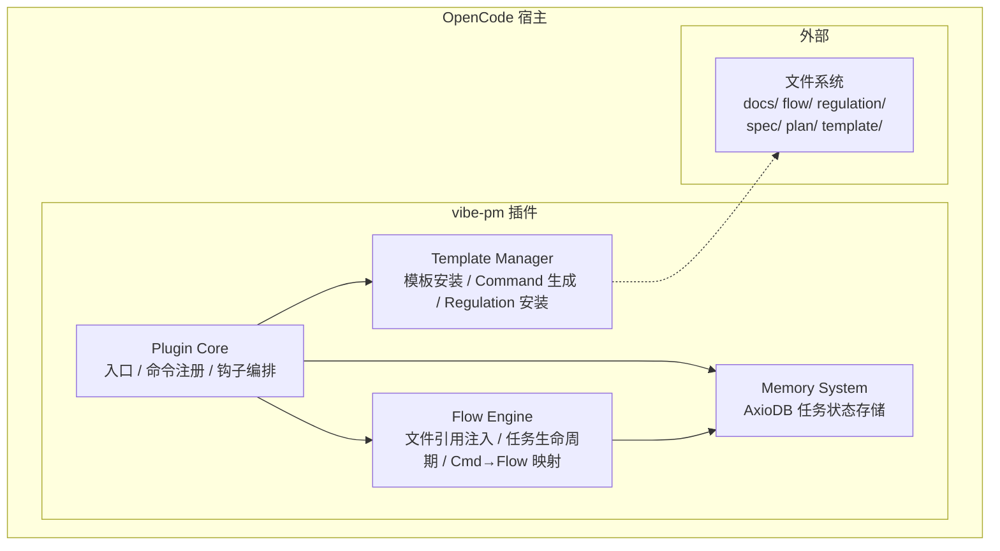
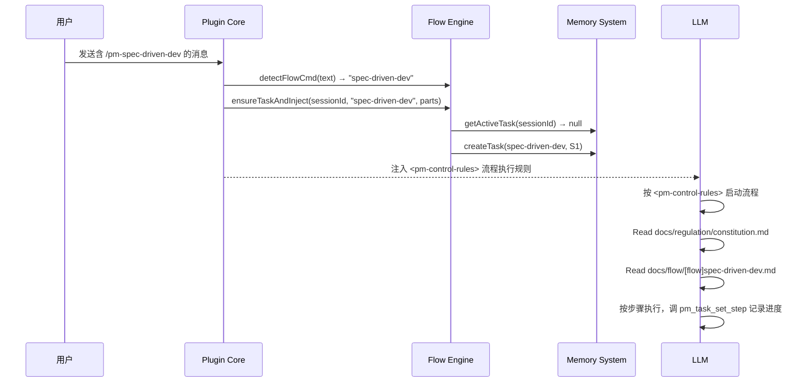

# vibe-pm 总体设计

**创建日期**: 2026-06-11
**状态**: Draft
**最后更新**: 2026-06-17 — 注入精简为单一 `<pm-control-rules>` 标签，任务由 messages.transform 自动创建

---

## 需求背景

vibe-pm 解决 vibe-coding 中上下文管理混乱的问题：

- **全量加载浪费上下文**：AGENTS.md 和 rules/*.md 每次全量注入
- **自动裁剪不可控**：黑盒裁剪误删关键信息

### 设计理念

将流程控制相关内容以更精确可控的方式嵌入上下文和 Agent 的交互中, **由LLM 主导流程控制**，**保证 vibe-coding 过程稳定可控**。用户/团队可按喜好和实际情况定制自己的开发流程，插件负责管理步骤流转并持续采集数据驱动优化。

### 任务驱动

每个任务包含三要素：

| 要素 | 含义 | 载体 |
|------|------|------|
| **Spec** | 做什么（WHAT） | `docs/spec/` — 技术规格文档 |
| **Task Plan** | 怎么做（HOW） | `docs/plan/` — 可执行计划 |
| **Task State** | 做到哪了（WHERE） | SQLite 结构化记忆 — 当前步骤 |

任务通过 `/pm-*` 命令启动，插件管理步骤流转。LLM 判断 FSM 状态转换（非硬编码规则），关键节点通过 `question` / `confirm` 工具进入阻塞式 human-in-loop。

### 上下文注入（每次对话）

1. 从 SQLite 读取当前流程和步骤
2. 提取相关上下文：Flow 文档、任务状态、Constitution、当前步骤指定的 Regulation、Spec 文档、任务计划
3. 移除与当前步骤无关的消息（裁剪）→ 注入最少但最相关的上下文

### 双重记忆体系

| 类型 | 存储 | 特点 |
|------|------|------|
| MD 文档记忆 | `docs/flow/`、`docs/regulation/`、`docs/spec/`、`docs/plan/` | 稳定沉淀，一般不轻易修改 |
| 结构化记忆 | SQLite（`.vibe-pm/`） | 频繁读写：任务状态、Discussion、FlowMetrics |

### 数据驱动优化

按步骤采集进入次数、Token 消耗、停留时间、人工介入时间、用户输入量等指标。任务结束后自动分析执行情况，生成 Discussion 改进建议。用户可在碎片时间异步召回 Discussion 讨论后修改落地生效。

---

## 系统架构



### 分层说明

| 层 | 模块 | 职责 |
|----|------|------|
| **入口层** | Plugin Core | 插件生命周期、命令注册、钩子编排 |
| **业务层** | Flow Engine | 文件引用标签注入、任务生命周期管理、Command→Flow 映射 |
| **数据层** | Memory System | AxioDB 任务状态 CRUD |
| **参考层** | Template Manager | 模板安装、Command 文件生成、Regulation 自动安装 |

---

## 核心数据流

### 一次对话的流程



### 上下文注入内容

每次对话注入 `<pm-control-rules>` 控制提示，其中包含**文件引用**让 LLM 自行读取相关文档（不含全文）：

---

## 目录结构

```
项目根目录/
├── .vibe-pm/                    # 插件运行时数据
├── .vibe-pm.json                # 插件配置
├── .opencode/
│   ├── commands/                # 生成的 Command 文件
│   └── dcp.jsonc                # DCP 保护配置
├── docs/
│   ├── flow/                    # 流程定义
│   │   └── flow-*.md
│   ├── regulation/              # 行为准则
│   │   ├── constitution.md
│   │   ├── coding_style.md
│   │   └── dictionary.md
│   ├── spec/                    # 程序规格说明
│   ├── plan/                    # 任务计划
│   └── template/                # 内置模板
├── src/
│   ├── index.ts
│   ├── core/                    # Plugin Core
│   ├── engine/                  # Flow Engine
│   ├── memory/                  # Memory System
│   └── template/                # Template Manager
```

---

## 技术栈

| 组件 | 用途 |
|------|------|
| TypeScript (ES2022, strict) | 实现语言 |
| Bun | 运行时 / 构建 / 测试 |
| `@opencode-ai/plugin` SDK | 钩子/命令/工具注册 |
| AxioDB | 任务状态存储 |
| Zod | 运行时校验 |
| tiktoken | Token 计数 |
