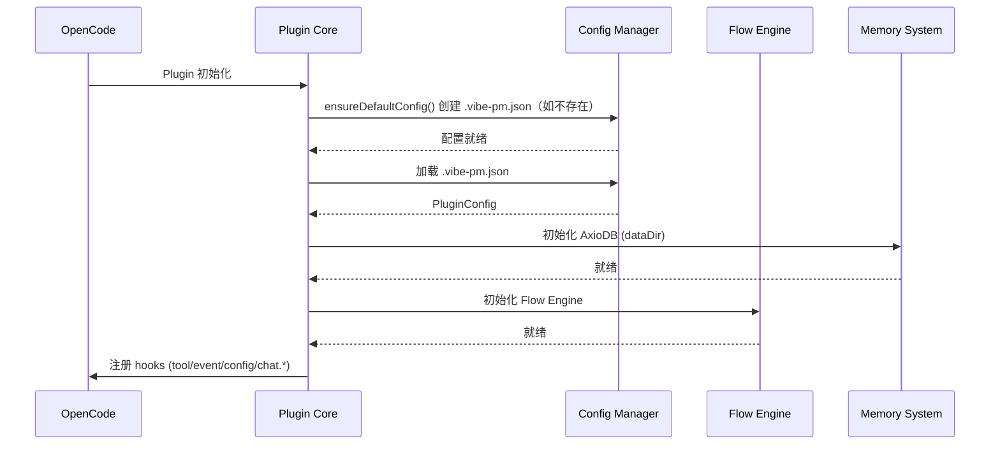
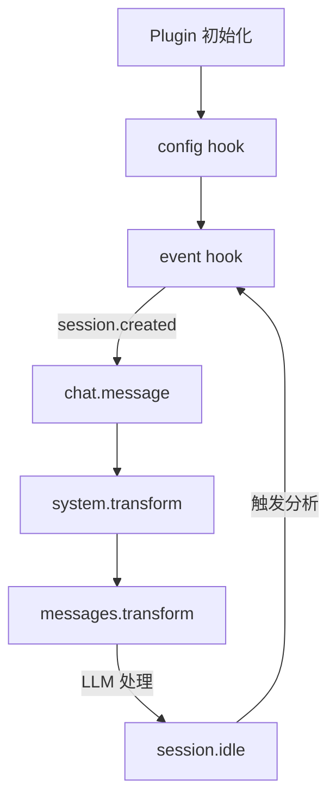

# Plugin Core Spec

**创建日期**: 2026-06-11
**状态**: Implemented
**输入来源**: XMind 设计文档 + OpenCode 插件 API 调研
**最后更新**: 2026-06-12 — Plugin Core 实现完成

---

## 需求背景

Plugin Core 是 vibe-pm 插件的入口层，负责：插件初始化、命令注册（`/pm-*`）、配置加载、管理生命周期钩子，并编排各业务模块。

---

## 设计要点

### 领域模型

| 实体 | 属性 | 关系 |
|------|------|------|
| Plugin | `name`, `version`, `config`, `modules` | 包含 1:N 个 Module |
| Module | `name`, `init()`, `hooks` | 由 Plugin 组装到 Hooks |
| Command | `name`, `description`, `handler` | 通过 tool / config hook 注册 |
| PluginConfig | `language`, `dataDir`, `autoAnalyze`, `contextInjection` | 从 `.vibe-pm.json` 加载 |

### 关键路径



启动时确保 `.vibe-pm.json` 存在（不存在则创建默认配置）。目录结构（`docs/flow/` 等）由 `/pm-install-flow` 按需创建。

### 命令注册

vibe-pm 通过两种方式注册命令：

#### 方式 1: config hook（声明式）

```typescript
config: async (opencodeConfig) => {
  openencodeConfig.command ??= {};
  openencodeConfig.command["pm-init"] = {
    template: "Initialize vibe-pm project with guided questions",
    description: "Start vibe-pm initialization wizard",
    agent: "build",
  };
  openencodeConfig.command["pm-task-start"] = {
    template: "Start a new task in the current flow",
    description: "Begin a new task",
    agent: "build",
  };
  // ... 其他命令
};
```

#### 方式 2: tool hook（可执行）

```typescript
tool: {
  pm_init: tool({
    description: "Initialize vibe-pm project structure",
    args: { language: z.enum(["zh-CN", "en-US"]).optional() },
    async execute(args, ctx) {
      return await commands.init(args, ctx);
    }
  }),
  pm_task_start: tool({
    description: "Start a new task under a flow",
    args: { flow: z.string().optional() },
    async execute(args, ctx) {
      return await commands.taskStart(args, ctx);
    }
  }),
  // ... 其他工具
}
```

### 命令清单

| 命令 | 实现方式 | 功能 |
|------|---------|------|
| `/pm-install-flow` | config（声明式）+ Plugin Core 处理 | 从内置模板目录选择并安装流程 |
| `/pm-uninstall-flow` | config（声明式）+ Plugin Core 处理 | 移除一个流程 |
| `/pm-refine-flow` | config（声明式）+ Plugin Core 处理 | 迭代优化流程定义 |
| `/pm-task-start` | config + tool | 启动新任务 |
| `/pm-task-set-step` | config + tool | 手动跳转步骤 |
| `/pm-task-refresh` | config + tool | 重新注入当前步骤上下文 |
| `/pm-task-close` | config + tool | 关闭任务，触发分析 |
| `/pm-config` | config（声明式）| 查看或修改 .vibe-pm.json 配置 |

### 生命周期钩子编排



Plugin Core 负责将各模块的实现函数绑定到对应钩子：

```typescript
export const VibePMPlugin: Plugin = async (ctx) => {
  const config = loadConfig(ctx.directory);
  const memory = await initMemory(config.dataDir);
  const engine = new FlowEngine(memory, ctx.directory);

  return {
    // 1. 命令注册
    config: (opencodeConfig) => registerCommands(opencodeConfig),

    // 2. 工具注册（可执行命令 + 流程工具）
    tool: registerTools(memory, engine),

    // 3. 消息到达 → 检查任务状态
    "chat.message": (input, output) => engine.onMessage(input, output),

    // 4. 系统提示注入
    "experimental.chat.system.transform": (input, output) =>
      engine.injectContext(input, output),

    // 5. 消息裁剪
    "experimental.chat.messages.transform": (input, output) =>
      engine.transformMessages(input, output),

    // 6. 生命周期事件
    event: ({ event }) => {
      if (event.type === "session.created") {
        memory.initSession(event.properties.sessionID);
      }
      if (event.type === "session.idle") {
        engine.onSessionIdle(event.properties.sessionID);
      }
    },
  };
};
```

### 配置管理

```typescript
// PluginConfig 类型定义
interface PluginConfig {
  language: "zh-CN" | "en-US";
  dataDir: string;                           // 默认 ".vibe-pm"
  autoAnalyze: boolean;                      // 默认 true
  contextInjection: {
    maxStepTokens: number;                   // 默认 0（不限制）
    pruneIrrelevant: boolean;                // 默认 true
  };
}

// 加载逻辑
function loadConfig(projectDir: string): PluginConfig {
  const configPath = path.join(projectDir, ".vibe-pm.json");

  if (!fs.existsSync(configPath)) {
    // 返回默认配置，由 /pm-init 创建
    return DEFAULT_CONFIG;
  }

  const raw = JSON.parse(fs.readFileSync(configPath, "utf-8"));
  return { ...DEFAULT_CONFIG, ...raw };
}

// DEFAULT_CONFIG 完整定义
const DEFAULT_CONFIG: PluginConfig = {
  language: "zh-CN",
  dataDir: ".vibe-pm",
  autoAnalyze: true,
  contextInjection: {
    maxStepTokens: 0,       // 0 = 不限制
    pruneIrrelevant: true,
  },
};
```

### 项目技术栈

- **语言**: TypeScript
- **模块格式**: NodeNext ESM
- **编译目标**: ES2022
- **包管理器**: pnpm
- **测试框架**: vitest
- **参数校验**: zod

### 日志系统

使用 `console.warn` / `console.error` + `[vibe-pm]` 统一前缀，零外部依赖。

---

## 接口设计

### Plugin Core 对外接口（供 Flow Engine / Memory 使用）

```typescript
interface IPluginContext {
  readonly config: PluginConfig;
  readonly projectDir: string;
  readonly dataDir: string;  // config.dataDir 的绝对路径
}
```

### 模块注册接口

模块通过 `ModuleHooks`（`Partial<Hooks>`）贡献钩子子集。Plugin Core 加载所有模块的 hooks 后合并注册到 OpenCode。

```typescript
import type { Hooks } from "@opencode-ai/plugin";

interface ModuleHooks extends Partial<Hooks> {
  // 模块可以贡献任意钩子子集
}

type ModuleInit = (ctx: IPluginContext) => ModuleHooks;
```

### 模块接入机制

各模块通过普通 TypeScript `import`/`export` 接入。Plugin Core 直接 import 各模块的 `ModuleInit` 函数，调用后获得 `ModuleHooks` 并合并。无需注册表、DI 容器或动态扫描机制。

---

## 测试用例

### plugin-config.test.ts

- **测试文件**: `tests/core/config.test.ts`
- **关联设计文档**: `vibe-pm-plugin-core.md`
- **Setup/Teardown**: 创建临时目录和 `.vibe-pm.json` 文件，测试后清理

| 动作指令 | 测试方法 | Given | When | Then | Notes |
|----------|----------|-------|------|------|-------|
| 新增 | `loadConfig_defaults` | `.vibe-pm.json` 不存在 | 调用 `loadConfig()` | 返回 DEFAULT_CONFIG | 首次使用的项目 |
| 新增 | `loadConfig_override` | `.vibe-pm.json` 存在，`language: "en-US"` | 调用 `loadConfig()` | 返回合并后的配置（language=en-US，其余默认） | 部分覆盖 |
| 新增 | `loadConfig_invalid_json` | `.vibe-pm.json` 内容为非法 JSON | 调用 `loadConfig()` | 返回 DEFAULT_CONFIG + 记录 warning | 容错处理 |

### plugin-init.test.ts

- **测试文件**: `tests/core/plugin.test.ts`
- **关联设计文档**: `vibe-pm-plugin-core.md`
- **Setup/Teardown**: 创建临时项目目录，Mock OpenCode PluginContext

| 动作指令 | 测试方法 | Given | When | Then | Notes |
|----------|----------|-------|------|------|-------|
| 新增 | `init_creates_data_dir` | 项目目录下无 `.vibe-pm/` | Plugin 初始化 | 创建 `.vibe-pm/` 目录和空的 `data.json` | 首次安装 |
| 新增 | `init_registers_all_hooks` | 正常配置 | Plugin 初始化 | 返回的 hooks 对象包含 config, tool, chat.message, system.transform, messages.transform, event | 完整性检查 |
| 新增 | `init_module_failure_skips` | 某模块 init 抛异常 | Plugin 初始化 | 跳过该模块，其他模块正常注册，记录 error 日志 | 故障隔离 |
| 新增 | `no_active_task_passthrough` | 当前 session 无活跃 Task | `chat.message` 钩子触发 | output 不做任何修改 | 无任务时不干预 |

### plugin-commands.test.ts

- **测试文件**: `tests/core/commands.test.ts`
- **关联设计文档**: `vibe-pm-plugin-core.md`
- **Setup/Teardown**: Mock OpenCode config 对象

| 动作指令 | 测试方法 | Given | When | Then | Notes |
|----------|----------|-------|------|------|-------|
| 新增 | `register_all_commands` | 空 command 配置 | 调用 `registerCommands()` | config.command 包含全部 8 个 `/pm-*` 命令 | 命令完整性 |
| 新增 | `command_no_duplicate_key` | 已有同名命令 | 再次注册 | 后者覆盖前者，不抛异常 | 幂等性 |

---

## 边界与错误情况

| 场景 | 预期行为 |
|------|---------|
| `.vibe-pm.json` 不存在 | 使用默认配置，提示用户运行 `/pm-init` |
| `.vibe-pm/data.json` 不存在 | 自动创建空数据库文件 |
| 会话无活跃任务 | chat.message / transform 钩子不做干预，透传 |
| 配置项格式错误 | 使用默认值，记录 warning 日志 |
| 模块初始化失败 | 跳过该模块，记录 error，不阻塞其他模块 |
| 命令重复注册 | 后者覆盖前者 |

---

## 约束与限制

### 技术约束

- Plugin Core 通过 `@opencode-ai/plugin` SDK 获取 OpenCode 交互类型（`Plugin`、`PluginInput`、`Hooks`、`tool()`）
- `experimental.*` 钩子可能在后续版本变化，Plugin Core 需通过抽象层隔离实验性 API
- 命令注册分 config + tool 两层，需保证两者一致

### 业务约束

- 不联网（当前阶段）
- 不删除任何用户文件
- 配置文件变更需 `/pm-init` 或 `/pm-refine-flow` 触发，不能自动修改

### 已知风险

- `experimental.chat.messages.transform` 和 `experimental.chat.system.transform` 在后续 OpenCode 版本中可能被移除或合并
- 消息裁剪可能误删关键上下文，需要可配置的裁剪白名单

### 影响范围

- 无现有代码影响（新项目）

---

## 开发进度

> 本部分在开发过程中持续更新。

### 已实现功能

- Plugin Core 入口（`VibePMPlugin`）+ 启动时自动创建默认配置
- 配置管理（`loadConfig` + `DEFAULT_CONFIG` + `initEnvironment`，支持深度合并/自动创建）
- 8 个 `/pm-*` 命令注册（config hook + tool hook）
- 日志系统（`[vibe-pm]` 前缀）
- 核心类型定义（`PluginConfig`, `IPluginContext`, `ModuleInit`, `ModuleHooks`，OpenCode 交互类型来自 SDK）

### 未实现功能

- 4 个可执行命令的实际逻辑（当前返回占位消息）
- TUI 集成（终端显示当前任务状态）

### 占位代码清单

| 位置 | 说明 | 预期替换时间 |
|------|------|-------------|
| `src/core/plugin.ts` — `initMemory()` | AxioDB 初始化的 stub | Memory System 实现时 |
| `src/core/plugin.ts` — `FlowEngine` 类 | 流程引擎的 stub | Flow Engine 实现时 |
| `src/core/commands.ts` — `createStubTool()` | 命令执行的 stub，返回占位消息 | 各命令实现时 |
