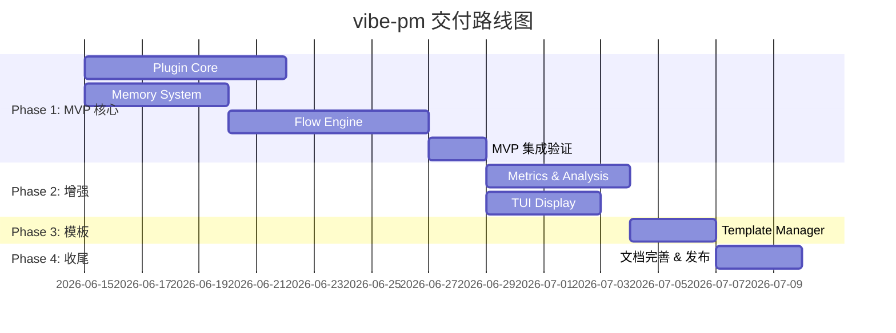
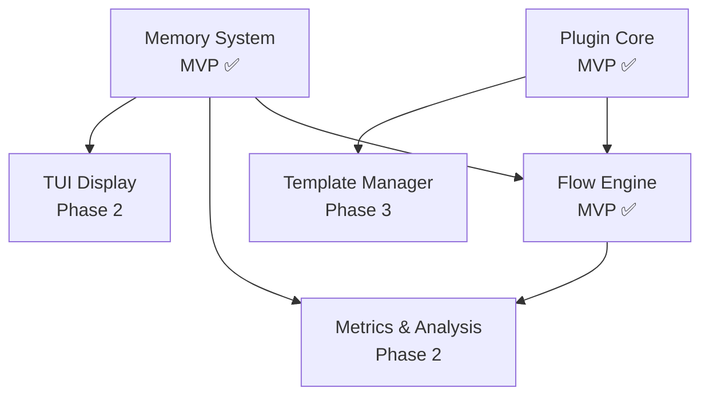

# vibe-pm 交付路线图

**创建日期**: 2026-06-11
**状态**: Draft
**输入来源**: 所有模块 Spec (T001-T007)

---

## 分阶段交付计划

---

## Phase 1: MVP 核心（约 3 周）

**目标**：验证核心闭环——启动任务 → 按步注入上下文 → 记录状态。

| 模块 | 交付物 | 关键能力 |
|------|--------|---------|
| Plugin Core | 插件入口、8 个命令、配置加载 | 双路径命令注册（config + tool）、钩子编排、`/pm-task-start` 重复任务检测 |
| Memory System | AxioDB JSON 文件集成、3 个数据模型 CRUD | Task/Discussion/FlowMetrics 的完整 CRUD 接口、数据文件自动创建与容错 |
| Flow Engine | Flow 解析、上下文注入、消息裁剪 | 完整 Flow 文档注入（含 Mermaid FSM）、⚠️ Human-in-loop 高亮、LLM 自主流转判断 |

### MVP 验证标准

1. 用户执行 `/pm-init` 初始化项目
2. 用户执行 `/pm-install-flow` 安装 research 流程
3. 用户执行 `/pm-task-start` 启动调研任务
4. 每次对话自动注入 Flow 文档 + Constitution + 当前步骤状态
5. Human-in-loop 步骤被 ⚠️ 高亮标记
6. LLM 自主判断步骤流转，`/pm-task-close` 关闭任务
7. Memory System 正确记录 Task 状态和步骤变更

---

## Phase 2: 增强（约 2 周）

**目标**：指标采集与分析、终端状态展示。

| 模块 | 交付物 | 关键能力 |
|------|--------|---------|
| Metrics & Analysis | 指标采集器、流程分析器 | Step 进入/退出采集、瓶颈识别、Discussion 自动生成 |
| TUI Display | 终端状态面板 | 实时展示任务进展、步骤耗时柱状图、Token 消耗 |

### Phase 2 验证标准

1. 任务关闭后自动生成 Discussion 改进建议
2. TUI 面板正确显示当前任务、步骤、耗时
3. 瓶颈步骤被准确识别
4. `getFlowSummary()` 可按流程查看汇总指标

---

## Phase 3: 模板（约 1 周）

**目标**：内置模板文件 + 安装/卸载能力。

| 模块 | 交付物 | 关键能力 |
|------|--------|---------|
| Template Manager | 4 个内置模板 + 安装卸载逻辑 | 模板扫描、安装到 `/docs/flow/`、冲突处理 |

### 内置模板清单

| 模板 | 状态 | 说明 |
|------|------|------|
| research | ✅ 已完成 | 调研任务（`rules/[rules]research.md`） |
| project-build | ✅ 已完成 | 项目搭建（`docs/flow/[flow]project-build.md`） |
| new-feature | 📋 待生成 | 新功能开发（基于 XMind 重任务开发） |
| bug-fix | 📋 待生成 | Bug 修复（基于 XMind Bug修复） |
| large-refactor | 📋 待生成 | 大规模重构 |

---

## Phase 4: 收尾（约 1 周）

**目标**：文档完善、测试补充、发布准备。

- 更新 AGENTS.md 和 README
- 补充端到端集成测试
- 清理 `TODO`/`FIXME` 标记
- 发布第一个可用版本

---

## 里程碑

| 里程碑 | 预计节点 | 标志 |
|--------|---------|------|
| M1: MVP 就绪 | Phase 1 结束 | 可启动任务、注入上下文、记录状态 |
| M2: 完整功能 | Phase 2 结束 | 指标采集 + TUI 展示 |
| M3: 开箱即用 | Phase 3 结束 | 内置模板可安装使用 |
| M4: v1.0 发布 | Phase 4 结束 | 文档完善、测试覆盖、正式发布 |

---

## 模块依赖总结

---

## 风险与缓解

| 风险 | 概率 | 影响 | 缓解措施 |
|------|------|------|---------|
| OpenCode `experimental.*` API 变更 | 中 | 高 | Plugin Core 用抽象层隔离实验性 API，变更时只改抽象层 |
| AxioDB 不稳定 | 低 | 中 | Memory System 接口层便于切换存储后端 |
| LLM 误判步骤流转 | 中 | 中 | Flow 文档中 `完成后` 描述写清晰，Mermaid 状态图提供可视化参考 |
| 上下文注入超出限制 | 低 | 低 | 智能截断策略：保留 Constitution + FSM 图，远端步骤压缩 |
