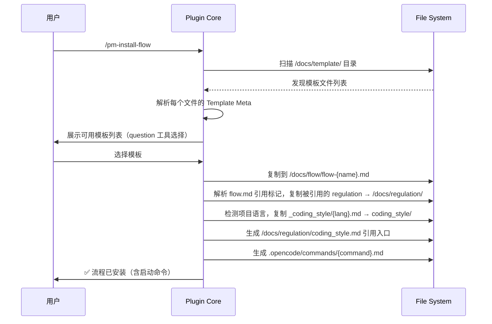
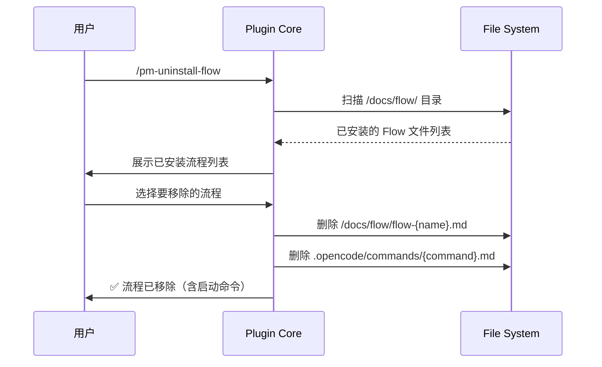

# Template Manager Spec

**创建日期**: 2026-06-11
**状态**: Implemented
**输入来源**: XMind 设计文档 + 用户反馈
**最后更新**: 2026-06-13 — 移除 project-build 内置模板

---

## 需求背景

vibe-pm 发布时**内置一批开箱即用的流程模板文件**。`/pm-install-flow` 命令只需按约定目录路径 `/docs/template/` 扫描模板文件，让用户选择后复制到 `/docs/flow/` 即可。无需额外的接口抽象层——路径约定即接口。

---

## 设计要点

### 约定路径

| 路径 | 用途 |
|------|------|
| `/docs/template/` | 内置模板存放目录（发布时自带） |
| `/docs/flow/` | 用户已安装的流程存放目录 |

### 模板文件格式

每个模板文件是一个完整的 Flow 文档（按 `flow-document-format.md` 规范），文件头标注模板元信息：

```markdown
# {模板名称}

**Template ID**: `{kebab-case-id}`
**Category**: {research / development / maintenance}
**Description**: {一句话描述}
**Command**: `/pm-{command-name}`
**Version**: 1.0.0

---

## 适用场景
...

## 状态机
...

## 任务步骤
...
```

### `/pm-install-flow` 工作流



### `/pm-uninstall-flow` 工作流



### Command 文件生成

安装 Flow 时，自动在 `.opencode/commands/` 下创建 Markdown prompt 模板文件，让用户可通过 `/命令名` 直接启动该 Flow 下的任务。

文件命名：`{command-name}.md`（去掉 `**Command**:` 中的前导 `/`）

内容结构：
```markdown
# {flow-title}

{适用场景原文}

## 任务启动

当用户触发 `/{command-name}` 命令时，表示要启动 **{flow-title}** 流程。

### 输入要求

| 输入项 | 必填 | 说明 |
|--------|------|------|
{从 Flow 文档表格解析}

### 执行步骤

1. 与用户确认任务目标和摘要
2. 收集输入要求中的必填项
3. 调用对应流程命令（如 `/pm-bug-fix`）启动任务（flow: `{flow-id}`）
4. 按照 Flow 文档中定义的步骤逐步执行
```

如果模板没有 `**Command**:` 字段，则不生成命令文件。

卸载 Flow 时，同时删除 `.opencode/commands/` 下的同名命令文件。

> **设计原则**：不需要 `ITemplateManager` 接口抽象层。Plugin Core 的命令实现直接按约定路径读写文件。

---

## 内置模板清单

4 个模板，均基于 XMind 中定义的例子生成：

| Template ID | 名称 | Category | Command | 来源 |
|-------------|------|----------|---------|------|
| `research` | 调研任务 | research | `/pm-research` | XMind「调研」例子 |
| `new-feature` | 新功能开发 | development | `/pm-new-feature` | XMind「重任务开发」完整版 |
| `bug-fix` | Bug 修复 | maintenance | `/pm-bug-fix` | XMind「Bug修复」例子 |
| `large-refactor` | 大规模重构 | development | `/pm-large-refactor` | 「重任务开发」+ 迁移/兼容步骤 |

### 模板完成状态

| 模板 | 状态 | 文件 |
|------|------|------|
| research | ✅ 已完成 | `docs/template/research/flow.md` |
| new-feature | ✅ 已完成 | `docs/template/new-feature/flow.md` |
| bug-fix | ✅ 已完成 | `docs/template/bug-fix/flow.md` |
| large-refactor | ✅ 已完成 | `docs/template/large-refactor/flow.md` + `regulations/migration-checklist.md` |

### 模板 Bundle 结构

```
docs/template/{template-id}/
├── flow.md                ← Flow 文档（含 Template Meta）
└── regulations/           ← 配套 Regulation（可选）
    └── *.md
```

### 编码风格模板结构

```
docs/template/_coding_style/   ← 语言编码风格模板目录（发布时自带）
├── typescript.md
├── python.md
├── go.md
├── rust.md
├── java.md
└── general.md
```

安装时：根据 `detectProjectLanguages()` 检测到的语言，将对应文件复制到 `/docs/regulation/coding_style/` 目录，并生成 `/docs/regulation/coding_style.md` 引用入口文件。

安装时：`flow.md` → `/docs/flow/flow-{id}.md`，`regulations/*.md` → `/docs/regulation/`。

### XMind 各流程步骤对照

**新功能开发**（重任务开发）：
```
S1 理解输入意图 → S2 探索已知事实 → S3 标记缺口与矛盾 →
S4 [Human-in-loop] 渐进式访谈 → S5 设计方案与计划 →
S6 [Human-in-loop] 审查计划 → S7 编写代码 → S8 编写测试 →
S9 运行测试修复 → S10 检查清单自查 → S11 生成交付报告 →
S12 [Human-in-loop] 用户验收 → S13 合流
```

**Bug 修复**：
```
S1 理解Bug描述 → S2 分析根因给出修复方案 →
S3 [Human-in-loop] 审查计划 → S4 编写代码 → S5 编写测试 →
S6 运行测试修复 → S7 检查清单自查 → S8 生成交付报告 →
S9 [Human-in-loop] 用户验收 → S10 合流
```

**大规模重构**：
```
S1 理解重构意图 → S2 探索现有代码 → S3 标记影响范围与风险 →
S4 [Human-in-loop] 渐进式访谈 → S5 设计方案与迁移路径 →
S6 [Human-in-loop] 审查计划 → S7 编写代码（保持向后兼容） →
S8 编写迁移测试 → S9 运行测试修复 → S10 兼容性验证 →
S11 检查清单自查 → S12 生成交付报告 →
S13 [Human-in-loop] 用户验收 → S14 合流

---

## 测试用例

### template-scan.test.ts

- **测试文件**: `tests/template/template-scan.test.ts`
- **关联设计文档**: `vibe-pm-template-manager.md`
- **Setup/Teardown**: 创建临时 `/docs/template/` 目录，放入测试模板文件；创建空 `/docs/flow/` 目录

| 动作指令 | 测试方法 | Given | When | Then | Notes |
|----------|----------|-------|------|------|-------|
| 新增 | `scan_finds_all_templates` | /docs/template/ 下有 3 个 .md 文件 | 扫描目录 | 返回 3 个文件名 | 目录扫描 |
| 新增 | `scan_filters_non_md_files` | /docs/template/ 下有 .md + .DS_Store | 扫描目录 | 仅返回 .md 文件 | 过滤非模板 |
| 新增 | `install_copies_to_flow_dir` | 选中模板 | 执行安装 | /docs/flow/ 下出现同名文件，内容一致 | 文件复制 |
| 新增 | `install_generates_command_file` | 模板含 Command 字段 | 执行安装 | .opencode/commands/{cmd}.md 创建 | 命令生成 |
| 新增 | `install_without_command_skips` | 模板不含 Command 字段 | 执行安装 | .opencode/commands/ 下无文件 | 无命令则跳过 |
| 新增 | `install_overwrite_prompt` | /docs/flow/ 已有同名 Flow | 执行安装 | 提示用户确认覆盖 | 冲突处理 |
| 新增 | `uninstall_removes_from_flow_dir` | /docs/flow/ 下有 2 个 Flow | 选择移除 1 个 | 目标文件被删除，另一个保留 | 卸载 |
| 新增 | `uninstall_removes_command_file` | 已安装含 Command 的 Flow | 执行卸载 | .opencode/commands 中对应文件也删除 | 命令清理 |

### command-generation.test.ts

- **测试文件**: `tests/template/command-generation.test.ts`
- **关联设计文档**: `vibe-pm-template-manager.md`
- **Setup/Teardown**: 创建临时项目目录，放入含/不含 Command 字段的模板

| 动作指令 | 测试方法 | Given | When | Then | Notes |
|----------|----------|-------|------|------|-------|
| 新增 | `parse_meta_includes_command` | 模板含 `**Command**: \`/pm-test\`` | 扫描模板 | TemplateMeta.command = "/pm-test" | 命令字段解析 |
| 新增 | `parse_meta_no_command` | 模板不含 Command 字段 | 扫描模板 | TemplateMeta.command = "" | 缺失字段降级 |
| 新增 | `install_generates_command_file` | 模板含 Command + 输入要求 | installTemplate | .opencode/commands/pm-test-cmd.md 创建，内容含适用场景/输入要求/执行步骤 | 完整内容验证 |
| 新增 | `install_without_command_skips_file` | 模板不含 Command | installTemplate | .opencode/commands/ 目录不存在 | 无命令则跳过 |
| 新增 | `uninstall_removes_command_file` | 已安装含 Command 的 Flow | uninstallFlow | Flow 文件和 Command 文件均被删除 | 清理一致性 |
| 新增 | `generated_command_content_structure` | 模板含 Command + 输入要求表格 | installTemplate | 命令文件包含标题/适用场景/输入要求/执行步骤完整结构 | 内容结构验证 |

---

## 实施规划

> 本部分在开发过程中持续更新。以里程碑为粒度拆解，每个里程碑关联功能点和风险。

### [x] 里程碑 1 — Template Manager MVP

- [x] 模板扫描与安装：`/pm-install-flow` → 约定路径 `docs/template/` → 复制到 `docs/flow/`
  - 已知问题/风险: regulations 安装改为按 flow.md 引用标记精确复制，不再全量复制 bundleDir/regulations/
- [x] dictionary 模板安装已移至 `/pm-config init` 流程，`installTemplate` 不再处理
- [x] 模板卸载：`/pm-uninstall-flow` → 删除 flow 文件 + 对应 command 文件
  - 已知问题/风险: 卸载流程不处理 regulations 文件清理（仅清理 flow + command）
- [x] Command 文件自动生成（`.opencode/commands/{cmd}.md`）
- [x] DCP 保护配置自动写入（`writeDcpConfig` — protectTags + protectedFilePatterns）
- [x] 编码风格模板安装（语言检测 + 13 种语言别名映射 + `_coding_style/` 复制 + 引用入口生成）
- [x] 4 个内置模板全部完成：research、new-feature、bug-fix、large-refactor
  - 已知问题/风险: 跨模板模板 ID 冲突处理依赖用户确认覆盖
