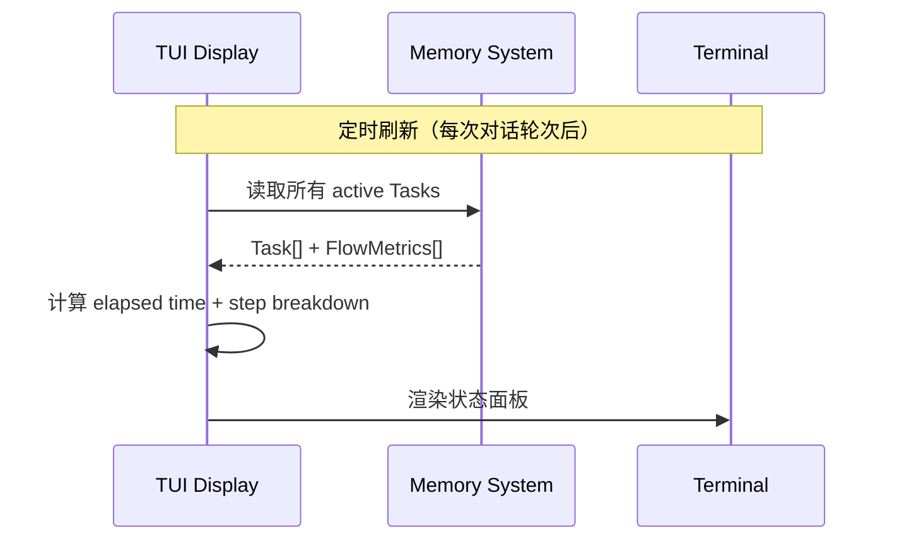

# TUI Display Spec

**创建日期**: 2026-06-11
**状态**: Draft
**输入来源**: XMind 设计文档 + Memory System Spec

---

## 需求背景

TUI Display 负责在终端展示 vibe-pm 的实时状态信息，让用户一眼了解当前任务进展。展示内容：当前运行的任务场景、任务状态、开始时间和各步骤耗时。

---

## 设计要点

### 领域模型

| 实体 | 属性 | 说明 |
|------|------|------|
| TUIState | `activeTasks[]`, `selectedTask` | 当前展示的状态快照 |
| TaskDisplay | `flow`, `currentStep`, `stepName`, `startAt`, `elapsed`, `stepHistory[]` | 单个任务的展示数据 |
| StepTiming | `stepId`, `stepName`, `dwellTime`, `entryCount` | 单个步骤的耗时信息 |

### 关键路径

#### 状态展示流程



#### 展示布局

```
┌─ vibe-pm ─────────────────────────────────────────────┐
│                                                        │
│  📋 当前任务: 项目整体设计                               │
│  📍 流程: research                                     │
│  🔄 步骤: S6/7 - 审查计划                              │
│  ⏱ 已用时间: 2h 15m                                   │
│                                                        │
│  步骤耗时:                                              │
│  S1 理解输入意图    ████░░░░░░░░  5m                    │
│  S2 探索已知事实    ██░░░░░░░░░░  3m                    │
│  S3 标记缺口      ███░░░░░░░░░  4m                     │
│  S4 渐进式访谈    ████████████  45m  ⚠️ 人工介入        │
│  S5 设计方案      ████████░░░░  30m                    │
│  S6 审查计划      ████████████  42m  ⚠️ 人工介入 ◀ 当前 │
│  S7 按计划输出    ░░░░░░░░░░░░  待开始                   │
│                                                        │
│  Token 消耗: 约 85,000                                 │
│  无活跃任务时显示: "— 无活跃任务 —"                       │
│                                                        │
└────────────────────────────────────────────────────────┘
```

### 接口设计

```typescript
interface ITuiDisplay {
  /** 渲染当前状态到终端 */
  render(): Promise<void>;

  /** 获取展示数据 */
  getDisplayData(): Promise<TuiState>;

  /** 切换选中的任务（多任务场景） */
  selectTask(sessionId: string): void;
}

interface TuiState {
  activeTasks: TaskDisplay[];
  selectedTaskIndex: number;
  lastUpdated: string;
}

interface TaskDisplay {
  sessionId: string;
  flow: string;
  currentStep: string;
  stepName: string;
  summary: string;
  startAt: string;
  elapsed: string;              // 格式化耗时 "2h 15m"
  totalTokens: number;
  steps: StepTiming[];
  totalSteps: number;
  completedSteps: number;
}

interface StepTiming {
  stepId: string;
  stepName: string;
  dwellTime: number;            // 毫秒
  entryCount: number;           // 进入次数
  humanInLoop: boolean;         // 是否需要人工介入
  isCurrent: boolean;           // 是否当前步骤
  formattedTime: string;        // 格式化耗时 "45m"
}
```

### 渲染方式

> **待确认**：TUI 展示方式取决于 OpenCode TUI 能力。两种方案：
>
> **方案 A**：通过 system prompt 注入状态信息，在终端侧边栏展示（推荐，与 OpenCode 原生 TUI 集成）
> **方案 B**：独立进程通过 ANSI 控制序列渲染（独立性强，但需要额外集成）
>
> 实施时根据 OpenCode TUI API 调研结果选择。

### 数据来源

TUI Display 从 Memory System 读取数据，不直接写入：

```typescript
class TuiDisplay implements ITuiDisplay {
  constructor(private memory: IMemorySystem) {}

  async getDisplayData(): Promise<TuiState> {
    const tasks = await this.memory.listActiveTasks();
    // 为每个 task 构造 TaskDisplay
    const displays = await Promise.all(
      tasks.map(async (task) => {
        const metrics = await this.memory.getFlowMetrics(task.sessionId);
        return this.buildTaskDisplay(task, metrics);
      })
    );
    return { activeTasks: displays, selectedTaskIndex: 0, lastUpdated: new Date().toISOString() };
  }

  private buildTaskDisplay(task: Task, metrics: FlowMetrics[]): TaskDisplay {
    const totalSteps = metrics.length;
    const completedSteps = metrics.filter(m => m.dwellTime > 0).length;
    const totalTokens = metrics.reduce((sum, m) => sum + m.tokensConsumed, 0);
    const elapsed = this.formatElapsed(task.startAt);

    return {
      sessionId: task.sessionId,
      flow: task.flow,
      currentStep: task.currentStep,
      stepName: task.currentStepName,
      summary: task.summary,
      startAt: task.startAt,
      elapsed,
      totalTokens,
      totalSteps,
      completedSteps,
      steps: metrics.map(m => ({
        stepId: m.step,
        stepName: m.stepName,
        dwellTime: m.dwellTime,
        entryCount: m.stepInCount,
        humanInLoop: false, // 从 Flow 定义获取
        isCurrent: m.step === task.currentStep,
        formattedTime: this.formatDuration(m.dwellTime),
      })),
    };
  }
}
```

---

## 测试用例

### tui-display.test.ts

- **测试文件**: `src/tui/__tests__/tui-display.test.ts`
- **关联设计文档**: `vibe-pm-tui-display.md`
- **Setup/Teardown**: Mock Memory System，预置 active Task 和 FlowMetrics

| 动作指令 | 测试方法 | Given | When | Then | Notes |
|----------|----------|-------|------|------|-------|
| 新增 | `render_active_task` | 1 个 active Task，有 5 条 FlowMetrics | getDisplayData() | TaskDisplay 包含正确的 currentStep、stepName、elapsed | 单任务展示 |
| 新增 | `render_no_active_task` | 无 active Task | getDisplayData() | activeTasks 为空数组 | 空闲状态 |
| 新增 | `calculate_elapsed_correctly` | startAt=2小时前 | getDisplayData() | elapsed="2h 0m" | 耗时计算 |
| 新增 | `step_timing_current_step_marked` | currentStep="S4" | getDisplayData() | S4 的 isCurrent=true，其他步骤 isCurrent=false | 当前步骤高亮 |
| 新增 | `total_tokens_aggregated` | FlowMetrics tokens=[1000,2000,3000] | getDisplayData() | totalTokens=6000 | Token 汇总 |

---

## 边界与错误情况

| 场景 | 预期行为 |
|------|---------|
| 无活跃任务 | 显示 "— 无活跃任务 —" |
| 任务刚启动（无 FlowMetrics） | 显示"步骤数据待采集" |
| Memory System 读取失败 | 显示错误提示，不影响其他模块 |
| 多个活跃任务 | 列表展示，默认选中第一个 |

---

## 约束与限制

### 技术约束

- 纯数据读取，不写入 Memory System
- TUI 展示方式依赖 OpenCode 的 TUI API（待调研）
- 刷新频率为每次对话轮次后（不在对话中实时刷新）

### 已知风险

- OpenCode TUI API 能力未知——可能只能用 system prompt 注入方式实现
- 多任务展示时信息密度可能过高

### 影响范围

- 依赖 Memory System（只读）
- 被 Plugin Core 调用 `render()` 更新终端显示
- 无下游依赖
