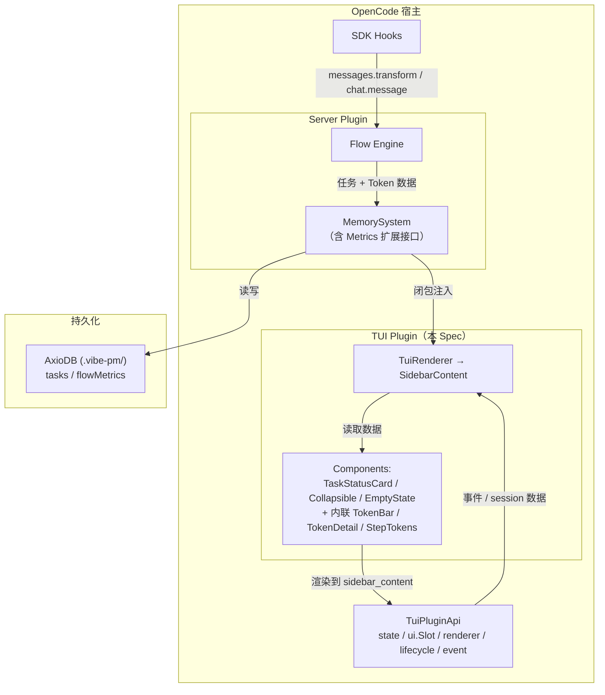
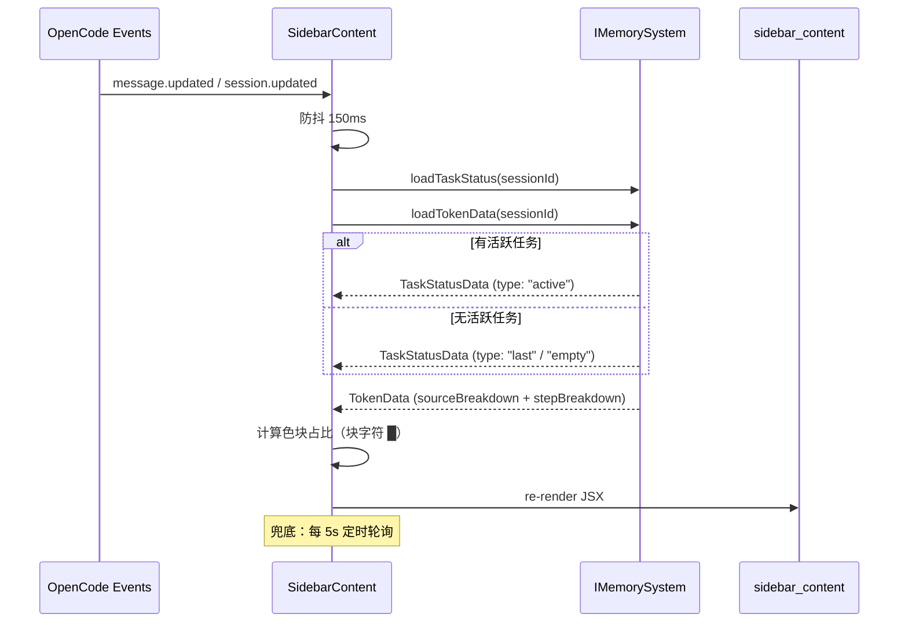

# TUI 扩展

**创建日期**: 2026-06-17
**状态**: Implemented
**输入来源**: 用户需求
**最后更新**: 2026-06-18 — 同步至实现状态：模块结构、数据加载方式、TokenBar 渲染、构建配置皆与代码一致；代码审查合规修复（onMouseUp、flexGrow 消除、SIDEBAR_WIDTH 常量）

---

## 需求背景

vibe-pm 当前通过纯文本 tool 返回值向用户展示任务状态（`[vibe-pm] ✅ 任务已创建` 格式），信息密度低、无结构、不可交互。用户需要离开当前对话上下文才能查看全局任务进展和 Token 消耗。

参考 magic-context 插件的 TUI 侧边栏设计，本 Spec 定义 vibe-pm 的 OpenCode TUI 扩展：在侧边栏面板中实时展示任务状态、流程进展、Token 分布。

> **依赖**: 本 Spec 依赖 [vibe-pm-metrics-collection.md](./vibe-pm-metrics-collection.md) 提供的数据接口（`IMemorySystem` 扩展方法、`FlowMetrics.tokensBySource`、`Task.endAt`）。

---

## 用例场景与用户故事

### 用户故事 1 — 查看当前任务进展（优先级：P1）

用户发起 `/pm-*` 命令启动任务后，希望在侧边栏即时看到：当前执行哪个流程、处于第几步、已耗时多久、关联的 Spec/Plan 文档。

**优先原因**: 这是 TUI 扩展的核心价值——让用户无需离开对话即掌握任务状态。

**独立验证**: 执行 `/pm-research` 后，侧边栏面板显示 "流程: research → S5: 执行环节，已耗时 12min"。

**验收场景**:

1. **Given** Session 中有一个活跃任务（flow=research, step=S3），**When** 打开 TUI 侧边栏，**Then** 面板显示流程名、当前步骤名、开始时间、已耗时
2. **Given** 任务刚通过 `/pm-task-set-step` 跳到 S4，**When** 侧边栏刷新，**Then** 步骤名立即更新为 S4 对应的步骤名
3. **Given** 任务通过 `/pm-task-close` 关闭，**When** 侧边栏刷新，**Then** 显示结束时间和总耗时

### 用户故事 2 — 无活跃任务时回退显示（优先级：P1）

当 Session 中没有活跃任务，但之前有过任务时，侧边栏应自动显示最近一个结束任务的信息，让用户了解上一轮工作的上下文。

**优先原因**: 用户在任务之间切换时，需要快速回顾上一步做了什么。

**独立验证**: 关闭活跃任务后，侧边栏显示 "上一任务: bug-fix，耗时 45min，已于 15:30 结束"。

**验收场景**:

1. **Given** Session 中有 1 个已关闭任务、无活跃任务，**When** 打开侧边栏，**Then** 显示该结束任务的流程名、耗时、结束时间
2. **Given** Session 中有 3 个已关闭任务、无活跃任务，**When** 打开侧边栏，**Then** 显示最近结束的任务（按 endAt 降序取第一个）
3. **Given** Session 从未创建过任何任务，**When** 打开侧边栏，**Then** 显示 "暂无任务" 空状态提示

### 用户故事 3 — Session Token 分布（优先级：P2）

侧边栏以单行色块占比条展示当前 Session 的 Token 使用分布，点击展开箭头查看各来源的百分比详情。

**优先原因**: Token 分布是 vibe-pm 上下文管理核心指标的直接可视化，让用户理解每轮对话的成本构成。

**独立验证**: 经过多轮对话后，侧边栏显示一行 6 色占比条（总 12.5K），点击展开后可看到 System(12%) / FlowControl(8%) / User(15%) / Assistant(40%) / Tool(20%) / Reasoning(5%)。

**验收场景**:

1. **Given** Session 刚启动、无消息，**When** 查看侧边栏，**Then** 占比条全空，显示总 Token=0
2. **Given** 用户发送一条消息、LLM 回复带有 tool calls，**When** 侧边栏刷新，**Then** 占比条对应色块增长，总量更新
3. **Given** 占比条下的详情折叠中，**When** 点击 ▼ 展开箭头，**Then** 显示 6 种来源各自的 Token 数和百分比

### 用户故事 4 — 按步骤的 Token 消耗（优先级：P3）

侧边栏可展开查看当前流程各步骤的累计 Token 消耗明细，帮助用户识别哪个步骤消耗了最多上下文。默认折叠。

**优先原因**: 为流程优化提供数据支撑，目前主要面向高级用户和流程设计者。

**独立验证**: 点击步骤 Token 的 ▶ 展开箭头后，显示 S1-S4 各步骤的进入次数和累计 Token。

**验收场景**:

1. **Given** 当前任务执行到 S3，**When** 展开步骤 Token 详情，**Then** 显示 S1/S2/S3 各自的进入次数和累计 Token
2. **Given** 同一 Session 中同一步骤进入多次（如 S4 反复访谈），**When** 展开步骤 Token，**Then** 显示进入次数和累计 Token（聚合值）

---

## 设计要点

### 领域模型

| 实体 | 属性 | 关系 |
|------|------|------|
| **TuiPanel** | `components[]`, `refreshInterval` | 通过闭包注入 IMemorySystem；通过 TuiPluginApi 渲染 |
| **TaskStatusCard** | `flow`, `currentStep`, `startAt`, `endAt?`, `elapsed` | 关联 1 个 Task 实体 |
| **TokenBar** | `segments: ColorSegment[]`, `totalTokens` | 聚合自 SourceTokenBreakdown[] |
| **ColorSegment** | `source: TokenSource`, `tokens: number`, `percentage: number`, `color: RGBA` | 每种来源固定颜色 |
| **TokenDetail** | `bySource: SourceBreakdown[]`, `byStep: StepBreakdown[]` | 聚合自 FlowMetrics，默认折叠 |
| **Collapsible** | `expanded: boolean`, `toggle()` | 可展开/折叠容器组件 |

#### 颜色映射（固定，参考 magic-context 冷暖色调设计）

| 来源 | 颜色 | 调性 |
|------|------|------|
| System | 冷蓝 `#4A90D9` | 冷色（结构化注入） |
| FlowControl | 冷青 `#36B0C8` | 冷色（结构化注入） |
| User | 暖橙 `#F5A623` | 暖色（用户流量） |
| Assistant | 暖绿 `#7ED321` | 暖色（LLM 输出） |
| Tool | 暖紫 `#B07BED` | 暖色（工具流量） |
| Reasoning | 暖灰 `#9B9B9B` | 暖色（推理开销） |

### 数据流架构



### 关键路径：TUI 渲染



### TUI 组件布局设计 

#### 无活跃任务

```
┌─────────────────────────────────┐
│  vibe-pm                        │  ← api.theme.current.primary
├─────────────────────────────────┤
│  当前无任务                     │
├─────────────────────────────────┤
│  Token 分布                     │  ← 内联 TokenBar（块字符 █，含总量）
│  ▼ ███████████████████████ 12.5K│  ← Collapsible，默认折叠
│    System             1.5K (12%)│
│    FlowControl        1.0K ( 8%)│
│    User               1.9K (15%)│
│    Assistent          5.0K (40%)│
│    Tools              2.5K (20%)│
│    Reasoning          0.6K ( 5%)│
├─────────────────────────────────┤
│  ▼ 步骤 Token                   │  ← Collapsible，默认折叠
└─────────────────────────────────┘
```

#### 任务进行中

```
┌─────────────────────────────────┐
│  vibe-pm                        │  ← api.theme.current.primary
├─────────────────────────────────┤
│  流程: research                 │
│  步骤: S5 — 执行环节            │
│  开始: 14:30  耗时: 22min       │
├─────────────────────────────────┤
│  Token 分布                     │  ← 内联 TokenBar（块字符 █，含总量）
│  ▼ ███████████████████████ 12.5K│  ← Collapsible，默认折叠
│    System             1.5K (12%)│
│    FlowControl        1.0K ( 8%)│
│    User               1.9K (15%)│
│    Assistent          5.0K (40%)│
│    Tools              2.5K (20%)│
│    Reasoning          0.6K ( 5%)│
├─────────────────────────────────┤
│  ▼ 步骤 Token                   │  ← Collapsible，默认折叠
│    S1 研究      1.2K - 12% - x2 │  ← 步骤名称不显示中括号内容和警告符号
│    S2 设计      2.8K - 24% - x1 │
│    S3 实施      0.5K -  8% - x1 │
│    S4 测试      5.0K - 40% - x4 │
│    S5 验收      3.0K - 30% - x1 │
└─────────────────────────────────┘
```

### 任务结束

```
┌─────────────────────────────────┐
│  vibe-pm                        │  ← api.theme.current.primary
├─────────────────────────────────┤
│  流程: research                 │
│  步骤: 任务已结束               │
│  开始: 14:30  耗时: 22min       │
├─────────────────────────────────┤
│  Token 分布                     │  ← 内联 TokenBar（块字符 █，含总量）
│  ▼ ███████████████████████ 12.5K│  ← Collapsible，默认折叠
│    System             1.5K (12%)│
│    FlowControl        1.0K ( 8%)│
│    User               1.9K (15%)│
│    Assistent          5.0K (40%)│
│    Tools              2.5K (20%)│
│    Reasoning          0.6K ( 5%)│
├─────────────────────────────────┤
│  ▼ 步骤 Token                   │  ← Collapsible，默认折叠
│    S1 研究      1.2K - 12% - x2 │  ← 步骤名称不显示中括号内容和警告符号
│    S2 设计      2.8K - 24% - x1 │
│    S3 实施      0.5K -  8% - x1 │
│    S4 测试      5.0K - 40% - x4 │
│    S5 验收      3.0K - 30% - x1 │
└─────────────────────────────────┘
```

### 模块结构

```
src/tui/                          # TUI 扩展模块
├── index.ts                      # TuiPluginModule default export + 类型重导出
├── tui-plugin.ts                 # createTuiPlugin(memory?: IMemorySystem): TuiPlugin 工厂函数
├── types.ts                      # 共享类型 + SOURCE_COLORS + formatElapsed / compactTokens 工具函数
├── slots/
│   └── sidebar-content.tsx       # SidebarContent 主渲染组件（含内联 TokenBar/TokenDetail/StepTokens）
├── components/                   # TUI 组件（@opentui/solid JSX）
│   ├── task-status.tsx           # TaskStatusCard 组件（active/last/empty 三态）
│   ├── collapsible.tsx           # Collapsible 通用组件（▶/▼ 切换 + SolidJS signal）
│   └── empty-state.tsx           # EmptyState 组件（"暂无 vibe-pm 任务"）
└── data/                         # 异步数据加载函数
    ├── task-status.ts            # loadTaskStatus(memory, sessionId) → TaskStatusData
    └── token-data.ts             # loadTokenData(memory, sessionId) → TokenData
```

> **注意**: 
> - TokenBar（单行色块占比条）、TokenDetail（来源百分比详情）、StepTokens（步骤 Token 柱状图）均作为 **内联 JSX 块** 在 `sidebar-content.tsx` 中实现，使用 `Collapsible` 组件包裹，而非独立组件文件。
> - 数据加载使用 `async function load*` 模式（非 React-style hooks），通过 IIFE 在 JSX 中调用。
> - TUI 插件通过 `index.ts` 的 `export default TuiPluginModule` 注册，**无需** `tui.json` / `opencode.json` 配置文件。
> - Token 计数模块（`src/token/`）和 IMemorySystem 扩展接口定义在 [vibe-pm-metrics-collection.md](./vibe-pm-metrics-collection.md) 中，不属于本 Spec 范围。

### 组件接口设计

```typescript
// ─── Task Status ───

interface TaskStatusData {
  type: "active" | "last" | "empty";
  flow?: string;
  currentStep?: string;
  currentStepName?: string;
  startAt?: string;
  endAt?: string;
  /** 格式化耗时 "22min" / "1h 15min" */
  elapsed?: string;
  specRef?: string;
  planRef?: string;
}

/**
 * 从 IMemorySystem 异步加载任务状态。
 * 查询逻辑：活跃任务 → 上一关闭任务 → empty 态。
 */
function loadTaskStatus(
  memory: IMemorySystem,
  sessionId: string,
): Promise<TaskStatusData>;

// ─── Token Data ───

interface TokenData {
  totalTokens: number;
  sourceBreakdown: TokenSourceEntry[];
  stepBreakdown: StepTokenEntry[];
}

interface TokenSourceEntry {
  source: TokenSource;
  tokens: number;
}

interface StepTokenEntry {
  step: string;
  stepName: string;
  stepInCount: number;
  tokensConsumed: number;
}

/**
 * 从 IMemorySystem 异步加载 Token 分布。
 * 同时获取来源级（getSourceTokenBreakdown）和步骤级（getStepTokenBreakdown）。
 */
function loadTokenData(
  memory: IMemorySystem,
  sessionId: string,
): Promise<TokenData>;

// ─── Color Segment（内联计算，非导出类型） ───

interface ColorSegment {
  source: TokenSource;
  tokens: number;
  percentage: number;    // Math.round(tokens / total * 100)
  color: RGBA;
}

// ─── Color Mapping ───

const SOURCE_COLORS: Record<TokenSource, RGBA> = {
  System:      RGBA.fromInts(74, 144, 217),   // #4A90D9 冷蓝
  FlowControl: RGBA.fromInts(54, 176, 200),   // #36B0C8 冷青
  User:        RGBA.fromInts(245, 166, 35),    // #F5A623 暖橙
  Assistant:   RGBA.fromInts(126, 211, 33),    // #7ED321 暖绿
  Tool:        RGBA.fromInts(176, 123, 237),   // #B07BED 暖紫
  Reasoning:   RGBA.fromInts(155, 155, 155),   // #9B9B9B 暖灰
};

// ─── 工具函数 ───

/** 格式化耗时为可读字符串 */
function formatElapsed(startAt: string, endAt?: string): string;

/** 格式化 Token 数为紧凑格式（如 12.5K, 16.4M） */
function compactTokens(tokens: number): string;
```

### 硬编码常量（`sidebar-content.tsx`）

当前实现将所有可调参数硬编码为模块级常量，不通过配置文件暴露：

| 常量 | 值 | 说明 |
|------|-----|------|
| `REFRESH_DEBOUNCE_MS` | `150` | 事件触发后防抖延迟（ms），避免短时间内重复刷新 |
| `POLL_INTERVAL_MS` | `5000` | 定时轮询间隔（ms），作为事件驱动的兜底机制 |
| `SLOT_ORDER` | `150` | sidebar_content slot 排序权重 |
| `SIDEBAR_WIDTH` | `38` | 侧边栏字符宽度，TokenBar 和 StepTokens 共享此值进行手动填充 |

> **注意**: `expandTokenDetail`、`expandStepTokens` 默认均为折叠（`Collapsible` 的 `defaultCollapsed={true}`），通过 SolidJS signal 在内存中切换状态，无需配置项。

---

## 边界与错误情况

| 场景 | 预期行为 |
|------|---------|
| MemorySystem（闭包注入）为 null | TUI 显示 "数据层不可用" 错误状态，不影响 OpenCode 正常运行 |
| Session 中有活跃任务但无 FlowMetrics | 任务状态卡片正常显示；TokenBar 显示全空占比条 + 总量 0 |
| IMemorySystem 查询返回空数组 | TokenBar 显示空占比条，TokenDetail 显示 "暂无数据" |
| 定时轮询时 MemorySystem 查询异常 | 保持上次成功数据不变，日志记录错误，下次轮询重试 |
| Session 从未有过任何任务 | 显示空状态 "暂无 vibe-pm 任务" |
| 同一 Session 有多个活跃任务（异常态） | 显示第一个活跃任务，日志记录警告 |
| TUI 模块在非 TUI 环境加载（headless/Web） | 静默跳过，不在无 TUI 环境报错或渲染 |
| 来源分布中某些来源为 0 | 对应色块宽度为 0，详情中该行显示 0 (0%) |
| Task 的 flow 字段对应 Flow 文件已被删除 | 流程名正常显示（来自 Task 记录），不尝试读取已删除文件 |
| sidebar_content slot 不可用（SDK 变更） | TuiPlugin 注册时不崩溃，toast 提示用户 |

---

## 测试用例

### tui/tui-plugin.test.ts

- **测试文件**: `tests/tui/tui-plugin.test.ts`
- **关联设计文档**: `docs/spec/vibe-pm-tui-extension.md`
- **Setup/Teardown**: 使用 vitest dynamic import + mock IMemorySystem / TuiPluginApi 对象

| 动作指令 | 测试方法 | Given | When | Then | Notes |
|----------|----------|-------|------|------|-------|
| 新增 | `createTuiPlugin` 返回函数 | 无参数 | 调用 createTuiPlugin() | 返回 TuiPlugin 签名的 async 函数 | 验证 arity ≥ 1 |
| 新增 | 非 TUI 环境降级 | mockApi 的 slots.register 抛异常 | 调用 plugin(mockApi) | 不抛异常，resolves undefined | try/catch 包裹 |
| 新增 | 接受外部 memory | mockMemory 注入 | 调用 createTuiPlugin(mockMemory) | 返回有效函数 | |
| 新增 | SOURCE_COLORS 完整性 | — | 读取 SOURCE_COLORS keys | 含全部 6 种来源，长度=6 | System/FlowControl/User/Assistant/Tool/Reasoning |

### tui/collapsible.test.ts

- **测试文件**: `tests/tui/collapsible.test.ts`
- **关联设计文档**: `docs/spec/vibe-pm-tui-extension.md`
- **Setup/Teardown**: 纯数据层 + 工具函数测试（Collapsible 组件本身依赖 @opentui/solid 原生模块，JSX 渲染由集成环境覆盖）

| 动作指令 | 测试方法 | Given | When | Then | Notes |
|----------|----------|-------|------|------|-------|
| 新增 | `loadTaskStatus` 空态 | 无活跃任务、无关闭任务 | 调用 loadTaskStatus | type="empty" | |
| 新增 | `loadTaskStatus` 活跃任务 | getActiveTask 返回结果 | 调用 loadTaskStatus | type="active"，含 flow/step/elapsed/specRef | |
| 新增 | `loadTaskStatus` 上一任务 | 无活跃、有关闭任务 | 调用 loadTaskStatus | type="last"，含 flow/elapsed | |
| 新增 | `loadTokenData` 聚合 | 3 种来源、2 个步骤 | 调用 loadTokenData | totalTokens=8400，sourceBreakdown 长度=3 | |
| 新增 | `loadTokenData` 空 session | 空数组 | 调用 loadTokenData | totalTokens=0，空数组 | |
| 新增 | `compactTokens` K 格式化 | 12500, 1000, 999, 0 | 调用 compactTokens | "12.5K", "1.0K", "999", "0" | |
| 新增 | `formatElapsed` 分钟 | 5 分钟前 | 调用 formatElapsed | 匹配 `/^\d+min$/` | |
| 新增 | `formatElapsed` 小时 | 130 分钟前 | 调用 formatElapsed | 匹配 `/^\d+h \d+min$/` | |
| 新增 | `formatElapsed` 含 endAt | 1 小时跨度 | 调用 formatElapsed(s, e) | 匹配 `/^\d+h \d+min$/` | |

---

## 约束与限制

### 技术约束

| 约束 | 说明 |
|------|------|
| TypeScript strict mode | 所有新增代码必须通过 strict 类型检查 |
| @opencode-ai/plugin SDK | TUI Plugin 必须通过 `TuiPluginModule` 格式导出，使用 `@opentui/solid` JSX 渲染 |
| 渲染框架 | 必须使用 `@opentui/solid`（OpenCode TUI 的渲染层），禁止引入额外 UI 框架 |
| 主题集成 | 颜色定义使用 `api.theme.current` 获取基础色，SOURCE_COLORS 在 Spec 中预定义固定值 |

### 业务约束

| 约束 | 说明 |
|------|------|
| 数据层解耦 | TUI 不直接操作 AxioDB，所有数据通过 IMemorySystem 接口读取 |
| 异步安全 | TUI 渲染不应阻塞 OpenCode 主线程，所有 I/O 操作异步化 |
| 降级策略 | IMemorySystem 不可用时 TUI 显示错误状态，不抛异常到 OpenCode 宿主 |
| 非 TUI 兼容 | TUI 模块在 headless/Web 模式静默跳过，确保不影响非 TUI 用户 |
| 独立部署 | TuiPluginModule 通过 `src/tui/index.ts` 的 `export default` 注册为 OpenCode TUI 模块，与 server plugin 共享 `tsconfig.json` 构建配置 |

### 已知风险

| 风险 | 影响 | 缓解措施 |
|------|------|---------|
| IMemorySystem 接口变更 | TUI 依赖的查询方法签名变化导致编译失败 | 接口定义在 Metrics Spec 中，两 Spec 保持同步更新 |
| sidebar_content slot 宽度有限 | 超长步骤名/Token 数值可能截断 | 省略号截断 + hover tooltip（如 SDK 支持） |
| 色块占比条在极小宽度下无法区分 | 占比 < 2% 的来源不可见 | 合并为 "Other" 或设置最小宽度 1px |
| OpenCode SDK 升级导致 TuiPluginApi 变更 | TUI 模块编译/运行失败 | 锁定 SDK 主版本，升级前先验证兼容性 |

### 影响范围

| 模块 | 变更类型 | 说明 |
|------|---------|------|
| `src/tui/` | 新建 | TUI 扩展完整模块（本 Spec），含 9 个源文件 |
| `src/memory/types.ts` | 扩展 | `IMemorySystem` 新增 `getLastClosedTask`、`getSourceTokenBreakdown`、`getStepTokenBreakdown` 查询方法 |
| `src/memory/memory-system.ts` | 扩展 | 实现上述 3 个新增查询方法 |
| `src/token/` | 无变化 | TokenCounter 属于 Metrics Spec |
| `src/core/plugin.ts` | 无变化 | TUI 独立模块，通过 `MemorySystem` 实例共享 AxioDB |
| `package.json` | 新增依赖 | `@opentui/core`、`@opentui/solid`、`@opentui/keymap`、`solid-js` |
| `tsconfig.json` | 无变化 | TUI 与 server 共享同一 tsconfig（`jsx: "preserve"`, `jsxImportSource: "@opentui/solid"`） |
| `scripts/jsx-shim.mjs` | 新建 | post-build 脚本，为 `.jsx` 产物生成 `.js` 重导出 shim |

---

## 开发进度

> 本部分在开发过程中持续更新。

### 已实现功能

- [x] P1: TaskStatusCard — 任务状态卡片（active / last / empty 三态，含格式化的开始时间/耗时/SpecRef/PlanRef）
- [x] P2: TokenBar — 内联单行色块占比条（块字符 `█` 渲染，含总量显示，空数据时显示灰色占位条）
- [x] P2: TokenDetail — 内联可折叠来源百分比详情（Collapsible 包裹，来源名缩写为 2 字符：Sy/Fc/Us/As/Tl/Rs）
- [x] P3: StepTokens — 内联可折叠步骤 Token 柱状图（Collapsible 包裹，含步骤名、柱状条、进入次数）
- [x] Collapsible 通用组件（▶/▼ 切换，SolidJS createSignal 控制状态）
- [x] EmptyState 组件（居中显示 "暂无 vibe-pm 任务"，接受 message prop 覆盖默认文案）
- [x] `loadTaskStatus` / `loadTokenData` 异步数据加载函数（`data/` 目录，替代原 use* hooks 设计）
- [x] `createTuiPlugin` 工厂函数（接受可选 `memory` 参数，未注入时独立创建 MemorySystem）
- [x] `SidebarContent` 主渲染组件（`slots/sidebar-content.tsx`）
- [x] `createSidebarSlot` → TuiSlotPlugin（order=150 注册 sidebar_content slot）
- [x] 事件驱动刷新（message.updated / session.updated + 150ms 防抖）
- [x] 定时轮询兜底（5s 间隔）
- [x] SOURCE_COLORS 颜色映射（`RGBA.fromInts`，6 种固定颜色）
- [x] `formatElapsed` / `compactTokens` 工具函数（types.ts）
- [x] 非 TUI 环境静默降级（try/catch 包裹 + console.error 日志）
- [x] 构建流程：`tsc` 编译 + `scripts/jsx-shim.mjs` 生成 `.js` 重导出 shim
- [x] `visualWidth()` 工具函数（CJK 字符计 2 列，用于手动字符串填充）
- [x] `SIDEBAR_WIDTH=38` 共享常量（TokenBar + StepTokens 统一宽度）
- [x] 代码审查合规：Collapsible `onMouseDown`→`onMouseUp`、空 TokenBar flexGrow 消除、StepTokens `justifyContent`→手动填充

### 未实现功能

- （全部完成）

### 已知问题/风险

- 来自"约束与限制"章节
- `SourceTokenBreakdown` 接口与 `TokenSourceEntry` 类型重复（分别在 `src/memory/types.ts` 和 `src/tui/types.ts` 中定义，结构相同但名称不同）
- Collapsible 仅支持 `onMouseUp` 切换，无键盘快捷键绑定（`@opentui/keymap` 已安装但未在该组件中使用）
- TokenBar 在 totalTokens > 0 但某些来源为 0 时仅显示非零色块，与 Spec 中"占比条显示 6 个色块"的验收场景不完全一致
- 构建需要 post-build 脚本 `jsx-shim.mjs`，增加构建复杂度（`jsx: "preserve"` 导致 `.tsx` 编译为 `.jsx`，需 shim 桥接 `.js` 导入）
