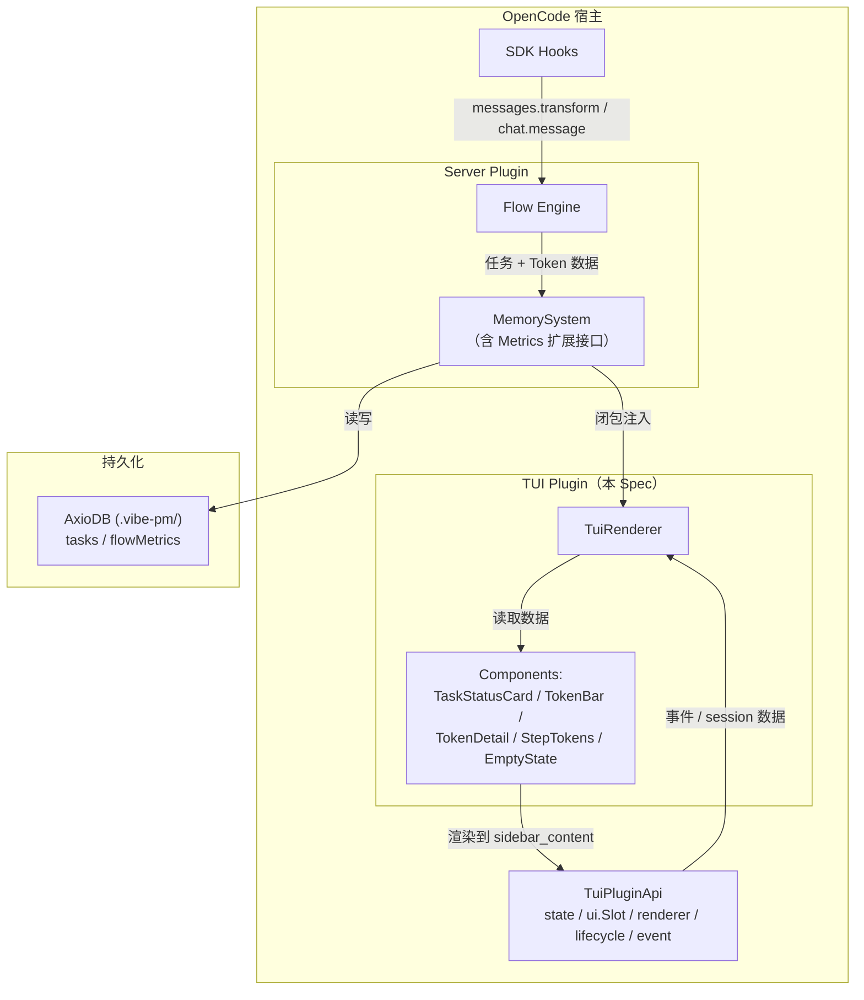
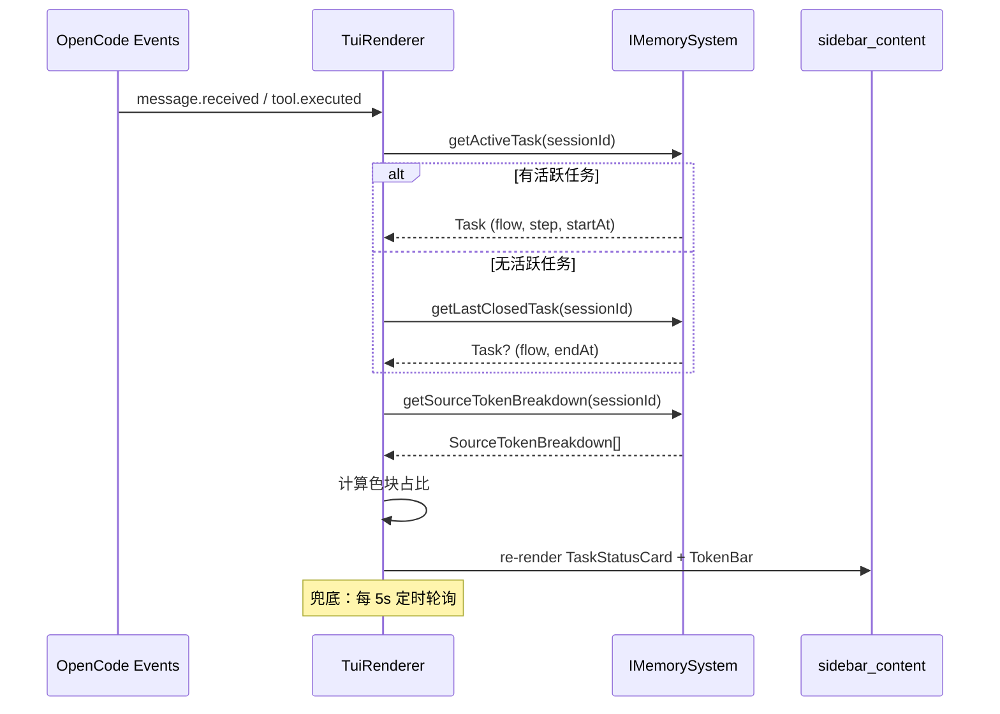

# TUI 扩展

**创建日期**: 2026-06-17
**状态**: Draft
**输入来源**: 用户需求
**最后更新**: 2026-06-17 — 拆分为 TUI（本 Spec）+ Metrics 收集（独立 Spec）；布局改为单行色块占比条 + 折叠详情

---

## 需求背景

vibe-pm 当前通过纯文本 tool 返回值向用户展示任务状态（`[vibe-pm] ✅ 任务已创建` 格式），信息密度低、无结构、不可交互。用户需要离开当前对话上下文才能查看全局任务进展和 Token 消耗。

参考 magic-context 插件的 TUI 侧边栏设计，本 Spec 定义 vibe-pm 的 OpenCode TUI 扩展：在侧边栏面板中实时展示任务状态、流程进展、Token 分布。

> **依赖**: 本 Spec 依赖 [vibe-pm-metrics-collection.md](./vibe-pm-metrics-collection.md) 提供的数据接口（`IMemorySystem` 扩展方法、`FlowMetrics.tokensBySource`、`Task.endAt`）。

---

## 用例场景与用户故事

### 用户故事 1 — 查看当前任务进展（优先级：P1）

用户发起 `/pm-*` 命令启动任务后，希望在侧边栏即时看到：当前执行哪个流程、处于第几步、已耗时多久、关联的 Spec/Plan 文档。

**优先原因**: 这是 TUI 扩展的核心价值——让用户无需离开对话即掌握任务状态。

**独立验证**: 执行 `/pm-research` 后，侧边栏面板显示 "流程: research → S5: 执行环节，已耗时 12min"。

**验收场景**:

1. **Given** Session 中有一个活跃任务（flow=research, step=S3），**When** 打开 TUI 侧边栏，**Then** 面板显示流程名、当前步骤名、开始时间、已耗时
2. **Given** 任务刚通过 `/pm-task-set-step` 跳到 S4，**When** 侧边栏刷新，**Then** 步骤名立即更新为 S4 对应的步骤名
3. **Given** 任务通过 `/pm-task-close` 关闭，**When** 侧边栏刷新，**Then** 显示结束时间和总耗时

### 用户故事 2 — 无活跃任务时回退显示（优先级：P1）

当 Session 中没有活跃任务，但之前有过任务时，侧边栏应自动显示最近一个结束任务的信息，让用户了解上一轮工作的上下文。

**优先原因**: 用户在任务之间切换时，需要快速回顾上一步做了什么。

**独立验证**: 关闭活跃任务后，侧边栏显示 "上一任务: bug-fix，耗时 45min，已于 15:30 结束"。

**验收场景**:

1. **Given** Session 中有 1 个已关闭任务、无活跃任务，**When** 打开侧边栏，**Then** 显示该结束任务的流程名、耗时、结束时间
2. **Given** Session 中有 3 个已关闭任务、无活跃任务，**When** 打开侧边栏，**Then** 显示最近结束的任务（按 endAt 降序取第一个）
3. **Given** Session 从未创建过任何任务，**When** 打开侧边栏，**Then** 显示 "暂无任务" 空状态提示

### 用户故事 3 — Session Token 分布（优先级：P2）

侧边栏以单行色块占比条展示当前 Session 的 Token 使用分布，点击展开箭头查看各来源的百分比详情。

**优先原因**: Token 分布是 vibe-pm 上下文管理核心指标的直接可视化，让用户理解每轮对话的成本构成。

**独立验证**: 经过多轮对话后，侧边栏显示一行 6 色占比条（总 12.5K），点击展开后可看到 System(12%) / FlowControl(8%) / User(15%) / Assistant(40%) / Tool(20%) / Reasoning(5%)。

**验收场景**:

1. **Given** Session 刚启动、无消息，**When** 查看侧边栏，**Then** 占比条全空，显示总 Token=0
2. **Given** 用户发送一条消息、LLM 回复带有 tool calls，**When** 侧边栏刷新，**Then** 占比条对应色块增长，总量更新
3. **Given** 占比条下的详情折叠中，**When** 点击 ▼ 展开箭头，**Then** 显示 6 种来源各自的 Token 数和百分比

### 用户故事 4 — 按步骤的 Token 消耗（优先级：P3）

侧边栏可展开查看当前流程各步骤的累计 Token 消耗明细，帮助用户识别哪个步骤消耗了最多上下文。默认折叠。

**优先原因**: 为流程优化提供数据支撑，目前主要面向高级用户和流程设计者。

**独立验证**: 点击步骤 Token 的 ▶ 展开箭头后，显示 S1-S4 各步骤的进入次数和累计 Token。

**验收场景**:

1. **Given** 当前任务执行到 S3，**When** 展开步骤 Token 详情，**Then** 显示 S1/S2/S3 各自的进入次数和累计 Token
2. **Given** 同一 Session 中同一步骤进入多次（如 S4 反复访谈），**When** 展开步骤 Token，**Then** 显示进入次数和累计 Token（聚合值）

---

## 设计要点

### 领域模型

| 实体 | 属性 | 关系 |
|------|------|------|
| **TuiPanel** | `components[]`, `refreshInterval` | 通过闭包注入 IMemorySystem；通过 TuiPluginApi 渲染 |
| **TaskStatusCard** | `flow`, `currentStep`, `startAt`, `endAt?`, `elapsed` | 关联 1 个 Task 实体 |
| **TokenBar** | `segments: ColorSegment[]`, `totalTokens` | 聚合自 SourceTokenBreakdown[] |
| **ColorSegment** | `source: TokenSource`, `tokens: number`, `percentage: number`, `color: RGBA` | 每种来源固定颜色 |
| **TokenDetail** | `bySource: SourceBreakdown[]`, `byStep: StepBreakdown[]` | 聚合自 FlowMetrics，默认折叠 |
| **Collapsible** | `expanded: boolean`, `toggle()` | 可展开/折叠容器组件 |

#### 颜色映射（固定，参考 magic-context 冷暖色调设计）

| 来源 | 颜色 | 调性 |
|------|------|------|
| System | 冷蓝 `#4A90D9` | 冷色（结构化注入） |
| FlowControl | 冷青 `#36B0C8` | 冷色（结构化注入） |
| User | 暖橙 `#F5A623` | 暖色（用户流量） |
| Assistant | 暖绿 `#7ED321` | 暖色（LLM 输出） |
| Tool | 暖紫 `#B07BED` | 暖色（工具流量） |
| Reasoning | 暖灰 `#9B9B9B` | 暖色（推理开销） |

### 数据流架构



### 关键路径：TUI 渲染



### TUI 组件布局设计

```
┌─────────────────────────────────┐
│  📋 vibe-pm                     │
├─────────────────────────────────┤
│  流程: research                 │
│  步骤: S5 — 执行环节            │  ← TaskStatusCard
│  开始: 14:30  耗时: 22min       │
│  Spec: docs/spec/vibe-pm-xxx.md │
├─────────────────────────────────┤
│  Token 分布 (来源)         12.5K│
│ ┌──┬───┬───┬──────┬────┬──┐    │
│ │蓝│青 │橙 │ 绿   │ 紫 │灰│    │  ← 单行色块占比条
│ └──┴───┴───┴──────┴────┴──┘    │    每块宽度 = 该来源占比
│ ▼ 详情                          │  ← 点击展开/折叠
│   System      1.5K (12%)        │
│   FlowCtrl    1.0K ( 8%)        │
│   User        1.9K (15%)        │
│   Assistant   5.0K (40%)        │
│   Tool        2.5K (20%)        │
│   Reasoning   0.6K ( 5%)        │
├─────────────────────────────────┤
│ ▶ 步骤 Token                    │  ← 默认折叠，点击展开
│   (展开后显示步骤柱状图)         │
└─────────────────────────────────┘
```

### 展开后的步骤 Token 区域

```
│ ▼ 步骤 Token                    │
│   S1 ████  1.2K (2次进入)       │
│   S2 ████████  2.8K (1次进入)   │
│   S3 ██  0.5K (1次进入)         │
│   S4 ██████████  5.0K (3次进入) │
│   S5 ██████  3.0K (1次进入)     │
```

### 模块结构

```
src/tui/                          # 新建：TUI 扩展模块
├── tui-plugin.ts                 # createTuiPlugin(memory: IMemorySystem): TuiPlugin 工厂函数
├── components/                   # TUI 组件（@opentui/solid JSX）
│   ├── task-status.tsx           # TaskStatusCard 组件
│   ├── token-bar.tsx             # TokenBar 组件（单行色块占比条）
│   ├── token-detail.tsx          # TokenDetail 组件（可折叠的来源百分比列表）
│   ├── step-tokens.tsx           # StepTokens 组件（可折叠的步骤 Token 柱状图）
│   ├── collapsible.tsx           # Collapsible 通用组件（▶/▼ 切换 + 内容区）
│   └── empty-state.tsx           # EmptyState 组件
├── hooks/                        # TUI 数据 hooks
│   ├── use-task-status.ts        # 任务状态：useTaskStatus(sessionId) → TaskStatusData
│   └── use-token-data.ts         # Token 数据：useTokenData(sessionId) → TokenData
└── index.ts                      # 导出 TuiPluginModule { tui }
```

> **注意**: Token 计数模块（`src/token/`）和 IMemorySystem 扩展接口定义在 [vibe-pm-metrics-collection.md](./vibe-pm-metrics-collection.md) 中，不属于本 Spec 范围。

### 组件接口设计

```typescript
// ─── Task Status ───

interface TaskStatusData {
  type: "active" | "last" | "empty";
  flow?: string;
  currentStep?: string;
  currentStepName?: string;
  startAt?: string;
  endAt?: string;
  elapsed?: string;       // 格式化耗时 "22min" / "1h 15min"
  specRef?: string;
  planRef?: string;
}

function useTaskStatus(
  memory: IMemorySystem,
  sessionId: string,
): () => TaskStatusData;

// ─── Token Data ───

interface TokenData {
  totalTokens: number;
  sourceBreakdown: SourceTokenBreakdown[];
  stepBreakdown: StepTokenBreakdown[];
}

function useTokenData(
  memory: IMemorySystem,
  sessionId: string,
): () => TokenData;

// ─── Color Mapping ───

const SOURCE_COLORS: Record<TokenSource, RGBA> = {
  System:      { r: 0.29, g: 0.56, b: 0.85, a: 1 },  // #4A90D9
  FlowControl: { r: 0.21, g: 0.69, b: 0.78, a: 1 },  // #36B0C8
  User:        { r: 0.96, g: 0.65, b: 0.14, a: 1 },  // #F5A623
  Assistant:   { r: 0.49, g: 0.83, b: 0.13, a: 1 },  // #7ED321
  Tool:        { r: 0.69, g: 0.48, b: 0.93, a: 1 },  // #B07BED
  Reasoning:   { r: 0.61, g: 0.61, b: 0.61, a: 1 },  // #9B9B9B
};
```

### 可配置项

| 配置项 | 默认值 | 说明 |
|--------|--------|------|
| `tui.refreshInterval` | `5000` | 定时轮询间隔（ms），0 表示仅事件驱动 |
| `tui.expandTokenDetail` | `false` | Token 百分比详情默认是否展开 |
| `tui.expandStepTokens` | `false` | 步骤 Token 详情默认是否展开 |
| `tui.showEmptyState` | `true` | 无任务时是否显示空状态面板 |

---

## 边界与错误情况

| 场景 | 预期行为 |
|------|---------|
| MemorySystem（闭包注入）为 null | TUI 显示 "数据层不可用" 错误状态，不影响 OpenCode 正常运行 |
| Session 中有活跃任务但无 FlowMetrics | 任务状态卡片正常显示；TokenBar 显示全空占比条 + 总量 0 |
| IMemorySystem 查询返回空数组 | TokenBar 显示空占比条，TokenDetail 显示 "暂无数据" |
| 定时轮询时 MemorySystem 查询异常 | 保持上次成功数据不变，日志记录错误，下次轮询重试 |
| Session 从未有过任何任务 | 显示空状态 "暂无 vibe-pm 任务" |
| 同一 Session 有多个活跃任务（异常态） | 显示第一个活跃任务，日志记录警告 |
| TUI 模块在非 TUI 环境加载（headless/Web） | 静默跳过，不在无 TUI 环境报错或渲染 |
| 来源分布中某些来源为 0 | 对应色块宽度为 0，详情中该行显示 0 (0%) |
| Task 的 flow 字段对应 Flow 文件已被删除 | 流程名正常显示（来自 Task 记录），不尝试读取已删除文件 |
| sidebar_content slot 不可用（SDK 变更） | TuiPlugin 注册时不崩溃，toast 提示用户 |

---

## 测试用例

### tui/tui-plugin.test.ts

- **测试文件**: `tests/tui/tui-plugin.test.ts`
- **关联设计文档**: `docs/spec/vibe-pm-tui-extension.md`
- **Setup/Teardown**: Mock TuiPluginApi（含 state.session / ui.Slot / event / renderer / lifecycle），创建 MemorySystem 临时实例并注入

| 动作指令 | 测试方法 | Given | When | Then | Notes |
|----------|----------|-------|------|------|-------|
| 新增 | `createTuiPlugin` | 注入 MemorySystem 实例 | 调用 createTuiPlugin(memory) | 返回符合 TuiPlugin 签名的函数 | |
| 新增 | TaskStatusCard 活跃 | 活跃任务 research/S5/startAt=now | 组件渲染 | 流程名/步骤/耗时均正确 | |
| 新增 | TaskStatusCard 上一任务 | 无活跃任务，有 1 个已关闭任务 | 组件渲染 | 显示 "上一任务" + 流程名 + 耗时 | |
| 新增 | TaskStatusCard 空状态 | Session 无任何任务 | 组件渲染 | 显示 "暂无 vibe-pm 任务" | |
| 新增 | TokenBar 渲染 | 6 种来源均有非零 token | 组件渲染 | 6 个色块可见，总宽度 = 100% | |
| 新增 | TokenBar 空数据 | 所有来源 token 为 0 | 组件渲染 | 占比条全空，总 Token=0 | |
| 新增 | TokenDetail 折叠/展开 | TokenDetail 默认 collapsed | 点击 toggle | ▼→▶ 切换，详情显示/隐藏 | |
| 新增 | StepTokens 折叠/展开 | StepTokens 默认 collapsed | 点击 toggle 展开 | 各步骤 token 和进入次数正确 | |
| 新增 | 事件刷新 | 活跃任务 step=S3 | 模拟 message.received 事件 | 侧边栏数据更新为最新 | |
| 新增 | 定时轮询 | refreshInterval=100ms | 等待 150ms | 侧边栏至少刷新 1 次 | |
| 新增 | 非 TUI 环境 | TuiPluginApi 为 null/missing | 加载 TuiPluginModule | 不崩溃，不渲染 | |

### tui/components/collapsible.test.ts

- **测试文件**: `tests/tui/collapsible.test.ts`
- **关联设计文档**: `docs/spec/vibe-pm-tui-extension.md`
- **Setup/Teardown**: 纯组件测试，无外部依赖

| 动作指令 | 测试方法 | Given | When | Then | Notes |
|----------|----------|-------|------|------|-------|
| 新增 | 默认折叠 | collapsed=true | 首次渲染 | 显示 ▶ + 标题，内容隐藏 | |
| 新增 | 点击展开 | collapsed=true | 点击 toggle | 显示 ▼ + 标题，内容可见 | |
| 新增 | 再次点击折叠 | collapsed=false | 点击 toggle | 显示 ▶ + 标题，内容隐藏 | |

---

## 约束与限制

### 技术约束

| 约束 | 说明 |
|------|------|
| TypeScript strict mode | 所有新增代码必须通过 strict 类型检查 |
| @opencode-ai/plugin SDK | TUI Plugin 必须通过 `TuiPluginModule` 格式导出，使用 `@opentui/solid` JSX 渲染 |
| 渲染框架 | 必须使用 `@opentui/solid`（OpenCode TUI 的渲染层），禁止引入额外 UI 框架 |
| 主题集成 | 颜色定义使用 `api.theme.current` 获取基础色，SOURCE_COLORS 在 Spec 中预定义固定值 |

### 业务约束

| 约束 | 说明 |
|------|------|
| 数据层解耦 | TUI 不直接操作 AxioDB，所有数据通过 IMemorySystem 接口读取 |
| 异步安全 | TUI 渲染不应阻塞 OpenCode 主线程，所有 I/O 操作异步化 |
| 降级策略 | IMemorySystem 不可用时 TUI 显示错误状态，不抛异常到 OpenCode 宿主 |
| 非 TUI 兼容 | TUI 模块在 headless/Web 模式静默跳过，确保不影响非 TUI 用户 |
| 独立部署 | TuiPluginModule 通过 `tui.json` / `tui.jsonc` 独立注册，不修改 server plugin 的 `opencode.json` |

### 已知风险

| 风险 | 影响 | 缓解措施 |
|------|------|---------|
| IMemorySystem 接口变更 | TUI 依赖的查询方法签名变化导致编译失败 | 接口定义在 Metrics Spec 中，两 Spec 保持同步更新 |
| sidebar_content slot 宽度有限 | 超长步骤名/Token 数值可能截断 | 省略号截断 + hover tooltip（如 SDK 支持） |
| 色块占比条在极小宽度下无法区分 | 占比 < 2% 的来源不可见 | 合并为 "Other" 或设置最小宽度 1px |
| OpenCode SDK 升级导致 TuiPluginApi 变更 | TUI 模块编译/运行失败 | 锁定 SDK 主版本，升级前先验证兼容性 |

### 影响范围

| 模块 | 变更类型 | 说明 |
|------|---------|------|
| `src/tui/` | 新建 | TUI 扩展完整模块（本 Spec） |
| `src/memory/types.ts` | 无变化 | 依赖 Metrics Spec 的扩展 |
| `src/memory/memory-system.ts` | 无变化 | 依赖 Metrics Spec 的扩展 |
| `src/token/` | 无变化 | TokenCounter 属于 Metrics Spec |
| `src/core/plugin.ts` | 无变化 | TUI 独立模块，通过闭包注入 |
| `package.json` | 无变化 | 无新依赖 |

---

## 开发进度

> 本部分在开发过程中持续更新。

### 已实现功能

- [x] P1: TaskStatusCard — 任务状态卡片（活跃任务 + 上一任务 + 空状态）
- [x] P2: TokenBar — 单行色块占比条组件
- [x] P2: TokenDetail — 可折叠来源百分比详情
- [x] P3: StepTokens — 可折叠步骤 Token 柱状图
- [x] Collapsible 通用组件（▶/▼ 切换，useKeyboard 控制）
- [x] loadTaskStatus / loadTokenData 数据加载函数（替代 use* hooks）
- [x] createTuiPlugin 工厂函数 + sidebar_content 注册（TuiSlotPlugin order=150）
- [x] 事件驱动（message.updated/session.updated + 150ms 防抖）+ 定时轮询（5s）刷新机制
- [x] SOURCE_COLORS 颜色映射（RGBA.fromInts）
- [x] 非 TUI 环境静默降级

### 未实现功能

- （全部完成）

### 已知问题/风险

- `void err` 在 tui-plugin.ts 吞掉初始化错误无日志（🟢 低危，用户选择忽略）
- 来自"约束与限制"章节
