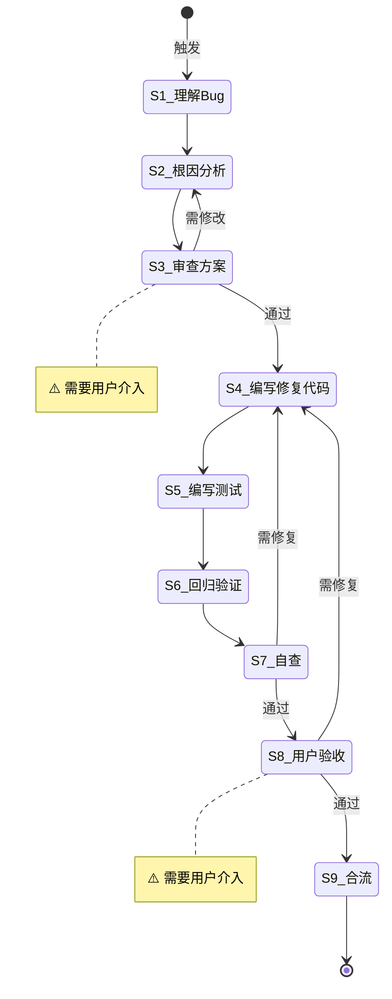

# Bug 修复

**Template ID**: `bug-fix`
**Category**: maintenance
**Description**: Bug 修复标准化流程（根因分析 → 修复 → 回归 → 验收）
**Version**: 1.0.0

---

## 适用场景

- 生产环境或开发阶段的 Bug 修复
- 需要根因分析的非琐碎修复

---

## 输入要求

| 输入项 | 必填 | 说明 |
|--------|------|------|
| Bug 描述 | 是 | 现象、复现步骤、影响范围 |
| 相关代码/日志 | 否 | 帮助定位问题的信息 |

---

## 默认交付清单

- 根因分析报告
- 修复代码 + 回归测试
- 交付报告

---

## 状态机

---

## 任务步骤

### S1: 理解 Bug 描述

**目标**：准确理解 Bug 现象、复现条件和影响范围。
**执行 Agent**：Assistant

1. 阅读 Bug 描述、日志、截图
2. 确认复现步骤
3. 评估影响范围（功能、数据、安全）

**完成后**：自动进入 S2

---

### S2: 根因分析

**目标**：定位根因，提出修复方案。
**执行 Agent**：Assistant

1. 阅读相关源码
2. 追踪调用链路
3. 定位根因代码行
4. 提出修复方案（含替代方案和风险评估）

**完成后**：自动进入 S3

---

### S3: [Human-in-loop] 审查方案 ⚠️

**目标**：用户审查修复方案。
**执行 Agent**：—

1. 展示：根因、修复方案、替代方案、风险评估
2. 使用 confirm 工具等待确认

**完成后**：通过 → S4，需修改 → S2

---

### S4: 编写修复代码

**目标**：按确认方案编写修复。
**执行 Agent**：Assistant
**引用 Regulation**：coding_style.md

1. 最小化修复——只改根因代码
2. 不引入无关重构
3. tsc --noEmit 验证

**完成后**：自动进入 S5

---

### S5: 编写测试

**目标**：编写回归测试防止复发。
**执行 Agent**：Assistant
**引用 Regulation**：coding_style.md

1. 覆盖复现场景
2. 覆盖边界条件
3. 覆盖相关功能（防止副作用）

**完成后**：自动进入 S6

---

### S6: 回归验证

**目标**：确认修复有效且无回归。
**执行 Agent**：Assistant

1. 运行全部测试
2. 验证原 Bug 场景不再复现
3. 检查相关功能正常

**完成后**：自动进入 S7

---

### S7: 自查

**目标**：全面自检修复质量。
**执行 Agent**：Assistant
**引用 Regulation**：checklist.md

1. 修复是否符合最小变更原则
2. 测试是否全部通过
3. 有无引入新问题
4. 文档是否需要更新

**完成后**：通过 → S8，需修复 → S4

---

### S8: [Human-in-loop] 用户验收 ⚠️

**目标**：用户确认修复效果。
**执行 Agent**：—

1. 展示修复报告（根因、改动、测试结果）
2. 使用 confirm 工具等待确认

**完成后**：通过 → S9，需修复 → S4

---

### S9: 合流

**目标**：最终验证并提交。
**执行 Agent**：Assistant
**引用 Regulation**：checklist.md

1. 运行最终 tsc + 测试
2. 更新 Spec 文档（如需要）
3. 提示 commit 信息

**完成后**：任务结束
