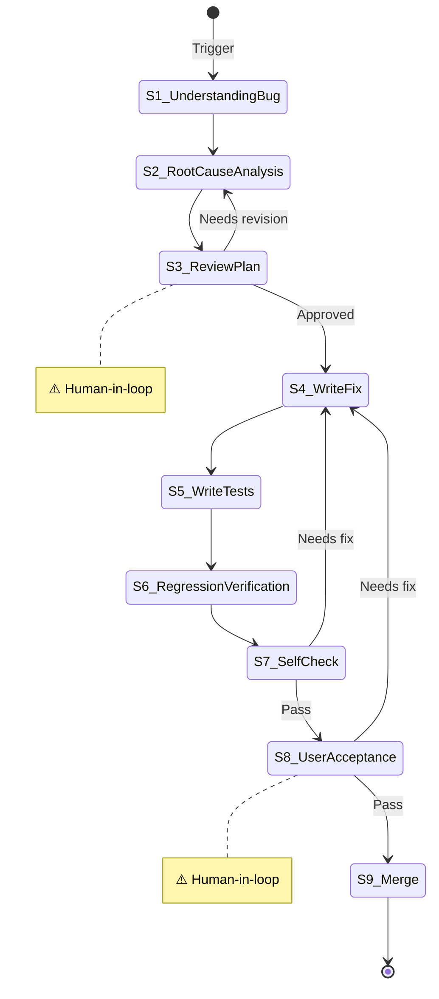

# Bug Fix

**Template ID**: `bug-fix`
**Category**: maintenance
**Description**: Standardized bug fix workflow (root cause analysis → fix → regression → acceptance)
**Command**: `/pm-bug-fix`
**Version**: 1.0.0

---

## Applicable Scenarios

- Bug fixes in production or development environments
- Non-trivial fixes requiring root cause analysis

---

## Input Requirements

| Input | Required | Description |
|--------|------|------|
| Bug Description | Yes | Symptoms, reproduction steps, impact scope |
| Related Code/Logs | No | Information to help locate the issue |

---

## Default Deliverables

- Root cause analysis report
- Fix code + regression tests
- Delivery report

---

## State Machine



---

## Task Steps

### S1: Understand the Bug

**Goal**: Accurately understand the bug symptoms, reproduction conditions, and impact scope.

1. Read the bug description, logs, and screenshots
2. Confirm reproduction steps
3. If the description is unclear, use the `question` tool to ask for clarification
4. Assess impact scope (functionality, data, security)

**On completion**: Automatically advance to S2

---

### S2: Root Cause Analysis

**Goal**: Identify the root cause and propose a fix plan.

1. Read relevant source code
2. Trace the call chain
3. Analyze and identify the root cause
4. Analyze test case coverage:
   - Search for existing test cases related to the affected code (`{affected_module}_test.go`)
   - Determine whether existing tests cover this abnormal path:
     - If **covered**, explain why the existing tests did not catch this bug (assertions not precise enough? mock data too ideal? tests skipped?)
     - If **not covered**, describe which test scenario is missing
   - Determine whether new or modified test cases are needed after the fix
5. Propose a fix plan: follow the project constitution's "Code Quality First" principle — strive for elegance, directness, and readable, maintainable code

```markdown
## Root Cause Analysis

- **Symptom**: {what the user observed}
- **Trigger Condition**: {under what conditions it triggers}
- **Root Cause**: {code-level reason for the failure, citing specific file and line numbers}
- **Impact Scope**: {which features / which users are affected}


```

**On completion**: Automatically advance to S3

---

### S3: [Human-in-loop] Review Fix Plan ⚠️

**Goal**: User reviews the fix plan.

1. Present: root cause, fix plan, alternatives, risk assessment
2. Use the `confirm` tool to wait for confirmation

**On completion**: Approved → S4, Needs revision → S2

---

### S4: Write the Fix

**Goal**: Write the fix according to the approved plan.
**Referenced Regulation**: coding_style.md

1. Minimal fix — only change the root cause code
2. Do not introduce unrelated refactoring
3. Run project build / type check to verify

**On completion**: Automatically advance to S5

---

### S5: Write Tests

**Goal**: Write regression tests to prevent recurrence.
**Referenced Regulation**: coding_style.md

1. Cover the reproduction scenario
2. Cover edge cases
3. Cover related functionality (prevent side effects)

**On completion**: Automatically advance to S6

---

### S6: Regression Verification

**Goal**: Confirm the fix is effective and there is no regression.

1. Run all tests
2. Verify the original bug scenario no longer reproduces
3. Check that related functionality works correctly

**On completion**: Automatically advance to S7

---

### S7: Self-Check

**Goal**: Thoroughly self-review fix quality.
**Referenced Regulation**: checklist.md

1. Does the fix comply with the code quality first principle?
2. Do all tests pass?
3. Have any new issues been introduced?
4. Does documentation need updating?

**On completion**: Pass → S8, Needs fix → S4

---

### S8: [Human-in-loop] User Acceptance ⚠️

**Goal**: User confirms the fix result.

1. Present the fix report (root cause, changes, test results)
2. Use the `confirm` tool to wait for confirmation

**On completion**: Approved → S9, Needs fix → S4

---

### S9: Merge

**Goal**: Final verification, wrap-up documentation, ask whether to commit.

1. Run final build check and tests
2. Update Spec and Plan documents (if needed)
3. Use the `question` tool to ask the user: "Execute `git commit`?"
   - If the user selects "Yes": run `git add -A && git commit`, using the fix summary as the commit message
   - If the user selects "No": skip commit
   - ⚠️ User selection does not affect task completion

**On completion**: Task ends
