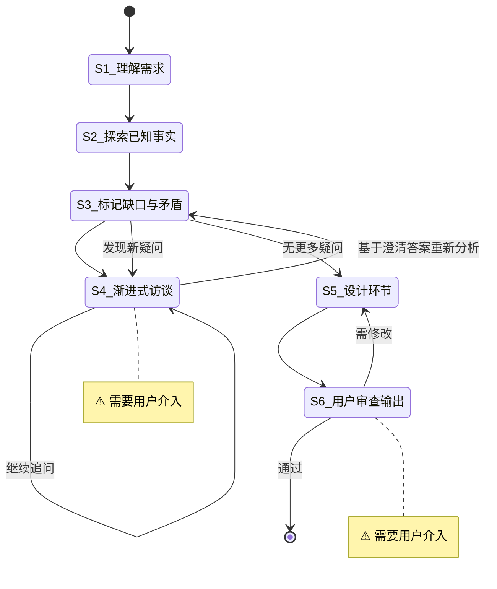

# Spec 设计

**Template ID**: `design-spec`
**Category**: design
**Description**: 从需求到 Spec 文档的渐进式设计流程（理解/探索/访谈/设计/审查，6步）
**Command**: `/pm-design-spec`
**Version**: 1.0.0

---

## 适用场景

- 从零设计新功能的 Spec 文档
- 将模糊需求转化为结构化设计规格
- 需要多轮用户访谈才能明确的复杂设计任务

**不适用**：已有 Spec 的增量修改（使用 spec-driven-dev）、纯代码调研（使用 research）。

---

## 输入要求

| 输入项 | 必填 | 说明 |
|--------|------|------|
| 需求描述 | 是 | 功能设想、问题描述、目标概要 |
| 约束条件 | 否 | 已知的技术/业务限制 |

---

## 默认交付清单

- Spec 文档（格式参考 `docs/template/spec-template.md`）
- 如有必要，附带调研笔记或决策记录

---

## 状态机

---

## 任务步骤

### S1: 理解需求

**目标**：准确理解用户输入的核心意图和期望产出。

1. 逐段阅读用户提供的需求描述
2. 提取核心意图——要解决什么问题？要达成什么目标？
3. 初步识别需求中已明确的部分和模糊地带
4. 确认输出范围——是完整的 Feature Spec、系统设计，还是特定模块的设计

**完成后**：自动进入 S2

---

### S2: 探索已知事实

**目标**：搜索项目内外部相关信息，建立设计所需的知识基线。

1. 搜索项目内已有的相关文档、代码、Spec（使用 explore agent 并行搜索）
2. 搜索外部参考资料——最佳实践、开源实现、技术文档（使用 librarian agent）
3. 记录关键发现：
   - 现有系统的约束和能力边界
   - 可复用的模块或接口
   - 已知的技术限制或依赖
4. 汇总发现，建立知识基线——作为后续设计的"已知事实"依据

**引用工具**：explore / librarian Agent（按需并行）

**完成后**：自动进入 S3

---

### S3: 标记缺口与矛盾

**目标**：系统性地找出所有模糊、缺失、冲突的设计点。

1. 对照输入需求与 S2 知识基线，标记三类问题：
   - **缺失项**：设计中完全空白的核心部分
   - **模糊项**：描述不够具体、存在歧义的内容
   - **矛盾项**：需求意图与已知事实冲突的地方
2. 按影响程度排序——阻塞性问题优先（先解决会影响后续设计的缺口）
3. 为 S4 准备逐题访谈列表——每个问题应聚焦、可回答
4. **访谈后重新分析**：从 S4 返回后，基于已澄清的答案，重新审视 S3 原始标记列表：
   - 澄清的答案是否引入了新的模糊点？
   - 已澄清的结论与现有知识基线有无新矛盾？
   - 是否有原先未发现的缺失项？
5. 若发现新疑问 → 整理新问题列表，返回 S4 继续访谈；若无新疑问 → 进入 S5

**完成后**：无新疑问 → 自动进入 S5；有新疑问 → 返回 S4

---

### S4: [Human-in-loop] 渐进式访谈 ⚠️

> **⚠️ 本步骤需要用户介入。** 使用 `question` / `confirm` 阻塞式工具向用户提问——每次只问 1 个问题。

**目标**：通过逐题提问澄清所有模糊点和矛盾点。

1. 使用 `question` / `confirm` 阻塞式工具发出问题——每次只问 1 个问题
2. 等待用户回复后才能问下一个
3. 如果用户回答引出新方向，先深入追问，再切回原路线
4. 循环直到用户确认「没有其他需要澄清的问题」
5. 访谈结束前，基于已澄清的需求预估 Spec 覆盖范围：
   - 若范围明显过大（涉及 3 个以上独立模块/子系统），建议采用分解设计
   - 使用 `question` 工具询问用户：「该 Spec 范围较大（涉及 {N} 个模块），是否采用分解设计——产出一个总览 Spec + 多个独立功能的详细设计 Spec？」
   - 若用户同意 → 标记「S5 采用分解设计」；若不同意 → 按常规单文档设计
6. **绝不**在普通文本中批量抛出多个问题

**完成后**：用户确认「不再追问」→ 返回 S3 重新分析

---

### S5: 设计环节

**目标**：基于澄清后的需求，产出结构化的 Spec 文档。

1. 整理 S1-S4 的全部信息：
   - 明确的需求背景和目标
   - 用户访谈中的关键决策和澄清结果
   - S2 收集到的技术约束和已知事实
2. 按照 `docs/template/spec-template.md` 的组织结构填充各章节：
   - 需求背景
   - 用例场景与用户故事（标注优先级 P1/P2/P3）
   - 设计要点（领域模型、关键路径、条件分支、接口设计、可配置项）
   - 边界与错误情况
   - 约束与限制（技术约束、业务约束、已知风险、影响范围）
3. 若 S4 中用户选择了分解设计：
   - 产出总览 Spec（主 Spec），"设计要点"仅描述模块分层架构和模块间接口
   - 为每个独立功能点产出独立的详细设计 Spec（完整章节）
   - 子 Spec 保存到 `/docs/spec/{parent-feature}/` 目录下，文件命名 `spec-{feature-name}.md`
   - 在主 Spec 中使用「分解索引」表格指向各详细设计 Spec
4. 输出 Spec 文档：
   - 常规设计 → `/docs/spec/{feature-name}.md`
   - 分解设计 → 主 Spec 保存为 `/docs/spec/{feature-name}/spec-{feature-name}.md`，子 Spec 保存到同目录
5. 不适用于当前设计的章节标注「不适用」后保留骨架
6. 标注设计中仍待决策的开放项（如有）

**引用文档**：`docs/template/spec-template.md`

**完成后**：自动进入 S6

---

### S6: [Human-in-loop] 用户审查输出 ⚠️

> **⚠️ 本步骤需要用户介入。** 用户审查 Spec 文档，确认后完成。

**目标**：用户审查 Spec 文档，确认设计满足需求。

1. 展示 Spec 文档摘要——核心设计决策、关键用户故事、主要约束和风险
2. 使用 `confirm` 工具等待用户对 Spec 整体审查确认
3. 审查通过后，使用 `question` 工具询问用户：「是否执行 `git commit`？」
   - 若用户选择「是」：执行 `git add -A && git commit`，使用本次 Spec 设计的总结作为 commit message
   - 若用户选择「否」：跳过提交
   - ⚠️ 用户选择不影响任务结束

> ⚠️ **重要**：Spec 设计到 S6 为止。本流程的交付物是 Spec 文档，**不进入代码实现**。后续如需实现，应通过 `/pm-spec-driven-dev` 或 `/pm-new-feature` 启动独立任务。如需将 Spec 拆解为分步计划，使用 `/pm-plan`。

**状态流转**：
- 用户通过 → 合流结束
- 用户要求修改 → 退回 S5

**完成后**：任务结束

---

> **设计原则**：
> - **精准优先于数量**：Spec 只写入确定的信息，不确定的标注为「待决策」
> - **LLM 判断流转**：模型根据用户反馈决定状态转换
> - **关键节点人机协作**：S4 渐进式访谈 + S6 审查输出，两处用户把关
