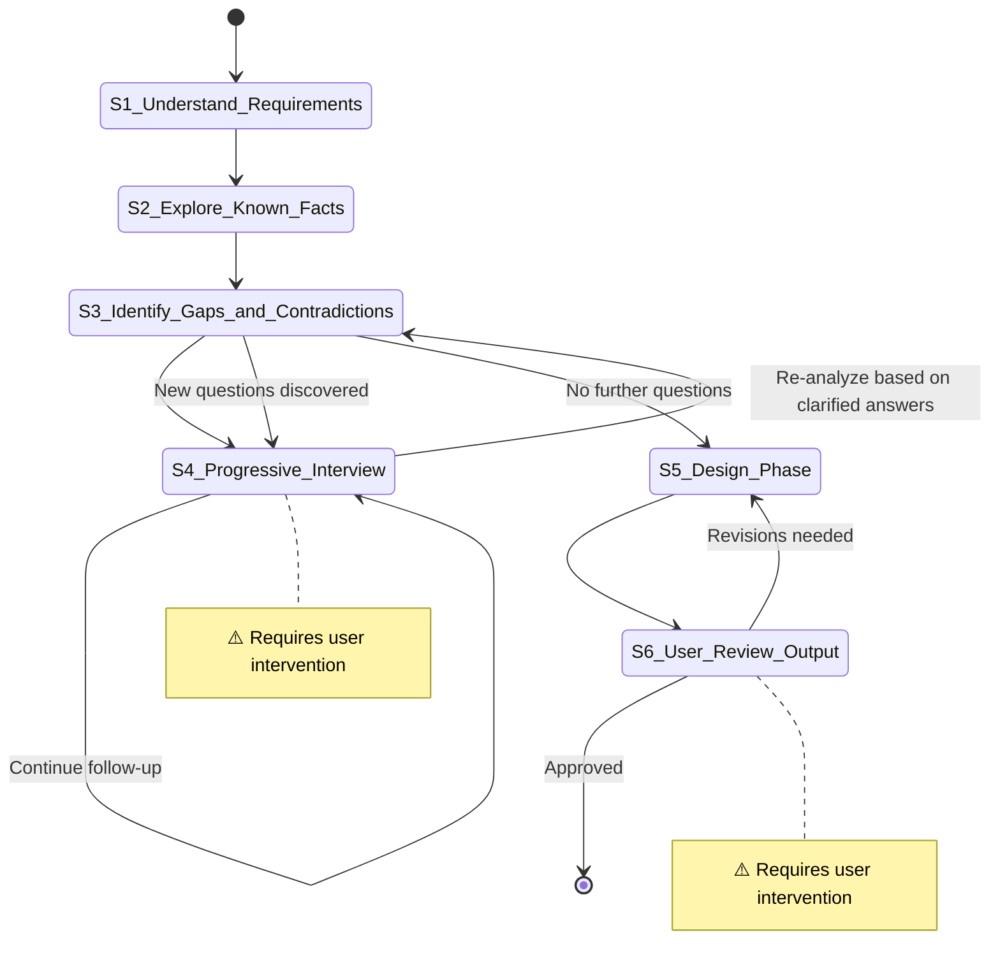

# Spec Design

**Template ID**: `design-spec`
**Category**: design
**Description**: Progressive design workflow from requirements to Spec documents (understand / explore / interview / design / review, 6 steps)
**Command**: `/pm-design-spec`
**Version**: 1.0.0

---

## Applicable Scenarios

- Designing a Spec document for a new feature from scratch
- Translating vague requirements into structured design specifications
- Complex design tasks requiring multiple rounds of user interviews to clarify

**Not applicable**: Incremental modifications to an existing Spec (use spec-driven-dev); pure code research (use research).

---

## Input Requirements

| Input Item | Required | Description |
|------------|----------|-------------|
| Requirement Description | Yes | Feature concept, problem statement, goal summary |
| Constraints | No | Known technical/business constraints |

---

## Default Deliverables Checklist

- Spec document (format reference: `regulation/spec-template.md`)
- Research notes or decision records if necessary

---

## State Machine

---

## Task Steps

### S1: Understand Requirements

**Goal**: Accurately understand the core intent and expected output of the user's input.

1. Read the user-provided requirement description section by section
2. Extract the core intent — what problem to solve? What goal to achieve?
3. Preliminarily identify what is already clear in the requirements and what remains vague
4. Confirm the output scope — is it a complete Feature Spec, system design, or a design for a specific module?

**Upon completion**: Automatically proceed to S2

---

### S2: Explore Known Facts

**Goal**: Search for internal and external project-related information to establish the knowledge baseline needed for design.

1. Search for existing relevant documents, code, and specs within the project (using explore agent in parallel)
2. Search for external references — best practices, open-source implementations, technical documentation (using librarian agent)
3. Record key findings:
   - Constraints and capability boundaries of the existing system
   - Reusable modules or interfaces
   - Known technical limitations or dependencies
4. Summarize findings and establish a knowledge baseline — serving as the foundation of "known facts" for subsequent design

**Reference tools**: explore / librarian Agent (in parallel as needed)

**Upon completion**: Automatically proceed to S3

---

### S3: Identify Gaps and Contradictions

**Goal**: Systematically identify all vague, missing, or conflicting design points.

1. Cross-reference the input requirements with the S2 knowledge baseline to flag three categories of issues:
   - **Missing items**: Core parts that are completely absent from the design
   - **Ambiguous items**: Content with insufficient specificity or inherent ambiguity
   - **Contradictory items**: Areas where the requirement intent conflicts with known facts
2. Sort by impact — prioritize blocking issues (gaps that will affect subsequent design decisions first)
3. Prepare a per-question interview list for S4 — each question should be focused and answerable
4. **Post-interview re-analysis**: After returning from S4, re-examine the original S3 flagged list based on the clarified answers:
   - Do the clarified answers introduce new ambiguities?
   - Do the clarified conclusions conflict with the existing knowledge baseline?
   - Are there newly discovered missing items that were previously unnoticed?
5. If new questions are discovered → organize a new question list and return to S4 to continue interviewing; if no new questions → proceed to S5

**Upon completion**: No new questions → automatically proceed to S5; new questions exist → return to S4

---

### S4: [Human-in-loop] Progressive Interview ⚠️

> **⚠️ This step requires user intervention.** Use `question` / `confirm` blocking tools to ask the user — only 1 question at a time.

**Goal**: Clarify all ambiguous and contradictory points through per-question interviewing.

1. Use `question` / `confirm` blocking tools to issue questions — only 1 question at a time
2. Wait for the user's reply before asking the next question
3. If the user's answer leads to a new direction, follow up deeply before returning to the original route
4. Loop until the user confirms "there are no other questions that need clarification"
5. Before concluding the interview, estimate the Spec coverage scope based on the clarified requirements:
   - If the scope is clearly too large (involving 3 or more independent modules/subsystems), suggest adopting a decomposed design
   - Use the `question` tool to ask the user: "This Spec has a relatively large scope (involving {N} modules). Would you like to adopt a decomposed design — producing one overview Spec + multiple detailed design Specs for independent features?"
   - If the user agrees → mark "S5 will use decomposed design"; if they disagree → proceed with the conventional single-document design
6. **Never** batch multiple questions in plain text

**Upon completion**: User confirms "no further follow-up" → return to S3 for re-analysis

---

### S5: Design Phase

**Goal**: Based on the clarified requirements, produce a structured Spec document.
**Referenced Regulation**: /docs/regulation/spec-template.md

1. Consolidate all information from S1–S4:
   - Clear requirement background and goals
   - Key decisions and clarification results from user interviews
   - Technical constraints and known facts collected in S2
2. Populate each section following the organizational structure of `/docs/regulation/spec-template.md`:
   - Requirement background
   - Use cases and user stories (annotated with priority P1/P2/P3)
   - Design points (domain model, critical paths, conditional branches, interface design, configurable items)
   - Edge cases and error scenarios
   - Constraints and limitations (technical constraints, business constraints, known risks, scope of impact)
3. If the user chose decomposed design in S4:
   - Produce an overview Spec (master Spec), where "Design Points" only describes the module layering architecture and inter-module interfaces
   - Produce independent detailed design Specs (full sections) for each independent feature
   - Save sub-Specs to the `/docs/spec/{parent-feature}/` directory, with file naming `spec-{feature-name}.md`
   - Use a "Decomposition Index" table in the master Spec to reference each detailed design Spec
4. Output the Spec document(s):
   - Conventional design → `/docs/spec/{feature-name}.md`
   - Decomposed design → master Spec saved as `/docs/spec/{feature-name}/spec-{feature-name}.md`, sub-Specs saved to the same directory
5. For sections not applicable to the current design, mark "Not Applicable" while retaining the skeleton
6. Note any open items still pending decision in the design (if any)

**Upon completion**: Automatically proceed to S6

---

### S6: [Human-in-loop] User Review Output ⚠️

> **⚠️ This step requires user intervention.** The user reviews the Spec document and confirms it to complete.

**Goal**: The user reviews the Spec document and confirms that the design meets the requirements.

1. Present a Spec document summary — core design decisions, key user stories, major constraints and risks
2. Use the `confirm` tool to wait for the user's overall review approval of the Spec
3. After approval, use the `question` tool to ask the user: "Run `git commit`?"
   - If the user selects "Yes": execute `git add -A && git commit`, using the summary of this Spec design as the commit message
   - If the user selects "No": skip the commit
   - ⚠️ The user's choice does not affect task completion

> ⚠️ **Important**: Spec design ends at S6. The deliverable of this workflow is the Spec document — it does **not** enter code implementation. For subsequent implementation, start an independent task via `/pm-spec-driven-dev` or `/pm-new-feature`. To decompose the Spec into a step-by-step plan, use `/pm-plan`.

**State transitions**:
- User approves → merge and end
- User requests modifications → return to S5

**Upon completion**: Task ends

---

> **Design Principles**:
> - **Precision over quantity**: The Spec only contains confirmed information; uncertain items are marked as "Pending Decision"
> - **LLM-driven transitions**: The model decides state transitions based on user feedback
> - **Human-machine collaboration at key nodes**: S4 Progressive Interview + S6 Review Output, two user checkpoints
