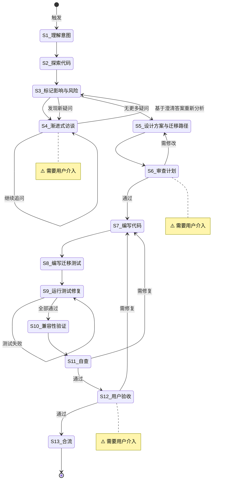

# Large-Scale Refactoring

**Template ID**: `large-refactor`
**Category**: development
**Description**: Large-scale code refactoring workflow (Impact assessment → Migration path → Compatibility verification → Integration)
**Command**: `/pm-large-refactor`
**Version**: 1.0.0

---

## Applicable Scenarios

- Cross-module architecture adjustments
- API signature changes
- Data model migration
- Refactoring affecting more than 5 files

---

## Input Requirements

| Input Item | Required | Description |
|--------|------|------|
| Refactoring goal | Yes | Refactoring motivation, expected outcome |
| Impact scope estimate | No | Rough estimate of affected files and modules |

---

## Default Deliverables

- Impact scope assessment report
- Migration path design document
- Refactored code (with backward compatibility layer)
- Migration tests
- Compatibility verification report

---

## State Machine

---

## Task Steps

### S1: Understand Refactoring Intent

**Goal**: Accurately understand the refactoring objective, motivation, and expected outcome.

1. Read the refactoring requirement description
2. Extract core objectives — What to change? Why change? Expected outcome?
3. Preliminary scope assessment

**On completion**: Automatically proceed to S2

---

### S2: Explore Existing Code

**Goal**: Gain a thorough understanding of the current state of the affected code.

1. Search all reference points (functions, types, interfaces)
2. Analyze call chains and dependency relationships
3. Mark external interfaces that are depended upon

**On completion**: Automatically proceed to S3

---

### S3: Mark Impact Scope and Risks

**Goal**: Systematically assess the blast radius and risks of the refactoring.

1. List all affected files and modules
2. Assess the impact of breaking changes
3. Mark high-risk areas (data migration, API compatibility)
4. Sort by risk level
5. **Re-analysis after interview**: After returning from S4, re-examine the S3 original marker list based on clarified answers:
   - Do the clarified answers introduce new impact scopes or risk points?
   - Are there new conflicts between the clarified conclusions and the existing architecture?
   - Are there high-risk areas that were not previously marked?
6. If new questions arise → compile a new question list and return to S4 to continue the interview; if no new questions → proceed to S5

**On completion**: No new questions → automatically proceed to S5; new questions → return to S4

---

### S4: [Human-in-loop] Progressive Interview ⚠️

> **⚠️ This step requires user intervention.** Ask only 1 question at a time.

**Goal**: Clarify ambiguities in refactoring decisions.

1. Use question / confirm to ask questions one at a time
2. Cover: compatibility strategy, migration window, rollback plan

**On completion**: User confirms "no more questions" → return to S3 for re-analysis

---

### S5: Design Solution and Migration Path

**Goal**: Design a complete refactoring solution and migration plan.

1. Design the new architecture / interfaces / data model
2. Design the backward compatibility layer (e.g., Adapter / Facade)
3. Design the migration path (incremental vs big bang)
4. Mark the deprecation timeline

**On completion**: Automatically proceed to S6

---

### S6: [Human-in-loop] Review Plan ⚠️

**Goal**: User reviews the refactoring plan.

1. Present: impact scope, migration path, compatibility strategy, risks
2. Use the confirm tool to wait for review

**On completion**: Approved → S7, needs revision → S5

---

### S7: Write Code (Maintaining Backward Compatibility)

**Goal**: Implement the refactoring incrementally following the migration path.
**Referenced Regulation**: coding_style.md

1. Build the compatibility layer first, then modify internal implementation
2. Run build / type check after each change
3. Mark deprecated APIs (@deprecated)

**On completion**: Automatically proceed to S8

---

### S8: Write Migration Tests

**Goal**: Write tests covering both old and new behavior.
**Referenced Regulation**: coding_style.md

1. Retain regression tests for old APIs
2. Add behavioral tests for new APIs
3. Add compatibility layer tests

**On completion**: Automatically proceed to S9

---

### S9: Run Tests and Fix

**Goal**: All tests pass.

1. Run all tests
2. Fix failures
3. Confirm no regressions

**On completion**: All pass → S10

---

### S10: Compatibility Verification

**Goal**: Verify backward compatibility.
**Referenced Regulation**: migration-checklist.md

1. Run tests for callers of old APIs
2. Verify data format compatibility
3. Verify configuration file compatibility
4. Check Deprecation Warning output

**On completion**: Automatically proceed to S11

---

### S11: Self-Check

**Goal**: Comprehensive self-check.

1. Is the migration path complete
2. Does the compatibility layer cover all old APIs
3. Do tests cover both old and new behavior
4. Is documentation updated

**On completion**: Pass → S12, needs fixes → S7

---

### S12: [Human-in-loop] User Acceptance ⚠️

**Goal**: User confirms the refactoring results.

1. Present the refactoring report (impact scope, migration path, compatibility)
2. Use the confirm tool to wait for confirmation

**On completion**: Approved → S13, needs fixes → S7

---

### S13: Integration

**Goal**: Final verification, wrap up documentation, ask whether to commit.

1. Run final build validation and tests
2. Update Spec and Migration documentation
3. Use the `question` tool to ask the user: "Execute `git commit`?"
   - If user selects "Yes": execute `git add -A && git commit`, using the refactoring summary as the commit message
   - If user selects "No": skip the commit
   - ⚠️ User choice does not affect task completion

**On completion**: Task ends
