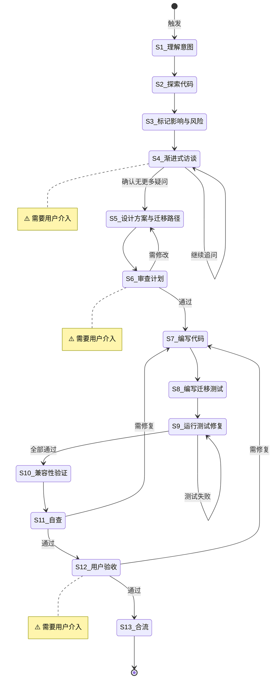

# 大规模重构

**Template ID**: `large-refactor`
**Category**: development
**Description**: 大规模代码重构流程（影响范围评估 → 迁移路径 → 兼容性验证 → 合流）
**Command**: `/pm-large-refactor`
**Version**: 1.0.0

---

## 适用场景

- 跨模块架构调整
- API 签名变更
- 数据模型迁移
- 影响范围超过 5 个文件的重构

---

## 输入要求

| 输入项 | 必填 | 说明 |
|--------|------|------|
| 重构目标 | 是 | 重构动机、期望效果 |
| 影响范围估计 | 否 | 粗略估计涉及的文件和模块 |

---

## 默认交付清单

- 影响范围评估报告
- 迁移路径设计文档
- 重构代码（含向后兼容层）
- 迁移测试
- 兼容性验证报告

---

## 状态机

---

## 任务步骤

### S1: 理解重构意图

**目标**：准确理解重构目标、动机和期望效果。

1. 阅读重构需求描述
2. 提取核心目标——改什么？为什么改？期望效果？
3. 初步评估范围

**完成后**：自动进入 S2

---

### S2: 探索现有代码

**目标**：全面了解受影响代码的现状。

1. 搜索所有引用点（函数、类型、接口）
2. 分析调用链路和依赖关系
3. 标记被依赖的外部接口

**完成后**：自动进入 S3

---

### S3: 标记影响范围与风险

**目标**：系统评估重构的波及面和风险。

1. 列出所有受影响文件和模块
2. 评估破坏性变更的影响
3. 标记高风险区域（数据迁移、API 兼容）
4. 按风险排序

**完成后**：自动进入 S4

---

### S4: [Human-in-loop] 渐进式访谈 ⚠️

> **⚠️ 本步骤需要用户介入。** 每次只问 1 个问题。

**目标**：澄清重构决策中的模糊点。

1. 使用 question / confirm 逐题提问
2. 覆盖：兼容策略、迁移窗口、回滚方案

**完成后**：用户确认 → S5

---

### S5: 设计方案与迁移路径

**目标**：设计完整的重构方案和迁移计划。
**引用 Regulation**：coding_style.md、constitution.md

1. 设计新架构/接口/数据模型
2. 设计向后兼容层（如 Adapter / Facade）
3. 设计迁移路径（渐进式 vs 大爆炸式）
4. 标注废弃（Deprecation）时间线

**完成后**：自动进入 S6

---

### S6: [Human-in-loop] 审查计划 ⚠️

**目标**：用户评审重构计划。

1. 展示：影响范围、迁移路径、兼容策略、风险
2. 使用 confirm 工具等待评审

**完成后**：通过 → S7，需修改 → S5

---

### S7: 编写代码（保持向后兼容）

**目标**：按迁移路径逐步实现重构。
**引用 Regulation**：coding_style.md、constitution.md

1. 先建兼容层，再改内部实现
2. 每个改动后运行构建/类型检查
3. 标记废弃 API（@deprecated）

**完成后**：自动进入 S8

---

### S8: 编写迁移测试

**目标**：编写覆盖旧行为和新行为的测试。
**引用 Regulation**：coding_style.md

1. 保留旧 API 的回归测试
2. 新增新 API 的行为测试
3. 新增兼容层测试

**完成后**：自动进入 S9

---

### S9: 运行测试修复

**目标**：全部测试通过。

1. 运行全部测试
2. 修复失败项
3. 确认无回归

**完成后**：全部通过 → S10

---

### S10: 兼容性验证

**目标**：验证向后兼容性。
**引用 Regulation**：migration-checklist.md

1. 运行旧 API 的调用方测试
2. 验证数据格式兼容性
3. 验证配置文件兼容性
4. 检查 Deprecation Warning 输出

**完成后**：自动进入 S11

---

### S11: 自查

**目标**：全面自检。
**引用 Regulation**：checklist.md

1. 迁移路径是否完整
2. 兼容层是否覆盖所有旧 API
3. 测试是否覆盖旧行为和新行为
4. 文档是否更新

**完成后**：通过 → S12，需修复 → S7

---

### S12: [Human-in-loop] 用户验收 ⚠️

**目标**：用户确认重构效果。

1. 展示重构报告（影响范围、迁移路径、兼容性）
2. 使用 confirm 工具等待确认

**完成后**：通过 → S13，需修复 → S7

---

### S13: 合流

**目标**：最终验证，收尾文档，询问是否提交。

1. 运行最终构建校验和测试
2. 更新 Spec 和 Migration 文档
3. 使用 `question` 工具询问用户：「是否执行 `git commit`？」
   - 若用户选择「是」：执行 `git add -A && git commit`，使用本次重构的总结作为 commit message
   - 若用户选择「否」：跳过提交
   - ⚠️ 用户选择不影响任务结束

**完成后**：任务结束
