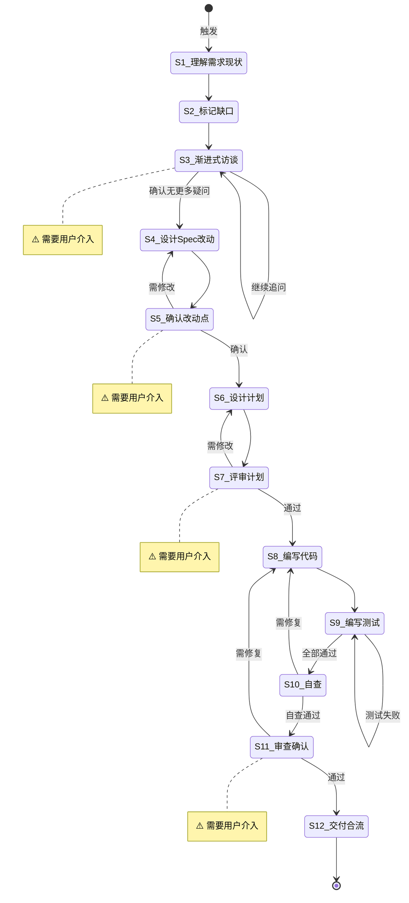

# 新功能开发

**Template ID**: `new-feature`
**Category**: development
**Description**: 复杂任务的标准化开发流程（编码/测试/验收/合流，13步）
**Command**: `/pm-new-feature`
**Version**: 1.0.0

---

## 适用场景

- 中大型新功能开发
- 涉及多模块交互的任务
- 需求需澄清的复杂任务

---

## 输入要求

| 输入项 | 必填 | 说明 |
|--------|------|------|
| Spec 文档 | 是 | 已存在的规格说明 |
| 调整需求 | 是 | 要改动什么、为什么改动 |

---

## 默认交付清单

- Spec 文档更新
- 代码实现 + 测试代码
- 交付报告

---

## 状态机

---

## 任务步骤

### S1: 理解需求与现状

**目标**：准确理解调整意图，了解当前代码现状。

1. 阅读用户提出的调整需求
2. 提取核心意图——要改动什么？为什么？
3. 阅读相关 Spec 和源码
4. 标记已覆盖、模糊、缺失的信息

**完成后**：自动进入 S2

---

### S2: 标记信息缺口与矛盾点

**目标**：系统性找出模糊、缺失、冲突的地方。

1. 对照 Spec 与需求，标记缺失项、模糊项、矛盾项
2. 按影响程度排序
3. 准备逐题访谈列表

**完成后**：自动进入 S3

---

### S3: [Human-in-loop] 渐进式访谈 ⚠️

> **⚠️ 本步骤需要用户介入。** 每次只问 1 个问题。

**目标**：逐题澄清模糊点。

1. 使用 question / confirm 阻塞式工具
2. 每次只问 1 个问题
3. 循环直到用户确认「无更多疑问」

**完成后**：用户确认 → S4

---

### S4: 设计 Spec 改动点

**目标**：基于澄清后需求设计 Spec 改动。
**引用 Regulation**：coding_style.md

1. 标记需要修改/补充的章节
2. 按改动点文档格式输出

**完成后**：自动进入 S5

---

### S5: [Human-in-loop] 确认改动点 ⚠️

**目标**：用户审查 Spec 改动范围。

1. 展示改动点文档
2. 使用 confirm 工具等待确认

**完成后**：确认 → S6，需修改 → S4，新模糊点 → S3

---

### S6: 设计执行计划

**目标**：将 Spec 改动转化为 Plan 文档。
**引用 Regulation**：coding_style.md

1. 阅读更新后的 Spec 和源码
2. 设计 Plan：文件清单、改动点、配置项、风险
3. 设计测试用例

**完成后**：自动进入 S7

---

### S7: [Human-in-loop] 评审计划 ⚠️

**目标**：用户评审执行计划。

1. 展示 Plan 文档
2. 使用 confirm 工具等待评审

**完成后**：通过 → S8，需修改 → S6

---

### S8: 编写代码

**目标**：按 Plan 编写实现。
**引用 Regulation**：coding_style.md、constitution.md

1. 按 Plan 改动点逐个实现
2. 每个改动后 tsc --noEmit
3. 遵循最小变更原则

**完成后**：全部实现 → S9

---

### S9: 编写测试与修复

**目标**：编写测试代码并全部通过。
**引用 Regulation**：coding_style.md

1. 按 Plan 的测试用例编写
2. 运行测试，修复失败项
3. 禁止删除失败测试

**完成后**：全部通过 → S10

---

### S10: 自查

**目标**：全面自检。
**引用 Regulation**：checklist.md

1. Plan 任务是否全部实现
2. tsc + 测试是否通过
3. Spec 是否完整实现
4. 有无多余重构

**完成后**：无问题 → S11，有问题 → S8

---

### S11: [Human-in-loop] 审查确认 ⚠️

**目标**：用户确认交付物。

1. 展示交付报告
2. 使用 confirm 工具等待确认

**完成后**：通过 → S12，需修复 → S8

---

### S12: 交付合流

**目标**：收尾，更新文档，准备提交。
**引用 Regulation**：checklist.md

1. 保存交付报告到 Plan
2. 更新 Spec 文档
3. 运行最终验证
4. 提示 commit 信息

**完成后**：任务结束
