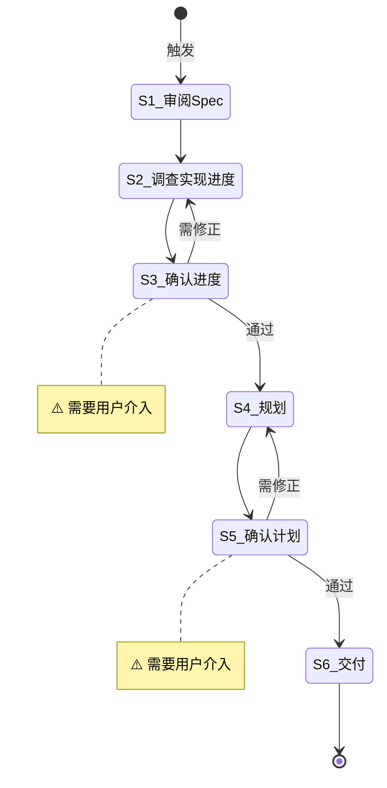

# 计划规划

**Template ID**: `plan`
**Category**: planning
**Description**: 以 Spec 为输入，经进度调查、分步拆解，产出可执行 Plan 文档
**Command**: `/pm-plan`
**Version**: 1.0.0

---

## 适用场景

- 已有 Spec 文档，需要制定可执行的分步计划
- Spec 功能范围较大，需要拆分为多个增量交付
- 接手已有项目，需要快速了解 Spec 实现进度并规划后续工作

**不适用**：无 Spec 文档的任务（先走 research 调研流程产出 Spec）。

---

## 输入要求

| 输入项 | 必填 | 说明 |
|--------|------|------|
| Spec 文档 | 是 | 指定要规划的 Spec 文件路径（如 `docs/spec/login-module.md`） |
| 检索代码库 | 否 | 是否搜索代码库验证实现状态。默认以 Spec 自身记录为准 |

输入不满足要求时，引导用户补充后继续。

---

## 默认交付清单

- Plan 文档 → `/docs/plan/plan_*.md`
- 拆解后的子 Spec 文档 → `/docs/spec/`（如适用）

---

## 状态机

---

## 任务步骤

### S1: 审阅 Spec

**目标**：全面理解 Spec 文档的内容，提取规划所需的关键信息。

1. 用 read 工具读取指定的 Spec 文档
2. 提取：
   - **功能清单**：Spec 中定义的所有功能点（逐条列出）
   - **技术决策**：架构选型、接口约定、数据模型、边界条件等
   - **依赖关系**：功能间的先后依赖和并行关系
   - **进度记录**：Spec 中已记录的实现状态（如已完成的模块、待实现的功能）
3. 如果 Spec 内容不清晰或信息不足，使用 `question` 工具追问

**完成后**：自动进入 S2

---

### S2: 调查实现进度

**目标**：确定 Spec 中各项功能的实际实现状态。

- **若用户明确要求检索代码库**：使用 explore agent 搜索相关代码，逐一核实每个功能点的代码实现情况，标记为「已实现 / 部分实现 / 未实现」
- **若用户未明确要求**：以 Spec 自身记录的进度信息为准，不主动搜索代码库

**完成后**：自动进入 S3

---

### S3: [Human-in-loop] 确认进度调查 ⚠️

> **⚠️ 本步骤需要用户介入。** 展示进度调查结果，等待用户明确确认。

**目标**：将进度调查结果展示给用户，获取确认。

1. 展示进度调查结果：
   - 功能实现状态一览表（已实现 / 部分实现 / 未实现）
   - 进度数据来源（代码检索 / Spec 记录）
   - 发现的问题（如 Spec 记录与实际代码不符）
2. ⚠️ 使用 `confirm` / `question` 工具等待用户明确确认
3. **严禁**在收到明确确认前进入下一步

**状态流转**：
- 用户明确确认 → S4
- 用户要求修正 → 返回 S2

**完成后**：用户明确确认 → 进入 S4

---

### S4: 规划

**目标**：以 Spec 交付为目标，完成分步拆解、Spec 拆解和执行路径规划。

1. **分步拆解**：梳理未实现功能的依赖关系，按「可独立验证」原则拆分增量——每个增量必须是可独立交付和验收的完整功能单元，标注增量间的先后依赖和并行机会
2. **Spec 拆解**：为每个增量生成对应的子 Spec，包含子交付目标、涉及功能点、技术决策引用、验收标准，形成「增量 → 子 Spec → 验收」闭环
3. **执行路径规划**：为每个增量制定具体实现步骤，设定里程碑和验收节点，标注并行执行机会（标记 `[P]`），汇总为完整的 Plan 文档大纲

**完成后**：自动进入 S5

---

### S5: [Human-in-loop] 确认计划 ⚠️

> **⚠️ 本步骤需要用户介入。** 展示完整执行计划，等待用户明确确认。

**目标**：将完整执行计划展示给用户，获取最终确认。

1. 展示完整执行计划：
   - 增量路线图（Mermaid 甘特图或流程图）
   - 每个增量的子 Spec 摘要（目标、范围、验收标准）
   - 每个增量的详细步骤和并行机会
   - 里程碑和验收节点
   - 识别的风险和缓解措施
2. ⚠️ 使用 `confirm` / `question` 工具等待用户明确确认
3. **严禁**在收到明确确认前进入下一步

**状态流转**：
- 用户明确确认 → S6
- 用户要求修正 → 返回 S4

**完成后**：用户明确确认 → 进入 S6

---

### S6: 交付

**目标**：将确认的计划写入文档，验证并询问提交。

1. 交付动作：
   - 将 Plan 文档写入 `/docs/plan/plan_*.md`
   - 将子 Spec 文档写入 `/docs/spec/`（如适用）
2. 验证：确认文档格式正确、内容完整
3. 展示交付摘要：
   - Plan 文档路径和核心内容
   - 子 Spec 清单（如有）
4. 使用 `question` 工具询问用户：「是否执行 `git commit`？」
   - 若用户选择「是」：执行 `git add -A && git commit`，使用本次规划任务的总结作为 commit message
   - 若用户选择「否」：跳过提交
   - ⚠️ 用户选择不影响任务结束

**完成后**：任务结束
