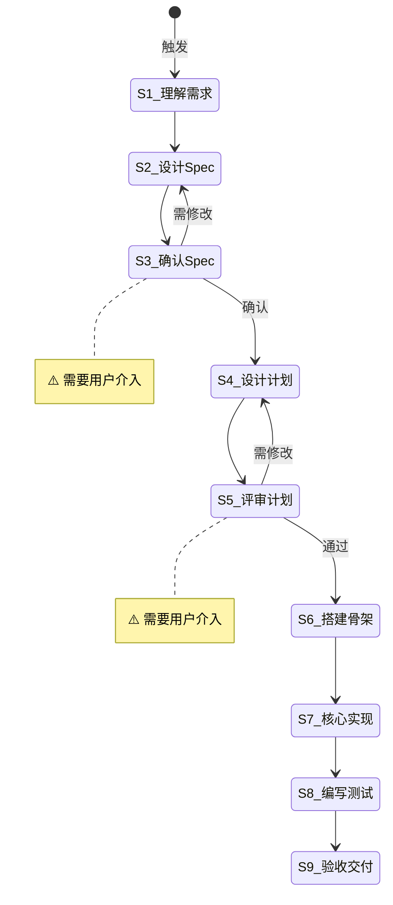

# 项目搭建

**Template ID**: `project-build`
**Category**: development
**Description**: 新项目从零搭建的标准化流程（Flow + Spec + Plan + Implement + Test）
**Command**: `/pm-project-build`
**Version**: 1.0.0

---

## 适用场景

- 创建新项目或模块
- 从零搭建技术栈和基础架构

---

## 输入要求

| 输入项 | 必填 | 说明 |
|--------|------|------|
| 项目需求描述 | 是 | 要构建什么、目标是什么 |
| 技术栈偏好 | 否 | 语言/框架/工具偏好 |

---

## 默认交付清单

- 项目骨架（配置、目录结构）
- 核心模块实现
- 测试代码
- Spec / Plan 文档

---

## 状态机

---

## 任务步骤

### S1: 理解需求

**目标**：准确理解项目目标和技术约束。
**执行 Agent**：Assistant

1. 阅读需求描述
2. 提取核心目标和约束条件
3. 标记信息缺口

**完成后**：自动进入 S2

---

### S2: 设计 Spec

**目标**：撰写 Spec 文档，澄清技术决策。
**执行 Agent**：Assistant
**引用 Regulation**：coding_style.md

1. 按 spec-template 结构填写
2. 定义领域模型、关键路径、接口设计
3. 标注边界条件和错误处理

**完成后**：自动进入 S3

---

### S3: [Human-in-loop] 确认 Spec ⚠️

**目标**：用户审查 Spec 文档。
**执行 Agent**：—

1. 展示 Spec 文档
2. 使用 confirm 工具等待确认

**完成后**：确认 → S4，需修改 → S2

---

### S4: 设计计划

**目标**：将 Spec 转化为可执行的 Plan。
**执行 Agent**：Assistant
**引用 Regulation**：coding_style.md

1. 列出文件清单和改动点
2. 设计测试用例
3. 评估风险

**完成后**：自动进入 S5

---

### S5: [Human-in-loop] 评审计划 ⚠️

**目标**：用户评审执行计划。
**执行 Agent**：—

1. 展示 Plan 文档
2. 使用 confirm 工具等待评审

**完成后**：通过 → S6，需修改 → S4

---

### S6: 搭建骨架

**目标**：创建项目配置和目录结构。
**执行 Agent**：Assistant
**引用 Regulation**：coding_style.md

1. 初始化 package.json / tsconfig.json
2. 创建约定目录
3. 配置构建和测试工具

**完成后**：自动进入 S7

---

### S7: 核心实现

**目标**：按 Plan 逐个实现功能。
**执行 Agent**：Assistant / Task Agent
**引用 Regulation**：coding_style.md、constitution.md

1. 按 Plan 改动点逐个完成
2. 每个改动后 tsc --noEmit 验证
3. 遵循最小变更原则

**完成后**：自动进入 S8

---

### S8: 编写测试

**目标**：编写测试并全部通过。
**执行 Agent**：Assistant
**引用 Regulation**：coding_style.md

1. 根据 Plan 的测试用例编写
2. 运行测试，修复失败项
3. 全部通过后进入 S9

**完成后**：自动进入 S9

---

### S9: 验收交付

**目标**：自查并交付。
**执行 Agent**：Assistant
**引用 Regulation**：checklist.md、constitution.md

1. 检查 Plan 全部实现
2. 运行 tsc --noEmit + 测试
3. 更新 Spec 文档
4. 生成交付报告

**完成后**：任务结束
