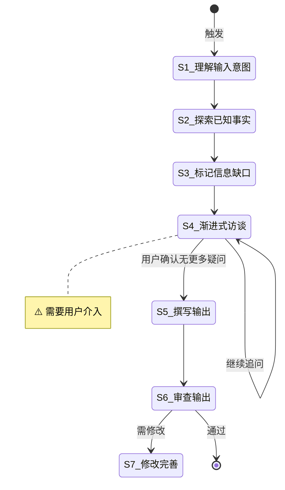

# 调研任务

**Template ID**: `research`
**Category**: research
**Description**: 梳理需求、设计文档、研究分析的调研工作流
**Version**: 1.0.0

---

## 适用场景

- 梳理需求、整理维护文档
- 调研分析、研究开放性问题
- 设计撰写 Spec 文档、技术方案

---

## 输入要求

| 输入项 | 必填 | 说明 |
|--------|------|------|
| 需求描述/草案/想法雏形 | 是 | 描述要解决什么问题或达成什么目标 |

---

## 默认交付清单

- 调研报告 / Spec 文档 / 技术方案
- 如有规划阶段，输出计划文档

---

## 状态机

---

## 任务步骤

### S1: 理解输入意图

**目标**：准确理解用户输入的核心意图。
**执行 Agent**：Assistant

1. 逐段阅读用户提供的描述
2. 提取核心意图——要解决什么问题？要达成什么目标？
3. 识别已覆盖的信息和初步发现的缺口

**完成后**：自动进入 S2

---

### S2: 探索相关已知事实

**目标**：搜索项目内外部相关信息，建立知识基线。
**执行 Agent**：explore / librarian（按需并行）

1. 在项目内搜索相关代码和文档
2. 搜索外部参考（GitHub、官方文档）
3. 汇总发现，建立知识基线

**完成后**：自动进入 S3

---

### S3: 标记信息缺口与矛盾点

**目标**：系统性地梳理已知信息和未知缺口。
**执行 Agent**：Assistant

1. 整理已明确的信息
2. 标记缺失项、模糊项、矛盾项
3. 按影响程度排序

**完成后**：自动进入 S4

---

### S4: [Human-in-loop] 渐进式访谈 ⚠️

> **⚠️ 本步骤需要用户介入。** 使用 question / confirm 阻塞式工具向用户提问。

**目标**：通过逐题提问澄清模糊点。
**执行 Agent**：Assistant

1. 每次只问 1 个问题，等待回复后再继续
2. 用户回答引出新方向时先深入追问
3. 循环直到用户确认「无更多疑问」

**完成后**：用户确认 → S5

---

### S5: 撰写输出

**目标**：基于澄清后的信息撰写最终输出。
**执行 Agent**：Assistant
**引用 Regulation**：coding_style.md

1. 按约定格式撰写（Spec 文档 / 技术方案 / 调研报告）
2. 标注引用来源和信息缺口

**完成后**：自动进入 S6

---

### S6: 审查输出

**目标**：自审查输出质量。
**执行 Agent**：Assistant
**引用 Regulation**：checklist.md

1. 检查是否覆盖了所有已确认的需求
2. 检查格式是否符合模板规范
3. 标注待决策项目和风险

**完成后**：审查通过 → 结束，需修改 → S7

---

### S7: 修改完善

**目标**：根据审查意见修改输出。
**执行 Agent**：Assistant

1. 逐条处理审查意见
2. 修改后重新输出最终版本

**完成后**：任务结束
