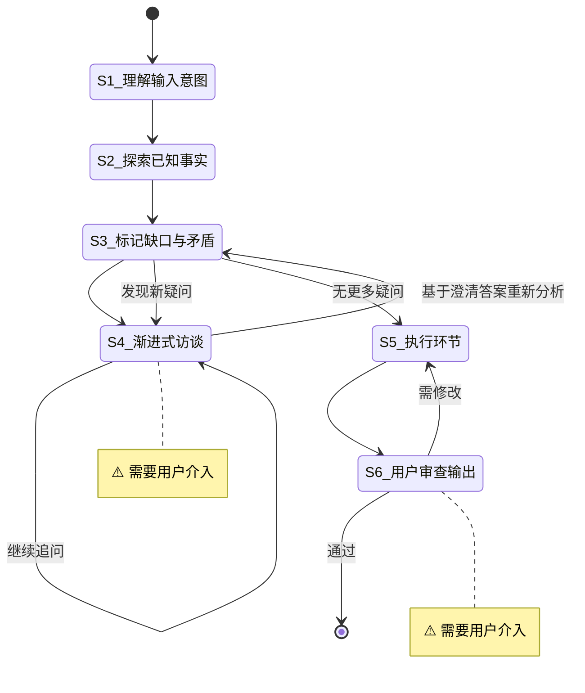

# 调研任务

**Template ID**: `research`
**Category**: research
**Description**: 梳理需求、设计文档、研究分析的调研工作流
**Command**: `/pm-research`
**Version**: 1.0.0

---

## 适用场景

- 梳理需求、整理维护文档
- 调研分析、研究开放性问题
- 设计撰写 Spec 文档、技术方案

**不适用**：代码实现、Bug修复。

---

## 输入要求

| 输入项 | 必填 | 说明 |
|--------|------|------|
| 需求描述/草案/想法雏形 | 是 | 描述要解决什么问题或达成什么目标 |

输入不满足要求时，引导用户补充后继续。

---

## 默认交付清单

- 调研报告 / Spec 文档 / 技术方案
- 如有规划阶段，输出计划文档到 `/docs/plan/[plan]_*.md`

---

## 状态机

---

## 任务步骤

### S1: 理解输入意图

**目标**：准确理解用户输入的核心意图。

1. 逐段阅读用户提供的描述
2. 提取核心意图——要解决什么问题？要达成什么目标？
3. 识别已覆盖的信息和初步发现的缺口

**完成后**：自动进入 S2

---

### S2: 探索相关已知事实

**目标**：搜索项目内外部相关信息，建立知识基线。

1. 搜索项目内已有的相关文档和代码
2. 搜索外部参考资料（文档、最佳实践、开源实现）
3. 记录关键发现和约束条件
4. 汇总发现，建立知识基线

**引用工具**：explore / librarian Agent（按需并行）

**完成后**：自动进入 S3

---

### S3: 标记信息缺口与矛盾点

**目标**：系统性地找出所有模糊、缺失、冲突的地方。

1. 对照输入意图与已知事实，标记：
   - **缺失项**：设计中完全空白的关键部分
   - **模糊项**：描述不够具体、存在歧义
   - **矛盾项**：设计意图与已知事实冲突的地方
2. 按影响程度排序——阻塞性问题优先
3. 为 S4 准备逐题访谈列表
4. **访谈后重新分析**：从 S4 返回后，基于已澄清的答案，重新审视 S3 原始标记列表：
   - 澄清的答案是否引入了新的模糊点？
   - 已澄清的结论与现有知识基线有无新矛盾？
   - 是否有原先未发现的缺失项？
5. 若发现新疑问 → 整理新问题列表，返回 S4 继续访谈；若无新疑问 → 进入 S5

**完成后**：无新疑问 → 自动进入 S5；有新疑问 → 返回 S4

---

### S4: [Human-in-loop] 渐进式访谈 ⚠️

> **⚠️ 本步骤需要用户介入。** 使用 `question` / `confirm` 阻塞式工具向用户提问——每次只问 1 个问题。

**目标**：通过逐题提问澄清所有模糊点和矛盾点。

1. 使用 `question` / `confirm` 阻塞式工具发出问题——每次只问 1 个问题
2. 等待用户回复后才能问下一个
3. 如果用户回答引出新方向，先深入追问，再切回原路线
4. 循环直到用户确认「没有其他需要澄清的问题」
5. **绝不**在普通文本中批量抛出多个问题

**完成后**：用户确认「不再追问」→ 返回 S3 重新分析

---

### S5: 执行环节

**目标**：基于澄清后的需求设计方案，按计划执行并产出最终成果。

1. 梳理完整设计——模块、接口、数据流、边界处理
2. 将任务拆解为可独立执行和验证的子任务，标注依赖关系和并行机会
3. 按计划中的子任务顺序执行，产出最终成果（调研报告 / Spec 文档 / 技术方案）
4. 标记 `[P]` 的任务可并行处理，每完成一个子任务更新进度
5. 汇总所有产出，准备供用户审查

**完成后**：自动进入 S6

---

### S6: [Human-in-loop] 用户审查输出 ⚠️

> **⚠️ 本步骤需要用户介入。** 用户审查最终产出，确认后合流。

**目标**：用户审查最终调研产出，确认交付物满足需求。

1. 展示最终产出摘要（报告 / Spec / 方案的关键内容和结论）
2. 使用 `confirm` 工具等待用户审查确认
3. 审查通过后，使用 `question` 工具询问用户：「是否执行 `git commit`？」
   - 若用户选择「是」：执行 `git add -A && git commit`，使用本次调研的总结作为 commit message
   - 若用户选择「否」：跳过提交
   - ⚠️ 用户选择不影响任务结束

**状态流转**：
- 用户通过 → 合流结束
- 用户要求修改 → 退回 S5

**完成后**：任务结束
