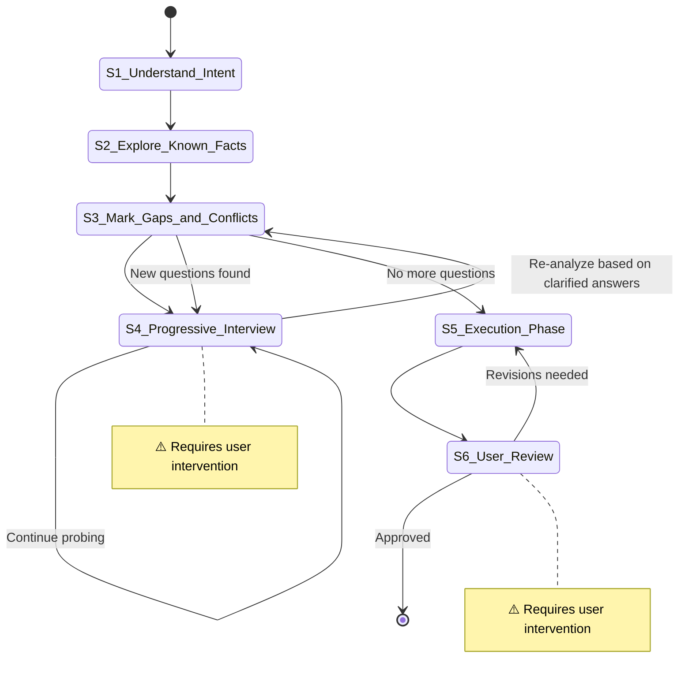

# Research Task

**Template ID**: `research`
**Category**: research
**Description**: Research workflow for organizing requirements, design documents, and analysis
**Command**: `/pm-research`
**Version**: 1.0.0

---

## Applicable Scenarios

- Organizing requirements, maintaining documentation
- Research analysis, investigating open-ended questions
- Designing and writing Spec documents, technical proposals

**Not applicable**: Code implementation, bug fixes.

---

## Input Requirements

| Input Item | Required | Description |
|------------|----------|-------------|
| Requirement description / draft / initial idea | Yes | Describe the problem to solve or the goal to achieve |

If the input does not meet requirements, guide the user to supplement before continuing.

---

## Default Deliverables

- Research report / Spec document / Technical proposal
- If a planning phase is involved, output the plan document to `/docs/plan/[plan]_*.md`

---

## State Machine

---

## Task Steps

### S1: Understand Input Intent

**Goal**: Accurately understand the core intent of the user's input.

1. Read the user-provided description paragraph by paragraph
2. Extract the core intent — what problem to solve? What goal to achieve?
3. Identify covered information and preliminary gaps

**After completion**: Automatically proceed to S2

---

### S2: Explore Related Known Facts

**Goal**: Search for relevant internal and external information to establish a knowledge baseline.

1. Search for existing relevant documents and code within the project
2. Search for external reference materials (documentation, best practices, open-source implementations)
3. Document key findings and constraints
4. Summarize findings to establish a knowledge baseline

**Referenced tools**: explore / librarian Agent (parallel on demand)

**After completion**: Automatically proceed to S3

---

### S3: Mark Information Gaps and Contradictions

**Goal**: Systematically identify all vague, missing, and conflicting areas.

1. Compare input intent with known facts, and mark:
   - **Missing items**: Key parts of the design that are completely blank
   - **Vague items**: Descriptions that are not specific enough or contain ambiguity
   - **Conflicting items**: Places where design intent conflicts with known facts
2. Prioritize by impact — blocking issues first
3. Prepare a question-by-question interview list for S4
4. **Post-interview re-analysis**: After returning from S4, based on clarified answers, re-examine the original S3 marker list:
   - Do the clarified answers introduce new ambiguities?
   - Do the clarified conclusions conflict with the existing knowledge baseline?
   - Are there previously undiscovered missing items?
5. If new questions found → organize new question list, return to S4 for further interview; if no new questions → proceed to S5

**After completion**: No new questions → automatically proceed to S5; new questions → return to S4

---

### S4: [Human-in-loop] Progressive Interview ⚠️

> **⚠️ This step requires user intervention.** Use `question` / `confirm` blocking tools to ask the user — only one question at a time.

**Goal**: Clarify all vague points and contradictions through sequential questioning.

1. Use `question` / `confirm` blocking tools to ask questions — only one question at a time
2. Wait for the user's response before asking the next one
3. If the user's answer leads to a new direction, follow up deeply before returning to the original path
4. Loop until the user confirms "no further questions need clarification"
5. **Never** batch multiple questions in plain text

**After completion**: User confirms "no further questions" → return to S3 for re-analysis

---

### S5: Execution Phase

**Goal**: Design the solution based on clarified requirements, execute according to plan, and produce final deliverables.

1. Outline the complete design — modules, interfaces, data flow, edge-case handling
2. Break down tasks into independently executable and verifiable subtasks, noting dependencies and parallelization opportunities
3. Execute subtasks in the planned order to produce the final deliverable (research report / Spec document / technical proposal)
4. Mark tasks with `[P]` for parallel processing; update progress after completing each subtask
5. Consolidate all outputs and prepare for user review

**After completion**: Automatically proceed to S6

---

### S6: [Human-in-loop] User Review Output ⚠️

> **⚠️ This step requires user intervention.** The user reviews the final output and confirms before merging.

**Goal**: User reviews the final research output and confirms that deliverables meet requirements.

1. Present a summary of the final output (key content and conclusions of the report / Spec / proposal)
2. Use the `confirm` tool to wait for user review and approval
3. After approval, use the `question` tool to ask the user: "Execute `git commit`?"
   - If the user selects "Yes": run `git add -A && git commit`, using the research summary as the commit message
   - If the user selects "No": skip the commit
   - ⚠️ The user's choice does not affect task completion

**State transitions**:
- User approves → merge and end
- User requests revisions → return to S5

**After completion**: Task ends
