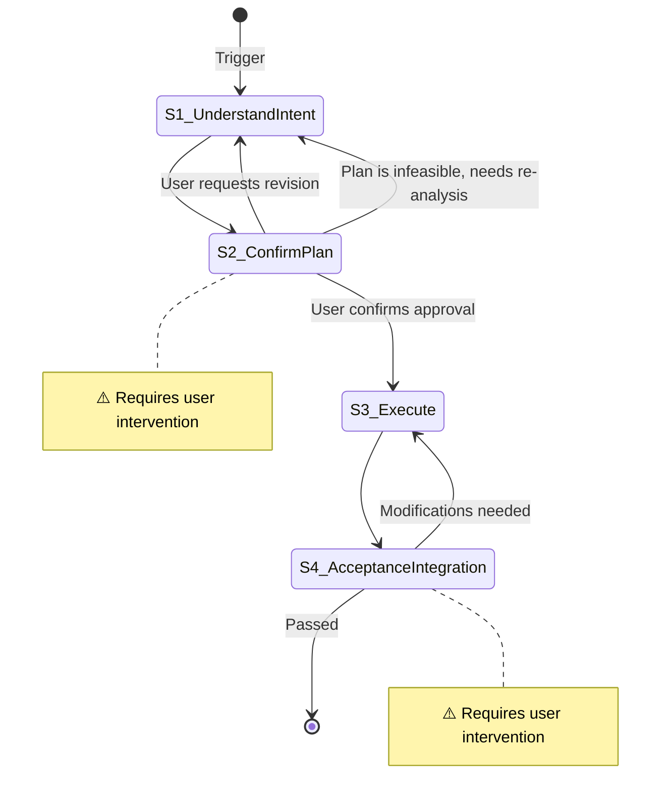

# Quick Turnaround Tasks

**Template ID**: `side-job`
**Category**: side-job
**Description**: Quick turnaround task flow — LLM must confirm the plan with the user before execution
**Command**: `/pm-side-job`
**Version**: 1.0.0

---

## Applicable Scenarios

- Independent small tasks with clear intent that don't require deep research
- One-off modifications, config adjustments, small-scale refactoring, script writing, etc.
- Users expect the LLM to think through a plan and get confirmation before taking action

**Not applicable**: Complex architecture design, bug fixes requiring root cause analysis, large-scale refactoring.

---

## Input Requirements

| Input Item | Required | Description |
|------------|----------|-------------|
| Task Description | Yes | What to do, and the expected outcome |

If the input does not meet requirements, guide the user to supplement before continuing.

---

## Default Deliverables

- Complete the task described by the user
- If code changes are involved, pass LSP diagnostics and build verification

---

## State Machine

---

## Task Steps

### S1: Understand Intent

**Goal**: Accurately understand what the user wants to do, and analyze feasible approaches.

1. Read the user's description, extract the core task and constraints
2. Read relevant source code and documentation as needed (using the read tool directly)
3. Search for related files within the project to understand existing patterns (using explore agent for parallel searches)
4. If the description is unclear or information is insufficient, use the `question` / `confirm` tools to follow up
5. Consider 2-3 feasible approaches, evaluate each in terms of scope of changes, risk, and impact
6. Select the recommended approach, ready to present in S2

**Note**: **Do not** edit, create, or delete any files during this step.

**On completion**: Automatically proceed to S2

---

### S2: [Human-in-loop] Confirm Execution Plan ⚠️

> **⚠️ This step requires user intervention.** The LLM presents the execution plan and uses the `confirm` / `question` tools to wait for the user's **explicit confirmation** before proceeding.

**Goal**: Present the execution plan to the user and obtain explicit confirmation.

1. Present the execution plan, including at minimum:
   - **Task Understanding**: A one-sentence summary of what to do
   - **Execution Steps**: Which specific files to modify, what changes to make (order and dependencies)
   - **Scope of Impact**: Modules or features that may be affected
   - **Risk Points**: Areas to watch out for (if any)
2. ⚠️ Use the `confirm` / `question` tools to wait for the user's explicit confirmation:
    - **Must** receive a **strongly affirmative** instruction such as "confirmed / agree / approved / no problem / OK / go ahead / LGTM" before proceeding
    - Vague or weakly affirmative language ("looks doable", "give it a try", "mm", "should be fine") is treated as **unconfirmed** — must follow up with the user for a clear stance
    - User silence is treated as **unconfirmed** — do not proceed on your own
3. **Strictly prohibited** from performing any code modifications, file edits, or todo creation before receiving explicit confirmation
4. If the user requests plan adjustments → return to S1 for re-analysis (or revise in place at this step and re-confirm)

**State transitions**:
- User explicitly confirms → S3
- User requests revisions → return to S1 (re-analyze the plan)
- Plan adjusted with simple changes and re-confirmed → stay at S2 to continue confirmation

**On completion**: User explicitly confirms → proceed to S3

---

### S3: Execute

**Goal**: Execute the task according to the confirmed plan.

1. Create a todo list (if the task involves multiple sub-steps)
2. Strictly follow the plan confirmed in S2:
    - Only modify files listed in the plan
    - Do not introduce changes outside the plan
    - Follow the project constitution's "Code Quality First" principle
3. Update todo status upon completing each sub-step
4. After completion, run project build / type check / LSP diagnostics for verification

**On completion**: Automatically proceed to S4

---

### S4: [Human-in-loop] Acceptance & Integration ⚠️

> **⚠️ This step requires user intervention.** The user reviews the execution results and confirms integration.

**Goal**: User accepts the final deliverable and confirms completion.

1. Present an execution summary:
   - Which files were modified
   - What changes were made (diff summary)
   - Verification results (build / type check / LSP diagnostics passed or not)
2. Use the `confirm` / `question` tools to wait for the user's acceptance confirmation
3. After acceptance, use the `question` tool to ask the user: "Proceed with `git commit`?"
   - If the user chooses "Yes": run `git add -A && git commit`, using the task summary as the commit message
   - If the user chooses "No": skip the commit
   - ⚠️ The user's choice does not affect task completion

**State transitions**:
- User approves → integration complete
- User requests modifications → return to S3

**On completion**: Call `pm_task_close()` to end the task and trigger analysis
