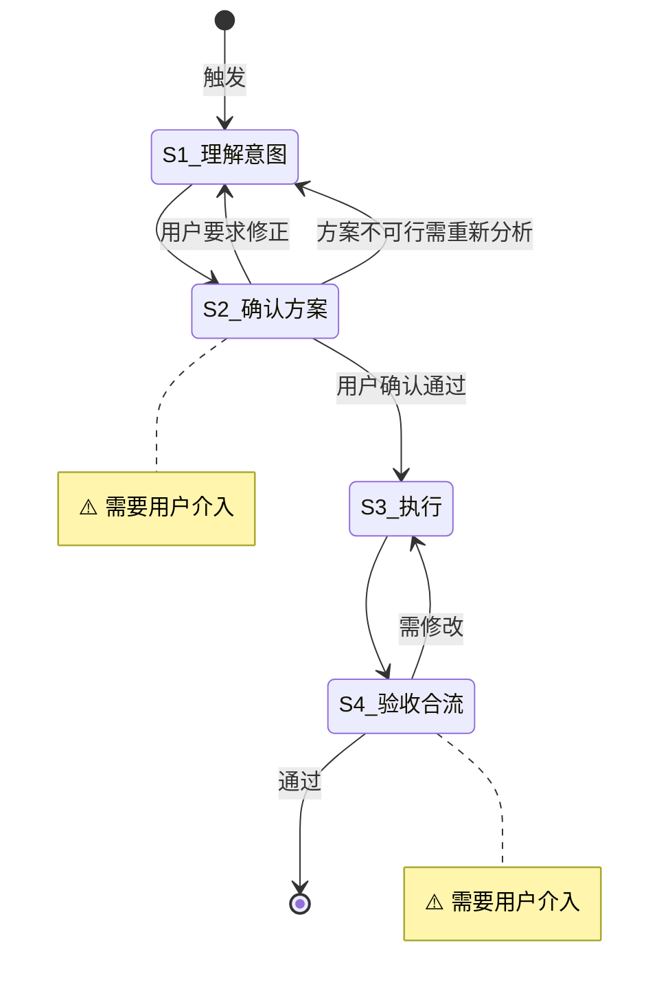

# 短平快任务

**Template ID**: `side-job`
**Category**: side-job
**Description**: 短平快任务流程——LLM 必须在执行前将方案与用户确认
**Command**: `/pm-side-job`
**Version**: 1.0.0

---

## 适用场景

- 意图明确、不需要深度调研的独立小任务
- 一次性修改、配置调整、小范围重构、脚本编写等
- 用户期望 LLM 在执行前先思考方案并确认，而非直接动手

**不适用**：复杂架构设计、需要根因分析的 Bug 修复、大规模重构。

---

## 输入要求

| 输入项 | 必填 | 说明 |
|--------|------|------|
| 任务描述 | 是 | 要做什么、期望效果是什么 |

输入不满足要求时，引导用户补充后继续。

---

## 默认交付清单

- 完成用户描述的任务
- 如有代码变更，通过 LSP 诊断和构建验证

---

## 状态机

---

## 任务步骤

### S1: 理解意图

**目标**：准确理解用户要做什么，分析可行方案。

1. 阅读用户描述，提取核心任务和约束条件
2. 必要时阅读相关源码和文档（用 read 工具直接读取）
3. 搜索项目内相关文件了解现有模式（用 explore agent 并行搜索）
4. 如果描述不清晰或信息不足，使用 `question` / `confirm` 工具追问
5. 思考 2-3 个可行方案，评估各自的改动范围、风险和影响
6. 选出推荐方案，准备在 S2 展示

**注意**：本步骤**禁止**编辑、创建或删除任何文件。

**完成后**：自动进入 S2

---

### S2: [Human-in-loop] 确认执行方案 ⚠️

> **⚠️ 本步骤需要用户介入。** LLM 展示执行方案，使用 `confirm` / `question` 工具等待用户**明确确认**后方可推进。

**目标**：将执行方案展示给用户，获取明确确认。

1. 调用 `pm_task_set_step(step="S2")` 声明进入步骤
2. 展示执行方案，至少包含：
   - **任务理解**：一句话概括要做什么
   - **执行步骤**：具体要改哪些文件、做什么修改（顺序和依赖关系）
   - **影响范围**：可能影响的模块或功能
   - **风险点**：需要注意的地方（如有）
3. ⚠️ 使用 `confirm` / `question` 工具等待用户明确确认：
   - **必须**收到用户「确认 / 同意 / 通过 / 没问题 / 可以 / go ahead / LGTM」等**强烈正面**的指令后方可推进
   - 含糊/弱肯定话术（「看起来行」「试试吧」「嗯」「应该可以」）视为**未确认**，必须追问用户明确表态
   - 用户沉默不回应视为**未确认**，禁止自行推进
4. **严禁**在收到明确确认前执行任何代码修改、文件编辑或 todo 创建
5. 若用户要求调整方案 → 返回 S1 重新分析（或在本步骤就地修正后重新确认）

**状态流转**：
- 用户明确确认 → S3
- 用户要求修正 → 返回 S1（重新分析方案）
- 方案经简单调整后重新确认 → 留在 S2 继续确认

**完成后**：用户明确确认 → 进入 S3

---

### S3: 执行

**目标**：按确认的方案执行任务。

1. 调用 `pm_task_set_step(step="S3")` 声明进入步骤
2. 创建 todo 列表（如果任务包含多个子步骤）
3. 严格按照 S2 确认的方案执行：
   - 只改方案中列出的文件
   - 不引入方案外的修改
   - 遵循项目宪章「代码品质优先原则」
4. 每完成一个子步骤，更新 todo 状态
5. 完成后运行项目构建/类型检查/LSP 诊断验证

**完成后**：自动进入 S4

---

### S4: [Human-in-loop] 验收合流 ⚠️

> **⚠️ 本步骤需要用户介入。** 用户审查执行结果，确认后合流。

**目标**：用户验收最终成果，确认交付。

1. 调用 `pm_task_set_step(step="S4")` 声明进入步骤
2. 展示执行摘要：
   - 修改了哪些文件
   - 做了什么改动（diff 摘要）
   - 验证结果（构建/类型检查/LSP 诊断是否通过）
3. 使用 `confirm` / `question` 工具等待用户验收确认
4. 验收通过后，使用 `question` 工具询问用户：「是否执行 `git commit`？」
   - 若用户选择「是」：执行 `git add -A && git commit`，使用本次任务的总结作为 commit message
   - 若用户选择「否」：跳过提交
   - ⚠️ 用户选择不影响任务结束

**状态流转**：
- 用户通过 → 合流结束
- 用户要求修改 → 退回 S3

**完成后**：调用 `pm_task_close()` 结束任务并触发分析
