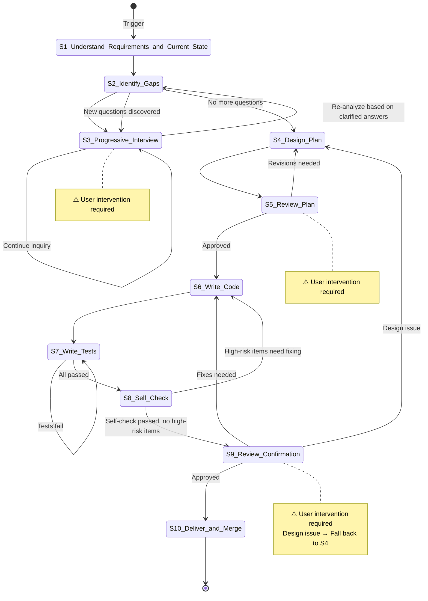

# Spec-Driven Development

**Template ID**: `spec-driven-dev`
**Category**: development
**Description**: Spec-driven standardized development workflow (Understand/Design/Code/Test/Accept/Merge, 10 steps)
**Command**: `/pm-spec-driven-dev`
**Version**: 1.1.0

---

## Applicable Scenarios

- Medium-to-large new feature development
- Tasks involving multi-module interaction
- Complex tasks requiring requirement clarification

---

## Input Requirements

| Input Item | Required | Description |
|--------|------|------|
| Spec Document | Yes | Existing specification document |
| Change Request | Yes | What to change and why |

---

## Default Deliverables

- Updated Spec document
- Code implementation + test code
- Delivery report

---

## State Machine



---

## Task Steps

### S1: Understand Requirements and Current State

**Goal**: Accurately understand the change intent and the current code state.

1. Read the user-submitted change request
2. Extract core intent — what needs to change? why?
3. Locate and read the corresponding Spec document from the `docs/spec/` directory (do NOT skip this step), then read related source code
4. Mark covered, vague, and missing information

**On completion**: Automatically proceed to S2

---

### S2: Identify Information Gaps and Contradictions

**Goal**: Systematically identify vague, missing, and conflicting items.

1. Cross-reference the Spec against the change request, marking missing items, vague items, and contradictions
2. Sort by impact level
3. Prepare a list of interview questions, one per topic
4. **Re-analyze after interview**: Upon returning from S3, re-examine the original S2 gap list based on clarified answers:
   - Do the clarified answers introduce new ambiguities?
   - Do the clarified conclusions conflict with the Spec or change request?
   - Are there previously undiscovered missing items?
5. If new questions are found → compile a new question list and return to S3 to continue interviewing; if no new questions → proceed to S4

**On completion**: No new questions → automatically proceed to S4; new questions found → return to S3

---

### S3: [Human-in-loop] Progressive Interview ⚠️

> **⚠️ This step requires user intervention.** Ask only 1 question at a time.

**Goal**: Clarify ambiguities one question at a time.

1. Use the question / confirm blocking tool
2. Ask only 1 question at a time
3. Loop until the user confirms "no more questions"

**On completion**: User confirms "no more questions" → return to S2 for re-analysis

---

### S4: Design Plan

**Goal**: Based on the requirements clarified through S3 interviews, produce a unified Plan document covering Spec changes, code changes, and conflicts between them. **Save the Plan as a file** for S5 review.

> ⚠️ **Critical**: This step MUST save the Plan as a file `docs/plan/plan-{taskId}.md`. The S5 review step depends on this file.

#### Analysis Steps

##### Phase 1: Spec Change Analysis (original S4 responsibility)

1. **Review S3 interview results**: Revisit all Q&A sessions, distill the clarified core requirements
2. **Locate relevant Spec documents**: List the involved Spec documents (`docs/spec/`), understand the existing chapter structure
3. **Cross-reference chapter by chapter**: Using the clarified requirements as the baseline, iterate through each Spec chapter and determine the change type for each:
   - **Modify** — Content is outdated, inaccurate, or needs supplementation
   - **Add** — New concepts, interfaces, constraints, or flows introduced by the requirements
   - **Delete** — Deprecated design, or content already covered by other chapters
   - **Affected** — Content itself unchanged, but cross-references or dependencies are impacted by changes in other chapters

##### Phase 2: Code Change Analysis (original S6 responsibility)

4. **Read relevant source code**: Locate affected source files and understand existing implementations
5. **Design code change points**: Map each Spec change point to an implementation path at the code level
6. **Design test cases**: Design verification plans for each change point

##### Phase 3: Conflict Analysis (🆕 New)

7. **Spec vs Code cross-comparison**: Compare Spec change points against code change points item by item, identifying inconsistencies:
   - Spec-defined interface signatures don't match code implementations
   - Spec-described constraints are not enforced or are implemented oppositely in code
   - Spec and code use different terminology for the same concept
   - Code contains implicit behaviors not covered by the Spec
8. **Annotate alignment direction**: Provide a recommendation for each conflict (align to Spec / align to Code / compromise), for the user to decide during S5

#### Plan Document Format

```markdown
# Execution Plan

> Related Spec: [spec document path]
> Based on S3 interview results: [one-sentence summary of core conclusion]
> Goal: [one-sentence goal summary]

---

## 1. Spec Changes

### Involved Spec Documents

| Document | Change Type | Description |
|------|----------|------|
| docs/spec/xxx.md | Modify | ... |

### Change Overview

| Type | Count |
|------|------|
| Modify | N |
| Add | N |
| Delete | N |
| Affected (no change needed) | N |

### Change Details

#### CHG-S1: [Chapter/Section Name] — Modify

- **Current Description**: [one-sentence summary of current state]
- **Reason for Change**: [which S3 interview conclusion]
- **Change Direction**: [what to change to, without writing specific implementation]

#### CHG-S2: [Chapter/Section Name] — Add

- **Reason for Addition**: [which S3 interview conclusion]
- **Chapter Draft**: [list of planned key points]
- **Dependencies**: [other chapters or documents to reference]

#### CHG-S3: [Chapter/Section Name] — Delete (if applicable)

- **Reason for Deletion**: [why deprecated]
- **Alternative**: [where functionality is migrated, or deprecation rationale]

### Spec Consistency Checklist

- [ ] Each change point traceable to an S3 interview conclusion
- [ ] No logical contradictions between change points
- [ ] Deleted chapters have annotated alternatives or deprecation rationale

---

## 2. Code Changes

### File List

| File | Operation | Description |
|------|------|------|
| path/to/file.ts | Modify | ... |
| path/to/new.ts | Add | ... |

### Change Details

#### CHG-C1: [File/Module Name] — [Operation Type]

- **Related Spec**: [corresponding CHG-Sx]
- **Goal**: [what to change]
- **Approach**: [how to change, brief technical path]
- **Impact**: [which other modules are affected]
- **Test Points**: [what needs to be verified]

#### CHG-C2: ...

### Configuration Items (if applicable)

| Config Item | Location | Change Description |
|--------|------|----------|
| ... | ... | ... |

### Risks and Mitigations

| Risk | Impact | Mitigation |
|------|------|----------|
| ... | ... | ... |

### Test Plan

| Test Type | Test Content | Expected Result |
|----------|----------|----------|
| Unit test | ... | ... |
| Integration test | ... | ... |

---

## 3. Spec vs Code Conflicts ⚠️

> Listed below are inconsistencies between Spec changes and code changes.
> Each conflict includes a **recommended alignment direction**. Please decide during S5 review.

| # | Conflict Description | Spec Definition | Code Status | Impact Scope | Recommended Alignment |
|------|----------|-----------|----------|----------|-------------|
| CF-1 | [brief conflict description] | [what Spec says] | [how code is implemented] | [affected modules] | Align to Spec / Align to Code / Compromise: [brief plan] |
| CF-2 | ... | ... | ... | ... | ... |

> If no conflicts, write "None — Spec and Code are consistent".
```

#### Self-Check Checklist

After saving the Plan file, confirm the following item by item:

- [ ] **Spec section**: Each CHG-S traces back to an S3 interview conclusion; no contradictions between change points
- [ ] **Code section**: File list is complete; each CHG-C is linked to a corresponding CHG-S
- [ ] **Conflict section**: Spec vs Code compared item by item; no missed implicit inconsistencies
- [ ] Plan file saved to `docs/plan/plan-{taskId}.md`
- [ ] Risks have corresponding mitigations
- [ ] Test plan covers all change points

**On completion**: Plan file saved → automatically proceed to S5

---

### S5: [Human-in-loop] Review Plan ⚠️

**Goal**: User reviews the complete Plan (Spec changes + Code changes + Conflicts) in one pass, and makes alignment decisions on conflict points.

1. Call `pm_task_set_step(step="S5")` to declare entry into this step
2. Present the three sections of the Plan document
3. ⚠️ For each CF-* entry in the "Spec vs Code Conflicts" table, use the `question` tool to ask the user for the alignment direction item by item:
   - Options: `Align to Spec` / `Align to Code` / `Compromise`
   - If the user chooses Compromise, follow up to ask for specific compromise details
4. After collecting all decisions, use the `confirm` tool to wait for the user's final confirmation of the overall Plan:
   - **Must** receive **strongly affirmative** instructions from the user such as "confirm / agree / approved / no problem / go ahead / LGTM" before proceeding
   - Vague or weak affirmative responses ("looks OK", "let's try", "mm", "should be fine") are treated as **unconfirmed**; must follow up for explicit approval
5. **Strictly prohibited** from performing any code modifications, file edits, or todo creation before receiving explicit confirmation

**On completion**: Explicitly confirmed → S6; revisions needed → S4; new ambiguities → S3

---

### S6: Write Code

**Goal**: Implement according to the Plan.
**Referenced Regulations**: coding_style.md, constitution.md

1. Implement change points from the Plan one by one
2. Run build/type-check after each change
3. Follow code quality-first principles

**On completion**: All implemented → S7.

> ⚠️ **Iteration Counter**: Each execution of S6 (including re-executions after being sent back from S8 for fixes or from S9 for fixes) increments the S6 iteration count by 1. This count is read by S8 during self-check to determine whether to trigger deep iteration review (threshold: > 5 rounds).

---

### S7: Write Tests and Fix

**Goal**: Write test code and ensure all pass.
**Referenced Regulation**: coding_style.md

1. Write tests according to the Plan's test cases
2. Run tests, fix failures
3. Do NOT delete failing tests

**On completion**: All passed → S8

---

### S8: Self-Check and Code Review

**Goal**: Perform a comprehensive self-check and use code review tools to discover potential issues.

> ⚠️ **Deep Iteration Review Trigger Condition**: If S6 iteration count > 5 rounds, the code review phase automatically upgrades to "Deep Review", additionally checking for ineffective modifications and excessive refactoring.

#### Phase 1: Basic Self-Check

**Referenced Regulation**: checklist.md

1. Are all Plan tasks fully implemented
2. Do build + tests pass
3. Is the Spec fully implemented
4. Is there any unnecessary refactoring

Basic self-check passed → proceed to Phase 2.
Issues found → return to S6 for fixes.

#### Precursor: Deep Iteration Review (triggered when S6 iteration count > 5)

When S6 has taken more than 5 iterations to reach this step, it indicates the code may have undergone extensive back-and-forth modifications. Before entering formal code review, perform additional deep review:

1. **Ineffective Modification Detection**:
   - Check for patterns of modifying the same code back and forth (changed, then changed back)
   - Identify intermediate changes that were overwritten/deprecated by subsequent modifications
   - Detect residual artifacts from multiple mutually exclusive approaches attempted for the same problem

2. **Excessive Refactoring Detection**:
   - Whether "passing refactoring" beyond the Plan scope introduced unnecessary complexity
   - Whether new abstraction layers, utility functions, or configuration items not covered by the Plan were introduced
   - Whether there is over-engineering for "possible future needs"

3. Output deep review conclusions:
   - Flag suspicious ineffective modification points, recommend whether to roll back some changes
   - Flag out-of-scope excessive refactoring, recommend retention or removal
   - Classify issues found in deep review into the 🔴/🟡/🟢 severity levels below

> If S6 iteration count ≤ 5, skip this phase and go directly to Phase 2.

#### Phase 2: Code Review

> **Conditional execution**: Check if the `/code-review-skill` command is available.
> - If available → perform code review
> - If unavailable → skip this phase, go directly to S9

1. Call `skill(name="/code-review-skill")` to retrieve the code review guide
2. Perform a comprehensive review of the changed files according to the review guide
3. Output a review report, categorized by severity

##### Review Severity Classification

| Severity | Definition | Handling |
|--------|------|----------|
| 🔴 Critical | Security vulnerabilities, data loss risk, logic errors, type safety violations | Must return to S6 for fixes |
| 🟡 Medium | Performance issues, code smells, maintainability issues, missing edge cases | Recorded in report; user decides in S9 whether to fix |
| 🟢 Low | Style issues, naming suggestions, documentation improvements | Recorded in report; user decides in S9 whether to fix |

##### Flow Rules

- **Critical items exist (🔴 > 0)**: Output review report, automatically return to S6 for fixes. Fix each critical item one by one; after fixes, re-enter S7 (tests) → S8 (self-check).
- **No critical items (🔴 = 0)**: Output complete review report (including medium and low severity items), automatically proceed to S9. Medium and low items are left for user decision during review confirmation.

**On completion**: No critical items → S9; critical items exist → S6

---

### S9: [Human-in-loop] Review Confirmation ⚠️

**Goal**: User confirms deliverables and code review results.

1. Present the delivery report
2. If there is an S8 code review report, present the list of medium and low severity items, and use the `question` tool to ask the user:
   - "Code review found N medium items and M low items. Should they be fixed in this round?"
   - Options: "Ignore all, accept directly" / "Fix medium items only" / "Fix all"
3. Use the `confirm` tool to wait for final confirmation

> ⚠️ **Design Issues vs Code Issues**:
> - **Code Issues**: Implementation bugs, missed edge cases, insufficient test coverage → return to S6 for fixes
> - **Design Issues**: User points out the overall approach direction is wrong, Spec understanding is off, architecture choice needs adjustment, the change points designed in the Plan themselves are unreasonable → return to S4 to redesign the plan

**On completion**:
- Approved (or user chooses to ignore fix items) → S10
- Fixes needed (code-level bugs/omissions) → S6
- Design issue (user points out design direction is wrong, approach is not viable, etc.) → S4 to redesign plan

---

### S10: Deliver and Merge

**Goal**: Wrap up, update documentation, prepare for commit.
**Referenced Regulation**: checklist.md

1. Save the delivery report to the Plan
2. Update the Spec document
3. Run final verification
4. Use the `question` tool to ask the user: "Perform `git commit`?"
   - If the user selects "Yes": execute `git add -A && git commit`, using the development summary as the commit message
   - If the user selects "No": skip commit
   - ⚠️ User choice does not affect task completion

**On completion**: Call `pm_task_close()` to end the task and trigger analysis
