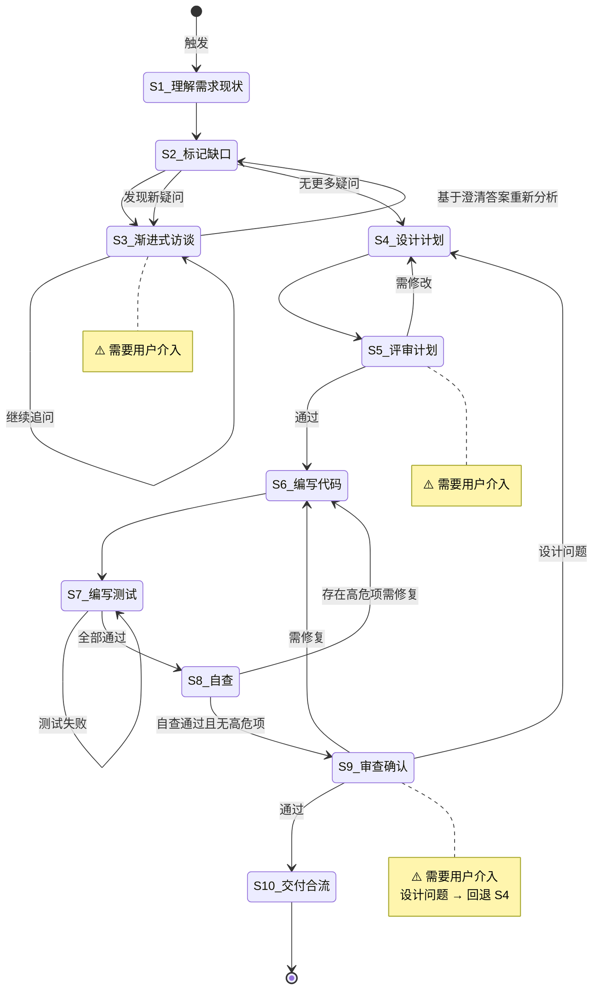

# Spec-Driven 开发

**Template ID**: `spec-driven-dev`
**Category**: development
**Description**: Spec 驱动的标准化开发流程（理解/设计/编码/测试/验收/合流，10步）
**Command**: `/pm-spec-driven-dev`
**Version**: 1.1.0

---

## 适用场景

- 中大型新功能开发
- 涉及多模块交互的任务
- 需求需澄清的复杂任务

---

## 输入要求

| 输入项 | 必填 | 说明 |
|--------|------|------|
| Spec 文档 | 是 | 已存在的规格说明 |
| 调整需求 | 是 | 要改动什么、为什么改动 |

---

## 默认交付清单

- Spec 文档更新
- 代码实现 + 测试代码
- 交付报告

---

## 状态机



---

## 任务步骤

### S1: 理解需求与现状

**目标**：准确理解调整意图，了解当前代码现状。

1. 阅读用户提出的调整需求
2. 提取核心意图——要改动什么？为什么？
3. 从 `docs/spec/` 目录定位并阅读对应 Spec 文档（不得跳过此步），再阅读相关源码
4. 标记已覆盖、模糊、缺失的信息

**完成后**：自动进入 S2

---

### S2: 标记信息缺口与矛盾点

**目标**：系统性找出模糊、缺失、冲突的地方。

1. 对照 Spec 与需求，标记缺失项、模糊项、矛盾项
2. 按影响程度排序
3. 准备逐题访谈列表
4. **访谈后重新分析**：从 S3 返回后，基于已澄清的答案，重新审视 S2 原始标记列表：
   - 澄清的答案是否引入了新的模糊点？
   - 已澄清的结论与 Spec 或需求有无新矛盾？
   - 是否有原先未发现的缺失项？
5. 若发现新疑问 → 整理新问题列表，返回 S3 继续访谈；若无新疑问 → 进入 S4

**完成后**：无新疑问 → 自动进入 S4；有新疑问 → 返回 S3

---

### S3: [Human-in-loop] 渐进式访谈 ⚠️

> **⚠️ 本步骤需要用户介入。** 每次只问 1 个问题。

**目标**：逐题澄清模糊点。

1. 使用 question / confirm 阻塞式工具
2. 每次只问 1 个问题
3. 循环直到用户确认「无更多疑问」

**完成后**：用户确认「不再追问」→ 返回 S2 重新分析

---

### S4: 设计计划

**目标**：基于 S3 访谈澄清后的需求，一次性输出统一的 Plan 文档，同时覆盖 Spec 改动、代码改动、以及两者之间的冲突点。**将 Plan 保存为文件**，供 S5 评审。

> ⚠️ **关键**：本步骤必须将 Plan 保存为文件 `docs/plan/plan-{taskId}.md`。S5 评审步骤依赖该文件。

#### 分析步骤

##### 阶段一：Spec 改动分析（原 S4 职责）

1. **回读 S3 访谈结果**：回顾所有问答，提炼已澄清的核心需求点
2. **定位相关 Spec 文档**：列出涉及的 Spec 文档（`docs/spec/`），理解现有章节结构
3. **逐章对照分析**：以澄清后的需求为准，遍历 Spec 各章节，判断每章的改动类型：
   - **修改** — 内容已过时、不准确或需要补充
   - **新增** — 需求引入的新概念、接口、约束、流程
   - **删除** — 已废弃的设计，或已被其他章节覆盖
   - **受影响** — 内容无需改动，但交叉引用、依赖关系会受其他章节改动影响

##### 阶段二：代码改动分析（原 S6 职责）

4. **阅读相关源码**：定位受影响的源文件，理解现有实现
5. **设计代码改动点**：为每个 Spec 改动点映射到代码层面的实现路径
6. **设计测试用例**：为每个改动点设计验证方案

##### 阶段三：冲突分析（🆕 新增）

7. **Spec vs 代码交叉对比**：逐条对比 Spec 改动点与代码改动点，识别不一致：
   - Spec 约定的接口签名与代码实现不匹配
   - Spec 描述的约束在代码中未落地或实现相反
   - Spec 与代码对同一概念使用不同术语
   - 代码中存在 Spec 未覆盖的隐式行为
8. **标注对齐方向**：对每个冲突点给出建议（向 Spec 对齐 / 向代码对齐 / 折中方案），由用户在 S5 决策

#### Plan 文档格式

```markdown
# 执行计划

> 关联 Spec：[spec 文档路径]
> 基于 S3 访谈结果：[一句话总结核心结论]
> 目标：[一句话概括目标]

---

## 一、Spec 改动点

### 涉及 Spec 文档

| 文档 | 改动类型 | 说明 |
|------|----------|------|
| docs/spec/xxx.md | 修改 | ... |

### 改动总览

| 类型 | 数量 |
|------|------|
| 修改 | N |
| 新增 | N |
| 删除 | N |
| 受影响（无需改） | N |

### 改动详情

#### CHG-S1: [章节/小节名称] — 修改

- **当前描述**：[现有一句话概括]
- **改动原因**：[源于 S3 哪个访谈结论]
- **改动方向**：[计划改成什么，不写具体实现]

#### CHG-S2: [章节/小节名称] — 新增

- **新增原因**：[源于 S3 哪个访谈结论]
- **章节草案**：[计划包含的要点列表]
- **依赖**：[需要参考的其他章节或文档]

#### CHG-S3: [章节/小节名称] — 删除（如适用）

- **删除原因**：[为什么废弃]
- **替代方案**：[功能迁移到哪里，或废弃理由]

### Spec 一致性检查

- [ ] 每个改动点可追溯到 S3 访谈结论
- [ ] 改动点之间无逻辑矛盾
- [ ] 删除的章节已标注替代方案或废弃理由

---

## 二、代码改动点

### 文件清单

| 文件 | 操作 | 说明 |
|------|------|------|
| path/to/file.ts | 修改 | ... |
| path/to/new.ts | 新增 | ... |

### 改动详情

#### CHG-C1: [文件/模块名] — [操作类型]

- **关联 Spec**：[对应 CHG-Sx]
- **目标**：[要改什么]
- **方案**：[怎么改，简要技术路径]
- **影响**：[会影响哪些其他模块]
- **测试点**：[需要验证什么]

#### CHG-C2: ...

### 配置项（如适用）

| 配置项 | 位置 | 变更说明 |
|--------|------|----------|
| ... | ... | ... |

### 风险与缓解

| 风险 | 影响 | 缓解措施 |
|------|------|----------|
| ... | ... | ... |

### 测试计划

| 测试类型 | 测试内容 | 预期结果 |
|----------|----------|----------|
| 单元测试 | ... | ... |
| 集成测试 | ... | ... |

---

## 三、Spec vs 代码冲突点 ⚠️

> 以下列出 Spec 改动与代码改动之间的不一致之处。
> 每个冲突点附带**建议对齐方向**，请在 S5 评审时决策。

| 编号 | 冲突描述 | Spec 约定 | 代码现状 | 影响范围 | 建议对齐方向 |
|------|----------|-----------|----------|----------|-------------|
| CF-1 | [简述冲突] | [Spec 怎么写] | [代码怎么实现的] | [影响哪些模块] | 向 Spec 对齐 / 向代码对齐 / 折中: [简述方案] |
| CF-2 | ... | ... | ... | ... | ... |

> 若无冲突点，填写「无 — Spec 与代码一致」。
```

#### 自检清单

保存 Plan 文件后逐项确认：

- [ ] **Spec 部分**：每个 CHG-S 都能追溯到 S3 的访谈结论，改动点之间无矛盾
- [ ] **代码部分**：文件清单完整，每个 CHG-C 关联到对应 CHG-S
- [ ] **冲突部分**：逐条对比了 Spec 与代码，无遗漏的隐式不一致
- [ ] Plan 文件已保存到 `docs/plan/plan-{taskId}.md`
- [ ] 风险项有对应的缓解措施
- [ ] 测试计划覆盖所有改动点

**完成后**：Plan 文件已保存 → 自动进入 S5

---

### S5: [Human-in-loop] 评审计划 ⚠️

**目标**：用户一次性评审完整 Plan（Spec 改动 + 代码改动 + 冲突点），并对冲突点做出对齐决策。

1. 调用 `pm_task_set_step(step="S5")` 声明进入步骤
2. 展示 Plan 文档的三部分内容
3. ⚠️ 对于「Spec vs 代码冲突点」表格中的每个 CF-*，使用 `question` 工具逐项询问用户对齐方向：
   - 选项：`向 Spec 对齐` / `向代码对齐` / `折中方案`
   - 若用户选择折中方案，追问具体折中细节
4. 汇总所有决策后，使用 `confirm` 工具等待用户对整体 Plan 的最终确认：
   - **必须**收到用户「确认 / 同意 / 通过 / 没问题 / 可以 / go ahead / LGTM」等**强烈正面**的指令后方可推进
   - 含糊/弱肯定话术（「看起来行」「试试吧」「嗯」「应该可以」）视为**未确认**，必须追问用户明确表态
5. **严禁**在收到明确确认前执行任何代码修改、文件编辑或 todo 创建

**完成后**：明确确认 → S6，需修改 → S4，新模糊点 → S3

---

### S6: 编写代码

**目标**：按 Plan 编写实现。
**引用 Regulation**：coding_style.md、constitution.md

1. 按 Plan 改动点逐个实现
2. 每个改动后运行构建/类型检查
3. 遵循代码品质优先原则

**完成后**：全部实现 → S7。

> ⚠️ **迭代计数**：S6 每执行一次（含被 S8 退回修复、S9 退回修复后的重新执行），累计 S6 迭代次数 +1。该计数由 S8 在自查时读取，用于判断是否需要触发迭代深度审查（阈值：> 5 轮）。

---

### S7: 编写测试与修复

**目标**：编写测试代码并全部通过。
**引用 Regulation**：coding_style.md

1. 按 Plan 的测试用例编写
2. 运行测试，修复失败项
3. 禁止删除失败测试

**完成后**：全部通过 → S8

---

### S8: 自查与代码审查

**目标**：全面自检，并利用代码审查工具发现潜在问题。

> ⚠️ **迭代深度审查触发条件**：若 S6 迭代次数 > 5 轮，代码审查阶段自动升级为"深度审查"，额外检查无效修改和过度重构。

#### 第一阶段：基础自检

**引用 Regulation**：checklist.md

1. Plan 任务是否全部实现
2. 构建 + 测试是否通过
3. Spec 是否完整实现
4. 有无多余重构

基础自检通过 → 进入第二阶段。
自检发现问题 → 返回 S6 修复。

#### 前置：迭代深度审查（S6 迭代次数 > 5 时触发）

当 S6 经过超过 5 轮迭代才到达本步骤，说明代码可能经历了大量反复修改。在进入正式代码审查前，需额外执行深度审查：

1. **无效修改检测**：
   - 检查是否存在来回修改同一段代码的模式（改过去又改回来）
   - 识别被后续修改覆盖/废弃的中间改动
   - 排查为解决同一问题而尝试的多个互斥方案残留

2. **过度重构检测**：
   - 超出 Plan 范围的"顺手重构"是否引入了不必要的复杂度
   - 是否引入了未被 Plan 覆盖的新抽象层、工具函数、配置项
   - 是否存在为"未来可能需求"而做的过度设计

3. 输出深度审查结论：
   - 标注可疑的无效修改点，建议是否回退部分改动
   - 标注超出范围的过度重构，建议保留或移除
   - 深度审查发现的问题按严重性归入下文的 🔴/🟡/🟢 分级

> 若 S6 迭代次数 ≤ 5，跳过本阶段，直接进入第二阶段。

#### 第二阶段：代码审查

> **条件执行**：检查命令 `/code-review-skill` 是否可用。
> - 若可用 → 执行代码审查
> - 若不可用 → 跳过本阶段，直接进入 S9

1. 调用 `skill(name="/code-review-skill")` 获取代码审查指南
2. 根据审查指南，对本次变更文件进行全面审查
3. 输出审查报告，按严重性分类

##### 审查严重性分级

| 严重性 | 定义 | 处理方式 |
|--------|------|----------|
| 🔴 高危 | 安全漏洞、数据丢失风险、逻辑错误、类型安全违规 | 必须返回 S6 修复 |
| 🟡 中危 | 性能问题、代码异味、可维护性问题、边界条件遗漏 | 记录到报告，由用户在 S9 确认是否修复 |
| 🟢 低危 | 风格问题、命名建议、文档完善 | 记录到报告，由用户在 S9 确认是否修复 |

##### 流转规则

- **存在高危项（🔴 > 0）**：输出审查报告，自动返回 S6 修复。修复时需逐项处理高危项，修复完成后重新进入 S7（测试）→ S8（自查）。
- **无高危项（🔴 = 0）**：输出完整审查报告（含中低危项），自动进入 S9，中低危项由用户审查确认时决定是否修复。

**完成后**：无高危项 → S9，有高危项 → S6

---

### S9: [Human-in-loop] 审查确认 ⚠️

**目标**：用户确认交付物及代码审查结果。

1. 展示交付报告
2. 若有 S8 代码审查报告，展示中低危项列表，并使用 `question` 工具询问用户：
   - 「代码审查发现 N 个中危项、M 个低危项。是否需要在本次修复？」
   - 选项：「全部忽略，直接验收」「仅修复中危项」「全部修复」
3. 使用 confirm 工具等待最终确认

> ⚠️ **设计问题 vs 代码问题**：
> - **代码问题**：实现有 bug、遗漏边界情况、测试覆盖不足 → 退回 S6 修复
> - **设计问题**：用户指出整体方案方向不对、Spec 理解有偏差、架构选型需调整、Plan 设计的改动点本身不合理 → 退回 S4 重新设计计划

**完成后**：
- 通过（或用户选择忽略修复项）→ S10
- 需修复（代码层面的 bug/遗漏）→ S6
- 设计问题（用户指出设计方向有误、方案不可行等）→ S4 重新设计计划

---

### S10: 交付合流

**目标**：收尾，更新文档，准备提交。
**引用 Regulation**：checklist.md

1. 保存交付报告到 Plan
2. 更新 Spec 文档
3. 运行最终验证
4. 使用 `question` 工具询问用户：「是否执行 `git commit`？」
   - 若用户选择「是」：执行 `git add -A && git commit`，使用本次开发的总结作为 commit message
   - 若用户选择「否」：跳过提交
   - ⚠️ 用户选择不影响任务结束

**完成后**：调用 `pm_task_close()` 结束任务并触发分析
