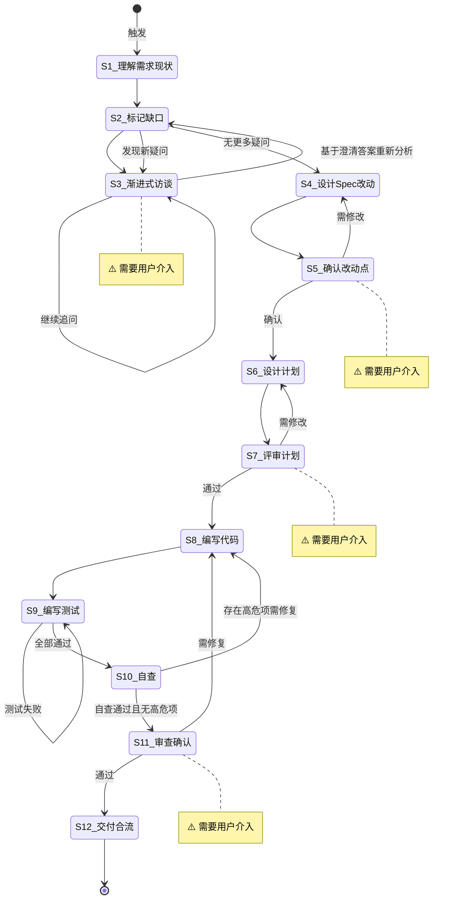

# Spec-Driven 开发

**Template ID**: `spec-driven-dev`
**Category**: development
**Description**: Spec 驱动的标准化开发流程（理解/设计/编码/测试/验收/合流，12步）
**Command**: `/pm-spec-driven-dev`
**Version**: 1.0.0

---

## 适用场景

- 中大型新功能开发
- 涉及多模块交互的任务
- 需求需澄清的复杂任务

---

## 输入要求

| 输入项 | 必填 | 说明 |
|--------|------|------|
| Spec 文档 | 是 | 已存在的规格说明 |
| 调整需求 | 是 | 要改动什么、为什么改动 |

---

## 默认交付清单

- Spec 文档更新
- 代码实现 + 测试代码
- 交付报告

---

## 状态机



---

## 任务步骤

### S1: 理解需求与现状

**目标**：准确理解调整意图，了解当前代码现状。

1. 阅读用户提出的调整需求
2. 提取核心意图——要改动什么？为什么？
3. 阅读相关 Spec 和源码
4. 标记已覆盖、模糊、缺失的信息

**完成后**：自动进入 S2

---

### S2: 标记信息缺口与矛盾点

**目标**：系统性找出模糊、缺失、冲突的地方。

1. 对照 Spec 与需求，标记缺失项、模糊项、矛盾项
2. 按影响程度排序
3. 准备逐题访谈列表
4. **访谈后重新分析**：从 S3 返回后，基于已澄清的答案，重新审视 S2 原始标记列表：
   - 澄清的答案是否引入了新的模糊点？
   - 已澄清的结论与 Spec 或需求有无新矛盾？
   - 是否有原先未发现的缺失项？
5. 若发现新疑问 → 整理新问题列表，返回 S3 继续访谈；若无新疑问 → 进入 S4

**完成后**：无新疑问 → 自动进入 S4；有新疑问 → 返回 S3

---

### S3: [Human-in-loop] 渐进式访谈 ⚠️

> **⚠️ 本步骤需要用户介入。** 每次只问 1 个问题。

**目标**：逐题澄清模糊点。

1. 使用 question / confirm 阻塞式工具
2. 每次只问 1 个问题
3. 循环直到用户确认「无更多疑问」

**完成后**：用户确认「不再追问」→ 返回 S2 重新分析

---

### S4: 设计 Spec 改动点

**目标**：基于 S3 访谈澄清后的需求，系统性分析 Spec 文档改动范围，输出结构化改动计划。**本步骤仅分析 Spec 文档改动，不涉及代码设计。**

> ⚠️ **范围限定**：S4 只分析 Spec 文档层面的改动（章节、接口约定、约束、术语等）。代码实现方案属于 S6（设计执行计划）和 S8（编写代码）的职责。

#### 分析步骤

1. **回读 S3 访谈结果**：回顾所有问答，提炼已澄清的核心需求点，确保无遗漏
2. **定位相关 Spec 文档**：列出涉及的 Spec 文档（`docs/spec/`），理解现有章节结构
3. **逐章对照分析**：以澄清后的需求为准，遍历 Spec 各章节，判断每章的改动类型：
   - **修改** — 内容已过时、不准确或需要补充
   - **新增** — 需求引入的新概念、接口、约束、流程
   - **删除** — 已废弃的设计，或已被其他章节覆盖
   - **受影响** — 内容无需改动，但交叉引用、依赖关系会受其他章节改动影响
4. **一致性检查**：交叉验证改动点之间无逻辑矛盾、无遗漏
5. **输出改动点文档**：按下方格式输出

#### 改动点文档格式

```markdown
## Spec 改动分析

> 基于 S3 访谈结果：[一句话总结核心结论]

### 涉及 Spec 文档

| 文档 | 改动类型 | 说明 |
|------|----------|------|
| docs/spec/xxx.md | 修改 | ... |

### 改动总览

| 类型 | 数量 |
|------|------|
| 修改 | N |
| 新增 | N |
| 删除 | N |
| 受影响（无需改） | N |

### 改动详情

#### CHG-1: [章节/小节名称] — 修改

- **当前描述**：[现有一句话概括]
- **改动原因**：[源于 S3 哪个访谈结论]
- **改动方向**：[计划改成什么，不写具体实现]
- **关联改动**：[涉及 CHG-x]

#### CHG-2: [章节/小节名称] — 新增

- **新增原因**：[源于 S3 哪个访谈结论]
- **章节草案**：[计划包含的要点列表]
- **依赖**：[需要参考的其他章节或文档]

#### CHG-3: [章节/小节名称] — 删除（如适用）

- **删除原因**：[为什么废弃]
- **替代方案**：[功能迁移到哪里，或废弃理由]

### 一致性检查

- [ ] 每个改动点可追溯到 S3 访谈结论
- [ ] 改动点之间无逻辑矛盾
- [ ] 删除的章节已标注替代方案或废弃理由
- [ ] 改动范围未越界（未涉及代码实现细节）
```

#### 自检清单

输出改动点文档后逐项确认：

- [ ] 每个 CHG 都能追溯到 S3 的某个访谈结论
- [ ] 改动点之间无矛盾（A 要改的内容 ≠ B 要删的内容）
- [ ] 删除项有明确的废弃理由或替代路径
- [ ] 未涉及代码实现细节（数据结构、算法、文件路径等）

**完成后**：自检通过 → 自动进入 S5

---

### S5: [Human-in-loop] 确认改动点 ⚠️

**目标**：用户审查 Spec 改动范围。

1. 展示改动点文档
2. 使用 confirm 工具等待确认

**完成后**：确认 → S6，需修改 → S4，新模糊点 → S3

---

### S6: 设计执行计划

**目标**：将 Spec 改动转化为 Plan 文档并保存到文件。
**引用 Regulation**：coding_style.md

> ⚠️ **关键**：本步骤必须将 Plan 保存为文件。S7 评审步骤依赖该文件。

#### 设计步骤

1. **阅读更新后的 Spec 和源码**：理解改动目标和技术约束
2. **设计 Plan**：逐项列出实现所需的文件清单、改动点、配置项、风险
3. **设计测试用例**：为每个改动点设计验证方案
4. **保存 Plan 文件**：将 Plan 写入 `docs/plan/plan-{taskId}.md`

#### Plan 文档格式

```markdown
# 执行计划

> 关联 Spec：[spec 文档路径]
> 目标：[一句话概括目标]

## 文件清单

| 文件 | 操作 | 说明 |
|------|------|------|
| path/to/file.ts | 修改 | ... |
| path/to/new.ts | 新增 | ... |

## 改动详情

### CHG-1: [文件/模块名] — [操作类型]

- **目标**：[要改什么]
- **方案**：[怎么改，简要技术路径]
- **影响**：[会影响哪些其他模块]
- **测试点**：[需要验证什么]

### CHG-2: ...

## 配置项（如适用）

| 配置项 | 位置 | 变更说明 |
|--------|------|----------|
| ... | ... | ... |

## 风险与缓解

| 风险 | 影响 | 缓解措施 |
|------|------|----------|
| ... | ... | ... |

## 测试计划

| 测试类型 | 测试内容 | 预期结果 |
|----------|----------|----------|
| 单元测试 | ... | ... |
| 集成测试 | ... | ... |
```

#### 自检清单

保存 Plan 文件后逐项确认：

- [ ] Plan 文件已保存到 `docs/plan/plan-{taskId}.md`
- [ ] 每个 CHG 都关联到 Spec 中具体的改动点（S4 输出）
- [ ] 文件清单完整（无遗漏模块）
- [ ] 风险项有对应的缓解措施
- [ ] 测试计划覆盖所有 CHG

**完成后**：Plan 文件已保存 → 自动进入 S7

---

### S7: [Human-in-loop] 评审计划 ⚠️

**目标**：用户评审执行计划。

1. 展示 Plan 文档
2. 使用 confirm 工具等待评审

**完成后**：通过 → S8，需修改 → S6

---

### S8: 编写代码

**目标**：按 Plan 编写实现。
**引用 Regulation**：coding_style.md、constitution.md

1. 按 Plan 改动点逐个实现
2. 每个改动后运行构建/类型检查
3. 遵循最小变更原则

**完成后**：全部实现 → S9

---

### S9: 编写测试与修复

**目标**：编写测试代码并全部通过。
**引用 Regulation**：coding_style.md

1. 按 Plan 的测试用例编写
2. 运行测试，修复失败项
3. 禁止删除失败测试

**完成后**：全部通过 → S10

---

### S10: 自查与代码审查

**目标**：全面自检，并利用代码审查工具发现潜在问题。

#### 第一阶段：基础自检

**引用 Regulation**：checklist.md

1. Plan 任务是否全部实现
2. 构建 + 测试是否通过
3. Spec 是否完整实现
4. 有无多余重构

基础自检通过 → 进入第二阶段。
自检发现问题 → 返回 S8 修复。

#### 第二阶段：代码审查

> **条件执行**：检查命令 `/code-review-skill` 是否可用。
> - 若可用 → 执行代码审查
> - 若不可用 → 跳过本阶段，直接进入 S11

1. 调用 `skill(name="/code-review-skill")` 获取代码审查指南
2. 根据审查指南，对本次变更文件进行全面审查
3. 输出审查报告，按严重性分类

##### 审查严重性分级

| 严重性 | 定义 | 处理方式 |
|--------|------|----------|
| 🔴 高危 | 安全漏洞、数据丢失风险、逻辑错误、类型安全违规 | 必须返回 S8 修复 |
| 🟡 中危 | 性能问题、代码异味、可维护性问题、边界条件遗漏 | 记录到报告，由用户在 S11 确认是否修复 |
| 🟢 低危 | 风格问题、命名建议、文档完善 | 记录到报告，由用户在 S11 确认是否修复 |

##### 流转规则

- **存在高危项（🔴 > 0）**：输出审查报告，自动返回 S8 修复。修复时需逐项处理高危项，修复完成后重新进入 S9（测试）→ S10（自查）。
- **无高危项（🔴 = 0）**：输出完整审查报告（含中低危项），自动进入 S11，中低危项由用户审查确认时决定是否修复。

**完成后**：无高危项 → S11，有高危项 → S8

---

### S11: [Human-in-loop] 审查确认 ⚠️

**目标**：用户确认交付物及代码审查结果。

1. 展示交付报告
2. 若有 S10 代码审查报告，展示中低危项列表，并使用 `question` 工具询问用户：
   - 「代码审查发现 N 个中危项、M 个低危项。是否需要在本次修复？」
   - 选项：「全部忽略，直接验收」「仅修复中危项」「全部修复」
3. 使用 confirm 工具等待最终确认

**完成后**：通过（或用户选择忽略修复项）→ S12，需修复 → S8

---

### S12: 交付合流

**目标**：收尾，更新文档，准备提交。
**引用 Regulation**：checklist.md

1. 保存交付报告到 Plan
2. 更新 Spec 文档
3. 运行最终验证
4. 使用 `question` 工具询问用户：「是否执行 `git commit`？」
   - 若用户选择「是」：执行 `git add -A && git commit`，使用本次开发的总结作为 commit message
   - 若用户选择「否」：跳过提交
   - ⚠️ 用户选择不影响任务结束

**完成后**：任务结束
