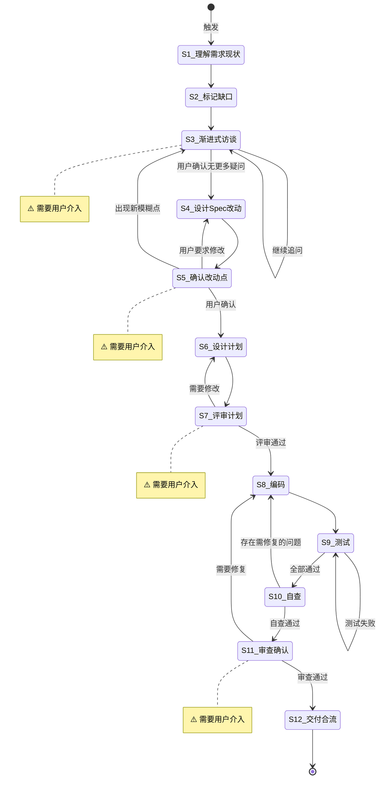

# 复杂任务设计开发规则流程

**Command**: `/pm-spec-driven`
**版本**: 1.0.0 | **创建日期**: 2026-06-11

---

## 适用场景

Spec 文档已存在（`/docs/spec/{name}.md`），需求或技术方案需要调整优化时触发。

## 触发机制

以下任一条件满足时，强制进入本流程：

1. **用户明确要求**：任务描述中出现"Spec Driven"、"规格驱动"、"严格按照规范开发"、"先写规约"等指示
2. **任务复杂度评估**（满足任一）：
   - 涉及多个模块、服务或系统的交互
   - 需求存在明显歧义，关键细节缺失
   - 可能引发重大影响（安全、数据完整性、核心业务逻辑等）
   - 由多个步骤组成的中大型功能，而非独立的微小修复

---

## 输入要求

| 输入项 | 必填 | 说明 |
|--------|------|------|
| Spec 文档 | 是 | 已存在的 Spec 文档路径 |
| 调整需求描述 | 是 | 要改动什么、为什么需要改动 |

---

## 默认交付清单

- Spec 文档更新（含已实现/未实现功能、已知问题）
- 代码实现 + 测试代码
- 交付报告

---

## 状态机



---

## 任务步骤

### S1: 理解需求与现状

**目标**：准确理解调整意图，了解当前代码现状。
**执行 Agent**：Assistant
**引用 Regulation**：—

1. 阅读用户提出的调整需求描述
2. 提取**调整的核心意图**——要改动什么？为什么需要改动？
3. 阅读相关 Spec 文档和源码，了解现状
4. 标记已覆盖、模糊、缺失的信息缺口

**完成后**：自动进入 S2

---

### S2: 标记信息缺口与矛盾点

**目标**：系统性地找出所有模糊、缺失、冲突的地方。
**执行 Agent**：explore / librarian（按需并行）
**引用 Regulation**：—

1. 对照 Spec 文档与调整需求，标记：
   - **缺失项**：设计中完全空白的关键部分
   - **模糊项**：描述不够具体、存在歧义
   - **矛盾项**：设计意图与现有实现冲突的地方
2. 按影响程度排序——阻塞性问题优先
3. 为 S3 准备逐题访谈列表

**完成后**：自动进入 S3

---

### S3: [Human-in-loop] 渐进式访谈 ⚠️

> **⚠️ 本步骤需要用户介入。** 使用 `question` / `confirm` 阻塞式工具向用户提问，每次只问 1 个问题，等待回复后再继续。

**目标**：通过逐题提问澄清所有模糊点和矛盾点。
**执行 Agent**：Assistant
**引用 Regulation**：`[rules]feature_spec_refinement.md`

1. 使用 `question` / `confirm` 阻塞式工具发出问题——**每次只问 1 个问题**
2. 等待用户回复后才能问下一个
3. 如果用户回答引出新方向，先深入追问，再切回原路线
4. 循环直到用户确认「没有其他需要澄清的问题」
5. **绝不**在普通文本中批量抛出多个问题

**访谈主题参考**：

| 主题 | 引导问题示例 |
|------|-------------|
| **调整目标** | 这次调整要解决什么具体问题？有哪些明确不做的事情？ |
| **技术方案** | 当前方案有什么问题？有没有备选？有哪些技术限制？ |
| **影响范围** | 改动涉及哪些模块？是否需要修改已有接口？ |
| **兼容性** | 已有数据/配置如何处理？回滚方案是什么？ |
| **优先级** | 哪些可以分步实施？关键路径是什么？ |

**完成后**：用户确认「无更多疑问」→ S4

---

### S4: 设计 Spec 改动点

**目标**：基于澄清后的需求，设计 Spec 文档的改动内容。
**执行 Agent**：Assistant
**引用 Regulation**：`[rules]spec-template.md`

1. 对照现有 Spec，标记需要修改/补充的章节
2. 判断调整是否涉及新增独立功能 → 需要独立 Spec？
3. 按 `[rules]spec-template.md` 的结构产出改动点文档：

```markdown
## Spec 改动点：{标题}

### 变更说明
{改动背景和动机简述}

### 改动清单
| 章节 | 操作 | 内容 |
|------|------|------|
| {原章节路径} | {新增/修改/删除} | {具体内容} |
```

- 调整量较小 → 直接在原有 Spec 上标注改动点
- 调整量较大 → 创建新版本，标记 supersedes 关系

**完成后**：自动进入 S5

---

### S5: [Human-in-loop] 确认改动点 ⚠️

> **⚠️ 本步骤需要用户介入。** 展示改动点文档，使用 `confirm` 工具等待用户确认。

**目标**：用户审查并确认 Spec 改动范围。
**执行 Agent**：—

1. 展示改动点/新版 Spec
2. 使用 `confirm` 工具等待用户确认

**完成后**：
- 用户确认 → S6
- 用户要求修改 → 退回 S4
- 出现新模糊点 → 退回 S3

---

### S6: 设计执行计划

**目标**：将 Spec 改动转化为可执行的 Plan 文档。
**执行 Agent**：Assistant
**引用 Regulation**：`[rules]checklist.md`

1. 阅读更新后的 Spec，理解任务目标
2. 阅读相关源代码，理解现状
3. 验证期望的能力是否都能实现，不具备可行性时提出替代方案
4. 设计 Plan 文档，包含：
   - 代码改动点，新增/修改/废弃文件确认
   - 可配置项及其默认值
   - 可复用模块和已引入资源
   - 负面影响评估：约束/风险/限制
5. 设计测试用例，覆盖：Happy path / 边界条件 / 异常场景 / 回归场景

**文档存储**: `/docs/plan/{feature-name}.md`

**测试用例格式**：
```markdown
| 动作指令 | 测试方法 | Given | When | Then | Notes |
|----------|----------|-------|------|------|-------|
| ${新增/修改/废弃} | `${testMethod}` | ${gherkin} | ${gherkin} | ${gherkin} | ${备注} |
```

**完成后**：自动进入 S7

---

### S7: [Human-in-loop] 评审计划 ⚠️

> **⚠️ 本步骤需要用户介入。** 展示 Plan 文档，等待用户「评审通过」后方可进入编码。

**目标**：用户审查并确认执行计划。
**执行 Agent**：—

1. 展示 Plan 文档
2. 使用 `confirm` 工具等待用户评审

**完成后**：
- 评审通过 → S8
- 需要修改 → 退回 S6
- Plan 与 Spec 冲突 → 以 Plan 为准

---

### S8: 编写代码

**目标**：按 Plan 文档编写实现代码。
**执行 Agent**：Assistant / Task Agent（按需委托）
**引用 Regulation**：`[rules]coding_style.md`、`constitution.md`

1. 按 Plan 文档的改动点逐个实现
2. 标记 `[P]`（可并行）的任务可同时处理
3. 遵循「最小变更原则」——不引入无关重构
4. 每个改动点完成后做 `tsc --noEmit` 编译检查

**完成后**：所有代码实现完毕 → S9

---

### S9: 编写测试与修复

**目标**：编写测试代码并执行，修复失败项。
**执行 Agent**：Assistant
**引用 Regulation**：`[rules]coding_style.md`

1. 根据 Plan 中的测试用例设计编写测试代码
   - 测试文件与被测文件同目录，命名为 `*.test.ts`
   - 使用 `describe`/`it` 分组，表驱动测试优先
2. 运行 `npm test`，修复失败项
3. 循环直到全部通过（或明确标记为预存失败）
4. **禁止**删除失败测试来"通过"

**完成后**：全部测试通过 → S10

---

### S10: 自查

**目标**：全面自检，确保质量和完整性。
**执行 Agent**：Assistant
**引用 Regulation**：`[rules]checklist.md`

1. 检查 Plan 文档规划的任务已全部实现
2. 执行 `/code-review-skill`，对变更代码进行审查，修复高危问题
3. 检查是否已完整实现 Spec（含本次任务更新内容），是否有功能遗漏
4. 检查是否有设计阶段未察觉的风险漏洞
5. 检查有无多余的无意义重构
6. 检查所有新增占位代码（TODO/FIXME/HACK）是否在本次任务的预期内，在交付报告中列出

**完成后**：
- 自查通过，无问题 → S11
- 存在问题需修复 → 退回 S8

---

### S11: [Human-in-loop] 审查确认 ⚠️

> **⚠️ 本步骤需要用户介入。** 展示交付报告和审查结果，等待用户「审查通过」后进入合流。

**目标**：用户确认交付物。
**执行 Agent**：—

1. 展示交付报告（含 Code Review 结果、占位代码清单）
2. 使用 `confirm` 工具等待用户确认

**完成后**：
- 审查通过 → S12
- 需要修复 → 退回 S8

---

### S12: 交付合流

**目标**：收尾工作，更新文档，准备提交。
**执行 Agent**：Assistant
**引用 Regulation**：`[rules]checklist.md`

1. 将最终交付报告保存到 Plan 文档
2. 更新 Spec 文档：已实现功能、未实现功能、已知问题
3. 运行 `tsc --noEmit` + 测试命令确保无回归
4. 提示用户确认提交信息，**由用户执行 commit/push**

**完成后**：任务结束
